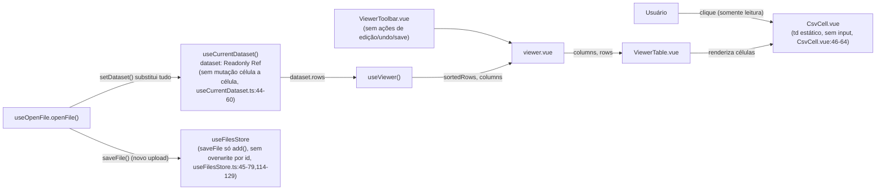
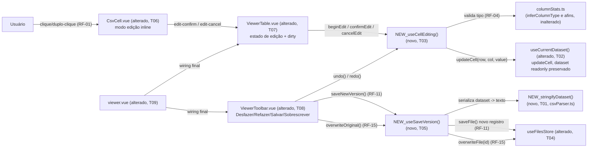

# Implementation Plan

## Request Summary
- Objective: adicionar edição inline de célula ao Viewer (clique/duplo-clique →
  input → Enter/Tab confirma, validado pelo tipo inferido da coluna, Esc
  cancela), undo/redo em memória por dataset, e as ações "Salvar nova versão"
  (novo registro em `files`) / "Sobrescrever original" (substitui `content` do
  registro existente).
- Scope: in — RF-01 a RF-15, UI-01 a UI-03, CT-01 a CT-04, RNF-01 a RNF-03
  (ver `SPEC.md`). Out — edição em massa/multi-célula, paste multi-célula,
  inserir/remover linha/coluna, exportar para disco a partir da edição
  (RF-14), persistência do histórico de undo/redo entre reloads (RF-10, fora
  do escopo — pertence a `sessions`).
- Tier: standard
- Architecture references: `AGENTS.md` (seção 2, camadas: `app/services/`
  puro/framework-free, `app/composables/` estado+orquestração, `app/
  components/` apresentacional), `docs/agents/architecture.md` (tabela "Layer
  responsibilities", linha 42: `app/services/` não depende de reatividade
  Vue/DOM), `docs/agents/domain_rules.md` (seção "Column type inference",
  `inferColumnType`/precedência número→data→booleano→email→url→texto, e
  "Recent-files LRU eviction", `saveFile`/`touchFile` em `useFilesStore.ts`).

## AS IS — Componentes impactados

Legenda: hoje `CsvCell` é puramente estático, `useCurrentDataset` não oferece
nenhuma ação de mutação célula a célula, `useFilesStore.saveFile` só é
acionado no fluxo de abrir um arquivo novo (`useOpenFile`) e `useFilesStore`
não tem nenhum método que sobrescreva `content` mantendo o mesmo `id`
(`touchFile` só atualiza `last_opened_at`); `ViewerToolbar` não tem nenhuma
ação de edição/undo/save.

## TO BE — Componentes propostos

Legenda: `NEW_CellEditing` (T03) é o novo composable que orquestra o modo de
edição, a validação por tipo (RF-04, reaproveitando `columnStats.ts`) e a
pilha de undo/redo em memória chaveada por `DatasetMeta.id` (CT-02);
`UseCurrentDataset` (alterado, T02) ganha `updateCell` preservando `dataset`
readonly para os demais consumidores (CT-01); `NEW_SaveVersion`/
`NEW_Serialize` (T05/T01) são a nova capacidade de serializar o dataset
editado e persisti-lo — `saveFile()` reutilizado sem alteração de assinatura
(RF-11, CT-03) e o novo `overwriteFile()` em `useFilesStore` (T04) para
RF-15/CT-04; `CsvCell`/`ViewerTable` (T06/T07) ganham o modo de edição
inline, a validação visual (UI-01, UI-02) e o indicador de alteração
pendente restrito à célula (UI-03); `ViewerToolbar` (T08) ganha os
acionadores de undo/redo e das duas ações de salvamento; `viewer.vue` (T09)
faz a fiação final entre os composables novos e os componentes alterados.

## Tasks

### T01 — Serialização Dataset → texto (`stringifyDataset`)
- **Files**: `app/services/csvParser.ts`
- **Change**: Adicionar função pura `stringifyDataset(dataset: Dataset,
  delimiter: Delimiter): string`, ao lado de `parseCsv`/`detectDelimiter`,
  mantendo o serviço framework-free (`AGENTS.md` seção 2, `docs/agents/
  architecture.md` linha 42). Junta `header` + `rows` com o caractere de
  `DELIMITER_CHARS[delimiter]`, uma linha por linha de dados (`\n`), e aplica
  quoting CSV padrão — envolve um campo em aspas duplas quando ele contém o
  delimitador, uma aspas dupla (dobrada) ou uma quebra de linha — para
  garantir round-trip correto com `parseCsv` (PapaParse) na reabertura do
  arquivo salvo.
- **Covers**: RF-11, CT-03
- **Tests**: `test/csvParser.spec.ts` — round-trip
  `parseCsv(stringifyDataset(dataset, d))` reproduz `header`/`rows`
  originais para os 3 delimitadores; campos contendo o delimitador, aspas
  duplas ou `\n` são quotados corretamente; dataset sem linhas de dados
  serializa apenas o cabeçalho.
- **Risk**: Low — função pura aditiva, nenhuma função existente é alterada.
- **Dependencies**: none

### T02 — `updateCell` em `useCurrentDataset`
- **Files**: `app/composables/useCurrentDataset.ts`
- **Change**: Adicionar ação `updateCell(rowIndex: number, columnIndex:
  number, value: string): void` que muta `dataset.value.rows[rowIndex]
  [columnIndex] = value` quando há dataset carregado e os índices estão
  dentro dos limites (no-op silencioso fora deles). `dataset` continua
  exposto via `readonly(dataset)` para os demais consumidores; `setDataset`/
  `clearDataset` permanecem substituindo o dataset inteiro, sem alteração de
  assinatura (CT-01, opção (a) confirmada pelo desenvolvedor). Nenhum
  composable paralelo com cópia própria de `Dataset`, nenhuma remoção do
  `readonly()`.
- **Covers**: CT-01, RF-13 (habilita o recompute reativo de
  `filteredRows`/`sortedRows` em `useViewer.ts:202-250`, consumido por T09)
- **Tests**: `test/useCurrentDataset.spec.ts` — `updateCell` altera o valor
  lido de volta em `dataset.value.rows[r][c]`; um `computed` que lê
  `dataset.value.rows` reavalia após `updateCell` (propagação reativa,
  base de RF-13); índices fora dos limites ou sem dataset carregado não
  lançam exceção e não alteram nada; `dataset` continua `readonly` (escrita
  direta por fora de `updateCell` continua bloqueada/sem efeito).
- **Risk**: Medium — primeira via de mutação num estado até então
  totalmente imutável; blast radius cobre toda árvore que lê `dataset`
  (`useViewer`, `useViewerSession`, `ExportModal`, `StatsPanel`). Mitigação:
  preservar o wrapper `readonly()` e expor a mutação só pela ação nomeada;
  cobertura de reatividade dedicada nos testes acima.
- **Dependencies**: none

### T03 — Composable `useCellEditing` (edição, validação, undo/redo)
- **Files**: `app/composables/useCellEditing.ts` (novo)
- **Change**: Novo composable, consumido por `CsvCell.vue`/`ViewerTable.vue`
  como clientes finos (props/emits), conforme a separação de camadas de
  `docs/agents/architecture.md` (composables = estado/orquestração;
  componentes = apresentação). Usa `useCurrentDataset()` internamente
  (dataset, meta, `updateCell` de T02) e expõe:
  - `editingCell` (rowIndex/columnIndex/draft atuais, ou `null`) e
    `beginEdit(rowIndex, columnIndex)` — RF-01.
  - `confirmEdit(value)` — RF-02/RF-04/RF-05/RF-08: recalcula o tipo da
    coluna via `inferColumnType(columnValues(dataset.value.rows,
    columnIndex))` (`columnStats.ts:323`) a cada chamada (nunca cacheado
    entre edições, para não validar contra um tipo desatualizado) e aplica o
    reconhecedor correspondente (`parseNumber`/`isDateValue`/
    `isBooleanValue`/`isEmailValue`/`isUrlValue`, `columnStats.ts:94,136,
    217,226,235`; célula vazia é sempre válida, espelhando `isEmptyCell`
    nunca invalidar um tipo em `inferColumnType`). Válido → chama
    `updateCell`, empilha `{rowIndex, columnIndex, previousValue,
    nextValue}` em `undoStack`, esvazia `redoStack` (RF-08), marca a célula
    "suja" (UI-03). Inválido → seta `validationError` (para UI-02), não
    muta nada, não empilha (RF-04).
  - `cancelEdit()` — RF-03: descarta o rascunho, nenhuma entrada de
    histórico.
  - `undo()`/`redo()` — RF-06/RF-07/RF-09: revertem/reaplicam via
    `updateCell` movendo entradas entre as duas pilhas; inertes (sem
    efeito) quando a pilha correspondente está vazia.
  - `canUndo`/`canRedo` computed (RF-09) e `isDirty(rowIndex, columnIndex)`
    (UI-03).
  - As pilhas (e o conjunto de células "sujas") são chaveadas por
    `meta.value?.id` (CT-02): um `watch` reseta ambas para vazias sempre
    que o id mudar (RF-10) — todo dataset chega ao Viewer com `id` já
    definido, pois `useOpenFile` sempre chama `saveFile`/`getFile` antes de
    `setDataset` (`useOpenFile.ts:113-129,144-169`).
- **Covers**: RF-01, RF-02, RF-03, RF-04, RF-05, RF-06, RF-07, RF-08, RF-09,
  RF-10, CT-02, RNF-01, RNF-03
- **Tests**: `test/useCellEditing.spec.ts` — ciclo begin/confirm/cancel;
  RF-04 rejeita valor inválido para o tipo inferido, preserva o valor
  original e não empilha; RF-05 cada confirmação válida soma exatamente 1
  entrada; RF-06/RF-07 undo reverte a última edição, redo sem edição
  intermediária restaura o estado pré-undo; RF-08 editar após um undo
  esvazia `redoStack`; RF-09 `canUndo`/`canRedo` inertes sem entradas
  correspondentes, acionar undo/redo nesse estado não altera nenhuma
  célula; RF-10 trocar `meta.id` (simulando reabrir outro dataset) zera as
  duas pilhas; `confirmEdit` é síncrono (RNF-01, sem fake timers/await
  parado no meio).
- **Risk**: High — lógica nova mais complexa da feature, central a quase
  todo RIGID; um bug aqui viola diretamente vários ACs. Mitigação: suíte de
  testes exaustiva por AC listada acima antes de integrar aos componentes
  (T06/T07).
- **Dependencies**: T02

### T04 — `overwriteFile` em `useFilesStore`
- **Files**: `app/composables/useFilesStore.ts`
- **Change**: Adicionar `overwriteFile(id: number, patch: { content:
  string; delimiter: string; size_bytes: number; row_count: number;
  column_count: number }): Promise<FileRecord | undefined>` que abre uma
  transação `readwrite` no `FILES_STORE`, lê o registro por `id`, e faz
  `put()` do registro com `content`/`delimiter`/`size_bytes`/`row_count`/
  `column_count` substituídos, `last_opened_at` atualizado para "agora" e
  `id`/`created_at` preservados — mesmo padrão de transação já usado por
  `touchFile` (`useFilesStore.ts:114-129`), mas patcheando `content` e os
  metadados de tamanho em vez de só `last_opened_at`. Retorna `undefined`
  sem lançar quando `id` não existe (mesma convenção de `touchFile`).
  Necessário porque nenhum método hoje sobrescreve `content` mantendo o
  mesmo `id`: `saveFile()` sempre `add()`s um registro novo (CT-03) e
  `touchFile()` só toca `last_opened_at` — RF-15/CT-04 exigem exatamente
  essa capacidade ausente.
- **Covers**: RF-15, CT-04
- **Tests**: `test/useFilesStore.spec.ts` — `overwriteFile` num id
  existente preserva `id`/`created_at`, substitui `content`/`delimiter`/
  `size_bytes`/`row_count`/`column_count`, atualiza `last_opened_at`; num id
  inexistente retorna `undefined` sem lançar e sem criar registro; a
  contagem total de registros em `files` não muda (não é um `add`).
- **Risk**: Medium — nova via de escrita no mesmo object store `files`
  usado pelos fluxos de abrir/reabrir (`useOpenFile`) e lista de recentes
  (`RecentFiles.vue`). Mitigação: reusar o padrão de transação já validado
  de `touchFile`; teste dedicado do caminho "id inexistente".
- **Dependencies**: none

### T05 — Composable `useSaveVersion` ("Salvar nova versão" / "Sobrescrever original")
- **Files**: `app/composables/useSaveVersion.ts` (novo)
- **Change**: Novo composable consumindo `useCurrentDataset()` (dataset +
  `meta`), `useFilesStore()` (`saveFile` de T02/existente + `overwriteFile`
  de T04) e `stringifyDataset` (T01), seguindo o mesmo padrão de estado
  (`isBusy`/`error` refs, sem bloquear a UI) já usado por
  `useExportModal.ts:104-216` (`isDownloading`/`downloadError`):
  - `saveNewVersion(): Promise<boolean>` — RF-11/RF-12/RF-14: serializa o
    dataset atual com `meta.value.delimiter`, chama `filesStore.saveFile({
    name, delimiter, size_bytes: content.length, row_count, column_count,
    content })` **sempre criando um novo registro** (nunca reutiliza
    `meta.value.id`), respeitando a política LRU de `MAX_RECENT_FILES = 10`
    já implementada em `saveFile` (`useFilesStore.ts:19,64-75`); nunca
    altera o registro original (RF-12) nem dispara qualquer exportação
    para disco (RF-14, fora do escopo desta feature).
  - `overwriteOriginal(): Promise<boolean>` — RF-15: exige `meta.value.id`
    definido; serializa o dataset e chama `filesStore.overwriteFile(id,
    {...})`, substituindo o `content` do registro existente sem criar
    registro adicional.
  - Ambas retornam `false` e populam um `error` ref legível (RNF-02) em
    caso de falha (ex.: quota do IndexedDB excedida) — o dataset em memória
    e as edições confirmadas permanecem intactos para nova tentativa; a
    UI nunca fica bloqueada durante a escrita (`isBusy` apenas informa
    estado, não desabilita a interação com o Viewer).
- **Covers**: RF-11, RF-12, RF-14, RF-15, CT-03, CT-04, RNF-02
- **Tests**: `test/useSaveVersion.spec.ts` — `saveNewVersion` cria um
  registro novo com `content` refletindo as edições, preserva o registro
  original intacto (RF-12), evicta o mais antigo por `last_opened_at`
  quando já há 10 registros; `overwriteOriginal` substitui `content` do
  mesmo `id` sem criar registro adicional; `saveNewVersion` sozinho nunca
  chama `overwriteFile`; falha simulada de `saveFile`/`overwriteFile`
  retorna `false`, popula `error` e não limpa o dataset/edições em memória.
- **Risk**: Medium — ponto único onde uma falha de persistência pode dar a
  falsa impressão de perda de edições (RNF-02). Mitigação: nunca limpar
  estado em memória em caso de erro; padrão de erro idêntico ao já testado
  em `useExportModal`.
- **Dependencies**: T01, T04

### T06 — `CsvCell.vue`: modo de edição inline
- **Files**: `app/components/CsvCell.vue`
- **Change**: Adicionar props `editable`, `editing`, `invalidEdit`, `dirty`
  (todas booleanas/opcionais, decididas pelo pai a partir de T03) e emits
  `edit-start`, `edit-confirm(value: string)`, `edit-cancel` — mantém
  `CsvCell` como cliente fino (props in/eventos out), sem lógica de
  validação/undo local (delegada ao composable de T03, consumido pelo pai).
  Clique/duplo-clique em uma célula `editable` emite `edit-start` (RF-01);
  enquanto `editing`, renderiza um `<input>` pré-preenchido com o valor
  atual, foco automático + cursor posicionado no valor (UI-01, borda/fundo
  visualmente distintos do modo leitura); `Enter`/`Tab` emitem
  `edit-confirm` com o valor digitado (RF-02); `Esc` emite `edit-cancel`
  sem alterar o campo (RF-03). Quando `invalidEdit` é `true` (setado pelo
  pai após uma rejeição de T03), exibe um indicador de erro não-cromático
  (ícone + texto, além de qualquer cor de destaque, UI-02) associado à
  célula. Quando `dirty` é `true`, exibe um indicador visual restrito a
  essa célula (nunca à linha inteira, alinhado à revogação de RF-03 de
  `visual-highlights`, UI-03).
- **Covers**: RF-01, RF-02, RF-03, UI-01, UI-02, UI-03
- **Tests**: `test/CsvCell.spec.ts` — clique/duplo-clique numa célula
  `editable` emite `edit-start`; em modo `editing`, o input recebe foco e
  está pré-preenchido; `Enter`/`Tab` emitem `edit-confirm` com o valor do
  input; `Esc` emite `edit-cancel` sem emitir `edit-confirm`; `invalidEdit`
  renderiza o indicador de erro (ícone/texto, verificável sem depender de
  cor); `dirty` renderiza o indicador restrito à célula, ausente por
  padrão.
- **Risk**: Medium — reintroduz interatividade numa célula até então 100%
  estática, usada por toda a superfície do Viewer; mitigação: `editable`
  como prop opt-in (default `false`/comportamento atual preservado quando
  omitida), preservando o comportamento somente-leitura em qualquer
  consumidor que não passe a nova prop.
- **Dependencies**: T03

### T07 — `ViewerTable.vue`: orquestra edição/undo por linha visível
- **Files**: `app/components/ViewerTable.vue`
- **Change**: Consome `useCellEditing()` (T03) para saber qual célula está
  em edição, o erro de validação corrente e o conjunto de células "sujas";
  passa `editable`/`editing`/`invalid-edit`/`dirty` a cada `CsvCell` (T06)
  e escuta `edit-start`/`edit-confirm`/`edit-cancel`, repassando para
  `beginEdit`/`confirmEdit`/`cancelEdit`. Nenhuma seleção múltipla, paste
  multi-célula ou inserção/remoção de linha/coluna é adicionada (RF-14) —
  o componente continua expondo apenas os emits já existentes
  (`sort`, `sort-additive`, `resize`, `reorder`, `toggle-pin`,
  `select-column`, `clear-filters`) mais os três novos de edição.
- **Covers**: RF-01, RF-02, RF-03, RF-04, RF-05, UI-01, UI-02, UI-03, RF-14
  (ausência de multi-seleção/paste/estrutura)
- **Tests**: `test/ViewerTable.spec.ts` — clicar numa célula editável entra
  em modo de edição só naquela célula (as demais permanecem estáticas);
  confirmar um valor válido atualiza a linha exibida e limpa o indicador
  de erro; confirmar um valor inválido mantém o valor anterior e mostra o
  indicador; nenhuma interação de seleção de múltiplas células é
  disparada. Nota de ambiente: `ViewerTable` usa `@tanstack/vue-virtual`
  sobre `happy-dom` — seguir o mesmo stub de `offsetHeight`/duplo
  `nextTick` já usado nos testes existentes de linhas do corpo (ver
  `test/ViewerTable.spec.ts` atual) para exercitar linhas reais.
- **Risk**: Medium — arquivo de maior superfície da tabela, muitos
  consumidores de props/emits existentes; mitigação: os 3 novos emits são
  aditivos, nenhum emit/prop existente muda de assinatura.
- **Dependencies**: T06, T03

### T08 — `ViewerToolbar.vue`: ações de undo/redo e salvar/sobrescrever
- **Files**: `app/components/ViewerToolbar.vue`
- **Change**: Adicionar 4 controles seguindo o padrão visual já usado pelo
  botão "Exportar" (`ViewerToolbar.vue:193-225`): "Desfazer"/"Refazer"
  (desabilitados quando `canUndo`/`canRedo` de T03 são `false`, RF-09) e
  "Salvar nova versão"/"Sobrescrever original" (chamando `saveNewVersion`/
  `overwriteOriginal` de T05) — os dois botões de salvamento continuam
  visualmente distintos entre si (CT-04: o padrão nunca aciona o
  comportamento de sobrescrita por si só). Exibe a mensagem de `error` de
  T05 quando uma escrita falha (RNF-02), sem bloquear os demais controles
  da toolbar. [Placement/mecanismo de acionamento não especificado por
  nenhum UI-XX do SPEC — ver Assumptions.]
- **Covers**: RF-06, RF-07, RF-09, RF-11, RF-12, RF-15, RNF-02
- **Tests**: `test/ViewerToolbar.spec.ts` — "Desfazer"/"Refazer" desabilitados
  quando `canUndo`/`canRedo` são `false`, habilitados e clicáveis quando
  `true` (emitem os eventos correspondentes); "Salvar nova versão" e
  "Sobrescrever original" emitem eventos distintos; mensagem de erro exibida
  quando a prop de erro está preenchida.
- **Risk**: Low — adição de controles novos, nenhum controle/emit existente
  é alterado.
- **Dependencies**: T03, T05

### T09 — `viewer.vue`: fiação final
- **Files**: `app/pages/viewer.vue`
- **Change**: Instancia `useCellEditing()` (T03) e `useSaveVersion()` (T05)
  ao lado de `useViewer`/`useViewerSession` já existentes; passa o estado
  de edição/undo/redo para `ViewerTable` (T07) e `ViewerToolbar` (T08) via
  props/emits, sem introduzir nenhum estado de edição próprio na página
  (delegado inteiramente aos composables, mantendo `viewer.vue` como
  composição de rota, `docs/agents/architecture.md` linha 45).
- **Covers**: integra RF-01 a RF-15, UI-01 a UI-03, CT-01 a CT-04
- **Tests**: `test/pages/viewer.spec.ts` — fluxo completo: editar uma
  célula, confirmar, undo, redo, "Salvar nova versão" (verifica novo
  registro via `useFilesStore` mockado/injetado) e "Sobrescrever original"
  (verifica `overwriteFile` chamado com o `id` correto).
- **Risk**: Medium — ponto único de integração de todos os composables
  novos; mitigação: cada composable já validado isoladamente em T03/T05,
  este teste cobre só a fiação (não repete os casos de borda de RF-04/RF-08
  etc., já cobertos em T03).
- **Dependencies**: T07, T08

### T10 — Testes de integração cross-cutting (RF-13, RF-10 na troca de dataset)
- **Files**: `test/pages/viewer.spec.ts` (extensão)
- **Change**: Nenhuma alteração de código de produção — apenas testes que
  não cabem isoladamente em nenhum componente/composable individual:
  confirmar uma edição que deixa de satisfazer um filtro de coluna ativo
  remove a linha da view imediatamente (RF-13, sem ação adicional do
  usuário); confirmar uma edição que muda a posição relativa da linha sob
  ordenação ativa reposiciona a linha imediatamente (RF-13); reabrir um
  dataset diferente (novo `meta.id`) zera `canUndo`/`canRedo` e o indicador
  de "sujo" de qualquer célula editada no dataset anterior (RF-10, ponta a
  ponta através de T09).
- **Covers**: RF-13, RF-10 (verificação end-to-end, complementar aos testes
  unitários de T03)
- **Tests**: `test/pages/viewer.spec.ts` — os 3 cenários acima.
- **Risk**: Low — só testes, nenhuma superfície de produção nova.
- **Dependencies**: T09

## Execution Phases
| Phase | Tasks | Parallel-safe? |
|-------|-------|-----------------|
| 1 | T01, T02, T04 | Sim — 3 arquivos distintos (`csvParser.ts`, `useCurrentDataset.ts`, `useFilesStore.ts`), sem dependências entre si |
| 2 | T03, T05 | Sim — arquivos novos distintos (`useCellEditing.ts`, `useSaveVersion.ts`); T03 depende só de T02, T05 depende só de T01+T04 |
| 3 | T06, T08 | Sim — arquivos distintos (`CsvCell.vue`, `ViewerToolbar.vue`); ambos dependem apenas de artefatos da Fase 2 |
| 4 | T07 | Não — único arquivo (`ViewerTable.vue`), depende de T06 |
| 5 | T09 | Não — único arquivo (`viewer.vue`), depende de T07 e T08 |
| 6 | T10 | Não — depende de T09 (testes de integração) |

## Risks
| Risk | Blast radius | Mitigation | Rollback |
|------|-------------|------------|----------|
| Mutação recém-introduzida em `useCurrentDataset` (T02) quebra a garantia de imutabilidade que outros consumidores assumem | `useViewer`, `useViewerSession`, `ExportModal`, `StatsPanel` — toda a árvore que lê `dataset` | Preservar `readonly()`; expor mutação só via `updateCell` nomeado; teste de reatividade dedicado (T02) | Função aditiva em `useCurrentDataset.ts`, sem remoção de API existente — reversível isoladamente |
| Validação de tipo (RF-04) cacheando `inferColumnType` entre edições validaria contra um tipo desatualizado | Correção de RF-04/RF-13 em colunas heterogêneas editadas em sequência | Recalcular `inferColumnType` a cada `confirmEdit` (T03), nunca cachear entre chamadas; teste dedicado | Isolado a `useCellEditing.ts`, sem efeito em outros composables |
| Nova via de escrita `overwriteFile` (T04) compartilha o object store `files` usado por LRU/reopen | Fluxos de abrir/reabrir (`useOpenFile`), lista de recentes (`RecentFiles.vue`) | Reusar o padrão de transação já validado de `touchFile`; teste dedicado do caminho "id inexistente" | Função aditiva isolada; remover sem afetar `saveFile`/`touchFile` |
| `stringifyDataset` (T01) sem quoting correto corrompe o re-parse de valores com delimitador embutido | Conteúdo persistido em `files.content` via "Salvar nova versão"/"Sobrescrever original", reaberto por qualquer usuário do arquivo salvo | Teste de round-trip `parseCsv(stringifyDataset(...))` cobrindo delimitador/aspas/quebras de linha embutidos | Isolado à nova função; `parseCsv`/`detectDelimiter` existentes intocados |
| Falha de escrita no IndexedDB durante "Salvar nova versão"/"Sobrescrever original" (quota excedida) pode sugerir perda de edições | Confiança do usuário nas edições em memória (RNF-02) | `saveNewVersion`/`overwriteOriginal` (T05) nunca limpam dataset/undo stack em erro; erro exposto via ref dedicado, padrão já usado por `useExportModal.downloadError` | Nenhuma migração de dado; falha é só sinalizada, dataset em memória intacto |

## Open Questions
- Nenhuma ambiguidade bloqueante identificada — as decisões de
  implementação sem UI-XX explícito no SPEC (mecanismo/local dos botões de
  undo/redo e salvar/sobrescrever) estão documentadas em Assumptions e não
  impedem um plano confiável, pois qualquer local de acionamento satisfaz os
  ACs de RF-06/RF-07/RF-09/RF-11/RF-12/RF-15 como escritos.

## Assumptions
- Os controles "Desfazer"/"Refazer"/"Salvar nova versão"/"Sobrescrever
  original" são adicionados a `ViewerToolbar.vue`, seguindo o padrão visual
  do controle "Exportar" já existente (`ViewerToolbar.vue:193-225`) — o
  SPEC não define nenhum UI-XX para o mecanismo/local de acionamento de
  RF-06/RF-07/RF-11/RF-15, só confirma via CT-04 que "Sobrescrever
  original" é uma ação separada e explícita, distinta do botão padrão.
  [UNVERIFIED: local exato; comportamento RIGID em si está confirmado.]
- `stringifyDataset` (T01) aplica quoting CSV padrão (aspas quando o campo
  contém o delimitador, aspas duplas ou quebra de linha) para garantir
  round-trip com `parseCsv`/PapaParse — RF-11 exige apenas "cabeçalho +
  linhas, no delimitador original", sem detalhar a regra de escaping;
  quoting é necessário para não corromper valores existentes no dataset
  aberto originalmente por `parseCsv` (que já lida com CSV quotado via
  PapaParse).
- Editar uma célula para um valor vazio é sempre aceito, independente do
  tipo inferido da coluna, espelhando `isEmptyCell` nunca invalidar um tipo
  em `inferColumnType`/`columnStats.ts` (linha 82-83, 332) — RF-04 não
  menciona células vazias explicitamente, mas essa é a única leitura
  consistente com o resto do motor de tipos já reaproveitado.
- `useFilesStore` precisa de um novo método `overwriteFile` (T04) porque
  nenhum método existente sobrescreve `content` mantendo o mesmo `id`:
  `saveFile` sempre `add()`s um registro novo (CT-03 confirma que
  `saveFile` é reutilizado sem alteração de assinatura só para RF-11) e
  `touchFile` só atualiza `last_opened_at` (`useFilesStore.ts:114-129`).
- A pilha de undo/redo (T03) é chaveada por `meta.value?.id`, sempre
  definido quando um dataset chega ao Viewer, pois `useOpenFile.openFile`/
  `reopenRecent` sempre chamam `saveFile`/`getFile` antes de `setDataset`
  (verified at `useOpenFile.ts:113-129,144-169`).
