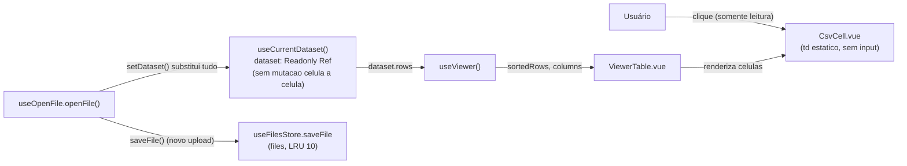
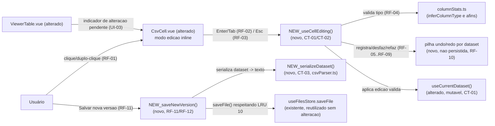

# SPEC: cell-editing

## Metadata
- Source: developer description via /plan
- Service: csvview (única app, SPA client-side)
- Tier: standard
- Version: 1.1
- Architecture references: `AGENTS.md`, `docs/agents/architecture.md`, `docs/agents/domain_rules.md`

## Context
O Viewer (`app/pages/viewer.vue` + `ViewerTable.vue` + `CsvCell.vue`) hoje é **somente
leitura**: `CsvCell.vue` renderiza um `<td>` estático (nenhum `input`/estado de edição, `app/
components/CsvCell.vue:46-64`) e `useCurrentDataset` expõe o dataset como `Readonly<Ref<Dataset>>`
(`app/composables/useCurrentDataset.ts:55`), com apenas duas ações — `setDataset` (substitui o
dataset inteiro) e `clearDataset` — nenhuma mutação célula a célula (`useCurrentDataset.ts:44-60`).

Esta feature adiciona edição inline de célula (clique/duplo-clique → input → Enter/Tab confirma →
Esc cancela), validação pelo tipo inferido de coluna (reaproveitando o motor de
`rich-types-and-stats`: `inferColumnType`, `parseNumber`, `isDateValue`, `isBooleanValue`,
`isEmailValue`, `isUrlValue` — `app/services/columnStats.ts:323,94,136,217,226,235`), uma pilha de
undo/redo por dataset **não persistida** entre reloads (fora do escopo de `sessions`), e a ação
"Salvar nova versão", que grava um novo registro no store `files` via `useFilesStore().saveFile()`
(`app/composables/useFilesStore.ts:45-79`), respeitando a política LRU `MAX_RECENT_FILES = 10`
(verified at `app/composables/useFilesStore.ts:19` — a AC confirmada nº 6 citou a linha 18; o
valor `10` está correto, apenas a linha exata do `export const` é 19).

Lacuna de arquitetura relevante: `app/services/csvParser.ts` hoje só expõe **parsing**
(`detectDelimiter`, `parseCsv`) — não há nenhuma função de **serialização** Dataset → texto
(nenhum `stringify`/`serialize` encontrado no serviço). "Salvar nova versão" exige gravar
`files.content` (texto bruto, re-parseado ao reabrir — `database-schema.md` linha 71), logo esta
feature precisa de uma nova função pura de serialização, o que se enquadra na regra de camadas
"Pure domain logic isolated in `app/services/` ... kept framework-free and unit-testable"
(`AGENTS.md` seção 2, linha 37) e na tabela de responsabilidades de `docs/agents/architecture.md`
(linha 42: `app/services/` não deve depender de reatividade Vue/DOM).

Esta feature é listada como **independente** no grafo de dependências do backlog
(`.spec/features/BACKLOG.md`, linha 73: `cell-editing (independente)`), mas compartilha a mesma
tabela/composables de `table-interactions`, `filters` e `sessions` (já implementadas) — a
interação de uma edição com filtro/ordenação ativos é resolvida por recompute síncrono de
`filteredRows`/`sortedRows` (ver RF-13).

## AS IS — Estado atual

Legenda: hoje `CsvCell` é puramente estático, `useCurrentDataset` não oferece nenhuma ação de
mutação célula a célula, e `useFilesStore.saveFile` só é acionado no fluxo de abrir um arquivo
novo (`useOpenFile`) — nunca para persistir uma edição feita no Viewer.

## TO BE — Estado proposto

Legenda: `NEW_CellEditing` (RF-01 a RF-09) é o novo composable que orquestra o modo de edição, a
validação por tipo e a pilha de undo/redo em memória; `UseCurrentDataset` (alterado, CT-01) passa
a expor uma via de mutação célula a célula; `NEW_SaveVersion`/`NEW_Serialize` (RF-11, CT-03) são a
nova capacidade de serializar o dataset editado e persisti-lo via `useFilesStore.saveFile`
(reutilizado sem mudança de assinatura, CT-04); `CsvCell`/`ViewerTable` (alterados) ganham o modo
de edição inline e o indicador de alteração pendente (UI-01, UI-02, UI-03).

## Scope
- **In**: entrar em edição inline por clique/duplo-clique numa célula; confirmar com Enter/Tab;
  cancelar com Esc restaurando o valor original; validar o valor confirmado pelo tipo inferido da
  coluna (rich-types-and-stats, quando plugado); undo/redo por dataset, em memória, durante a
  sessão corrente; ação "Salvar nova versão" que grava um novo registro em `files` respeitando o
  LRU de 10.
- **Out**: edição em massa/multi-célula; colar (paste) sobre múltiplas células; adicionar ou
  remover linha/coluna; exportar diretamente para disco (escopo da feature `export`, já
  implementada); persistência do histórico de undo/redo entre reloads (escopo de `sessions`).

## RIGID (Non-Negotiable)

### Functional Requirements

- RF-01 [Event-Driven]: WHEN o usuário clica ou dá duplo-clique numa célula editável da tabela do
  Viewer, o sistema SHALL entrar em modo de edição inline para essa célula, exibindo o valor atual
  em um campo editável.
  - AC: Clicar ou dar duplo-clique numa célula editável substitui a renderização estática por um
    campo de edição pré-preenchido com o valor original da célula.

- RF-02 [Event-Driven]: WHEN o usuário pressiona Enter ou Tab enquanto uma célula está em modo de
  edição e o valor digitado é válido para o tipo inferido da coluna, o sistema SHALL confirmar o
  valor, sair do modo de edição e atualizar a célula exibida com o novo valor.
  - AC: Pressionar Enter/Tab com um valor válido faz a célula exibir o novo valor e encerra o modo
    de edição.

- RF-03 [Event-Driven]: WHEN o usuário pressiona Esc enquanto uma célula está em modo de edição, o
  sistema SHALL cancelar a edição em andamento, restaurar o valor original da célula e sair do
  modo de edição, sem registrar nenhuma entrada no histórico de undo/redo.
  - AC: Pressionar Esc reverte o campo ao valor anterior à edição e nenhuma entrada é adicionada à
    pilha de undo/redo daquele dataset.

- RF-04 [Unwanted Behavior]: IF o valor confirmado (Enter/Tab) não satisfaz o tipo inferido da
  coluna (validação de `rich-types-and-stats`, quando plugada — `inferColumnType`, `parseNumber`,
  `isDateValue`, `isBooleanValue`, `isEmailValue`, `isUrlValue`, verified at
  `app/services/columnStats.ts:323,94,136,217,226,235`) THEN o sistema SHALL rejeitar a edição,
  sinalizar visualmente o erro de validação e preservar o valor original da célula — a edição
  inválida NUNCA é aplicada nem gera entrada no histórico de undo/redo.
  - AC: Confirmar um valor que viola o tipo inferido da coluna mantém o valor anterior exibido na
    célula, apresenta um indicador de erro perceptível e não altera a pilha de undo/redo daquele
    dataset.

- RF-05 [Event-Driven]: WHEN uma edição de célula é confirmada com um valor válido, o sistema
  SHALL registrar essa alteração como uma entrada na pilha de histórico de undo/redo do dataset
  atualmente carregado.
  - AC: Cada confirmação válida de edição incrementa em exatamente 1 o número de entradas
    desfazíveis do dataset atual.

- RF-06 [Event-Driven]: WHEN o usuário aciona a ação de desfazer (undo) e há ao menos uma entrada
  desfazível no histórico do dataset atual, o sistema SHALL reverter a edição confirmada mais
  recente ainda não desfeita, restaurando o valor anterior da célula afetada.
  - AC: Acionar undo uma vez, após uma ou mais edições confirmadas, restaura a célula alterada por
    último ao valor que ela tinha antes dessa edição.

- RF-07 [Event-Driven]: WHEN o usuário aciona a ação de refazer (redo) e há ao menos uma entrada
  desfeita ainda não substituída por uma nova edição, o sistema SHALL reaplicar a edição revertida
  mais recente.
  - AC: Undo seguido de redo, sem nenhuma edição confirmada entre os dois, restaura a célula ao
    valor que tinha imediatamente antes do undo.

- RF-08 [Unwanted Behavior]: IF uma nova edição é confirmada após um ou mais undos (com entradas de
  redo pendentes) THEN o sistema SHALL descartar todas as entradas de redo pendentes daquele ponto
  em diante.
  - AC: Undo → editar uma célula (nova edição confirmada) → acionar redo não reaplica a edição
    descartada pelo undo anterior; a pilha de redo fica vazia imediatamente após essa nova edição.

- RF-09 [State-Driven]: WHILE não há nenhuma entrada desfazível no histórico do dataset atual, o
  sistema SHALL manter a ação de undo inerte (nenhum efeito ao ser acionada); WHILE não há nenhuma
  entrada refazível, o sistema SHALL manter a ação de redo inerte.
  - AC: Sem nenhuma edição confirmada no dataset atual, acionar undo não altera nenhuma célula; sem
    nenhum undo pendente de redo, acionar redo não altera nenhuma célula.

- RF-10 [Unwanted Behavior]: IF o usuário recarrega a página (reload) THEN o sistema SHALL
  apresentar a pilha de histórico de undo/redo vazia para o dataset reaberto — nenhuma edição
  confirmada em uma sessão anterior permanece desfazível/refazível após o reload (persistência de
  histórico entre reloads é escopo da feature `sessions`, fora desta feature).
  - AC: Após um reload da página e a reabertura do mesmo arquivo, acionar undo não reverte nenhuma
    edição feita antes do reload.

- RF-11 [Event-Driven]: WHEN o usuário aciona "Salvar nova versão" com o dataset atual contendo ao
  menos uma edição confirmada, o sistema SHALL gravar um novo registro no store `files` (via
  `useFilesStore().saveFile()`, verified at `app/composables/useFilesStore.ts:45-79`) contendo o
  conteúdo serializado do dataset editado (cabeçalho + linhas, no delimitador original do arquivo),
  respeitando a política LRU de no máximo `MAX_RECENT_FILES = 10` registros (verified at
  `app/composables/useFilesStore.ts:19`) — evictando o(s) registro(s) mais antigo(s) por
  `last_opened_at` quando o limite é excedido.
  - AC: Acionar "Salvar nova versão" com edições pendentes cria um novo registro em `files` cujo
    `content` reflete os valores editados; se já havia 10 arquivos persistidos, o mais antigo por
    `last_opened_at` é removido na mesma operação.

- RF-12 [State-Driven]: WHILE o usuário não aciona a opção explícita de sobrescrever o arquivo
  original (mecanismo de acionamento definido em CT-04), o sistema SHALL preservar o registro
  original em `files` intacto (mesmo `content`, `id` e metadados) ao executar "Salvar nova
  versão", tratando-a como a criação de um registro adicional e nunca como substituição implícita.
  - AC: Sem acionar a opção de sobrescrever, o registro original em `files` permanece com
    `content`/metadados inalterados após "Salvar nova versão" ser executada.

- RF-13 [Conditional]: WHEN uma edição de célula confirmada altera um valor que deixa de satisfazer
  um filtro de coluna ativo (`filters`) e/ou muda a posição relativa da linha numa ordenação ativa
  (`table-interactions`), o sistema SHALL recomputar `filteredRows`/`sortedRows` de forma síncrona
  (consistente com RNF-01, `app/composables/useViewer.ts:202-250`): a linha SHALL desaparecer
  imediatamente da view quando deixar de satisfazer o filtro ativo, e a linha SHALL se reordenar
  imediatamente conforme a chave de ordenação ativa quando a edição alterar sua posição relativa —
  nenhum refresh/reaplicação explícita é exigido do usuário (confirmado pelo desenvolvedor).
  - AC: Confirmar uma edição que viola o filtro de coluna ativo remove a linha da view
    imediatamente, sem ação adicional do usuário; confirmar uma edição que muda a posição relativa
    da linha sob ordenação ativa reposiciona a linha imediatamente, sem refresh explícito.

- RF-14 [Unwanted Behavior]: IF o usuário tenta editar múltiplas células simultaneamente (seleção
  múltipla), colar (paste) sobre mais de uma célula, adicionar ou remover uma linha/coluna, ou
  exportar diretamente para disco a partir do fluxo de edição THEN o sistema SHALL NOT executar
  nenhuma dessas ações como parte desta feature.
  - AC: Nenhuma interação de seleção múltipla, paste multi-célula, inserção/remoção de
    linha/coluna, ou exportação para disco é disparada pelo fluxo de edição desta feature.

- RF-15 [Event-Driven]: WHEN o usuário aciona a ação separada e explícita "Sobrescrever original"
  (distinta do botão padrão "Salvar nova versão", CT-04) com o dataset atual contendo ao menos uma
  edição confirmada, o sistema SHALL substituir o `content` do registro original em `files` (mesmo
  `id`) pelo conteúdo serializado do dataset editado, em vez de criar um novo registro — o botão
  padrão "Salvar nova versão" NUNCA dispara esse comportamento por si só (confirmado pelo
  desenvolvedor).
  - AC: Acionar "Sobrescrever original" atualiza o `content` do registro existente em `files`
    (mesmo `id`), sem criar um registro adicional; acionar apenas "Salvar nova versão" nunca
    sobrescreve o registro original.

### UI Requirements

- UI-01 [Event-Driven]: WHEN uma célula entra em modo de edição, o sistema SHALL exibir um campo
  de edição com foco automático e o cursor de texto posicionado no valor atual, visualmente
  distinto do modo de leitura da célula (ex.: borda/fundo diferenciado, não apenas o cursor de
  texto).
  - AC: Ao entrar em edição, o campo recebe foco imediatamente e é visualmente distinguível de uma
    célula em modo de leitura, mesmo sem interação do mouse.

- UI-02 [Unwanted Behavior]: IF uma edição é rejeitada por falha de validação de tipo (RF-04) THEN
  o sistema SHALL exibir um indicador de erro diretamente associado à célula em edição que não
  dependa apenas de cor para comunicar o estado (ex.: ícone e/ou texto, além de qualquer destaque
  cromático).
  - AC: Uma edição inválida confirmada exibe um indicador de erro não-cromático (ícone/texto),
    além de qualquer cor de destaque usada.

- UI-03 [Optional]: WHERE uma célula foi editada nesta sessão e a alteração ainda não foi
  persistida via "Salvar nova versão", o sistema SHALL exibir o indicador visual de "alteração
  pendente" (dirty state) restrito exclusivamente à célula editada — nunca na linha inteira nem
  como contador agregado na toolbar do Viewer, evitando reintroduzir o padrão de destaque de linha
  inteira revogado pela feature `visual-highlights` (RF-03 revogado,
  `.spec/features/visual-highlights/SPEC.md`) (confirmado pelo desenvolvedor).
  - AC: Uma célula editada e ainda não salva exibe um indicador visual restrito a essa célula; a
    linha inteira não recebe destaque e nenhum contador agregado é exibido na toolbar em função de
    edições pendentes.

### Contracts

Contratos **in-process** (superfície de tipos/dados internos) — não há API HTTP; o app é 100%
client-side (`docs/agents/architecture.md`, seção "External integration points": nenhuma rede).

- CT-01: `useCurrentDataset()` adiciona uma ação `updateCell(rowIndex, columnIndex, value)` para
  mutação reativa célula a célula, preservando `dataset: Readonly<Ref<Dataset>>` para os demais
  consumidores (opção (a) confirmada pelo desenvolvedor, `app/composables/
  useCurrentDataset.ts:44-60`); `setDataset`/`clearDataset` continuam substituindo o dataset
  inteiro. Nenhum composable paralelo com cópia própria de `Dataset` (opção (b)) nem remoção do
  `readonly()` de `dataset.rows` (opção (c)) são adotados.
- CT-02: A pilha de undo/redo é chaveada por dataset, por `DatasetMeta.id`/identidade do arquivo
  carregado, resetando ao trocar de arquivo carregado (confirmado pelo desenvolvedor —
  forward-compatible com a futura feature `file-comparison`, Tier 1, item 8 do backlog, que poderá
  trazer múltiplos datasets simultâneos). Cada entrada referencia a edição por índice de linha +
  índice de coluna (consistente com `string[][]`, `app/composables/useCurrentDataset.ts:8-13`) e
  os valores anterior/novo, permitindo reverter/reaplicar uma célula por vez sem exigir cópia
  completa do dataset a cada edição.
- CT-03: `useFilesStore().saveFile()` (verified at `app/composables/useFilesStore.ts:45-79`) é
  reutilizado **sem alteração de assinatura** para persistir a nova versão. O `content` fornecido
  DEVE ser produzido por uma nova função pura de serialização Dataset → texto (cabeçalho + linhas,
  no delimitador original do arquivo — `DatasetMeta.delimiter`, `useCurrentDataset.ts:25`),
  inexistente hoje em `app/services/csvParser.ts` (que hoje só expõe `detectDelimiter`/`parseCsv`,
  sem nenhuma função `stringify`/`serialize` — verificado por busca no arquivo).
- CT-04: "Salvar nova versão" grava exclusivamente um novo registro em `files` (IndexedDB, via
  `useFilesStore().saveFile()`, respeitando `MAX_RECENT_FILES = 10`) e nunca exporta para o sistema
  de arquivos do usuário neste fluxo (exportação para disco permanece escopo exclusivo da feature
  `export`, já implementada); confirma RF-11/RF-12/RF-14 como já escritos, sem reescrita necessária
  (opção (a), confirmado pelo desenvolvedor). O mecanismo de UI para acionar a substituição do
  arquivo original (RF-12) é a ação separada e explícita "Sobrescrever original" (RF-15), distinta
  do botão padrão "Salvar nova versão", de modo que o comportamento padrão nunca cause perda de
  dados por acidente.

### Non-Functional Requirements

- RNF-01: A validação de tipo (RF-04) e a atualização da célula editada DEVEM ocorrer de forma
  síncrona à confirmação (Enter/Tab), sem debounce nem espera perceptível — consistente com o
  padrão síncrono já adotado por `filteredRows`/`sortedRows` em `app/composables/
  useViewer.ts:202-250`.
- RNF-02: A gravação de "Salvar nova versão" (RF-11) NÃO DEVE bloquear a interação do usuário com o
  Viewer de forma perceptível durante a serialização e a escrita em IndexedDB; uma falha na escrita
  (ex.: quota do IndexedDB excedida) DEVE ser sinalizada ao usuário sem descartar as edições
  confirmadas em memória — o dataset editado permanece intacto para uma nova tentativa de salvar.
- RNF-03: A profundidade da pilha de undo/redo NÃO tem limite numérico definido por nenhuma AC
  confirmada; nenhuma expiração ou truncamento automático de entradas é requisito desta feature —
  a pilha vive inteiramente em memória, limitada apenas pelos recursos do navegador na sessão
  corrente (RF-10).

## FLEXIBLE (Implementation Suggestions)
- Reaproveitar os reconhecedores de tipo já existentes (`parseNumber`, `isDateValue`,
  `isBooleanValue`, `isEmailValue`, `isUrlValue`, `app/services/columnStats.ts`) como base da
  validação de RF-04, evitando duplicar regras de reconhecimento de tipo.
- Nomear a nova função de serialização como `stringifyDataset(dataset, delimiter)` (ou similar),
  ao lado de `parseCsv`/`detectDelimiter` em `app/services/csvParser.ts`, mantendo o serviço
  framework-free (CT-03).
- Implementar a pilha de undo/redo como dois arrays (`undoStack`/`redoStack`) de entradas
  `{ rowIndex, columnIndex, previousValue, nextValue }`, com `redoStack` esvaziado a cada nova
  edição confirmada (RF-08) — evita reimplementar uma estrutura de histórico genérica.
- Um composable dedicado (ex. `useCellEditing(dataset)`) para encapsular estado de edição em
  andamento, validação, undo/redo e a chamada de "salvar nova versão", mantendo `CsvCell.vue` e
  `ViewerTable.vue` como consumidores finos (props/emits), conforme a separação de camadas de
  `docs/agents/architecture.md` (composables = estado/orquestração; componentes = apresentação).

## Acceptance Criteria Summary
| ID | Criterion | Testable? |
|----|-----------|-----------|
| RF-01 | Clique/duplo-clique entra em edição com valor pré-preenchido | Sim |
| RF-02 | Enter/Tab com valor válido confirma e sai da edição | Sim |
| RF-03 | Esc cancela e restaura valor original, sem entrada de histórico | Sim |
| RF-04 | Valor inválido é rejeitado, sinalizado, célula inalterada | Sim |
| RF-05 | Edição válida confirmada registra 1 entrada de histórico | Sim |
| RF-06 | Undo reverte a edição confirmada mais recente | Sim |
| RF-07 | Redo reaplica a edição revertida (sem edição intermediária) | Sim |
| RF-08 | Nova edição após undo descarta o redo pendente | Sim |
| RF-09 | Undo/redo inertes sem entradas correspondentes | Sim |
| RF-10 | Reload apresenta histórico vazio (não persiste) | Sim |
| RF-11 | "Salvar nova versão" grava registro em `files` respeitando LRU 10 | Sim |
| RF-12 | Sem overwrite explícito, registro original permanece intacto | Sim |
| RF-13 | Linha some/reordena imediatamente após edição que viola filtro/ordenação | Sim |
| RF-14 | Edição em massa/paste/estrutura/export-direto não ocorrem | Sim |
| RF-15 | "Sobrescrever original" substitui `content` do registro existente (mesmo `id`) | Sim |
| UI-01 | Campo de edição com foco automático, visualmente distinto | Sim |
| UI-02 | Indicador de erro não-cromático em edição inválida | Sim |
| UI-03 | Indicador de alteração pendente restrito à célula editada | Sim |
| CT-01 | `updateCell(rowIndex, columnIndex, value)` em `useCurrentDataset`, dataset readonly | Sim |
| CT-02 | Pilha de undo/redo chaveada por dataset (`DatasetMeta.id`) | Sim |
| CT-03 | Nova função de serialização Dataset → texto reutiliza `saveFile` | Sim |
| CT-04 | "Salvar nova versão" grava só em `files`; overwrite via ação separada (RF-15) | Sim |
| RNF-01 | Validação/atualização síncrona à confirmação | Sim |
| RNF-02 | Escrita de "salvar nova versão" não bloqueia UI; falha não perde edições | Sim |
| RNF-03 | Sem limite numérico de profundidade do histórico nesta feature | Sim |
