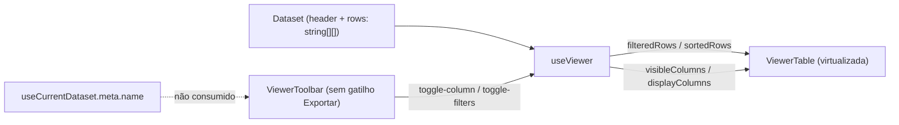
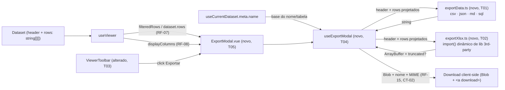

# Implementation Plan

## Request Summary
- Objective: Implementar a exportação de dados adiada do MVP (Screen 4) — um `ExportModal` disparado por um novo botão "Exportar" na `ViewerToolbar`, cobrindo 5 formatos (CSV/JSON/XLSX/MD/SQL), 2 escopos (linhas filtradas/todas) e 2 opções (cabeçalho/aspas), com download 100% client-side.
- Scope: **In** — gatilho na toolbar; modal fiel à Screen 4; geradores puros por formato respeitando `displayColumns` e o escopo escolhido; download nomeado/extensionado/MIME por formato; truncamento com aviso para XLSX acima de 1.048.576 linhas; dismiss sem persistência de seleção. **Out** — colunas ocultas, qualquer rede/backend, exportação agendada/em lote, persistência de preferências entre sessões, alteração do dataset/ordem de colunas, formatos além dos 5, i18n de conteúdo.
- Tier: standard
- Architecture references: `AGENTS.md` (camadas `app/services|composables|components`, regra "ssr:false ... no backend API surface"), `docs/agents/architecture.md` (tabela "Layer responsibilities": services = lógica pura framework-free; composables = estado reativo/orquestração; components = apresentacional, delega regras de negócio), `docs/agents/domain_rules.md` (invariante de `normalizeRow`: toda `row` já alinhada ao `header`, reaproveitável sem revalidação).

## AS IS — Componentes impactados

Legenda: `useViewer.ts` já deriva `filteredRows`, `displayColumns` e `dataset.rows`, consumidos hoje só pela tabela virtualizada; `useCurrentDataset.meta.name` não é consumido em lugar nenhum; a `ViewerToolbar` não tem gatilho "Exportar" (comentário explícito em `ViewerToolbar.vue:16-17` marcando a feature como adiada); nenhum módulo de geração de arquivo existe em `app/services/`.

## TO BE — Componentes propostos

Legenda: `ViewerToolbar` ganha o botão "Exportar" (T03) que abre `ExportModal.vue` (T05, apresentacional, padrão `FilterPanel.vue`). O modal delega toda a orquestração a `useExportModal` (T04, novo composable), que lê `filteredRows`/`dataset.rows`/`displayColumns` de `useViewer` sem alterá-los e `meta.name` de `useCurrentDataset`. Dois módulos novos de serviços puros — `exportData.ts` (T01: CSV/JSON/MD/SQL, síncrono) e `exportXlsx.ts` (T02: XLSX, assíncrono via `import()` dinâmico da lib de terceiros) — geram o conteúdo; `useExportModal` monta o `Blob` com nome/MIME fixos por formato e aciona o download sem nenhuma chamada de rede.

## Tasks

### T01 — Geradores puros CSV/JSON/Markdown/SQL + projeção de colunas + nome de tabela
- **Files**: `app/services/exportData.ts` (novo)
- **Change**: Módulo framework-free (sem `ref`/`computed`) com:
  - `projectColumns(rows: string[][], columnIndexes: number[]): string[][]` — pura, extrai só as colunas indicadas na ordem dada (base para RF-08; `header` já vem como `displayColumns.map(c => c.label)` de quem chama).
  - `generateCsv(header: string[], rows: string[][], options: { includeHeader?: boolean; quoteAll?: boolean }): string` — cabeçalho condicional; aspas em todos os campos OU só onde RFC 4180 exige (delimitador/aspas/quebra de linha), com aspas internas escapadas por duplicação; célula vazia → campo vazio entre delimitadores (RF-09, RF-17).
  - `generateJson(header: string[], rows: string[][]): string` — array de objetos chaveados pelos rótulos de `header`; todo valor não vazio é passthrough de string (nunca `Number`/`Boolean`); célula vazia → `null` JSON (RF-11, RF-17).
  - `generateMarkdown(header: string[], rows: string[][]): string` — tabela GFM com cabeçalho e separador SEMPRE presentes (ignora `includeHeader`, que é N/A para este formato — RF-05); escapa `|` como `\|` e substitui `\n`/`\r\n` por espaço em toda célula (cabeçalho e dados); célula vazia → célula em branco (RF-12, RF-17).
  - `generateSql(header: string[], rows: string[][], options: { includeHeader?: boolean; tableName: string }): string` — um `INSERT INTO <tableName> (<header>) VALUES (...);` por linha; strings entre aspas simples com `''` para aspas internas; célula vazia → `NULL` (escolha do gerador, consistente em todo o arquivo — RF-17); comentário `-- col1, col2, ...` antes do bloco só se `includeHeader` (RF-06, RF-13).
  - `deriveTableName(fileName: string): string` — remove a extensão final, substitui qualquer caractere fora de `[A-Za-z0-9_]` por `_`, colapsa `_` consecutivos, prefixa com `_` se começar com dígito ou for vazio (RF-14).
- **Covers**: RF-05, RF-06, RF-08, RF-09, RF-11, RF-12, RF-13, RF-14, RF-17, CT-01 (assinatura mínima por gerador puro, sem I/O, sem estado Vue)
- **Acceptance criteria**: cada gerador, chamado isoladamente com fixtures de `header`/`rows`/`options`, produz exatamente a string descrita nos ACs de RF-09/RF-11/RF-12/RF-13/RF-17 acima; `deriveTableName('transactions 2026.csv')` === `'transactions_2026'`; `deriveTableName('2026-vendas!.csv')` não começa com dígito e só contém `[A-Za-z0-9_]`; `projectColumns` nunca inclui um índice fora da lista passada.
- **Tests**: `test/exportData.spec.ts` — um `describe` por gerador cobrindo: cabeçalho on/off (onde aplicável), aspas-todas vs RFC 4180 mínimo (CSV), passthrough sem coerção numérica/booleana (JSON), escape de `|`/quebra de linha (Markdown), escape de aspas simples e comentário de cabeçalho (SQL), célula vazia por formato (RF-17), e casos de borda de `deriveTableName` (nome começando com dígito, vazio, sequência de separadores).
- **Risk**: Medium — bug de escaping/serialização corrompe o arquivo gerado silenciosamente (sem erro de runtime visível ao usuário); mitigado pela cobertura unitária exaustiva por formato.
- **Dependencies**: none

### T02 — Gerador XLSX (lib de terceiros via `import()` dinâmico) + truncamento
- **Files**: `app/services/exportXlsx.ts` (novo), `package.json`, `yarn.lock`
- **Change**: Adicionar a biblioteca de terceiros (ex. SheetJS `xlsx`) como dependência de runtime (`dependencies`, não `devDependencies` — é usada em produção, ainda que via `import()` lazy). Implementar `generateXlsx(header: string[], rows: string[][], options: { includeHeader?: boolean }): Promise<{ buffer: ArrayBuffer; rowCount: number; truncated: boolean }>`:
  - Dentro da função (nunca no topo do módulo), `const XLSX = await import('xlsx')` — garante que o código da lib só entra num chunk separado, carregado apenas quando XLSX é efetivamente gerado (RNF-02); o módulo `exportXlsx.ts` pode ser importado eagerly por quem o chama, sem puxar a lib.
  - Monta uma pasta de trabalho de planilha única (`aoa_to_sheet` + `book_append_sheet`) com a linha 1 = cabeçalho se e somente se `includeHeader` (RF-10); célula vazia → célula vazia (sem `'—'`, RF-17).
  - Se `(rows.length + (includeHeader ? 1 : 0)) > 1_048_576`, trunca as linhas de dados no limite (mantendo a linha de cabeçalho quando presente) e devolve `truncated: true`, sem dividir em múltiplas planilhas e sem lançar erro (RF-18).
- **Covers**: RF-10, RF-17 (XLSX), RF-18, RNF-02, CT-01 (assinatura mínima do gerador XLSX, retorno binário serializável)
- **Acceptance criteria**: o `ArrayBuffer` retornado, escrito em disco, abre como `.xlsx` válido de planilha única em pelo menos um leitor OOXML (Excel/LibreOffice/Google Sheets — validação manual); com `>1.048.576` linhas no escopo, `truncated === true` e o total de linhas da planilha (dados + cabeçalho) é exatamente `1_048_576`; dentro do limite, `truncated === false` e nenhuma linha é descartada; inspecionando os chunks do build de produção (`yarn build`), o código da lib XLSX não aparece nos chunks eager das rotas Upload/Viewer.
- **Tests**: `test/exportXlsx.spec.ts` — geração com/sem cabeçalho, célula vazia, truncamento acima/dentro do limite (usar um dataset sintético grande ou mockar `rows.length` para evitar alocar 1M+ strings reais no teste); mock de `import('xlsx')` onde a leitura binária completa não for viável em `happy-dom`.
- **Risk**: High — dependência de terceiros nova (superfície de API/versão pode mudar), truncamento em 1M+ linhas tem custo de geração perceptível, e a verificação de isolamento de chunk (RNF-02) depende de inspecionar o build de produção (não é uma asserção de teste unitário padrão) — mitigado por teste dedicado de truncamento com dataset sintético e um passo manual de bundle-analysis documentado no rollout.
- **Dependencies**: none (independente de T01 — arquivo e responsabilidade distintos)

### T03 — Botão "Exportar" na `ViewerToolbar`
- **Files**: `app/components/ViewerToolbar.vue`
- **Change**: Adicionar um controle "Exportar" em `toolbar__meta`, entre os controles existentes (`toolbar__controls`) e o contador de linhas, que emite um novo evento (`open-export`) ao clique; remover/atualizar o comentário em `ViewerToolbar.vue:16-17` que hoje documenta a exportação como "fora do escopo do MVP" (não reflete mais a realidade após esta feature).
- **Covers**: UI-04
- **Acceptance criteria**: o controle "Exportar" está presente no DOM da toolbar, posicionado entre os controles existentes e o contador de linhas; um clique emite `open-export` exatamente uma vez, sem alterar nenhum outro estado da toolbar.
- **Tests**: `test/ViewerToolbar.spec.ts` — novo caso: renderiza o botão "Exportar" e emite `open-export` ao clique.
- **Risk**: Low — mudança isolada de UI, sem lógica de negócio.
- **Dependencies**: none

### T04 — Composable `useExportModal` (orquestração)
- **Files**: `app/composables/useExportModal.ts` (novo)
- **Change**: Composable que recebe getters reativos para `filteredRows`, `allRows` (`dataset.rows`), `displayColumns` (`ViewerColumn[]`) e `fileName` (`meta.name`), e expõe:
  - `format` (`ref<'csv'|'json'|'xlsx'|'md'|'sql'>`, default `'csv'`), `scope` (`ref<'filtered'|'all'>`, default `'filtered'`), `includeHeader`/`quoteAll` (`ref<boolean>`, defaults `true`/`false`).
  - `resetSelection()` — restaura os defaults acima; chamada sempre que o modal abre (RF-16 — a seleção nunca deve sobreviver a um fechamento sem exportar).
  - `optionsEnabled` (computed `{ includeHeader: boolean; quoteAll: boolean }`) por formato, conforme RF-02 a RF-06 (CSV: ambos habilitados; XLSX: só cabeçalho; JSON/Markdown: nenhum; SQL: só cabeçalho).
  - `scopeCounts` (computed `{ filtered: number; all: number }`) a partir de `filteredRows.value.length`/`allRows.value.length`, formatáveis via `formatRowCount` (`app/services/formatFile.ts`) — UI-02.
  - `downloadLabel` (computed) — `"Baixar " + rótulo do formato` (`CSV|JSON|XLSX|MD|SQL`) — UI-05.
  - `rowsForScope` (computed) — `filteredRows.value` quando `scope==='filtered'`, `allRows.value` quando `'all'` — usa **sempre** a ordem de `filteredRows`/`dataset.rows`, nunca `sortedRows` (RF-07, fiel a `useViewer.ts:186-203`).
  - `xlsxWarning` (`ref<string | null>`) — populado quando `generateXlsx` retorna `truncated: true` (RF-18), limpo a cada nova geração/troca de formato.
  - `download()` (async) — projeta `rowsForScope.value` com `projectColumns(rows, displayColumns.value.map(c => c.index))` e `header = displayColumns.value.map(c => c.label)` (RF-08); chama o gerador do formato atual (`exportData.ts` síncrono para csv/json/md/sql; `exportXlsx.ts` assíncrono, `tableName: deriveTableName(fileName.value)` para SQL); monta o `Blob` com o MIME fixo por formato (`text/csv` | `application/json` | `application/vnd.openxmlformats-officedocument.spreadsheetml.sheet` | `text/markdown` | `text/plain` — CT-02); dispara o download via `URL.createObjectURL` + `<a download>` temporário, nomeado `<fileName sem extensão>.<ext>` (RF-15, CT-02); nenhuma chamada de rede em todo o fluxo (RNF-01); geração síncrona na thread principal, exceto o `await import('xlsx')`/o próprio `generateXlsx` (RNF-01 aceita isso para o MVP).
- **Covers**: RF-01 (estado inicial ao abrir), RF-02–RF-07, RF-08, RF-14, RF-15, RF-16 (reset), RF-18 (aviso), UI-02, UI-05, CT-02, RNF-01, RNF-02 (consumo do `import()` isolado de T02)
- **Acceptance criteria**: alternar `format` atualiza `optionsEnabled`/`downloadLabel` imediatamente; alternar `scope` não afeta `rowsForScope` além do escopo escolhido (contagens batem com `scopeCounts`); `download()` nunca inclui índices de coluna fora de `displayColumns.value`; após `resetSelection()`, `format==='csv'`, `scope==='filtered'`, `includeHeader===true`, `quoteAll===false`; `download()` no formato XLSX com escopo acima de 1.048.576 linhas define `xlsxWarning` com uma mensagem não vazia.
- **Tests**: `test/useExportModal.spec.ts` — uma suíte por RF coberto acima, usando datasets sintéticos (incl. um cenário com colunas ocultas/fixadas/reordenadas para RF-08, e um dataset >1.048.576 linhas sintético — reaproveitando o padrão de mocks já usado para XLSX em T02 — para RF-18).
- **Risk**: Medium — é o ponto de maior acoplamento entre RFs (escopo, projeção de colunas, nome/MIME, reset); um bug aqui pode silenciosamente exportar dados errados (colunas ocultas, escopo errado) sem lançar erro visível.
- **Dependencies**: T01, T02

### T05 — Componente `ExportModal.vue` (Screen 4)
- **Files**: `app/components/ExportModal.vue` (novo)
- **Change**: Modal seguindo o padrão de overlay de `FilterPanel.vue` (backdrop com `@click.self` para fechar, `Transition` de abertura/fechamento, `role="dialog"`/`aria-modal`, foco inicial via `watch(open) → nextTick → focus()` para o `@keydown.esc` funcionar sem clique prévio). Props: `open: boolean`, `filteredRows: string[][]`, `allRows: string[][]`, `displayColumns: ViewerColumn[]`, `fileName: string`. Instancia `useExportModal` (T04) internamente a partir dessas props (getters reativos). Template fiel à Screen 4 (`.spec/init/design/README.md#screen-4--exportação`): título "Exportar dados", subtítulo "Escolha o formato e o escopo.", 5 abas de formato (CSV/JSON/XLSX/MD/SQL), 2 rádios de escopo com contagem (`scopeCounts` + `formatRowCount`), 2 toggles de opção com estado `disabled` visual e não-interativo conforme `optionsEnabled` (UI-03), banner de aviso de truncamento (`xlsxWarning`, RF-18) quando presente, rodapé com "Cancelar" e o botão "Baixar" com `downloadLabel` dinâmico (UI-05). Fechamento por "X", "Cancelar", backdrop ou Escape chama `resetSelection()` (via T04) e `emit('close')` sem gerar/baixar nada (RF-16); clicar em "Baixar" chama `download()` (T04) e então `emit('close')`.
- **Covers**: RF-01, RF-02, RF-03, RF-04, RF-05, RF-06, RF-16, RF-18 (exibição do aviso), UI-01, UI-02, UI-03, UI-05
- **Acceptance criteria**: com `open=true`, o modal renderiza título, subtítulo, 5 abas, 2 rádios com contagem e 2 toggles, e o rodapé Cancelar/Baixar — todos simultaneamente visíveis (RF-01/UI-01); para cada formato, os toggles refletem exatamente o `optionsEnabled` computado (RF-02–06/UI-03) e não respondem a clique quando desabilitados; os 4 caminhos de dismiss (X/Cancelar/backdrop/Escape) não disparam `download()` e emitem `close`; reabrir o modal (nova prop `open=true` após um `close` sem baixar) mostra o estado padrão, não a seleção anterior.
- **Tests**: `test/ExportModal.spec.ts` — render fiel à Screen 4, troca de aba atualiza toggles/rótulo do botão, os 4 caminhos de dismiss não chamam download, clique em "Baixar" chama a lógica de download exatamente uma vez.
- **Risk**: Medium — replicar o padrão de acessibilidade (foco/Escape/backdrop) de `FilterPanel.vue` incorretamente quebra o dismiss por teclado sem sinal visual de erro.
- **Dependencies**: T04

### T06 — Wiring em `viewer.vue`
- **Files**: `app/pages/viewer.vue`
- **Change**: Importar `ExportModal`, adicionar `showExport = ref(false)`; escutar o novo evento `open-export` da `ViewerToolbar` (T03) para setar `showExport.value = true`; renderizar `<ExportModal :open="showExport" :filtered-rows="filteredRows" :all-rows="dataset.rows" :display-columns="displayColumns" :file-name="meta?.name ?? ''" @close="showExport = false" />`; expor `filteredRows` a partir de `useViewer` (hoje não desestruturado nesta página — só `sortedRows`/`visibleRowCount` são usados).
- **Covers**: RF-01 (wiring do gatilho), RF-07 (fonte de `filteredRows`/`dataset.rows`), RF-08 (fonte de `displayColumns`), RF-14/RF-15 (fonte de `meta.name`)
- **Acceptance criteria**: clicar em "Exportar" na toolbar abre o `ExportModal`; o modal recebe exatamente `filteredRows`/`dataset.rows`/`displayColumns`/`meta.name` correntes do Viewer (sem cópias defasadas); fechar o modal (qualquer caminho) volta `showExport` a `false` sem navegar nem alterar o dataset.
- **Tests**: `test/pages/viewer.spec.ts` — novo caso: clicar em "Exportar" na toolbar renderiza o `ExportModal` com `open=true`; fechar o modal reverte para `open=false`.
- **Risk**: Low — wiring de props/eventos, sem lógica nova.
- **Dependencies**: T03, T05

## Execution Phases
| Phase | Tasks | Parallel-safe? |
|-------|-------|----------------|
| 1 | T01, T02, T03 | Sim — arquivos distintos (`exportData.ts`, `exportXlsx.ts`+`package.json`, `ViewerToolbar.vue`), sem dependência entre si |
| 2 | T04 | Não (fase própria — depende de T01 e T02) |
| 3 | T05 | Não (depende de T04) |
| 4 | T06 | Não (depende de T03 e T05) |

## Contracts emitted

Nenhum arquivo de contrato formal (`openapi.yaml`/`.proto`/`asyncapi.yaml`) foi emitido. A seção `### Contracts` do SPEC (CT-01, CT-02) descreve explicitamente contratos **in-process** — assinaturas de módulos TypeScript, não uma superfície de API HTTP/RPC/eventos de rede (`docs/agents/architecture.md`, "External integration points: None"; `AGENTS.md:45`, "ssr:false ... no server runtime and no backend API surface"). A regra de emissão de contratos (REST → OpenAPI, gRPC → proto3, eventos assíncronos → AsyncAPI) não se aplica a nenhum desses dois casos. CT-01 e CT-02 são rastreados como assinaturas de tipo inline dentro das tasks T01/T02 (geradores puros) e T04 (nome de arquivo + MIME por formato), que é o mecanismo de verificação apropriado para contratos in-process sem superfície de rede.

## Risks
| Risk | Blast radius | Mitigation | Rollback |
|------|-------------|------------|----------|
| Bug de escaping/serialização por formato (CSV RFC 4180, JSON passthrough, Markdown `\|`/quebra de linha, SQL aspas simples) corrompe o arquivo exportado sem erro visível ao usuário | Arquivo exportado inválido ou com dados incorretos, sem sinal de falha na UI | Suíte unitária exaustiva por formato em `test/exportData.spec.ts`/`test/exportXlsx.spec.ts` cobrindo todos os ACs de RF-09/11/12/13/17 | Sem persistência envolvida — corrigir o gerador e reexportar; nenhum dado do usuário é afetado retroativamente |
| RF-08 mal implementado exporta colunas ocultas ou na ordem errada (vaza dados que o usuário explicitamente ocultou) | Exposição de dados que o usuário escondeu da visualização, em qualquer um dos 5 formatos | Testes de `useExportModal`/`exportData.projectColumns` com fixtures de colunas ocultas/fixadas/reordenadas; `header` e `rows` projetados sempre derivados de `displayColumns`, nunca do cabeçalho original | Corrigir a projeção e reexportar; nenhuma exportação anterior é revogável (é um download local do usuário), mas o bug não persiste em nenhum estado do app |
| Dependência de terceiros nova para XLSX (T02) muda de API entre versões, ou o `import()` dinâmico não isola o chunk como esperado (RNF-02) | Build quebrado ou bundle inicial inflado para todas as rotas Upload/Viewer, mesmo sem uso de XLSX | Fixar a versão da lib em `package.json`; verificação manual de bundle-analysis após `yarn build` documentada como passo de rollout; teste dedicado de truncamento/geração em `test/exportXlsx.spec.ts` | Reverter a dependência adicionada (`package.json`/`yarn.lock`) e o arquivo `exportXlsx.ts`; XLSX volta a ficar indisponível até correção, sem afetar os demais 4 formatos |
| Geração síncrona na thread principal (RNF-01, aceito para o MVP) trava a UI perceptivelmente para datasets muito grandes (próximo do limite de 1.048.576 linhas) | Percepção de "app travado" durante o clique em "Baixar" para arquivos grandes | Documentado como trade-off aceito nesta versão (RNF-01); nenhuma mitigação de código nesta fase — revisitar apenas se houver reclamação de performance futura | N/A — comportamento aceito e documentado, não uma regressão a reverter |
| RF-16 (dismiss sem persistir seleção) implementado incorretamente deixa a seleção anterior "vazar" para a próxima abertura do modal | Comportamento inesperado (usuário reabre o modal e vê a seleção anterior, não os defaults) — risco de confusão, não de dados | `resetSelection()` chamada em todo caminho de dismiss (T04) e testada explicitamente nos 4 caminhos em `test/ExportModal.spec.ts` | Corrigir o composable/handler de fechamento; sem estado persistido (RNF-04 do Viewer), o "rollback" é apenas o fix em código |

## Open Questions
Nenhuma pendente — a SPEC v1.1 chega com 0 marcadores `[NEEDS CLARIFICATION]` e todas as decisões de implementação necessárias para este PLAN (nome/local dos módulos de serviço, ponto exato do `import()` dinâmico do XLSX, valor de célula vazia em SQL) são FLEXIBLE e foram resolvidas aqui com uma escolha concreta e justificada em cada task (T01/T02/T04), sem contradizer nenhum requisito RIGID.

## Assumptions
- `useExportModal` (T04) recebe os dados do Viewer via **props/getters passados pelo componente pai** (`ExportModal.vue` → `viewer.vue`), sem estender `useViewer` nem introduzir um segundo estado de módulo compartilhado — consistente com a sugestão FLEXIBLE da SPEC ("sem estender `useViewer`") e com o padrão local de estado já usado por `FilterPanel.vue`. [Verificado contra o padrão existente, não contra um requisito RIGID.]
- O download é implementado com `URL.createObjectURL(blob)` + elemento `<a download>` temporário dentro do composable `useExportModal` (T04) — tratado como uma extensão do mesmo tipo de exceção já aberta para `useTheme` (manipulação direta de API de navegador fora de componentes), e não como "rendering/markup" vedado a composables pela tabela de `architecture.md`. [UNVERIFIED: a tabela de `architecture.md` não menciona download/Blob explicitamente; é uma inferência por analogia com o uso de IndexedDB/tema já presente nas composables.]
- Célula vazia em SQL (RF-17, "a critério do gerador") é serializada como `NULL` (sem aspas), não `''` — escolha registrada em T01, consistente para todo o arquivo gerado, sem preferência declarada no SPEC entre as duas opções permitidas.
- O nome do arquivo de download (RF-15, CT-02, `<nome-base>.<ext>`) usa `meta.name` sem a extensão original **sem** a sanitização de caracteres aplicada ao nome de tabela SQL (RF-14) — são regras distintas no SPEC (RF-14 é explicitamente sobre o identificador SQL; RF-15/CT-02 não mencionam sanitização de caracteres para o nome do arquivo).
- A biblioteca de terceiros para XLSX (T02) é tratada como SheetJS `xlsx` (única sugestão nomeada no SPEC), mas a escolha exata fica aberta ao implementador conforme a própria SPEC declara em FLEXIBLE — o PLAN não trava esse ponto além de exigir `import()` dinâmico e retorno binário serializável (CT-01).
