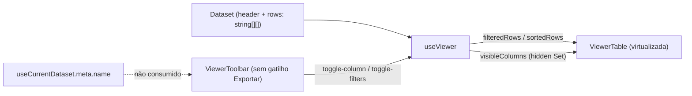
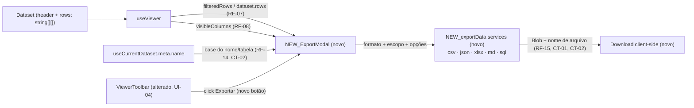

# SPEC: export

## Metadata
- Source: developer description via /plan
- Service: csvview (100% client-side, Nuxt 4 SSG — `ssr: false`, sem backend, sem API HTTP, sem persistência de servidor)
- Tier: standard
- Version: 1.1
- Architecture references: `AGENTS.md`, `docs/agents/architecture.md`, `docs/agents/domain_rules.md`

## Context

O Viewer já deriva, em `useViewer` (`app/composables/useViewer.ts`), tudo que a exportação precisa consumir: `filteredRows` (busca + filtros de coluna aplicados, ordem de exibição original, `useViewer.ts:186-203`), `sortedRows` (mesma base, já ordenada, `useViewer.ts:216-234`), e `visibleColumns` (colunas não ocultas pelo seletor "Colunas", a partir do `Set` `hidden`, `useViewer.ts:75,160-162`). Nenhuma dessas derivações é persistida — são todas `computed` em memória (RNF-04 documentado em `useViewer.ts`). A `ViewerToolbar.vue` hoje não tem gatilho "Exportar" (comentário explícito em `ViewerToolbar.vue:16-17`: "controle de Exportar (feature adiada) fica fora do escopo do MVP"), e o `project-phases.md` (linha 312, Fase 7.1) confirma que exportação foi deliberadamente adiada do MVP. Esta feature implementa esse escopo adiado agora, como um modal (Screen 4 do design, `.spec/init/design/README.md#screen-4--exportação`) disparado por um novo botão na toolbar.

O dataset atual carrega, além de `header`/`rows`, metadados em `useCurrentDataset` — em particular `meta.name` (`app/composables/useCurrentDataset.ts:23`), o nome original do arquivo aberto, usado aqui como base do nome de download e do nome de tabela SQL. Não há biblioteca de geração de planilhas no projeto hoje (`package.json` sem `xlsx`/`exceljs`/similar) — a geração de XLSX usará uma biblioteca de terceiros carregada via `import()` dinâmico (decisão confirmada, ver RNF-02).

Convenções arquiteturais aplicáveis: `docs/agents/architecture.md` define que `app/services/` contém **lógica pura de domínio, framework-free** (sem `ref`/`computed`, ver tabela "Layer responsibilities", `architecture.md:42`) enquanto `app/composables/` concentra **estado reativo e orquestração** (`architecture.md:43`) e `app/components/` fica **apresentacional**, delegando regras de negócio às camadas inferiores (`architecture.md:44: "Não possui: Persistência, parsing, business rules (delegated to composables/services)"`). Regra concreta aplicável aqui: os geradores de conteúdo por formato (CSV/JSON/XLSX/MD/SQL) são lógica pura de domínio e devem viver em `app/services/`, como `csvParser.ts`/`columnStats.ts`/`formatFile.ts` já fazem — o componente do modal e o composable do Viewer apenas coletam a seleção do usuário e chamam essas funções puras (controller→service delegation, análogo ao existente). `docs/agents/domain_rules.md` documenta a normalização de linha do parser (`csvParser.ts`, `normalizeRow`) que garante toda `row` alinhada ao tamanho do `header` — a exportação pode assumir essa invariante (nenhuma linha mais curta que o cabeçalho) sem revalidar.

## AS IS — Estado atual

Legenda: hoje `useViewer` já deriva `filteredRows`, `sortedRows` e `visibleColumns`, consumidos pela tabela virtualizada, mas nenhum módulo gera arquivos de exportação e a `ViewerToolbar` não tem um gatilho "Exportar" — o controle foi explicitamente adiado do MVP.

## TO BE — Estado proposto

Legenda: a `ViewerToolbar` ganha o botão "Exportar" (UI-04, alterado) que abre um `ExportModal` novo; o modal lê `filteredRows`/`dataset.rows` e `visibleColumns` de `useViewer` sem alterá-los (RF-07, RF-08) e o `meta.name` de `useCurrentDataset` (RF-14). Um módulo novo de serviços puros (`exportData`, CT-01) gera o conteúdo por formato (RF-09 a RF-13) e o modal aciona um download client-side (RF-15) sem nenhuma chamada de rede. `useViewer`, `useCurrentDataset` e `ViewerToolbar` são nós verificados no código; `ExportModal` e os serviços de exportação são novos.

## Scope
- **In**: gatilho "Exportar" na `ViewerToolbar`; modal (Screen 4) com seletor de formato (CSV/JSON/XLSX/MD/SQL), escopo (Linhas filtradas com contagem / Todas as linhas com contagem) e duas opções (Incluir cabeçalho, Aspas em todos os campos) habilitadas/desabilitadas por formato; geração de conteúdo respeitando apenas colunas visíveis; download client-side nomeado/extensionado por formato; fechar/Cancelar descarta sem exportar.
- **Out**: exportação de colunas ocultas; qualquer chamada de rede/backend para gerar ou entregar o arquivo; exportação agendada/automática ou em lote de múltiplos arquivos; persistência das preferências de exportação (formato/escopo/opções) entre sessões; alteração do dataset/ordem de colunas subjacente pela ação de exportar; formatos além dos cinco listados; internacionalização do conteúdo exportado (cabeçalhos/valores permanecem como estão no dataset).

## RIGID (Non-Negotiable)

### Functional Requirements

- RF-01 [Event-Driven] — QUANDO o usuário clica em "Exportar" na `ViewerToolbar`, O SISTEMA DEVE abrir o modal de exportação (Screen 4) exibindo: seletor de formato (abas CSV/JSON/XLSX/MD/SQL), seletor de escopo (rádio: Linhas filtradas / Todas as linhas, cada um com contagem), as duas opções (Incluir cabeçalho, Aspas em todos os campos) e o rodapé com Cancelar/Baixar.
  - AC: clicar em "Exportar" renderiza o modal com as 5 abas de formato, os 2 rádios de escopo com suas contagens e os 2 toggles de opção, todos visíveis ao mesmo tempo.

- RF-02 [State-Driven] — ENQUANTO o formato selecionado for **CSV**, O SISTEMA DEVE manter habilitados (interativos) os toggles "Incluir cabeçalho" e "Aspas em todos os campos".
  - AC: com CSV selecionado, ambos os toggles respondem a clique e alteram seu estado.

- RF-03 [State-Driven] — ENQUANTO o formato selecionado for **XLSX**, O SISTEMA DEVE manter habilitado "Incluir cabeçalho" e desabilitado (não aplicável, sem efeito) "Aspas em todos os campos".
  - AC: com XLSX selecionado, "Incluir cabeçalho" responde a clique; "Aspas em todos os campos" aparece desabilitado e não altera o arquivo gerado independentemente do seu estado.

- RF-04 [State-Driven] — ENQUANTO o formato selecionado for **JSON**, O SISTEMA DEVE manter ambos os toggles ("Incluir cabeçalho", "Aspas em todos os campos") desabilitados (não aplicáveis).
  - AC: com JSON selecionado, nenhum dos dois toggles é interativo, e o arquivo gerado independe do seu estado.

- RF-05 [State-Driven] — ENQUANTO o formato selecionado for **Markdown**, O SISTEMA DEVE manter ambos os toggles desabilitados (não aplicáveis) e a linha de cabeçalho DEVE sempre estar presente no arquivo gerado.
  - AC: com Markdown selecionado, nenhum dos dois toggles é interativo; o arquivo gerado sempre inclui a linha de cabeçalho da tabela GFM, independentemente de qualquer estado anterior do toggle "Incluir cabeçalho".

- RF-06 [State-Driven] — ENQUANTO o formato selecionado for **SQL**, O SISTEMA DEVE manter "Aspas em todos os campos" desabilitado (não aplicável — literais string são sempre delimitados por aspas simples) e "Incluir cabeçalho" habilitado, controlando a presença de uma linha de comentário `-- col1, col2, ...` antes das instruções `INSERT`.
  - AC: com SQL selecionado, "Aspas em todos os campos" não é interativo e não afeta a saída; ligar "Incluir cabeçalho" insere uma única linha `-- <col1>, <col2>, ...` (rótulos das colunas visíveis, na mesma ordem das colunas do `INSERT`) antes das instruções `INSERT`; desligado, essa linha não aparece.

- RF-07 [Conditional] — SE o escopo selecionado for "Linhas filtradas", O SISTEMA DEVE exportar exatamente as linhas de `filteredRows` (busca global + filtros de coluna ativos, ordem de exibição não ordenada — `useViewer.ts:186-203`); SE o escopo for "Todas as linhas", O SISTEMA DEVE exportar todas as linhas do dataset (`dataset.rows`), ignorando busca e filtros ativos.
  - AC: com um termo de busca e/ou filtros ativos que reduzem o dataset a N linhas, escolher "Linhas filtradas" gera um arquivo com exatamente N linhas de dados; escolher "Todas as linhas" gera um arquivo com o total de linhas do dataset carregado, independentemente da busca/filtros ativos.

- RF-08 [Ubiquitous] — Todo formato de exportação DEVE incluir apenas as colunas atualmente visíveis, na ordem de exibição final da tabela (`displayColumns`: colunas fixadas primeiro, seguidas da ordem resultante da reordenação do usuário sobre `visibleColumns` — `useViewer.ts:393-406`), e não a ordem original do cabeçalho do arquivo importado; colunas ocultas NÃO DEVEM aparecer em nenhum formato gerado.
  - AC: ocultando uma coluna antes de exportar, o arquivo gerado (em qualquer dos 5 formatos) não contém essa coluna nem seus valores; reexibindo-a, o próximo arquivo gerado volta a incluí-la.
  - AC: fixando uma coluna à esquerda e/ou reordenando colunas na tabela antes de exportar, a ordem das colunas no arquivo gerado (em qualquer formato) reflete `displayColumns` (fixadas primeiro, depois a ordem reordenada pelo usuário), não a ordem original do cabeçalho.

- RF-09 [Event-Driven] — QUANDO o formato for CSV, O SISTEMA DEVE gerar o conteúdo com: linha de cabeçalho presente se e somente se "Incluir cabeçalho" estiver ligado; todos os campos entre aspas duplas se "Aspas em todos os campos" estiver ligado, OU apenas os campos que exigem aspas por RFC 4180 (contêm o delimitador, aspas ou quebra de linha) se estiver desligado.
  - AC: com "Incluir cabeçalho" desligado, a primeira linha do arquivo já é a primeira linha de dados; com "Aspas em todos os campos" ligado, todo campo (inclusive números e campos sem caracteres especiais) aparece entre aspas duplas; desligado, apenas campos com vírgula/aspas/quebra de linha aparecem entre aspas (aspas internas escapadas por duplicação, conforme RFC 4180).

- RF-10 [Event-Driven] — QUANDO o formato for XLSX, O SISTEMA DEVE gerar uma pasta de trabalho de **planilha única** (single-sheet), abrível em Excel, LibreOffice Calc e Google Sheets, com a linha 1 sendo o cabeçalho se e somente se "Incluir cabeçalho" estiver ligado (caso contrário, a linha 1 já é a primeira linha de dados).
  - AC: o arquivo `.xlsx` gerado abre sem erro de formato em pelo menos um leitor OOXML padrão (Excel, LibreOffice Calc ou Google Sheets) e contém uma única planilha com os dados esperados; com "Incluir cabeçalho" ligado, a linha 1 contém os rótulos das colunas visíveis; desligado, a linha 1 já é a primeira linha de dados.

- RF-11 [Event-Driven] — QUANDO o formato for JSON, O SISTEMA DEVE gerar um array de objetos, um por linha exportada, cada objeto com uma chave por coluna visível igual ao rótulo dessa coluna no cabeçalho; todo valor não vazio DEVE ser serializado como string JSON exatamente como armazenado no modelo interno `string[][]` (passthrough), sem coerção para `number`/`boolean` mesmo quando o conteúdo da coluna pareça numérico ou booleano (ver RF-17 para células vazias).
  - AC: o arquivo gerado é um JSON válido cujo elemento raiz é um array; cada elemento é um objeto cujas chaves são exatamente os rótulos das colunas visíveis (nenhuma chave de coluna oculta) e cujos valores são os valores da linha correspondente.
  - AC: uma coluna cujos valores parecem numéricos (ex.: `"42"`, `"3.14"`) é exportada com o valor entre aspas como string JSON (`"42"`), nunca como número JSON (`42`) nem como booleano.

- RF-12 [Event-Driven] — QUANDO o formato for Markdown, O SISTEMA DEVE gerar uma tabela GFM (`pipe table`) válida, com a linha de cabeçalho e a linha separadora sempre presentes, contendo apenas as colunas visíveis; antes de inserir cada valor de célula (cabeçalho ou dado) na tabela, o gerador DEVE escapar qualquer caractere `|` literal como `\|` e substituir qualquer quebra de linha embutida (`\n` ou `\r\n`) por um único espaço, garantindo que a tabela gerada permaneça sintaticamente válida.
  - AC: o conteúdo gerado é uma tabela GFM sintaticamente válida (linha de cabeçalho, linha separadora `---` por coluna, linhas de dados), com uma coluna por rótulo visível e sem colunas ocultas.
  - AC: um valor de célula contendo o caractere `|` é exportado com esse caractere escapado como `\|`, sem quebrar a contagem de colunas da linha; um valor contendo quebra de linha é exportado como uma única linha da tabela (a quebra é substituída por espaço), sem gerar linhas extras.

- RF-13 [Event-Driven] — QUANDO o formato for SQL, O SISTEMA DEVE gerar uma instrução `INSERT INTO <tabela> (<colunas visíveis>) VALUES (<valores>);` por linha exportada, com todo literal de string delimitado por aspas simples (`'...'`), escapando aspas simples internas por duplicação (`''`); se "Incluir cabeçalho" estiver ligado, uma única linha de comentário `-- <col1>, <col2>, ...` DEVE preceder o bloco de instruções `INSERT`.
  - AC: o arquivo gerado contém exatamente uma instrução `INSERT INTO` por linha exportada, com a lista de colunas igual às colunas visíveis na mesma ordem dos valores; todo valor de string aparece entre aspas simples com qualquer aspa simples interna escapada como `''`; com "Incluir cabeçalho" ligado, a primeira linha não-vazia do arquivo é o comentário `-- col1, col2, ...`.

- RF-14 [Ubiquitous] — O nome da tabela usado em `INSERT INTO` DEVE ser derivado de `meta.name` (`app/composables/useCurrentDataset.ts:23`, nome original do arquivo aberto) removendo a extensão final e substituindo por `_` qualquer caractere que não seja letra ASCII, dígito ou `_`; sequências de `_` consecutivos resultantes colapsam em um único `_`; se o resultado começar com um dígito ou for vazio, DEVE ser precedido por `_`.
  - AC: um arquivo aberto como `transactions 2026.csv` gera instruções `INSERT INTO transactions_2026 (...)`; um arquivo `2026-vendas!.csv` gera um nome de tabela que não começa com dígito (ex.: prefixado com `_`) e sem caracteres fora de `[A-Za-z0-9_]`.

- RF-15 [Event-Driven] — QUANDO o usuário clica em "Baixar", O SISTEMA DEVE disparar um download client-side (sem requisição de rede) do arquivo gerado, nomeado a partir do nome base do arquivo aberto (`meta.name` sem extensão) e com a extensão correspondente ao formato selecionado (`.csv`, `.json`, `.xlsx`, `.md`, `.sql`).
  - AC: clicar em "Baixar" produz um único arquivo entregue via API de download do navegador (sem chamada de rede observável), cujo nome termina com a extensão do formato selecionado; nenhuma requisição HTTP é disparada pela ação.

- RF-16 [Unwanted] — SE o usuário clicar em "Cancelar", fechar o modal pelo "X", clicar no backdrop fora do conteúdo do modal, OU pressionar a tecla Escape enquanto o modal estiver aberto — consistente com o padrão já existente do `FilterPanel` para backdrop/Escape —, O SISTEMA NÃO DEVE gerar nem baixar nenhum arquivo, e a seleção feita no modal (formato/escopo/opções) NÃO DEVE persistir para a próxima abertura.
  - AC: abrir o modal, alterar formato/escopo/opções e, em qualquer um dos quatro casos — (a) clicar em "Cancelar", (b) fechar por "X", (c) clicar no backdrop, (d) pressionar Escape —, nenhum download é produzido; reabrir o modal em seguida mostra o estado padrão (não a seleção anterior descartada).

- RF-17 [Ubiquitous] — Uma célula vazia (string vazia no modelo interno `string[][]`) DEVE ser serializada por formato segundo a convenção nativa de cada um: string vazia (`""`) entre delimitadores em CSV; `null` (o valor JSON `null`, não a string `"null"`) em JSON; célula vazia (sem texto) na tabela Markdown; e, em SQL, string vazia entre aspas simples (`''`) ou o literal `NULL` (sem aspas) — a critério do gerador, desde que consistente para todas as células vazias do arquivo. Em nenhum formato o placeholder visual `—` usado apenas na renderização da UI (`CsvCell.vue`) DEVE aparecer no conteúdo exportado.
  - AC: exportando uma linha com uma célula vazia em cada um dos 5 formatos: o campo CSV correspondente está vazio entre os delimitadores; a chave JSON correspondente tem valor `null`; a célula Markdown correspondente está vazia; a instrução SQL contém `''` ou `NULL` na posição correspondente; o arquivo XLSX contém uma célula vazia na posição correspondente.
  - AC: em nenhum dos 5 formatos gerados o caractere `—` aparece no conteúdo exportado, mesmo quando a célula de origem está vazia.

- RF-18 [Conditional] — SE o número de linhas do escopo selecionado (mais a linha de cabeçalho, quando incluída) exceder o limite de linhas por planilha do Excel (1.048.576 linhas), O SISTEMA DEVE, ao gerar XLSX (RF-10), truncar a exportação nesse limite e exibir um aviso visível ao usuário informando que o arquivo foi truncado, sem dividir os dados em múltiplas planilhas e sem bloquear o download do arquivo truncado.
  - AC: exportando em XLSX um escopo com mais de 1.048.576 linhas (dados + cabeçalho, se "Incluir cabeçalho" estiver ligado), o arquivo `.xlsx` gerado contém exatamente 1.048.576 linhas em uma única planilha, e uma mensagem visível ao usuário indica que o arquivo foi truncado.
  - AC: exportando em XLSX um escopo dentro do limite, nenhum aviso de truncamento é exibido e nenhuma linha é descartada.

### UI Requirements

- UI-01 [Ubiquitous] — O modal de exportação DEVE seguir a Screen 4 do design (`.spec/init/design/README.md#screen-4--exportação`): título "Exportar dados", subtítulo "Escolha o formato e o escopo.", abas de formato, rádios de escopo, os dois toggles de opção e o rodapé Cancelar/Baixar.
  - AC: o modal renderiza título, subtítulo, as 5 abas de formato, os 2 rádios de escopo e os 2 toggles de opção, e o rodapé com os botões "Cancelar" e "Baixar".

- UI-02 [State-Driven] — ENQUANTO o modal estiver aberto, cada rádio de escopo DEVE exibir a contagem de linhas correspondente: "Linhas filtradas" mostra `filteredRows.value.length`; "Todas as linhas" mostra o total do dataset (`dataset.value.rows.length` / `totalRows`), formatadas com `formatRowCount` (`app/services/formatFile.ts:15`, mesmo formatador já usado no contador da toolbar).
  - AC: a contagem ao lado de "Linhas filtradas" muda em tempo real conforme busca/filtros ativos no momento em que o modal é aberto; a contagem ao lado de "Todas as linhas" permanece igual ao total do dataset independentemente da busca/filtros.

- UI-03 [State-Driven] — Um toggle de opção desabilitado para o formato atual (RF-03 a RF-06) DEVE ser visualmente distinguível (ex.: opacidade reduzida/atributo `disabled`) e NÃO DEVE responder a interação de clique/teclado.
  - AC: para cada formato cujo AC declara um toggle não aplicável, esse toggle é renderizado com um estado visual de desabilitado e um clique nele não altera seu valor nem o conteúdo a ser gerado.

- UI-04 [Event-Driven] — A `ViewerToolbar` DEVE ganhar um novo controle "Exportar", posicionado entre os controles existentes e o contador de linhas (área `toolbar__meta`), que abre o modal de exportação ao ser clicado.
  - AC: o controle "Exportar" está presente na toolbar do Viewer e, ao ser clicado, abre o modal descrito em RF-01/UI-01.

- UI-05 [State-Driven] — ENQUANTO o modal de exportação estiver aberto, o botão "Baixar" do rodapé DEVE exibir um rótulo dinâmico dependente do formato selecionado, conforme o mockup: "Baixar CSV", "Baixar JSON", "Baixar XLSX", "Baixar MD", "Baixar SQL".
  - AC: selecionando cada uma das 5 abas de formato, o texto do botão de baixar no rodapé muda imediatamente para o rótulo correspondente listado acima, sem exigir fechar e reabrir o modal.

### Contracts

Contratos **in-process** (superfície de tipos TypeScript/módulos) — não há API HTTP nem RPC; o app é 100% client-side (`docs/agents/architecture.md`, "External integration points: None"; `AGENTS.md:45`, "ssr:false ... no server runtime and no backend API surface").

- CT-01: Um módulo novo de geradores puros por formato (candidato FLEXIBLE `app/services/exportData.ts`, arquivo ainda não existe — nome não congelado) DEVE expor, no mínimo, uma função pura por formato com a assinatura conceitual `(header: string[], rows: string[][], options: { includeHeader?: boolean; quoteAll?: boolean; tableName?: string }) => string | ArrayBuffer` (CSV/JSON/MD/SQL retornam `string`; XLSX retorna um binário serializável, ex. `ArrayBuffer`/`Uint8Array`, ver RNF-02). Cada gerador é puro, sem I/O e sem depender de estado do Vue — segue a convenção de `csvParser.ts`/`columnStats.ts`/`formatFile.ts` (`architecture.md:42`).
- CT-02: O download client-side DEVE nomear o arquivo como `<nome-base>.<ext>`, onde `<nome-base>` é `meta.name` (`useCurrentDataset.ts:23`) sem a extensão original, e `<ext>` é `csv | json | xlsx | md | sql` conforme o formato selecionado. O `Blob`/download DEVE usar um tipo MIME fixo por formato: `text/csv` (CSV), `application/json` (JSON), `application/vnd.openxmlformats-officedocument.spreadsheetml.sheet` (XLSX), `text/markdown` (MD), `text/plain` (SQL — não há tipo IANA registrado para `.sql`; `text/plain` é o fallback universalmente suportado pelos navegadores).

### Non-Functional Requirements

- RNF-01 — A geração e o download do arquivo NÃO DEVEM realizar nenhuma requisição de rede: todo o processamento (leitura do dataset em memória, montagem do conteúdo, criação do `Blob` e disparo do download) ocorre inteiramente no navegador, coerente com o princípio client-side do produto (`project-description.md`, "os dados nunca saem do dispositivo"; `AGENTS.md:45`). A geração do conteúdo é síncrona na thread principal — consistente com o padrão já usado por `sortedRows` em `useViewer` — e esta versão não define orçamento máximo de tempo de bloqueio nem exige geração assíncrona/particionada; isso é aceitável para o escopo desta feature (MVP) e deve ser revisitado apenas se surgir reclamação de performance futura.
  - AC: durante o fluxo de exportação (abrir modal → escolher opções → Baixar), nenhuma chamada de rede é observada.
- RNF-02 — A geração de XLSX (RF-10) DEVE usar uma biblioteca client-side de terceiros (ex. SheetJS/`xlsx`), carregada via `import()` dinâmico ativado apenas quando o usuário seleciona o formato XLSX no modal de exportação — a biblioteca NÃO DEVE ser incluída no bundle eager inicial das telas Upload/Viewer, mitigando o impacto no tamanho do bundle da SPA estática.
  - AC: analisando os chunks gerados pelo build de produção, o código da biblioteca de geração XLSX está isolado em um chunk separado do bundle inicial (eager) das rotas Upload/Viewer; abrir e usar a aplicação sem nunca selecionar o formato XLSX não carrega esse chunk; selecionar XLSX no modal e clicar em "Baixar XLSX" aciona o carregamento do chunk antes de produzir o arquivo.

## FLEXIBLE (Implementation Suggestions)

- **Onde vive a lógica**: um gerador puro por formato em `app/services/exportData.ts` (ou arquivos por formato, ex. `exportCsv.ts`/`exportSql.ts`, se o módulo crescer muito), reaproveitando padrões já existentes (`formatFile.ts` para formatação de metadados, `columnStats.ts` para o estilo de funções puras testáveis).
- **UI do modal**: um componente novo `ExportModal.vue`, seguindo o padrão de overlay já estabelecido em `FilterPanel.vue` (backdrop com `@click.self` para fechar, transições de abertura/fechamento, foco inicial para Escape funcionar) — mantém consistência visual e de acessibilidade entre os dois modais/drawers do Viewer.
- **Estado do modal**: um `ref` local de UI (formato selecionado, escopo, opções) no próprio `ExportModal` ou num composable dedicado (`useExportModal`), sem estender `useViewer` — a exportação é uma ação pontual, não um estado persistente do Viewer, ao contrário de busca/filtros/ordenação.
- **XLSX (RNF-02)**: a biblioteca de terceiros e o `import()` dinâmico já são RIGID (RNF-02); fica em aberto para o implementador apenas a escolha exata da biblioteca (ex. SheetJS/`xlsx` vs. alternativa equivalente) e o ponto de código onde o `import()` é disparado (no submit do "Baixar" vs. já ao selecionar a aba XLSX).
- **Reaproveitar `formatRowCount`** (`app/services/formatFile.ts:15`) para as contagens do escopo (UI-02), igual ao contador já usado na `ViewerToolbar`.
- **Download**: `URL.createObjectURL(blob)` + elemento `<a download>` temporário é o padrão client-side usual para este tipo de ação, sem dependência nova.

## Acceptance Criteria Summary
| ID | Criterion | Testable? |
|----|-----------|-----------|
| RF-01 | "Exportar" abre o modal com todos os controles da Screen 4 | Sim (component) |
| RF-02 | CSV: ambos os toggles habilitados | Sim (component) |
| RF-03 | XLSX: cabeçalho habilitado, aspas desabilitado/N-A | Sim (component) |
| RF-04 | JSON: ambos os toggles desabilitados/N-A | Sim (component) |
| RF-05 | Markdown: ambos desabilitados/N-A; cabeçalho sempre presente | Sim (component/unit) |
| RF-06 | SQL: aspas desabilitado/N-A; cabeçalho controla comentário `-- cols` | Sim (component/unit) |
| RF-07 | Escopo filtrado = `filteredRows`; escopo total = `dataset.rows` | Sim (unit) |
| RF-08 | Apenas colunas visíveis exportadas em todos os formatos, na ordem de `displayColumns` | Sim (unit) |
| RF-09 | CSV: cabeçalho condicional; aspas-todas vs RFC 4180 mínimo | Sim (unit) |
| RF-10 | XLSX: planilha única abrível; cabeçalho condicional na linha 1 | Sim (unit/manual) |
| RF-11 | JSON: array de objetos chaveados pelos rótulos visíveis; valores sempre string (sem coerção numérica) | Sim (unit) |
| RF-12 | Markdown: tabela GFM válida, cabeçalho sempre presente; `\|` escapado e quebras de linha convertidas em espaço | Sim (unit) |
| RF-13 | SQL: um `INSERT` por linha; strings sempre entre aspas simples; comentário opcional | Sim (unit) |
| RF-14 | Nome de tabela derivado e sanitizado a partir de `meta.name` | Sim (unit) |
| RF-15 | "Baixar" produz download nomeado/extensionado por formato, sem rede | Sim (component/manual) |
| RF-16 | Cancelar/"X"/backdrop/Escape descartam sem exportar nem persistir seleção | Sim (component) |
| RF-17 | Células vazias serializadas por convenção nativa do formato; `—` nunca exportado | Sim (unit) |
| RF-18 | XLSX além do limite de linhas do Excel é truncado com aviso visível | Sim (unit/component) |
| UI-01 | Modal fiel à Screen 4 (título, abas, rádios, toggles, rodapé) | Sim (component) |
| UI-02 | Contagens de escopo corretas e reativas | Sim (component) |
| UI-03 | Toggles desabilitados são não-interativos e visualmente distintos | Sim (component) |
| UI-04 | Controle "Exportar" presente na toolbar e abre o modal | Sim (component) |
| UI-05 | Rótulo do botão "Baixar" muda dinamicamente por formato selecionado | Sim (component) |
| CT-01 | Módulo de geradores puros por formato, assinatura mínima definida | Sim (type/unit) |
| CT-02 | Nome de arquivo/MIME fixo por formato no download (SQL = `text/plain`) | Sim (unit/manual) |
| RNF-01 | Nenhuma requisição de rede durante o fluxo de exportação; geração síncrona aceitável para o MVP | Sim (review/manual) |
| RNF-02 | XLSX via biblioteca de terceiros com `import()` dinâmico, fora do bundle eager | Sim (build/bundle analysis) |

## Open Clarifications
Nenhuma pendente — os 3 marcadores de clarificação pré-existentes (RF-08 ordem de colunas, serialização de células vazias, abordagem de geração XLSX) e as 7 lacunas/ambiguidades adicionais identificadas na análise foram resolvidos com decisões do desenvolvedor em `.spec/features/export/.handoff/clarifier-answers.md` e incorporados nesta versão (v1.1) como requisitos RIGID (RF-08, RF-11, RF-12, RF-16, RF-17, RF-18, UI-05, CT-02, RNF-01, RNF-02).
