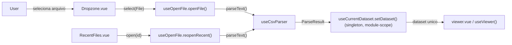
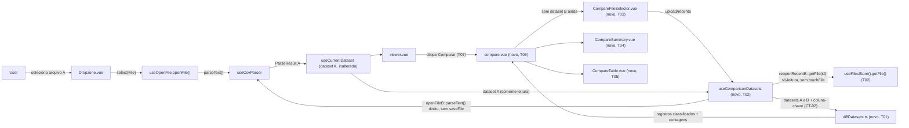

# Implementation Plan

## Request Summary
- Objective: comparar dois datasets CSV/TSV (A já carregado no Viewer + B escolhido pelo usuário) em memória simultânea, classificando cada registro em adicionado/removido/alterado/sem alteração, com diff célula a célula dos alterados, resumo de contagens e filtro "somente diferenças".
- Scope: **in** — abrir B mantendo A intacto; motor de pareamento por chave comum (fallback posicional); classificação e diff normalizado por tipo; tela/modo dedicado de comparação; resumo + filtro. **Out** — merge de 3+ arquivos, edição de célula na tela de comparação, exportação do diff.
- Tier: standard
- Architecture references: `AGENTS.md`, `docs/agents/architecture.md`, `docs/agents/domain_rules.md` (todas verificadas na leitura direta de `useCurrentDataset.ts`, `useOpenFile.ts`, `Dropzone.vue`, `RecentFiles.vue`, `columnStats.ts`, `useViewer.ts`, `ViewerTable.vue`, `ExportModal.vue`, `viewer.vue`, `index.vue`, `useFilesStore.ts`, `useDatabase.ts`, `useCellEditing.ts`, `useViewerSession.ts`)

## AS IS — Componentes impactados

Verificado por leitura direta: `useCurrentDataset` (`app/composables/useCurrentDataset.ts:36-37`) é um singleton de módulo — `dataset`/`meta` em `ref`s fora da função — e `setDataset()` sempre substitui o conteúdo anterior; não existe hoje nenhum ponto que carregue dois datasets simultâneos, nem constante de teto de tamanho/linhas em `useOpenFile.ts`/`csvParser.ts` (confirmado por busca textual — não há `MAX_FILE_SIZE`/`MAX_ROW*` em nenhum arquivo de `app/`). `useFilesStore.saveFile()` (`app/composables/useFilesStore.ts:45-79`) persiste em IndexedDB e aplica a política LRU (`MAX_RECENT_FILES = 10`); `touchFile()` (`useFilesStore.ts:114-129`) atualiza `last_opened_at` de um registro já existente, reordenando os recentes; `getFile()` (`useFilesStore.ts:82-85`) é leitura pura, sem efeito colateral.

## TO BE — Componentes propostos

T07 acrescenta o botão "Comparar" à `ViewerToolbar.vue`/`viewer.vue`, navegando para a rota nova `/compare` (RF-02). T06 (`compare.vue`) guarda a rota atrás de `hasDataset` (dataset A) e alterna entre T03 (sem B) e T04+T05 (com B). **T02 (`useComparisonDatasets`) NÃO instancia `useOpenFile.ts` para o fluxo de B** — abre um caminho dedicado e paralelo (`openFileB`/`reopenRecentB`) que reaproveita apenas peças framework-free/sem I/O de persistência (`useCsvParser`/Web Worker de parse, e as constantes puras de extensão de `useOpenFile.ts`) e o acesso somente-leitura `useFilesStore().getFile()`; **nunca chama `saveFile()` nem `touchFile()`** — dataset B nunca é persistido em IndexedDB e nunca aparece na lista de recentes (RecentFiles.vue continua listando apenas os recentes de A, reaproveitada por T03 apenas como UI de seleção). T02 também nunca importa nem muta `useCurrentDataset` diretamente, preservando RF-01. T01 (`diffDatasets.ts`) é o único lugar com lógica de pareamento/classificação/equivalência por tipo (RF-03 a RF-06, CT-02).

## Tasks

### T01 — Serviço puro `diffDatasets.ts` (pareamento, classificação, equivalência por tipo)
- **Files**: `app/services/diffDatasets.ts` (novo)
- **Change**: Implementar, framework-free (`app/services/` — `AGENTS.md` seção 2), um serviço puro com:
  - `commonKeyColumns(headerA: string[], headerB: string[]): string[]` — nomes de coluna presentes em ambos os cabeçalhos, na ordem de A (CT-02: base para o seletor de coluna-chave; cabeçalhos divergentes → lista vazia).
  - `pairByKey(datasetA, datasetB, keyColumn: string): PairedIndex[]` — constrói `Map<string, number>` chave concatenada → nº da linha para cada dataset (chave = valor bruto da(s) coluna(s)-chave) e casa os registros cujas chaves coincidem; chave presente só em um mapa vira `added`/`removed` (RF-04). Duplicidade de chave dentro do mesmo dataset: `Map.set` fica com a última ocorrência (documentar no JSDoc — decisão de implementação, `FLEXIBLE` da SPEC não fixa estrutura exata).
  - `pairByPosition(datasetA, datasetB): PairedIndex[]` — casa linha N de A com linha N de B; índice fora do intervalo de um dos lados vira `added`/`removed` (RF-05).
  - `valuesEqual(type: ColumnType, a: string, b: string): boolean` — reexporta a regra de equivalência de RF-06: `number` via `parseNumber` (`columnStats.ts`) comparado numericamente, `date` via `parseDate` comparado pelo timestamp, demais tipos por igualdade de string exata.
  - `diffRecord(rowA, rowB, commonColumns: {name, index}[], typeOf: (name) => ColumnType): { status: 'changed' | 'unchanged'; diffColumns: string[] }` — aplica `valuesEqual` a cada coluna comum; o tipo usado por coluna exige que **ambos** os lados (A e B) tenham essa coluna inferida como o mesmo tipo não-texto para aplicar a regra numérica/data — caso contrário cai em comparação de string exata (ver `## Assumptions`).
  - `diffDatasets(datasetA: Dataset, datasetB: Dataset, options?: { keyColumn?: string }): ComparisonResult` — orquestra: resolve pareamento (`pairByKey` se `keyColumn` informado e presente em `commonKeyColumns`, senão `pairByPosition`, RF-05), classifica cada par via `diffRecord`, agrega contagens (RF-03). Exporta os tipos `RecordStatus`, `ComparisonRecord`, `ComparisonResult`.
- **Covers**: RF-03, RF-04, RF-05, RF-06, CT-02 (parte de descoberta/pareamento por coluna-chave)
- **Tests**: `test/diffDatasets.spec.ts` — `commonKeyColumns` com/sem interseção; `pairByKey` com chaves únicas, chave só em A, chave só em B, chave duplicada (documenta last-write-wins); `pairByPosition` com A mais longo, B mais longo, mesmo tamanho; `valuesEqual` para `"10"` vs `"10.0"` (number, iguais), datas em formatos distintos equivalentes, texto que difere em qualquer caractere (não igual); `diffDatasets` fim a fim: soma de contagens == total de pares (RF-03 AC), nenhum registro em duas categorias.
- **Risk**: Medium — é o único ponto de lógica de negócio da feature; um erro de pareamento propaga silenciosamente para toda a UI de comparação.
- **Dependencies**: none

### T02 — Composable `useComparisonDatasets` (estado paralelo CT-01, RF-01, RNF-01; abertura de B dedicada e sem persistência)
- **Files**: `app/composables/useComparisonDatasets.ts` (novo)
- **Change**: Composable de estado em escopo de módulo (mesmo padrão de `useCurrentDataset.ts`/`useCellEditing.ts`), expondo:
  - `datasetA`/`metaA`: passthrough somente-leitura de `useCurrentDataset().dataset`/`.meta` — nunca reatribuídos, nunca chama `setDataset`/`clearDataset`/`updateCell` (RF-01 AC: nenhuma navegação/estado desta feature aciona `useCurrentDataset.setDataset()` sobre A).
  - `datasetB`/`metaB`: `ref`s locais dedicadas (CT-01) — nunca persistidas em IndexedDB.
  - `keyColumn`: `ref<string | null>` (CT-02), mais `availableKeyColumns` computed via `commonKeyColumns(datasetA.header, datasetB.header)` (T01) quando ambos carregados, senão `[]`.
  - `result`: `computed(() => datasetA.value && datasetB.value ? diffDatasets(datasetA.value, datasetB.value, { keyColumn: keyColumn.value ?? undefined }) : null)` (T01).
  - `summary`: computed com as contagens de `result` (UI-03).
  - `hasDatasetB`: computed.
  - `openFileB(file: File): Promise<boolean>` — caminho de abertura **dedicado e paralelo** a `useOpenFile.ts`, NÃO uma instância dele: valida a extensão reaproveitando as constantes puras `hasAcceptedExtension`/`ACCEPTED_EXTENSIONS`/`ACCEPTED_LABEL` já exportadas por `useOpenFile.ts` (framework-free, sem I/O — seguras de importar sem trazer o fluxo de persistência); lê `file.text()`; parseia via `parser.parseText()` (`useCsvParser()` por padrão — mesmo `csvParser.worker.ts`, injetável para teste); valida o teto de RNF-01 via `exceedsCeiling(file.size, result.row_count)` (abaixo); em sucesso, atribui `datasetB.value`/`metaB.value` diretamente a partir do `ParseResult` (sem `id` persistido — `metaB.id` fica `undefined`). **Nunca chama `useFilesStore().saveFile()`** nem qualquer outra escrita em IndexedDB.
  - `reopenRecentB(id: number): Promise<boolean>` — reabre, em modo **somente-leitura**, um arquivo já persistido (item da lista de recentes de A, exibida em T03 via `RecentFiles.vue`) como dataset B: busca o conteúdo via `filesStore.getFile(id)` (leitura pura, `useFilesStore.ts:82-85`, sem efeito colateral), reparseia via o mesmo `parser`, valida o teto de RNF-01 via `exceedsCeiling(record.size_bytes, result.row_count)`, e em sucesso atribui `datasetB.value`/`metaB.value` (`metaB.id = id`, apenas para exibição). Deliberadamente **não chama `filesStore.touchFile(id)`**: reabrir um arquivo como B não deve alterar `last_opened_at` nem reordenar os recentes de A (ver `## Assumptions`) — elimina a antiga hipótese de LRU compartilhada entre A e B.
  - `exceedsCeiling(sizeBytes: number, rowCount: number): boolean` — helper interno com `MAX_COMPARISON_SIZE_BYTES` (50 * 1024 * 1024) e `MAX_COMPARISON_ROWS` (1_000_000), reaproveitado por `openFileB`/`reopenRecentB`; em excesso, seta `comparisonError` com mensagem em pt-BR e **não** atribui `datasetB`/`metaB` (RNF-01 AC: arquivo B validado contra o mesmo teto hoje-alvo de um único dataset; teto de A não é reavaliado). Expor `comparisonError: readonly(ref)`.
  - `isOpeningB`/`progressB`: `ref`s locais dedicadas ao próprio composable (não compartilhadas com o estado de módulo de `useOpenFile.ts`) — como B não instancia mais `useOpenFile()`, não há superfície de estado (`error`/`isOpening`/`progress`) para vazar entre a tela de Upload e a tela de comparação.
  - `clearComparison()`: zera `datasetB`/`metaB`/`keyColumn`/`comparisonError` — nunca toca em A.
  - Reset automático: `watch(() => useCurrentDataset().meta.value?.id, clearComparison, { flush: 'sync' })` — mesma técnica de `useCellEditing.ts:61-70` — evita uma comparação B-vs-A ficar presa contra um A já trocado (ver `## Assumptions`).
  - Opções injetáveis (mesmo padrão de `UseOpenFileOptions`, para teste): `{ parser?: OpenFileParser; filesStore?: Pick<ReturnType<typeof useFilesStore>, 'getFile'> }` — o tipo do `filesStore` injetável expõe **apenas** `getFile` (leitura), nunca `saveFile`/`touchFile`, reforçando em tipo que o caminho de B não escreve em IndexedDB.
- **Covers**: RF-01, CT-01, CT-02 (exposição da coluna-chave), RNF-01
- **Tests**: `test/useComparisonDatasets.spec.ts` — carregar B não altera `dataset`/`meta` de `useCurrentDataset` (RF-01 AC, comparando `rowCount`/`columnCount`/conteúdo antes/depois); `openFileB`/`reopenRecentB` populam `datasetB`/`metaB` sem chamar `setDataset`; `openFileB`/`reopenRecentB` **nunca chamam `saveFile`/`touchFile`** do `filesStore` injetado (spy dedicado); com um `filesStore` real (IndexedDB fake/in-memory do projeto), `useFilesStore().listFiles()` não ganha nenhuma entrada nova e o `last_opened_at`/ordem dos arquivos existentes não muda após abrir B por upload ou por recente; arquivo B acima do teto de tamanho e acima do teto de linhas são ambos rejeitados com `comparisonError` populado e `datasetB` permanece `null`, nos dois caminhos (`openFileB` e `reopenRecentB`); troca do `id` de A (via `useCurrentDataset().setDataset`) limpa `datasetB`/`metaB`/`keyColumn`/`comparisonError`; `availableKeyColumns` reflete a interseção real dos cabeçalhos.
- **Risk**: Medium — o caminho de abertura de B é paralelo e não reaproveita `useOpenFile.ts` por injeção; validação de extensão/mensagens de erro precisa se manter alinhada manualmente ao fluxo de A (mitigado reaproveitando as constantes exportadas de `useOpenFile.ts`, ver `## Risks`).
- **Dependencies**: T01

### T03 — Componente `CompareFileSelector.vue` (UI-01: escolha do arquivo B)
- **Files**: `app/components/CompareFileSelector.vue` (novo)
- **Change**: Modal reaproveitando `Dropzone.vue`/`RecentFiles.vue` **por composição** (não herança de props — `Dropzone.vue` não recebe prop/variante nova, conforme SPEC "Resolvido" de UI-01), no mesmo padrão visual de overlay/backdrop/foco/`Transition` de `ExportModal.vue` (`export-overlay`/`export-overlay__panel`). `RecentFiles.vue` aqui lista os recentes de A (`useFilesStore().listFiles()`, alimentado por T06) apenas como origem de seleção — escolher um item chama `reopenRecentB` (T02), que nunca escreve nessa mesma lista. Props: `open: boolean`, `recents: FileRecord[]`, `isOpening: boolean`, `error: string | null`. Emits: `select(file: File)`, `open-recent(id: number)`, `close`. Título "Comparar arquivos" (Design ref: `.spec/init/design/README.md#screen-5--comparação-de-arquivos`).
- **Covers**: UI-01
- **Tests**: `test/CompareFileSelector.spec.ts` — emite `select` ao soltar/escolher arquivo via `Dropzone`; emite `open-recent` ao clicar um item de `RecentFiles`; emite `close` no backdrop/Escape/"X"; exibe `error` quando presente; `disabled`/spinner durante `isOpening`.
- **Risk**: Low — presentacional, sem lógica de negócio própria.
- **Dependencies**: none (usa apenas `Dropzone.vue`/`RecentFiles.vue` já existentes; roteada pelos dados de T02 em T06)

### T04 — Componente `CompareSummary.vue` (UI-03: resumo de contagens)
- **Files**: `app/components/CompareSummary.vue` (novo)
- **Change**: Componente presentacional exibindo as três contagens (adicionados/removidos/alterados) recebidas via prop `counts: { added: number; removed: number; changed: number; unchanged: number }`, fiel ao formato da Screen 5 (`+128 adicionadas · −54 removidas · ~312 alteradas`, Design ref: `.spec/init/design/README.md#screen-5--comparação-de-arquivos`). Reaproveita `Badge.vue` para os valores, mesmo padrão de `ViewerToolbar.__count`/`Badge` já usados no Viewer.
- **Covers**: UI-03
- **Tests**: `test/CompareSummary.spec.ts` — renderiza as três contagens exatamente como recebidas via prop; não conta `unchanged` em nenhum dos três badges visíveis (UI-03 AC).
- **Risk**: Low — presentacional, sem lógica própria; contagem já resolvida por T01/T02.
- **Dependencies**: none

### T05 — Componente `CompareTable.vue` (UI-02: diff célula a célula + UI-04: filtro)
- **Files**: `app/components/CompareTable.vue` (novo)
- **Change**: Tabela virtualizada reaproveitando o padrão de `ViewerTable.vue`/`@tanstack/vue-virtual` (FLEXIBLE da SPEC) para navegar grandes volumes de registros pareados. Props: `commonColumns: { name: string; type: ColumnType }[]`, `records: ComparisonRecord[]` (já filtrados pelo pai quando "somente diferenças" está ativo — UI-04 mantém o estado no chamador, T06), `noResults: boolean`. Cada linha exibe um indicador de status (`added`/`removed`/`changed`/`unchanged`, reaproveitando `Badge.vue`); em uma linha `changed`, cada célula cujo nome de coluna está em `record.diffColumns` recebe um indicador visual distinto (classe CSS dedicada) das células iguais (UI-02 AC: nenhuma célula igual é marcada). Sem edição de célula (fora do escopo — `cell-editing` não se aplica aqui).
- **Covers**: UI-02, UI-04 (renderização da lista já filtrada — o toggle em si vive em T06)
- **Tests**: `test/CompareTable.spec.ts` — um registro `changed` com 2 de 5 colunas divergentes marca exatamente essas 2 células e nenhuma das outras 3 (UI-02 AC); registros `added`/`removed` renderizam sem indicador de diff de célula; lista vazia (`noResults`) mostra o estado vazio.
- **Risk**: Medium — reúso de virtualização introduz uma segunda superfície com a mesma classe de risco de performance/DOM já mitigada em `ViewerTable.vue`; sem cobertura de virtualização real em `happy-dom` (mesma limitação documentada em memória do projeto: stub + `nextTick` duplo para linhas de corpo).
- **Dependencies**: none (props já resolvidas por T01/T02, roteadas em T06)

### T06 — Página `compare.vue` (RF-02: rota dedicada + fiação completa)
- **Files**: `app/pages/compare.vue` (novo)
- **Change**: Nova rota `/compare`. Guarda de entrada: sem dataset A (`useCurrentDataset().hasDataset`), `navigateTo('/')` (mesmo padrão de `viewer.vue:31-33`). Usa `useComparisonDatasets()` (T02): enquanto `!hasDatasetB`, renderiza `CompareFileSelector` (T03) aberto, alimentado por `useFilesStore().listFiles()` (mesmo padrão de `index.vue` — busca própria de recentes de A, sem herdar estado de `useOpenFile` da tela de Upload) e por `openFileB`/`reopenRecentB`; com `hasDatasetB`, renderiza um `<Select>` (reaproveitando `Select.vue`) com `availableKeyColumns` para a coluna-chave (CT-02, `v-model` em `keyColumn`), `CompareSummary` (T04) com `summary`, um toggle "Somente diferenças" (UI-04, `ref` local `onlyDifferences`, default `false`) e `CompareTable` (T05) recebendo `records` filtrados por `onlyDifferences` (`result.records.filter(r => r.status !== 'unchanged')` quando ativo, senão `result.records`).
- **Covers**: RF-02, CT-02 (UI de seleção da coluna-chave), UI-03 (fiação), UI-04 (estado do toggle + filtragem)
- **Tests**: `test/pages/compare.spec.ts` — acesso direto sem dataset A redireciona a `/`; com A carregado e sem B, mostra `CompareFileSelector`; após `select`/`open-recent`, mostra `CompareSummary`+`CompareTable`; toggle "Somente diferenças" ativo esconde registros `unchanged` da lista passada a `CompareTable` (UI-04 AC) e desativá-lo restaura todos.
- **Risk**: Medium — ponto único de fiação de toda a feature; um erro aqui quebra a superfície inteira de comparação (RF-02 AC).
- **Dependencies**: T02, T03, T04, T05

### T07 — Entrada "Comparar" no Viewer (RF-02, `ViewerToolbar.vue` + `viewer.vue`)
- **Files**: `app/components/ViewerToolbar.vue`, `app/pages/viewer.vue`
- **Change**: Novo botão "Comparar" na `ViewerToolbar.vue` (mesmo padrão visual/estrutural dos botões existentes — `toolbar__meta`), emitindo `open-compare`. `viewer.vue` escuta `@open-compare` e chama `navigateTo('/compare')`. Nenhuma outra mudança em `viewer.vue`/`useViewer.ts` — dataset A permanece exatamente como hoje (RF-01).
- **Covers**: RF-02 (ponto de entrada a partir do Viewer)
- **Tests**: `test/ViewerToolbar.spec.ts` (caso novo) — clique no botão "Comparar" emite `open-compare`; `test/pages/viewer.spec.ts` (caso novo) — `@open-compare` dispara navegação para `/compare`.
- **Risk**: Low — aditivo, não toca nos fluxos existentes de busca/filtros/edição/exportação do Viewer.
- **Dependencies**: none

### T08 — Testes de integração cross-cutting (RF-01 fim a fim, RNF-01 nos dois caminhos, reset em troca de A, não-persistência de B)
- **Files**: `test/useComparisonDatasets.spec.ts` (ampliação), `test/pages/compare.spec.ts` (ampliação)
- **Change**: Cenários que atravessam mais de um task: (1) abrir A → abrir B via upload (caminho dedicado de T02, sem persistência) → abrir um terceiro arquivo como novo A (fluxo completo real de `useOpenFile`/`useCurrentDataset`, não mockado) → `datasetB`/`metaB`/`keyColumn` são limpos automaticamente (T02, watch em `meta.value?.id`); (2) RNF-01 nos dois caminhos de abertura de B — upload (`openFileB`) e reabertura de recente (`reopenRecentB`) — ambos rejeitam um arquivo/registro acima do teto com a mesma mensagem de erro; (3) RF-03 AC fim a fim: para um par de datasets fixo (fixture com casos de added/removed/changed/unchanged conhecidos), a soma das quatro contagens de `useComparisonDatasets().summary` bate exatamente com o nº total de registros pareados; (4) não-persistência de B: abrir B por upload e por recente (`reopenRecentB`), com um `useFilesStore()` real (não mockado), não altera a contagem de registros em `files` nem o `last_opened_at`/ordem dos arquivos existentes — regressão dedicada à correção desta rodada de `/plan`.
- **Covers**: RF-01, RF-03, RNF-01 (verificação cross-cutting, não duplicando os testes unitários já cobertos em T01/T02)
- **Tests**: os arquivos listados em Files — casos descritos acima.
- **Risk**: Low — só testes, sem código de produção novo.
- **Dependencies**: T02, T06

## Execution Phases
| Phase | Tasks | Parallel-safe? |
|-------|-------|----------------|
| 1 | T01, T07 | Sim — arquivos e responsabilidades totalmente independentes |
| 2 | T02 | Não — depende de T01 (`diffDatasets.ts`) |
| 3 | T03, T04, T05 | Sim — três componentes novos em arquivos distintos, todos consomem apenas os tipos expostos por T01/T02 |
| 4 | T06 | Não — depende de T02, T03, T04, T05 |
| 5 | T08 | Não — depende de T02 e T06 (testes cross-cutting sobre a fiação completa) |

## Risks
| Risk | Blast radius | Mitigation | Rollback |
|------|-------------|------------|----------|
| RF-06 (equivalência por tipo) roda em um `computed()` síncrono sobre datasets de até ~1M linhas × N colunas, sem Web Worker (diferente do parse em `csvParser.worker.ts`) | Tela de comparação pode travar a main thread por um instante perceptível em datasets próximos do teto de RNF-01 | `diffDatasets` é O(N × colunas) de passagem única reaproveitando `parseNumber`/`parseDate` já otimizados; sem evidência de profiling de que é necessário, não se antecipa chunking/Worker nesta fase | Nenhum risco de perda de dado; se necessário, extrair `diffDatasets` para um Worker dedicado em uma fase futura, sem mudar a API pública do serviço |
| `pairByKey` (RF-04) usa `Map.set` — chave duplicada dentro do mesmo dataset faz a última ocorrência "vencer" silenciosamente, sem erro nem aviso | Comparação incorreta apenas quando o usuário escolhe uma coluna-chave que não é realmente única em A e/ou B | Comportamento documentado no JSDoc de `pairByKey` e travado por teste dedicado em T01 (FLEXIBLE da SPEC já defere a estrutura exata do Map à implementação) | Reverter para pareamento posicional (RF-05) manualmente, selecionando "nenhuma coluna-chave" |
| `openFileB`/`reopenRecentB` (T02) são um caminho **paralelo** a `useOpenFile.ts`, não uma reutilização por injeção — extensão aceita, mensagens de erro e teto de tamanho precisam ser mantidos alinhados manualmente entre os dois fluxos | Se `useOpenFile.ts` mudar sua mensagem de erro de extensão/parse no futuro sem que T02 seja atualizado junto, o fluxo de B fica com mensagens divergentes do fluxo de A | T02 reaproveita as constantes puras já exportadas por `useOpenFile.ts` (`ACCEPTED_EXTENSIONS`, `hasAcceptedExtension`, `ACCEPTED_LABEL`) em vez de copiar strings, reduzindo a superfície de divergência à mensagem de erro de parse (`CsvParseError`) e ao teto de RNF-01 | Se a divergência virar problema real, extrair um helper compartilhado (`validateAndParse`) usado por ambos os fluxos, sem reintroduzir a persistência de B |

## Open Questions
Nenhuma pergunta em aberto. As três questões levantadas na rodada anterior deste PLAN foram respondidas pelo desenvolvedor e incorporadas: (1) dataset B nunca é persistido nem aparece nos recentes — T02 reescrito com um caminho de abertura dedicado, sem `saveFile`/`touchFile`; (2) UI-04 começa desligado (mostra tudo por padrão) — confirmado, T06 inalterado; (3) a assimetria de teto de memória (só B valida RNF-01, A não) é aceitável nesta feature — confirmado, sem mudança em T02/T07.

## Assumptions
- Trocar o dataset A (novo `id` em `useCurrentDataset().meta`) limpa automaticamente `datasetB`/`metaB`/`keyColumn`/erro de comparação (T02). Evidência: mesma técnica e mesma motivação explícita já usada por `useCellEditing.ts:61-70` — e a própria SPEC cita isso no Context (`cell-editing`, "chaveada por dataset justamente para ser forward-compatible com a futura feature `file-comparison`", `.spec/features/cell-editing/SPEC.md:242-245`).
- Dataset B aceita exatamente as mesmas extensões de A (`.csv`, `.tsv`, `.txt`, `useOpenFile.ACCEPTED_EXTENSIONS`) e as mesmas mensagens de erro de parse — a SPEC não restringe isso explicitamente para B, mas UI-01 descreve o fluxo de B como "equivalente ao fluxo de abertura já existente"; T02 reaproveita as constantes de extensão diretamente de `useOpenFile.ts` para garantir esse alinhamento sem duplicar a lista.
- `reopenRecentB` (T02) deliberadamente **não** chama `useFilesStore().touchFile(id)` ao reabrir um recente de A como B — decisão explícita do desenvolvedor (correção desta rodada): abrir B nunca deve persistir nem alterar a lista/ordem de recentes de A. [Decisão confirmada, não `[UNVERIFIED]`].
- RF-06 (equivalência por tipo) exige que **ambos** os lados (A e B) tenham a coluna inferida como o mesmo tipo não-texto para aplicar a regra numérica/de data; caso um dos lados divirja de tipo para aquela coluna (ex.: numérica em A, mista em B), a comparação cai para igualdade de string exata nessa coluna. [UNVERIFIED] — a SPEC (RF-06, "Resolvido") não especifica o comportamento quando A e B discordam do tipo inferido para uma mesma coluna; esta é a leitura mais conservadora (nunca classifica um valor divergente como igual por engano).
- Nenhum contrato HTTP/gRPC/AsyncAPI é emitido por este PLAN: a SPEC declara explicitamente contratos **in-process** (CT-01, CT-02) e a arquitetura confirma "nenhuma rede" (`docs/agents/architecture.md`, "External integration points") — os contratos ficam expressos nos tipos/composables de T01/T02, não em artefatos de schema externos.
</content>
