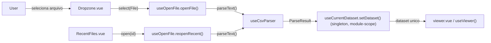
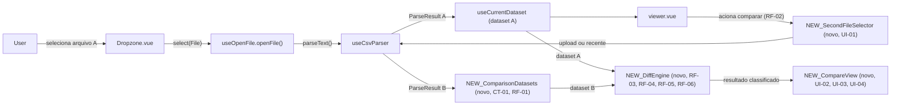

# SPEC: file-comparison

## Metadata
- Source: developer description via /plan
- Service: csvview (100% client-side, Nuxt 4 SSG — sem backend, sem API HTTP)
- Tier: standard
- Version: 1.1
- Architecture references: `AGENTS.md`, `docs/agents/architecture.md`, `docs/agents/domain_rules.md`

## Context

O CSV View hoje mantém **um único dataset em memória por vez**: `useCurrentDataset` (`app/composables/useCurrentDataset.ts:36-37`) guarda `dataset`/`meta` em `ref`s de **escopo de módulo** (singleton), e `setDataset()` sempre **substitui** o dataset anterior — não há suporte a dois datasets simultâneos hoje. O fluxo de abertura é único e compartilhado entre upload e reabertura de recente: `Dropzone.vue` (`select(File)`) e `RecentFiles.vue` (`open(id)`) alimentam `useOpenFile.openFile()`/`reopenRecent()` (`app/composables/useOpenFile.ts:98-177`), que parseia via `useCsvParser`, persiste em `files` (IndexedDB) e navega para `/viewer` (`VIEWER_ROUTE = '/viewer'`, `useOpenFile.ts:21`, verified). A tela `viewer.vue` lê o dataset único via `useCurrentDataset()` e deriva todo o estado de exibição em `useViewer(() => dataset.value)` (`app/pages/viewer.vue:28,71`).

Esta feature introduz a **comparação de dois arquivos CSV/TSV**: o arquivo já carregado no Viewer (dataset A) mais um segundo arquivo escolhido pelo usuário (dataset B, via upload ou lista de recentes — mesmo mecanismo de seleção já existente), classificando cada registro em adicionado, removido ou alterado, com diff célula a célula para os alterados. A necessidade de manter 2+ datasets em memória simultaneamente já era antecipada no backlog do produto: `BACKLOG.md:102` — "`file-comparison` / `merge-files`: exigem 2+ datasets em memória ao mesmo tempo — revisar `useCurrentDataset` (hoje single-dataset)" — e a feature `cell-editing`, já mesclada em `main`, deixou a pilha de undo/redo chaveada por dataset justamente para ser "forward-compatible com a futura feature `file-comparison`" (`.spec/features/cell-editing/SPEC.md:242-245`).

A inferência de tipo por coluna (`app/services/columnStats.ts`, `inferColumnType`) já normaliza valores para fins de tipo/estatística (`docs/agents/domain_rules.md`, seção "Column type inference"), mas **não define hoje** uma noção de "valor equivalente" entre dois arquivos distintos para fins de diff — ponto sinalizado pelo desenvolvedor como pendente (ver RF-06).

Não há camada de API/servidor a documentar (`docs/agents/architecture.md`, "External integration points": nenhuma rede) — os "Contracts" desta SPEC são **in-process** (superfície de estado/dados compartilhada entre composables).

## AS IS — Estado atual

Legenda: hoje existe **apenas um** dataset em memória por vez — `useCurrentDataset` é um singleton de módulo, e cada abertura (upload ou recente) chama `setDataset()`, que substitui integralmente o dataset anterior antes de exibi-lo no Viewer.

## TO BE — Estado proposto

Legenda: abrir um segundo arquivo (UI-01) carrega o dataset B em paralelo ao dataset A sem substituí-lo (RF-01, CT-01); um motor de diff novo (RF-03 a RF-06) pareia e classifica os registros dos dois datasets, alimentando uma tela/modo de comparação (UI-02 a UI-04) acessível a partir do Viewer (RF-02).

## Scope
- **In**: abrir um segundo arquivo CSV/TSV mantendo ambos em memória; classificar registros em adicionado/removido/alterado/sem alteração; diff célula a célula dos alterados; identidade de registro por coluna(s)-chave indicada(s) pelo usuário, com fallback posicional; resumo de contagens; navegação/filtro só pelas diferenças.
- **Out**: comparar mais de 2 arquivos simultaneamente ou combiná-los em um terceiro arquivo (feature `merge-files`, que depende desta); edição de células a partir da tela/modo de comparação (feature `cell-editing`, já implementada, escopo separado); exportar o resultado do diff (avaliar futuramente se cabe na feature `export`).

## RIGID (Non-Negotiable)

### Functional Requirements

- RF-01 [Event-Driven]: WHEN o usuário seleciona um segundo arquivo CSV/TSV (upload ou item da lista de recentes) enquanto um dataset (A) já está carregado no Viewer, THE SYSTEM SHALL parsear o arquivo selecionado como dataset B e mantê-lo em memória simultaneamente ao dataset A, sem descartar ou substituir A.
  - AC: após a seleção do arquivo B, o dataset A permanece intacto (mesmo `rowCount`/`columnCount`/conteúdo de antes da seleção) e o dataset B fica acessível para comparação — nenhuma navegação/estado desta feature aciona `useCurrentDataset.setDataset()` sobre o dataset A.
  - Resolvido: dataset B vive em um estado paralelo dedicado (ex. `useComparisonDatasets`), sem alterar `useCurrentDataset`. `useCurrentDataset` permanece exatamente como hoje (contrato inalterado, consumido por `cell-editing`/`sessions`).

- RF-02 [Event-Driven]: WHEN o usuário aciona a ação de comparar (a partir do Viewer, com o dataset A carregado), THE SYSTEM SHALL apresentar uma tela ou modo dedicado de comparação distinto da navegação normal do Viewer.
  - AC: acionar "comparar" a partir do Viewer leva a uma superfície onde o resumo (UI-03) e a navegação por diferenças (UI-04) ficam visíveis, sem exigir que o usuário reabra o arquivo A.
  - Resolvido: rota nova dedicada (ex. `/compare`), tela própria distinta do Viewer, alinhada ao design de referência (Screen 5).

- RF-03 [Event-Driven]: WHEN os datasets A e B estão carregados e pareados (RF-04 ou RF-05), THE SYSTEM SHALL classificar cada registro resultante em exatamente uma das categorias: adicionado (existe somente em B), removido (existe somente em A), alterado (existe em ambos com ao menos uma célula divergente, conforme RF-06) ou sem alteração (existe em ambos com todas as células comuns equivalentes, conforme RF-06).
  - AC: a soma das contagens de adicionado + removido + alterado + sem alteração é igual ao total de registros resultantes do pareamento (união das chaves/posições de A e B); nenhum registro fica sem classificação e nenhum registro é classificado em mais de uma categoria.

- RF-04 [Event-Driven]: WHEN uma coluna-chave comum entre A e B está disponível (CT-02), THE SYSTEM SHALL parear os registros construindo, para cada dataset, um mapa de chave concatenada (valores da(s) coluna(s)-chave) para o número da linha, e casando os registros cujas chaves coincidem entre os dois mapas.
  - AC: dois registros com o mesmo valor de chave (um em A, outro em B) são sempre pareados entre si, independentemente da posição/ordem em que aparecem nos respectivos arquivos; um registro cuja chave existe apenas em um dos mapas é classificado como adicionado (somente em B) ou removido (somente em A), nunca pareado com outro registro.

- RF-05 [Conditional]: IF nenhuma coluna-chave comum está configurada ou resolvida (CT-02), THEN THE SYSTEM SHALL parear os registros de A e B pela posição (índice da linha), comparando a linha N de A com a linha N de B.
  - AC: com pareamento posicional, uma linha N presente em A e ausente em B (índice fora do intervalo de B) é classificada como removida, e uma linha N presente em B e ausente em A é classificada como adicionada; linhas N presentes em ambos são avaliadas por RF-06 para decidir entre alterado e sem alteração.

### UI Requirements

- UI-01 [Event-Driven]: WHEN o usuário aciona a ação de comparar a partir do Viewer, THE SYSTEM SHALL apresentar um mecanismo de seleção do arquivo B equivalente ao fluxo de abertura já existente (upload por arrastar-e-soltar/seleção de arquivo, ou escolha a partir da lista de arquivos recentes).
  - AC: o usuário consegue chegar ao dataset B tanto soltando/selecionando um arquivo quanto escolhendo um item da lista de recentes, sem passar pela tela de Upload (`/`).
  - Resolvido: modal dedicado (novo componente), reaproveitando os componentes internos de `Dropzone.vue`/`RecentFiles.vue` por composição (não herança de props) — consistente com o padrão de modal já usado na Exportação (Screen 4). `Dropzone.vue` não recebe prop/variante nova.

- UI-02 [Event-Driven]: WHEN um registro é exibido na tela/modo de comparação e está classificado como alterado (RF-03), THE SYSTEM SHALL destacar visualmente, célula a célula, quais colunas têm valor diferente entre A e B (RF-06).
  - AC: em um registro alterado, toda célula cujo valor difere entre A e B recebe um indicador visual distinto das células iguais; nenhuma célula igual entre A e B é marcada como diferença.

- UI-03 [State-Driven]: WHILE a tela/modo de comparação está ativo com os datasets A e B carregados, THE SYSTEM SHALL exibir um resumo com a contagem de registros adicionados, removidos e alterados.
  - AC: as três contagens exibidas correspondem exatamente ao resultado da classificação de RF-03 (nenhum registro adicionado/removido/alterado fica fora da contagem exibida; nenhum registro sem alteração é contado).

- UI-04 [Optional]: WHERE o usuário aciona o filtro "somente diferenças" na tela/modo de comparação, THE SYSTEM SHALL restringir a navegação/exibição de registros aos classificados como adicionado, removido ou alterado, ocultando os registros sem alteração.
  - AC: com o filtro ativo, nenhum registro classificado como "sem alteração" (RF-03) aparece na lista/navegação; desativar o filtro restaura a exibição de todos os registros pareados.

### Contracts

Contratos **in-process** (superfície de estado/dados compartilhada entre composables) — não há API HTTP; o app é 100% client-side (`docs/agents/architecture.md`, "External integration points").

- CT-01: O estado da comparação DEVE expor, de forma legível pela UI, os dois datasets carregados (A e B) e, para cada registro pareado, sua classificação (`adicionado | removido | alterado | sem alteração`) e — quando alterado — a lista de colunas com valor divergente entre A e B.
  - Resolvido: exposto por um composable de estado paralelo dedicado (ex. `useComparisonDatasets`), que não estende nem modifica `useCurrentDataset` (decisão de RF-01). Conteúdo mínimo do contrato (dois datasets acessíveis + classificação por registro + diffs por célula) é o que esta SPEC congela; nome/local exatos ficam em FLEXIBLE.
- CT-02: A configuração de identidade de registro (coluna(s)-chave) DEVE ser expressável pelo usuário antes ou durante a comparação, valendo para o pareamento de RF-04; na ausência de configuração, o pareamento cai para RF-05 (posicional) sem exigir ação do usuário.
  - Resolvido: a coluna-chave exige cabeçalhos idênticos entre A e B — é escolhida por nome comum aos dois arquivos. Não há mapeamento manual de colunas (coluna X de A ↔ coluna Y de B) nesta feature; schemas com cabeçalhos divergentes caem direto no fallback posicional (RF-05).

### Non-Functional Requirements

- RNF-01: Manter os dois datasets completos (A e B) em memória simultaneamente para comparação SHALL respeitar um teto de tamanho/linhas, validado antes ou durante a seleção do arquivo B.
  - Resolvido: mantém a mesma meta atual (~50 MB / ~1M linhas, `.spec/init/project-phases.md:16`) aplicada individualmente a cada dataset (A e B) — sem teto agregado novo para os dois juntos.
  - AC: o arquivo B é validado contra o mesmo teto (~50 MB / ~1M linhas) já aplicado hoje à abertura de um único dataset; o teto de A não é reavaliado nem alterado pela presença de B.

### Unwanted Behavior

- RF-06 [Conditional]: IF um registro existe em ambos os datasets (pareado por RF-04 ou RF-05) E pelo menos um valor de célula bruto (string) difere entre A e B para uma coluna comum, THEN THE SYSTEM SHALL classificar o registro como alterado e marcar essa coluna como divergente (RF-03, UI-02).
  - AC: um registro cujas células têm exatamente o mesmo valor bruto em todas as colunas comuns entre A e B nunca é classificado como alterado.
  - Resolvido: a comparação usa o valor **normalizado pelo tipo inferido** da coluna (`inferColumnType`, `docs/agents/domain_rules.md`, seção "Column type inference"), não a string bruta. Regra de equivalência por tipo: coluna numérica → parse numérico de ambos os valores e comparação numérica (ex.: `"10"` e `"10.0"` são iguais); coluna de data → parse de ambos os valores e comparação pelo formato canônico (variações de formatação equivalentes contam como iguais); texto/demais tipos → comparação exata da string.
  - AC: um registro cujas células diferem apenas em formatação (ex.: `"10"` vs `"10.0"` em coluna numérica, ou datas equivalentes em formatos distintos) nunca é classificado como alterado por essa coluna; um registro cuja coluna de texto difere em qualquer caractere é classificado como alterado.

## FLEXIBLE (Implementation Suggestions)

- Nome/local do composable de estado (ex. `useComparisonDatasets`) e do serviço puro de diff (ex. `app/services/diffDatasets.ts`, seguindo o padrão de lógica pura em `app/services/` — `AGENTS.md`, seção 2) são sugestões, não RIGID.
- Reaproveitar `columnStats.inferColumnType`/`isEmptyCell` (`app/services/columnStats.ts`) como base de implementação da normalização de valor exigida por RF-06.
- Estrutura de dados exata do `Map` de RF-04 (tipos de chave/valor, particionamento) fica a critério da implementação; RF-04 fixa apenas o comportamento observável (pareamento por chave concatenada comum a A e B).
- A tela/modo de comparação pode reaproveitar `ViewerTable.vue`/virtualização (`@tanstack/vue-virtual`) para navegar grandes volumes de diferenças, mantendo o padrão de virtualização já usado no Viewer (`docs/agents/domain_rules.md`).

## Acceptance Criteria Summary

| ID | Criterion | Testable? |
|----|-----------|-----------|
| RF-01 | Dataset A permanece intacto após selecionar/parsear o arquivo B; ambos ficam acessíveis | Sim |
| RF-02 | Ação "comparar" no Viewer leva a uma superfície de comparação com resumo e navegação por diferenças | Sim |
| RF-03 | Todo registro pareado recebe exatamente uma classificação (adicionado/removido/alterado/sem alteração) | Sim |
| RF-04 | Registros com mesma chave comum entre A e B são pareados entre si, independente da posição | Sim |
| RF-05 | Sem coluna-chave, pareamento cai para posição (índice de linha) entre A e B | Sim |
| UI-01 | Seleção do arquivo B via upload ou lista de recentes, sem passar pela tela de Upload | Sim |
| UI-02 | Registros alterados destacam célula a célula os valores divergentes; células iguais não são marcadas | Sim |
| UI-03 | Resumo exibe contagens de adicionados/removidos/alterados iguais ao resultado da classificação | Sim |
| UI-04 | Filtro "somente diferenças" oculta registros sem alteração; desativar restaura todos | Sim |
| RF-06 | Registro com valores normalizados (por tipo inferido) iguais em todas as colunas comuns nunca é alterado | Sim |
| RNF-01 | Teto de ~50 MB / ~1M linhas é respeitado individualmente por cada dataset (A e B) | Sim |
| CT-01 | Estado expõe os dois datasets + classificação por registro + diffs por célula, via composable paralelo dedicado | Sim |
| CT-02 | Coluna-chave por nome comum entre A e B; fallback posicional automático sem configuração; sem mapeamento manual de schema | Sim |
