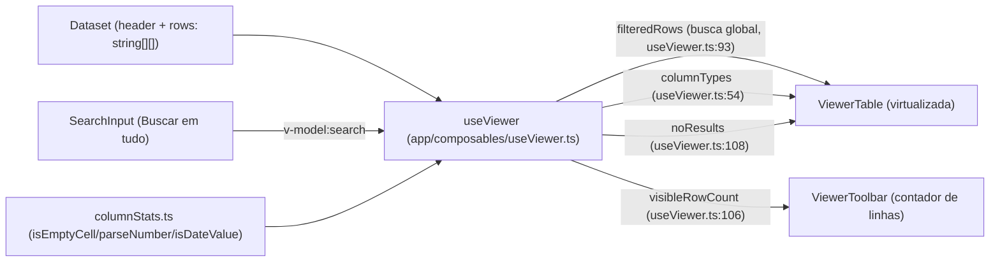
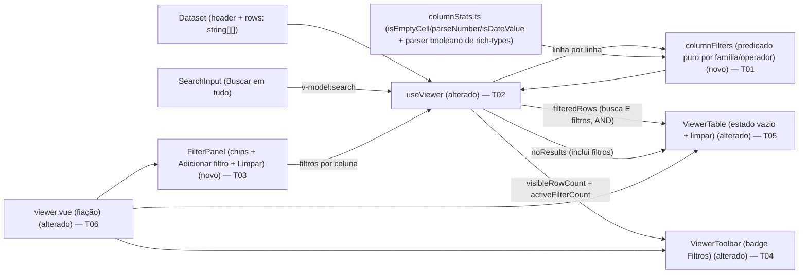

# Implementation Plan

## Request Summary
- **Objective**: acrescentar filtros por coluna ao Viewer — operadores dependentes da família de tipo inferido (texto / número / data / booleano), combinação por **E (AND)**, coexistência com a busca global, painel de filtros dedicado (chips + "Adicionar filtro" + "Limpar"), aplicação **puramente reativa** sobre a tabela virtualizada. Estado apenas em memória.
- **Scope**:
  - **In**: módulo de predicado puro (`columnFilters`), ampliação do `useViewer` (estado + mutadores + composição busca+filtros em `filteredRows`), novo `FilterPanel`, badge de contagem na `ViewerToolbar`, estado vazio + limpar filtros no `ViewerTable`, fiação em `viewer.vue`.
  - **Out**: OR/grupos; persistência durável (feature `sessions`); ordenação/exportação; realce condicional; filtros no cabeçalho da coluna; qualquer backend/HTTP. Inferência de tipo booleano/raw-string → **pertence a `rich-types-and-stats`** (consumida, não redefinida).
- **Tier**: standard
- **Architecture references**: `AGENTS.md`, `docs/agents/coding_guidelines.md`, `docs/agents/tech_stack.md`, `docs/agents/architecture.md` (**stale** — descreve só `CsvCell`), `docs/agents/domain_rules.md` (**stale**). Regra vinculante: `coding_guidelines.md` rule 2 (estado derivado em `computed`) + convenção de-facto observada no código (lógica pura em `app/services/`, estado reativo em composable, componentes finos/apresentacionais — ver `columnStats.ts`, `useViewer.ts`, `ViewerTable.vue`, `ViewerToolbar.vue`).

## AS IS — Componentes impactados

Legenda: hoje só a busca global filtra o dataset — `useViewer.filteredRows` (`useViewer.ts:93`) casa o termo, sem caixa, em qualquer célula e entrega à `ViewerTable` virtualizada (`@tanstack/vue-virtual`, `ViewerTable.vue:59`). Contador (`visibleRowCount`) e estado vazio (`noResults`) derivam do resultado da busca. `columnStats.ts` fornece `isEmptyCell`/`parseNumber`/`isDateValue` puros. Não há filtro por coluna nem painel. Nós verificados no código.

## TO BE — Componentes propostos

Legenda: `columnFilters` (novo, **T01**) avalia cada linha por família/operador (RF-01, RF-02) reutilizando `isEmptyCell`/`parseNumber`/`isDateValue` de `columnStats.ts` e o reconhecedor booleano provido por `rich-types-and-stats`. `useViewer` (alterado, **T02**) mantém o estado dos filtros e compõe busca+filtros por E em `filteredRows` (RF-03/04/05/06, CT-02). `FilterPanel` (novo, **T03**) coleta filtros (UI-01); `ViewerToolbar` ganha o badge de contagem (alterado, **T04**, UI-02); `ViewerTable` estende o estado vazio + ação de limpar (alterado, **T05**, UI-03/RF-06); `viewer.vue` (alterado, **T06**) faz a fiação. Nós `useViewer`/`ViewerTable`/`ViewerToolbar`/`SearchInput`/`columnStats` verificados no código; `columnFilters`/`FilterPanel` são novos.

## Tasks

### T01 — Módulo de predicado puro `columnFilters`
- **Files**: `app/services/columnFilters.ts` (novo)
- **Change**: criar o módulo puro (estilo `columnStats.ts`, sem I/O). Exportar:
  - Modelo de contrato **CT-01**: `ColumnFilter { column: number; operator: FilterOperator; value?: string | number | { from: string | number; to: string | number } }` e a união `FilterOperator` = `'igual' | 'diferente' | 'contem' | 'naoContem' | 'maiorQue' | 'menorQue' | 'entre' | 'intervaloDatas' | 'vazio' | 'preenchido' | 'verdadeiro' | 'falso'` (rótulos pt-BR resolvidos na UI).
  - `typeFamily(type: ColumnType): 'texto' | 'numero' | 'data' | 'booleano'` — mapeia `number→numero`, `date→data`, `boolean→booleano`, `text|email|url→texto`. Degrada: sem `rich-types-and-stats`, `ColumnType` nunca produz `boolean`, então a família booleano nunca aparece (RF-01 graceful).
  - `operatorsForFamily(family)`: **texto** = igual, diferente, contem, naoContem, vazio, preenchido; **numero** = igual, diferente, maiorQue, menorQue, entre, vazio, preenchido; **data** = igual, diferente, intervaloDatas, vazio, preenchido; **booleano** = verdadeiro, falso, vazio, preenchido (RF-01).
  - `isFilterInert(filter)`: `true` quando o operador exige valor e ele está ausente/vazio (RF-05 inerte). `vazio`/`preenchido`/`verdadeiro`/`falso` nunca são inertes.
  - Predicados por operador (RF-02): `vazio`/`preenchido` reutilizam `isEmptyCell` (`columnStats.ts:63`); `maiorQue`/`menorQue`/`entre` comparam via `parseNumber` (`columnStats.ts:75`), célula não-parseável **nunca** satisfaz; `igual`/`diferente` numérico via `parseNumber`, texto via `toLowerCase()` nos dois lados; `contem`/`naoContem` substring caixa-insensível; `intervaloDatas` normaliza célula e limites via helper local `normalizeDate` cobrindo **DMY (`dd/mm/aaaa`) + ISO (`aaaa-mm-dd`)** (reusa `isDateValue`, `columnStats.ts:100`; se `parseDate` de `table-interactions` existir, preferir), não-parseável nunca satisfaz; `entre`/`intervaloDatas` **inclusivos** `[from,to]`; `verdadeiro`/`falso` consomem o reconhecedor booleano de `rich-types-and-stats` (**não redefinir tokens**); negação (`diferente`/`naoContem`) **mantém** células vazias.
  - Predicado combinador **CT-01**: `matchesFilters(filters: ColumnFilter[], row: string[], columnTypes: ColumnType[]): boolean` — `true` sse a linha satisfaz **todos** os filtros não-inertes (AND); filtros inertes ignorados; puro/determinístico (RNF-02).
- **Covers**: RF-01, RF-02, RF-03, CT-01, RNF-02
- **Tests**: `test/columnFilters.spec.ts` (novo, Vitest) — `operatorsForFamily`: number inclui maiorQue/menorQue/entre e exclui contem; text inclui contem/naoContem e exclui maiorQue/entre; date inclui intervaloDatas; vazio/preenchido em todas; booleano só quando family='booleano'. Semântica: vazio == `isEmptyCell`, preenchido = complemento; `"100"`==`"100.0"`==`" 100 "` (igual numérico), célula não-numérica nunca satisfaz igual; entre `[from,to]` inclusivo; intervaloDatas com DMY e ISO inclusivo; não-parseável excluída de relacional/intervalo; `diferente`/`naoContem` mantêm célula vazia; `matchesFilters` AND de múltiplos filtros (inclusive dois na mesma coluna) e filtro inerte não restringe; duas execuções iguais → mesmo resultado (determinismo).
- **Risk**: Low — arquivo novo, puro, sem consumidores até T02.
- **Dependencies**: none (consome símbolos já existentes de `columnStats.ts`; o reconhecedor booleano vem de `rich-types-and-stats` — ver Open Questions)

### T02 — Ampliar `useViewer` com estado de filtros + composição busca+filtros
- **Files**: `app/composables/useViewer.ts`
- **Change**: adicionar, **sem regredir símbolos atuais** (CT-02):
  - `filters = ref<ColumnFilter[]>([])` (só em memória — RF-07).
  - Mutadores: `addFilter(filter)`, `updateFilter(id/index, patch)`, `removeFilter(index)`, `clearFilters()`.
  - `activeFilters = computed(() => filters.value.filter((f) => !isFilterInert(f)))` e `activeFilterCount = computed(() => filters.value.length)` (contagem de chips — UI-02).
  - **Estender** o computed `filteredRows` (`useViewer.ts:93`) para, na **mesma passagem O(N)**, aplicar `matchesFilters(activeFilters.value, row, columnTypes.value)` **após** o casamento da busca (RF-03/04/05, RNF-01). Sem filtros ativos, `filteredRows` permanece **exatamente** o resultado de busca de hoje (CT-02).
  - `columnTypes` é lido **uma vez** por passagem (computed reutilizado, RNF-02) — não recalcular por linha.
  - Estender `noResults` (`useViewer.ts:108`) para disparar quando houver busca **ou** filtros ativos e o resultado for vazio (RF-06).
  - Acrescentar os novos símbolos ao objeto de retorno (`useViewer.ts:164`) preservando nome/semântica de `search`, `filteredRows`, `totalRows`, `visibleRowCount`, `noResults`, `columnTypes`, `visibleColumns`.
- **Covers**: RF-03, RF-04, RF-05, RF-06, RF-07, CT-02, RNF-01, RNF-02, RNF-03
- **Tests**: `test/useViewer.spec.ts` (estender) — filtro `amount>100` reduz linhas; `amount>100` E `status=failed` (interseção); dois filtros na mesma coluna (`amount>100` E `amount<500`) por E; remover filtro reamplia; busca `"pix"` + `amount>0` = interseção; limpar só a busca mantém filtro e vice-versa; `visibleRowCount` acompanha; `noResults` verdadeiro em combinação vazia; `clearFilters()` com busca vazia restaura `dataset.value.rows`; filtro inerte não restringe; **regressão**: sem filtros `filteredRows` idêntico ao comportamento atual (asserts existentes continuam verdes).
- **Risk**: Medium — arquivo central consumido por `viewer.vue`/`ViewerTable`/`ViewerToolbar`; risco de regressão na busca. Mitigado por manter símbolos e testes existentes intactos.
- **Dependencies**: T01

### T03 — Novo componente `FilterPanel` (chips + Adicionar filtro + editor + Limpar)
- **Files**: `app/components/FilterPanel.vue` (novo)
- **Change**: componente **fino/apresentacional** (props/emits, sem lógica de dados). Props: `columns: ViewerColumn[]` (todas, inclusive ocultas), `filters: ColumnFilter[]`. Emits: `add`, `update`, `remove`, `clear`. UI: um **chip por filtro ativo** com rótulo legível `<coluna> <operador> <valor>` (nome da coluna mesmo se oculta); botão **"Adicionar filtro"** abrindo um editor dropdown/popover (reusar `Dropdown.vue`/`Select.vue`) que escolhe coluna (lista **todas**), operador (`operatorsForFamily(typeFamily(column.type))` de T01) e valor (campo único, ou par `{from,to}` para entre/intervaloDatas, ou sem valor para vazio/preenchido/verdadeiro/falso); botão **"Limpar"**. Chips reaproveitam tokens de `Badge.vue`/`ColumnChip.vue`. **Nenhum** controle de filtro no cabeçalho da coluna (UI-01). Sem botão "Aplicar".
- **Covers**: UI-01, RF-01 (lista de operadores por família na UI)
- **Tests**: `test/FilterPanel.spec.ts` (novo, `@vue/test-utils mount`) — renderiza um chip por filtro com rótulo `<coluna> <operador> <valor>`; coluna oculta ainda aparece no seletor e no chip; para coluna `number` o seletor de operadores inclui "maior que"/"entre" e exclui "contém"; para `text` inclui "contém" e exclui "entre"; "Adicionar filtro" emite `add`; remover chip emite `remove`; "Limpar" emite `clear`; ausência de qualquer controle de filtro dentro de `<th>` (responsabilidade da tabela permanece intacta).
- **Risk**: Low — componente novo, isolado.
- **Dependencies**: T01

### T04 — Badge de contagem de filtros na `ViewerToolbar`
- **Files**: `app/components/ViewerToolbar.vue`
- **Change**: adicionar o controle **"Filtros"** com **badge de contagem** (reusar `Badge.vue`), espelhando o design (`README.md:78`). Nova prop `activeFilterCount: number`; quando `> 0` exibe o número, quando `0` não mostra contagem. Emitir `toggle-filters` (ou expor via slot) para abrir o painel — a coordenação de visibilidade fica em `viewer.vue` (T06). Manter os controles atuais (busca, seletor de colunas, contador) inalterados.
- **Covers**: UI-02
- **Tests**: `test/ViewerToolbar.spec.ts` (estender) — `activeFilterCount=2` renderiza badge "2" no controle Filtros; `activeFilterCount=0` não renderiza contagem; controles existentes (busca/colunas/contador) permanecem renderizados; clicar em Filtros emite o evento de abertura.
- **Risk**: Low — adição de prop opcional; componente apresentacional.
- **Dependencies**: none (consome só uma prop numérica)

### T05 — Estado vazio + ação "Limpar filtros" no `ViewerTable`
- **Files**: `app/components/ViewerTable.vue`
- **Change**: no bloco `viewer-table__empty` (`ViewerTable.vue:126`), quando houver filtros ativos, ajustar a dica para mencionar filtros e expor uma ação **visível** de **limpar filtros** (emitir `clear-filters`). Nova prop opcional `hasActiveFilters: boolean` (default `false`) para escolher a mensagem/ação; sem filtros mantém o texto atual da busca. Virtualização (`ViewerTable.vue:59`) inalterada (RNF-01).
- **Covers**: UI-03, RF-06
- **Tests**: `test/ViewerTable.spec.ts` (estender) — com `rows=[]` e `hasActiveFilters=true` renderiza a ação de limpar filtros e emite `clear-filters` ao acioná-la; com `hasActiveFilters=false` mantém a dica atual da busca; cabeçalho continua sem controles de filtro; nº de linhas montadas continua proporcional à viewport (não a N).
- **Risk**: Low — adição de prop opcional retrocompatível.
- **Dependencies**: none

### T06 — Fiação em `viewer.vue`
- **Files**: `app/pages/viewer.vue`
- **Change**: desestruturar do `useViewer` os novos símbolos (`filters`, `activeFilterCount`, `addFilter`, `updateFilter`, `removeFilter`, `clearFilters`, `noResults`, `visibleRowCount`); montar `FilterPanel` entre a `ViewerToolbar` e o `viewer__body`, passando `columns`/`filters` e ligando `add/update/remove/clear`; passar `:active-filter-count` à `ViewerToolbar`; passar `:has-active-filters` e `noResults` ao `ViewerTable` e ligar `clear-filters` → `clearFilters`. Controlar visibilidade do editor via estado local disparado por `toggle-filters`. Sem chamadas a IndexedDB/localStorage (RF-07).
- **Covers**: RF-04, RF-05, RF-06, RF-07, UI-01, UI-02, UI-03, RNF-01
- **Tests**: `test/viewer.spec.ts` (novo ou estender, `mount`) — adicionar filtro reduz as linhas renderizadas em tempo real e o contador atualiza; combinação sem resultado renderiza "Nenhuma linha encontrada" com ação de limpar; limpar filtros restaura linhas; badge de filtros reflete a contagem; nenhum acesso a storage durável para salvar/restaurar filtros.
- **Risk**: Medium — ponto de integração de todos os componentes; risco de regressão visual/reativa. Mitigado por manter a estrutura atual do template e só acrescentar o painel + props.
- **Dependencies**: T02, T03, T04, T05

## Execution Phases
| Phase | Tasks | Parallel-safe? |
|-------|-------|----------------|
| Phase 1: Predicado puro (serviço) | T01 | N/A (tarefa única) |
| Phase 2: Estado reativo (composable) | T02 | N/A (tarefa única) |
| Phase 3: Componentes de UI | T03, T04, T05 | Sim — arquivos distintos, sem dependência mútua |
| Phase 4: Fiação da página | T06 | N/A (tarefa única) |

## Contracts emitted
Nenhum artefato de contrato formal emitido. CT-01 e CT-02 são **contratos de tipos TypeScript in-process** (app 100% client-side — `tech_stack.md` "External integrations: None"; `architecture.md` "External integration points: None"). Não há superfície REST/gRPC/async, logo nenhum OpenAPI/proto/AsyncAPI se aplica. Os schemas do contrato estão inline nas tasks T01 (`ColumnFilter`, `FilterOperator`, `matchesFilters`) e T02 (superfície ampliada do `useViewer`).

## Risks
| Risk | Blast radius | Mitigation | Rollback |
|------|-------------|------------|----------|
| Regressão da busca global ao estender `filteredRows` | `viewer.vue`, `ViewerTable`, `ViewerToolbar` (todos os consumidores de `useViewer`) | Manter símbolos e semântica atuais; sem filtros `filteredRows` idêntico; testes existentes de `useViewer`/`ViewerToolbar`/`ViewerTable` intactos e verdes (RNF-03) | Reverter T02 (composição de filtros) mantém a busca funcional |
| Custo por linha degrada performance em ~1M linhas | Fluência de rolagem/filtragem no Viewer | Predicado O(colunas-filtradas); `columnTypes` computado uma vez; filtragem em passagem única O(N) reaproveitando o `.filter` atual; virtualização inalterada (RNF-01) | Reverter T02; a busca segue O(N) |
| Dependência de `rich-types-and-stats` não mergeada (tipo `boolean` + reconhecedor de tokens) | Família booleano e operadores "é verdadeiro/é falso" | Degradação graciosa: sem `boolean` em `ColumnType`, a família não aparece e texto/número/data seguem válidos; consumir o reconhecedor booleano, não redefinir tokens | Família booleano some sem afetar o restante |
| Conflito de merge em `columnStats.ts` (editado por `rich-types-and-stats`/`table-interactions`) | Serviço de tipos/stats compartilhado | Esta feature **adiciona** `columnFilters.ts` e só **consome** `isEmptyCell`/`parseNumber`/`isDateValue`/`ColumnType` — não edita `columnStats.ts` | Nenhum rollback necessário (sem edição do arquivo compartilhado) |

## Open Questions
- **Reconhecedor booleano de `rich-types-and-stats`**: o nome do símbolo exportado (ex.: `parseBoolean`/`isBooleanValue`) e do tipo `boolean` em `ColumnType` ainda não estão congelados naquele SPEC. T01 consome esse símbolo; enquanto `rich-types-and-stats` não estiver mergeado, os operadores "é verdadeiro/é falso" ficam indisponíveis por degradação graciosa (não redefinir tokens localmente). Impacto: apenas a família booleano.
- **`parseDate` de `table-interactions`**: o SPEC permite reutilizá-lo quando existir; até lá T01 mantém uma normalização local DMY+ISO. Se `table-interactions` congelar um `parseDate` divergente da normalização local, alinhar em uma iteração posterior. Impacto: apenas operadores de data.
- **`architecture.md`/`domain_rules.md` desatualizados**: descrevem apenas `CsvCell` e não refletem `useViewer`/`columnStats`/`ViewerTable` já existentes. O plano segue `coding_guidelines.md` (rule 2) + convenção de-facto do código; **este plano NÃO é validado por `architecture.md`/`domain_rules.md`** (stale). Recomenda-se regenerar esses docs via `/ai-context`.

## Assumptions
- `yarn test` (Vitest + `@vue/test-utils` `mount`, happy-dom) é o portão de validação; `vue-tsc` (TS7) está quebrado e não é usado (MEMORY). [verificado em `tech_stack.md` + MEMORY]
- Componentes de design system reutilizáveis existem: `Badge.vue`, `ColumnChip.vue`, `Dropdown.vue`, `Select.vue`, `SearchInput.vue`, `Button.vue`. [verificado — `ls app/components`]
- `ColumnType` é `'number' | 'date' | 'text'` hoje e será ampliado com `boolean|email|url` por `rich-types-and-stats` (com `numericKind` em `NumericStats`); `type === 'number'` permanece válido. [verificado em `columnStats.ts:16` + SPEC de `rich-types-and-stats` CT-01/CT-02]
- A tabela recebe apenas `filteredRows` já filtradas e virtualiza via `@tanstack/vue-virtual`; nenhuma task altera esse pipeline, preservando RNF-01. [verificado em `ViewerTable.vue:59,104-123`]
- `filteredRows`/`search`/`visibleRowCount`/`noResults`/`columnTypes` estão nas linhas citadas do `useViewer.ts`. [verificado]
- Nomes de arquivo/função FLEXÍVEIS (`columnFilters.ts`, `FilterPanel.vue`, `FilterOperator`); apenas os campos de `ColumnFilter` e a assinatura do predicado são contrato (CT-01). [SPEC FLEXIBLE + CT-01]
