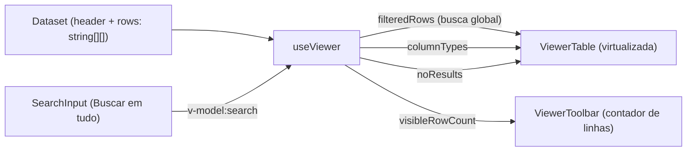
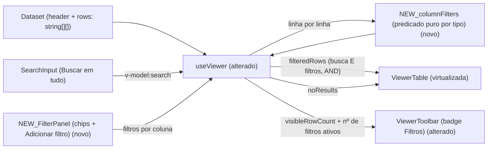

# SPEC: filters

## Metadata
- Source: developer description via /plan
- Service: csvview (100% client-side, Nuxt 4 SSG — sem backend, sem API HTTP, sem persistência de servidor)
- Tier: standard
- Version: 1.1
- Architecture references: `AGENTS.md`, `docs/agents/coding_guidelines.md`, `docs/agents/tech_stack.md`, `docs/agents/architecture.md` (stale), `docs/agents/domain_rules.md` (stale)

## Context

O Viewer já filtra linhas por **busca global**: `useViewer` mantém `search` (ref, `app/composables/useViewer.ts:42`) e deriva `filteredRows` (computed, `useViewer.ts:93`) casando o termo, sem distinção de caixa, em qualquer célula da linha — inclusive colunas ocultas. O tipo inferido por coluna vem de `columnTypes` (`useViewer.ts:54`), calculado por `inferColumnType` (`app/services/columnStats.ts:127`). O estado vazio (`noResults`, `useViewer.ts:108`) e o contador (`totalRows`/`visibleRowCount`, `useViewer.ts:104-106`) já existem. A tabela é virtualizada por `@tanstack/vue-virtual` (`app/components/ViewerTable.vue:59`), recebendo apenas linhas já filtradas, e o estado "Nenhuma linha encontrada" é renderizado quando `rows.length === 0` (`ViewerTable.vue:74,126`).

Esta feature acrescenta **filtros por coluna**: cada coluna aceita um filtro cujos operadores dependem do tipo inferido (família texto / número / data / booleano); múltiplos filtros combinam por **E (AND)** e coexistem com a busca global (ambos aplicados juntos). A UI é um **painel/barra de filtros dedicado** (chips de filtros ativos + botão "Adicionar filtro"), fora do cabeçalho da coluna — coerente com o design (`.spec/init/design/README.md#screen-3--filtros-avançados`, "Combine múltiplas condições por coluna", regras `Onde <coluna> <operador> <valor>` unidas por E) e com a Screen 2 que já prevê um botão "Filtros" com badge de contagem (`README.md:78`). Os filtros são **apenas em memória**; persistência durável pertence à feature `sessions` (fora de escopo).

Dependência explícita: esta feature **depende de** `rich-types-and-stats` (`.spec/features/rich-types-and-stats/SPEC.md`) para os tipos inferidos ricos que habilitam a disponibilidade de operadores por coluna — em especial o tipo **booleano** e a distinção número vs data. A disponibilidade de operadores é enquadrada por **família de tipo** (texto / número / data / booleano) para degradar graciosamente: se apenas os tipos base `number | date | text` existirem (sem `rich-types-and-stats`), a família booleano simplesmente não aparece e os operadores de texto/número/data continuam válidos.

Convenção arquitetural aplicável: `architecture.md` e `domain_rules.md` estão **desatualizados** (descrevem apenas `CsvCell`); a orientação vinculante vem de `docs/agents/coding_guidelines.md` (rule 2 — estado derivado vive em `computed` refs, não no template) e da convenção de-facto observada no código: **lógica pura de predicado/filtro em `app/services/` ou no composable, componentes finos e apresentacionais** (ex.: `columnStats.ts` puro; `useViewer` deriva tudo por `computed`; `ViewerTable`/`ViewerToolbar` só consomem props e emitem eventos).

## AS IS — Estado atual

Legenda: hoje apenas a busca global filtra o dataset — `useViewer` casa o termo em qualquer célula e devolve `filteredRows` à `ViewerTable` virtualizada; o contador e o estado vazio derivam do resultado da busca. Não há filtro por coluna nem painel dedicado.

## TO BE — Estado proposto

Legenda: um `FilterPanel` novo (UI-01) coleta filtros por coluna e os entrega ao `useViewer`; um módulo de predicado puro novo (`columnFilters`, CT-01) avalia cada linha por tipo/operador (RF-01, RF-02) e `useViewer` compõe busca + filtros por E (RF-03, RF-04, CT-02) atualizando `filteredRows` em tempo real (RF-05). A `ViewerToolbar` ganha o badge de contagem de filtros ativos (UI-02, alterado); `noResults` passa a refletir a combinação vazia (RF-06). Os nós `useViewer`/`ViewerTable`/`ViewerToolbar`/`SearchInput` são verificados no código; `FilterPanel` e `columnFilters` são novos.

## Scope
- **In**: filtro por coluna com operadores dependentes da família de tipo inferido (texto / número / data / booleano); conjunto de operadores igual, diferente, contém, não contém, maior que, menor que, entre (numérico), intervalo de datas, vazio, preenchido; combinação por E (AND) de múltiplos filtros; coexistência com a busca global (ambos aplicados juntos); painel/barra de filtros dedicado com chips de filtros ativos e botão "Adicionar filtro"; aplicação em tempo real na tabela virtualizada com atualização do contador de linhas e do badge de filtros; estado "nenhuma linha encontrada" para combinação vazia; limpar filtros restaura o dataset; predicado puro e client-side sem materializar todas as linhas no DOM.
- **Out**: combinação por OU (OR) ou grupos de condições; **persistência durável** dos filtros (pertence à feature `sessions`); ordenação de colunas; exportação de linhas filtradas; realce visual condicional; filtros embutidos no cabeçalho da coluna; qualquer backend, API HTTP ou I/O de rede.

## RIGID (Non-Negotiable)

### Functional Requirements

- RF-01 [Conditional] — Quando o usuário cria/edita um filtro para uma coluna, os operadores oferecidos DEVEM depender da **família do tipo inferido** dessa coluna (texto / número / data / booleano), derivada de `columnTypes` (`useViewer.ts:54`; motor `app/services/columnStats.ts:16`, ampliado por `rich-types-and-stats`). A disponibilidade é por família e degrada graciosamente: se apenas os tipos base `number | date | text` existirem, a família booleano não é oferecida e as demais permanecem.
  - Mapeamento de família → operadores: **texto** = igual, diferente, contém, não contém, vazio, preenchido; **número** = igual, diferente, maior que, menor que, entre, vazio, preenchido; **data** = igual, diferente, intervalo de datas, vazio, preenchido; **booleano** = **é verdadeiro**, **é falso**, vazio, preenchido. O mapeamento raw-string → booleano (`{true,false,sim,não,yes,no}`, caixa-insensível, `0/1` excluídos) NÃO é redefinido aqui — vem da inferência booleana de `rich-types-and-stats`; "é verdadeiro"/"é falso" apenas consomem esse tipo. Sem `rich-types-and-stats` a família booleano não aparece (degradação graciosa).
  - AC: para uma coluna `number` a lista de operadores inclui "maior que", "menor que" e "entre" e NÃO inclui "contém"; para uma coluna `text` inclui "contém"/"não contém" e NÃO inclui "maior que"/"entre"; para uma coluna `date` inclui "intervalo de datas"; "vazio" e "preenchido" aparecem em todas as famílias.

- RF-02 [Event-Driven] — Ao avaliar um filtro contra uma célula, o motor DEVE aplicar a semântica do operador escolhido dentro do conjunto suportado: igual, diferente, contém, não contém, maior que, menor que, entre (numérico), intervalo de datas, vazio, preenchido. Os operadores "vazio"/"preenchido" DEVEM reutilizar a regra `isEmptyCell` (`columnStats.ts:63`): "vazio" satisfaz quando a célula é `null`/`undefined`/string vazia após aparar espaços; "preenchido" é o complemento.
  - AC: "vazio" seleciona exatamente as linhas cuja célula da coluna satisfaz `isEmptyCell`; "preenchido" seleciona o complemento; "maior que"/"menor que"/"entre" comparam numericamente valores parseados por `parseNumber`; "contém"/"não contém" testam substring; "intervalo de datas" seleciona células cuja data cai no intervalo informado.
  - Regras finas resolvidas:
    - **Inclusividade** — "entre" (numérico) e "intervalo de datas" usam **ambos os limites inclusivos**: `[from, to]` (célula ≥ from E célula ≤ to).
    - **Caixa (texto)** — "contém"/"não contém"/"igual"/"diferente" são **caixa-insensíveis**, reutilizando a convenção da busca global (`useViewer.ts:94,98`: `toLowerCase()` nos dois lados).
    - **Igual/diferente numérico** — em coluna da família **número**, "igual"/"diferente" comparam **numericamente** via `parseNumber` (`"100"` == `"100.0"` == `" 100 "`); célula não-parseável como número **nunca** satisfaz a igualdade.
    - **Formato de data** — a entrada do "intervalo de datas" (e demais operadores de data) aceita **tanto pt-BR DMY (`dd/mm/aaaa`) quanto ISO (`aaaa-mm-dd`)**, normalizando internamente para um valor comparável. Se um `parseDate` normalizado de `table-interactions` existir, reutilizá-lo; até lá, esta feature mantém uma normalização local própria cobrindo DMY+ISO.
    - **Células não-parseáveis (número/data)** — para "maior que"/"menor que"/"entre"/"intervalo de datas", células que não parseiam como número/data **nunca satisfazem** a comparação (são excluídas do resultado).
    - **Negação vs vazio** — "diferente"/"não contém" **mantêm** as células vazias no resultado (uma célula vazia é diferente de qualquer valor não-vazio; **não** se aplica semântica NULL de SQL).

- RF-03 [State-Driven] — Enquanto houver múltiplos filtros de coluna ativos, uma linha DEVE aparecer somente se satisfizer **todos** eles (combinação por **E / AND**). NÃO há OU (OR) nem grupos nesta feature.
  - **Múltiplos filtros na mesma coluna são permitidos**: cada filtro é um chip próprio e todos combinam por E (ex.: `amount > 100` E `amount < 500` como dois chips distintos, sem exigir o operador "entre").
  - AC: com um filtro `amount > 100` e outro `status = failed` ativos, apenas linhas que satisfazem ambos permanecem; dois filtros na mesma coluna (`amount > 100` E `amount < 500`) combinam por E como quaisquer outros; remover um dos filtros reamplia o conjunto para as linhas que satisfazem o(s) restante(s); com zero filtros ativos, nenhum filtro por coluna restringe as linhas.

- RF-04 [State-Driven] — Enquanto houver busca global E filtros de coluna ativos simultaneamente, ambos DEVEM ser aplicados juntos: uma linha aparece somente se casa a busca (regra atual de `filteredRows`, `useViewer.ts:93`) **e** satisfaz todos os filtros de coluna (AND entre os dois mecanismos). A busca global permanece casando em qualquer coluna, inclusive ocultas.
  - AC: com o termo de busca `"pix"` e o filtro `amount > 0` ativos, o resultado é a interseção das linhas que casam `"pix"` em qualquer célula com as que têm `amount > 0`; limpar apenas a busca mantém o filtro de coluna aplicado e vice-versa.

- RF-05 [Event-Driven] — Ao adicionar, editar ou remover um filtro, o resultado DEVE refletir **em tempo real** na tabela virtualizada (sem ação "Aplicar" explícita) e o contador de linhas exibido (`visibleRowCount`, `useViewer.ts:106`) DEVE atualizar para a nova contagem, sem materializar todas as linhas no DOM.
  - Um filtro em edição que ainda **não** tenha um valor válido (operador exige valor mas ele está vazio) é **inerte**: é ignorado (equivale a não restringir nenhuma linha) até receber um valor válido.
  - AC: adicionar um filtro reduz imediatamente as linhas renderizadas e o contador passa a exibir a nova contagem; editar o valor/operador de um filtro recompõe o resultado sem recarregar a página; remover um filtro restaura as linhas que ele excluía; um filtro sem valor válido não altera o conjunto de linhas; a virtualização (`@tanstack/vue-virtual`, `ViewerTable.vue:59`) continua montando apenas as linhas visíveis mais overscan.
  - Resolução do conflito com o init chain: a Screen 3 do design (`README.md:90`) listava uma ação "Aplicar"; os ACs confirmados (AC-5) exigem reflexo **em tempo real** e prevalecem. **Não** há botão "Aplicar" — a filtragem é **puramente reativa**. As ações do painel são apenas **"Adicionar filtro"** e **"Limpar"**.

- RF-06 [State-Driven] — Enquanto a combinação de busca + filtros não retornar nenhuma linha, o Viewer DEVE exibir o estado "nenhuma linha encontrada" (reutilizando o padrão de `ViewerTable.vue:126` e a semântica de `noResults`, `useViewer.ts:108`, estendida para incluir filtros ativos). Limpar os filtros DEVE restaurar o dataset ao conjunto que a busca (se houver) sozinha produz; limpar busca e filtros restaura o dataset completo.
  - AC: uma combinação sem resultados renderiza o bloco "Nenhuma linha encontrada"; limpar todos os filtros com a busca vazia restaura `filteredRows` a todas as linhas do dataset (`dataset.value.rows`); o estado vazio some quando ao menos uma linha volta a satisfazer a combinação.

- RF-07 [Unwanted] — Os filtros NÃO DEVEM ser persistidos de forma durável nesta feature: o estado dos filtros vive **apenas em memória** (refs do `useViewer`/composable de filtros). NÃO DEVE haver gravação em IndexedDB, localStorage ou qualquer armazenamento durável — isso pertence à feature `sessions`.
  - AC: recarregar a página (F5) ou reabrir o Viewer zera os filtros ativos; nenhum acesso a IndexedDB/localStorage é feito para salvar ou restaurar filtros.

### UI Requirements

- UI-01 [Ubiquitous] — O Viewer DEVE apresentar um **painel/barra de filtros dedicado**, separado do cabeçalho da coluna, contendo os **chips dos filtros ativos** e um botão **"Adicionar filtro"**. Os controles de filtro NÃO DEVEM ser embutidos no cabeçalho da coluna (`ViewerTable.vue` `<th>`).
  - AC: existe um painel/barra de filtros com um chip por filtro ativo (rótulo legível `<coluna> <operador> <valor>`, exibindo o nome da coluna independentemente de estar visível ou oculta) e um botão "Adicionar filtro"; o cabeçalho da coluna (`viewer-table__th`) permanece sem controles de filtro; abrir o editor a partir de "Adicionar filtro" permite escolher coluna (o seletor lista **todas** as colunas, inclusive ocultas), operador (conforme RF-01) e valor.

- UI-02 [Event-Driven] — Ao adicionar/editar/remover um filtro pelos chips ou pelo botão "Adicionar filtro", a tabela virtualizada e o contador de linhas DEVEM atualizar em tempo real (RF-05), e a `ViewerToolbar` DEVE indicar o número de filtros ativos por um badge de contagem no controle "Filtros" (previsto no design, `README.md:78`).
  - AC: adicionar um filtro cria um chip e incrementa o badge de contagem; remover o chip decrementa o badge e reamplia a tabela; com zero filtros o badge não mostra contagem (ou fica em zero) e nenhum chip é exibido.

- UI-03 [Event-Driven] — Quando a combinação de busca + filtros não retorna linhas, o Viewer DEVE exibir o estado "Nenhuma linha encontrada" (RF-06) e oferecer, de forma visível, a ação de **limpar os filtros** para restaurar o dataset.
  - AC: o bloco "Nenhuma linha encontrada" aparece na área da tabela quando a combinação é vazia; há um controle visível para limpar os filtros; acioná-lo remove todos os chips e restaura as linhas conforme RF-06.

### Contracts

Contratos **in-process** (superfície de tipos TypeScript) — não há API HTTP; o app é 100% client-side (`docs/agents/tech_stack.md`, "External integrations: None"; `architecture.md`, "External integration points: None").

- CT-01: Um módulo puro de predicado de filtro (candidato FLEXIBLE `app/services/columnFilters.ts`, arquivo ainda não existe — nome não congelado) DEVE expor um modelo de filtro de coluna e um predicado puro por linha. Forma mínima exigida (nomes de campo são contrato; o nome do arquivo/função é FLEXIBLE):
  - `ColumnFilter { column: number; operator: <operador suportado>; value?: string | number | { from: string | number; to: string | number } }` — um filtro referencia a coluna por índice e carrega o operador e o(s) valor(es); operadores de dois limites ("entre", "intervalo de datas") usam o par `{ from, to }`. Qualquer coluna pode ser alvo de um filtro, **inclusive colunas ocultas** (o filtro referencia o índice; a visibilidade não restringe a filtragem).
  - Um predicado puro `(filters: ColumnFilter[], row: string[], columnTypes: ColumnType[]) => boolean` que devolve `true` sse a linha satisfaz **todos** os filtros (AND). Puro, sem I/O, determinístico. Um filtro sem valor válido (quando o operador o exige) é tratado como inerte (não restringe).
- CT-02: `useViewer` (verified at `app/composables/useViewer.ts:40`) DEVE ampliar sua superfície exposta com: o estado dos filtros ativos e seus mutadores (adicionar/editar/remover/limpar) e a composição busca+filtros em `filteredRows`. Os símbolos existentes (`search`, `filteredRows`, `totalRows`, `visibleRowCount`, `noResults`, `columnTypes`, `visibleColumns`; verified at `useViewer.ts:164-183`) DEVEM manter nome e semântica atual para inputs sem filtros — `filteredRows` sem filtros ativos permanece exatamente o resultado da busca de hoje.

### Non-Functional Requirements

- RNF-01 — A avaliação de filtros DEVE preservar a performance com datasets grandes (~1.000.000 linhas) e NÃO DEVE materializar todas as linhas no DOM: a virtualização (`@tanstack/vue-virtual`, `ViewerTable.vue:59`) monta apenas as linhas visíveis mais overscan; o predicado por linha é O(colunas-filtradas) e a filtragem do dataset é uma única passagem O(N) sobre as linhas (como a busca atual, `useViewer.ts:96`).
  - AC: com um dataset de ~1M linhas, o número de nós de linha no DOM permanece proporcional à viewport (não a N); a filtragem completa é uma passagem única por linha; nenhuma operação de filtragem é O(N²).
- RNF-02 — O predicado de filtro DEVE ser puro e determinístico (mesmo input → mesma saída), sem I/O nem rede, coerente com `columnStats.ts:10` e a convenção de-facto (lógica pura em `app/services/`). A inferência de tipo por coluna NÃO DEVE ser recalculada por linha durante a filtragem.
  - AC: duas filtragens consecutivas do mesmo dataset com os mesmos filtros produzem o mesmo conjunto de linhas; `columnTypes` é computado uma vez (computed) e reutilizado em toda a passagem.
- RNF-03 — A mudança DEVE ser retrocompatível em compilação e teste: `yarn test` continua verde e os consumidores atuais de `useViewer` (`app/pages/viewer.vue`, `ViewerTable`, `ViewerToolbar`) continuam funcionando sem regressão da busca global. (O projeto valida via `yarn test`, não `vue-tsc` — ver MEMORY: TS7 quebrado.)
  - AC: `yarn test` passa integralmente; a busca global mantém comportamento idêntico quando não há filtros ativos; nenhum teste existente é removido ou afrouxado.

## FLEXIBLE (Implementation Suggestions)

- **Onde vive a lógica**: predicado puro por operador/família em um novo módulo `app/services/columnFilters.ts` (reconhecedores/comparadores no estilo `parseNumber`/`isDateValue` de `columnStats.ts`); estado dos filtros e composição em `useViewer` (ou em um `useColumnFilters` dedicado composto por `useViewer`), mantendo componentes finos (coding_guidelines rule 2 + convenção de-facto).
- **Composição busca + filtros**: preferir **estender** o computed `filteredRows` (`useViewer.ts:93`) para aplicar, na mesma passagem, o predicado de filtros após o casamento da busca — evita um segundo pipeline e mantém uma única iteração O(N). Alternativa (novo computed encadeado) é aceitável se a passagem única for preservada.
- **Reuso de tipo**: aproveitar os comparadores numéricos/`parseNumber` e, quando `table-interactions`/`rich-types-and-stats` fornecerem `parseDate`/`numericKind`/booleano, reutilizá-los em vez de reparsear; enquadrar operadores por família de tipo para degradar sem os tipos ricos.
- **Datas**: se um `parseDate` normalizado existir (feature `table-interactions`), usar seus valores para "intervalo de datas"; caso contrário, comparar via `isDateValue` + normalização local documentada.
- **UI**: `FilterPanel` novo entre a `ViewerToolbar` e o corpo do Viewer (`viewer.vue`), com chips reaproveitando os tokens de badge/`ColumnChip` do design system; editor de filtro como dropdown/popover ("dropdown de filtro" já previsto em `README.md:118`); o botão "Filtros" com badge na toolbar espelha a contagem de filtros ativos.
- **Estado vazio**: reaproveitar o bloco `viewer-table__empty` (`ViewerTable.vue:126`) ajustando a dica para mencionar filtros quando houver filtros ativos.
- **Coordenação de arquivo compartilhado**: `rich-types-and-stats` e `table-interactions` também editam `app/services/columnStats.ts`; esta feature preferencialmente adiciona um arquivo novo (`columnFilters.ts`) e apenas consome `ColumnType`/`isEmptyCell`/`parseNumber`, evitando conflito de merge.

## Acceptance Criteria Summary
| ID | Criterion | Testable? |
|----|-----------|-----------|
| RF-01 | Operadores oferecidos dependem da família de tipo (texto/número/data/booleano); degrada sem tipos ricos | Sim (unit/component) |
| RF-02 | Semântica dos 10 operadores; vazio/preenchido via `isEmptyCell` | Sim (unit) |
| RF-03 | Múltiplos filtros combinam por E (AND); sem OR/grupos | Sim (unit) |
| RF-04 | Filtros e busca global aplicados simultaneamente (interseção) | Sim (unit) |
| RF-05 | Add/editar/remover reflete em tempo real; contador atualiza | Sim (component) |
| RF-06 | Estado "nenhuma linha encontrada"; limpar restaura dataset | Sim (component) |
| RF-07 | Filtros só em memória; sem persistência durável | Sim (component/review) |
| UI-01 | Painel dedicado com chips + "Adicionar filtro", fora do cabeçalho | Sim (component) |
| UI-02 | Badge de contagem de filtros ativos na toolbar; update em tempo real | Sim (component) |
| UI-03 | Estado vazio + ação de limpar filtros visível | Sim (component) |
| CT-01 | Módulo puro de predicado + modelo `ColumnFilter` | Sim (type/unit) |
| CT-02 | `useViewer` amplia superfície sem regredir símbolos atuais | Sim (type/unit) |
| RNF-01 | ~1M linhas sem materializar DOM; passagem única O(N) | Sim (review/perf) |
| RNF-02 | Predicado puro e determinístico; tipo não recalculado por linha | Sim (unit) |
| RNF-03 | Retrocompatível; `yarn test` verde; busca intacta sem filtros | Sim (`yarn test`) |

## Resolved Clarifications (v1.1)
1. RF-01 — Booleano: operadores dedicados **"é verdadeiro" / "é falso"** além de vazio/preenchido; mapeamento raw-string vem de `rich-types-and-stats` (não redefinido aqui). ✔
2. RF-02 — "entre" e "intervalo de datas": **ambos os limites inclusivos** `[from, to]`. ✔
3. RF-02 — Operadores de texto (contém/não contém/igual/diferente): **caixa-insensíveis**, reutilizando a convenção da busca global. ✔
4. RF-02 — "igual"/"diferente" numérico: comparação **numérica** via `parseNumber`; não-parseável nunca satisfaz. ✔
5. RF-02 — Datas: aceitar **DMY (`dd/mm/aaaa`) e ISO (`aaaa-mm-dd`)**, normalizando internamente; reutilizar `parseDate` de `table-interactions` quando existir. ✔
6. RF-05 — **Sem botão "Aplicar"**: filtragem puramente reativa; ações do painel = "Adicionar filtro" + "Limpar" (ACs prevalecem sobre a Screen 3). ✔
7. RF-02 — Células não-parseáveis (número/data) **nunca satisfazem** comparações relacionais/intervalos. ✔
8. RF-02 — Operadores de negação **mantêm** células vazias (sem semântica NULL de SQL). ✔
9. RF-03/CT-01 — **Múltiplos filtros na mesma coluna permitidos** (todos por E); par de limites = `{ from, to }`. ✔
10. RF-05/CT-01 — Filtro sem valor válido é **inerte** (não restringe) até ser completado. ✔
11. UI-01/CT-01 — **Todas** as colunas são filtráveis, inclusive ocultas; chip exibe o nome da coluna. ✔
