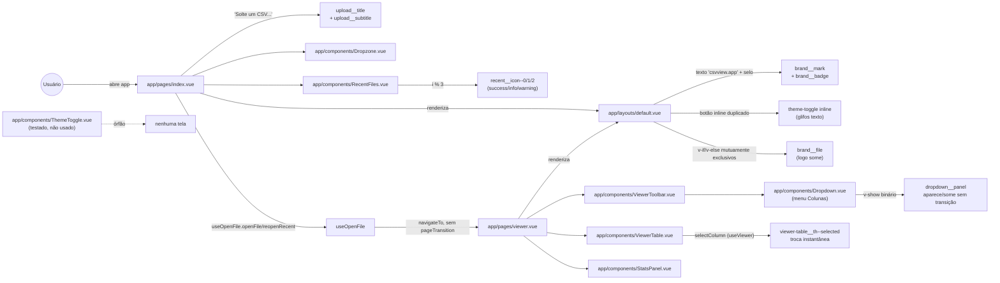
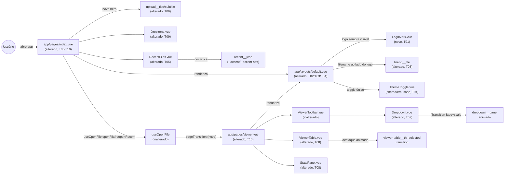

# Implementation Plan

## Request Summary
- Objective: refresh visual/interativo da landing (`app/pages/index.vue`) e do
  Viewer (`app/pages/viewer.vue`, `app/layouts/default.vue`) — copy do hero,
  logo SVG substituindo o wordmark de texto, header do Viewer com logo +
  filename simultâneos, ícones decorativos unificados na cor accent, toggle de
  tema consolidado (elimina duplicação `ThemeToggle.vue` órfão vs. botão
  inline), e transições/animações em abrir arquivo, trocar coluna, abrir/fechar
  o painel "Colunas" e navegar landing→viewer.
- Scope: in — textos do hero; logo SVG (landing + Viewer); reposicionamento do
  filename no header do Viewer; cor única (`--accent`/`--accent-soft`) nos
  ícones de `RecentFiles.vue`; transições (RF-06, RF-07, UI-02, UI-03) dentro
  de 150–300ms e respeitando `prefers-reduced-motion`; redesenho do toggle de
  tema preservando `useTheme`. out — parsing, estatísticas, IndexedDB, busca
  global, resize/reorder/pin de colunas (já entregues), cores semânticas de
  estado (`Badge.vue`, `StatsPanel.vue` `is-positive/negative/warning`), i18n,
  novos formatos/telas.
- Tier: standard
- Architecture references: `AGENTS.md`, `docs/agents/architecture.md`,
  `docs/agents/domain_rules.md` — regra citada e respeitada: `app/components/`
  permanece apresentacional (sem "Data fetching, parsing, state"); toda lógica
  de tema (`useTheme.ts`) e dataset (`useCurrentDataset.ts`, `useViewer.ts`) já
  existe nos composables e é reaproveitada sem introduzir estado novo nos
  componentes. `docs/agents/architecture.md`/`AGENTS.md` §3 estão desatualizados
  quanto ao inventário real (15 componentes, 8 composables, páginas reais) —
  esta decomposição usa o inventário real, verificado em `app/`, não a lista
  obsoleta do documento.

## AS IS — Componentes impactados

Legenda: o header hoje alterna, de forma mutuamente exclusiva (`v-if`/`v-else`),
entre o wordmark de texto (rotas fora do Viewer) e o nome do arquivo (Viewer) —
nunca os dois juntos; existe um `ThemeToggle.vue` completo e testado, porém
órfão, enquanto `default.vue` duplica a lógica num botão inline; nenhuma das
interações de `useOpenFile`, `Dropdown.vue` ou `selectColumn`/`ViewerTable.vue`
tem transição além dos micro-hovers de 0.12–0.15s já existentes em
`Button.vue`/`Dropzone.vue`/etc.

## TO BE — Componentes propostos

Legenda: `LogoMark.vue` (T01) passa a ser renderizado sempre no header,
inclusive no Viewer lado a lado com `brand__file` (T02/T03); o toggle de tema
único vive em `ThemeToggle.vue`, agora efetivamente usado por `default.vue`
(T04), eliminando o botão inline duplicado; `RecentFiles.vue` (T05) usa uma
única cor decorativa; `Dropzone.vue` (T09), `Dropdown.vue` (T07),
`ViewerTable.vue`/`StatsPanel.vue` (T08) e a dupla `index.vue`/`viewer.vue`
(T10) ganham transições dentro de 150–300ms, com fallback para
`prefers-reduced-motion: reduce`; nenhum composable muda — `useTheme`,
`useOpenFile`, `useViewer`, `useCurrentDataset` permanecem a única fonte de
estado, conforme a regra de camadas citada.

## Tasks

### T01 — Asset da logo SVG + componente `LogoMark.vue`
- **Files**: `public/logo.svg` (novo, cópia versionada de
  `/mnt/c/Users/werlesson/Desktop/image.svg`), `app/components/LogoMark.vue`
  (novo), `test/LogoMark.spec.ts` (novo)
- **Change**: copiar o SVG de origem para `public/logo.svg` (servido sem
  processamento do Vite, garantindo presença em `yarn generate` sem qualquer
  dependência de rede — RNF-04). Criar `LogoMark.vue`, um componente
  apresentacional puro (sem estado, sem composable) que renderiza
  `` com `width`/
  `height` fixos preservando a proporção 2064×512 (`aspect-ratio` ou
  `width`/`height` explícitos), reutilizável entre landing e Viewer.
- **Covers**: RF-03, RNF-04
- **Tests**: `test/LogoMark.spec.ts` — renderiza uma `` (ou `<svg>`
  inline, se optar por import como componente) apontando para o asset local;
  possui `alt` não vazio; smoke de montagem sem props obrigatórias.
- **Risk**: Low — componente novo, isolado, sem tocar em telas existentes
  nesta task.
- **Dependencies**: none

### T02 — Header (rotas fora do Viewer): logo substitui o wordmark de texto
- **Files**: `app/layouts/default.vue`
- **Change**: no branch `v-else` do `.brand` (hoje `brand__mark` +
  `brand__badge`), substituir os dois nós de texto por `<LogoMark />`,
  mantendo `.brand` como `<a href="/">` e preservando a posição atual (canto
  esquerdo do header, UI-04) e o comportamento responsivo existente (breakpoint
  640px que hoje esconde `.brand__badge` — como o badge de texto deixa de
  existir, remover a regra `@media (max-width: 640px) { .brand__badge {
  display: none } }` órfã, sem alterar o restante do breakpoint). Import de
  `LogoMark` no `<script setup>`.
- **Covers**: RF-03, UI-04
- **Tests**: `test/DefaultLayout.spec.ts` (novo, iniciado aqui e completado em
  T11) — fora da rota `/viewer`, o header não contém mais os textos
  "csvview.app"/"100% no navegador" e contém a `LogoMark`.
- **Risk**: Medium — `default.vue` não tem teste dedicado hoje; alterações no
  layout compartilhado afetam todas as rotas.
- **Dependencies**: T01

### T03 — Header do Viewer: logo + filename lado a lado
- **Files**: `app/layouts/default.vue`
- **Change**: eliminar a exclusividade mútua `v-if="currentFile"` / `v-else`
  do `.brand`. `.brand` (com `<LogoMark />`, de T02) passa a renderizar sempre;
  `brand__file` (nome do arquivo) vira um elemento irmão dentro de
  `.app-header__inner`, posicionado à direita do `.brand` — por exemplo com
  `margin-left: auto` no `brand__file` (ou um bloco dedicado antes do
  `theme-toggle`) — visível apenas `v-if="currentFile"` (sem `v-else` mais
  ocultando o logo). Mantém `app-header__inner--wide` para a largura total no
  Viewer.
- **Covers**: RF-04
- **Tests**: `test/DefaultLayout.spec.ts` — no Viewer com `currentFile`
  presente (mock/stub de `useCurrentDataset`), o header contém tanto
  `LogoMark` quanto o texto do arquivo, nessa ordem no DOM.
- **Risk**: Medium — mesmo arquivo de T02 (sequencial); qualquer regressão
  afeta o header em todas as rotas.
- **Dependencies**: T02

### T04 — Consolidar o toggle de tema (elimina duplicação)
- **Files**: `app/layouts/default.vue`, `app/components/ThemeToggle.vue`
- **Change**: remover o `<button class="theme-toggle">` inline de
  `default.vue` (glifos `☾`/`☀`, `computed isDark`, import de `useTheme`
  duplicado) e importar/usar `<ThemeToggle />` no lugar. Em
  `ThemeToggle.vue`, adicionar uma transição animada entre os dois ícones
  (lua/sol) — ex.: `transition`/`@keyframes` de `opacity`+`transform: scale`
  no `<svg>` trocado, 150–300ms (RNF-01), com bloco
  `@media (prefers-reduced-motion: reduce)` reduzindo a animação a 0/instantânea
  (RNF-02, escopado ao próprio componente — evita depender de um bloco global
  compartilhado por outras tasks). Preserva `toggleTheme`/`aria-pressed`/
  persistência inalterados (comportamento funcional 100% de `useTheme.ts`, sem
  novo estado no componente).
- **Covers**: RF-08, UI-01, RNF-01, RNF-02
- **Tests**: `test/ThemeToggle.spec.ts` (existente, ajustar se necessário para
  a nova transição sem quebrar as asserções de `aria-pressed`/`data-theme-state`
  já cobertas) + `test/DefaultLayout.spec.ts` — exatamente um controle de tema
  no header (nenhum `theme-toggle` inline residual), clicar chama
  `toggleTheme`.
- **Risk**: Medium — remove código do layout compartilhado; regressão quebra
  o toggle em todas as rotas. Mitigação: rodar `test/ThemeToggle.spec.ts` e o
  novo smoke de layout antes de prosseguir.
- **Dependencies**: T03

### T05 — `RecentFiles.vue`: ícones decorativos só com `--accent`
- **Files**: `app/components/RecentFiles.vue`, `test/RecentFiles.spec.ts`
- **Change**: remover o modificador `recent__icon--${i % 3}` e as classes
  `.recent__icon--0/1/2` (que hoje usam `--success`/`--info`/`--warning`);
  `.recent__icon` passa a usar `--accent` (cor) e `--accent-soft` (fundo)
  diretamente, independentemente do índice `i`. Nenhuma lógica de estado nova
  — troca puramente de classe/CSS num componente já apresentacional.
- **Covers**: RF-05, RNF-03
- **Tests**: `test/RecentFiles.spec.ts` — para uma lista com 3+ itens, nenhum
  elemento `.recent__icon` tem classe `recent__icon--0/1/2`; todos resolvem
  para a mesma cor computada (via `getComputedStyle` ou verificação de classe
  única `recent__icon`).
- **Risk**: Low — troca de classes CSS num componente isolado e já coberto por
  testes.
- **Dependencies**: none
- **Evidência RNF-03** (verificação de contraste, sem mudança de token):
  contraste não-textual `--accent` sobre `--accent-soft` compositado sobre
  `--bg-1` — dark: `#6e62f7` sobre composto `rgb(29,27,52)` ≈ **3.78:1**;
  light: `#5a4fe0` sobre composto `rgb(237,236,252)` ≈ **4.96:1**. Ambos ≥ 3:1
  (WCAG 1.4.11); nenhum ajuste de token é necessário nesta task.

### T06 — Landing: novo título e subtítulo do hero
- **Files**: `app/pages/index.vue`
- **Change**: substituir o texto de `.upload__title` por "O explorador de CSV
  para quem vive nos dados" e o de `.upload__subtitle` por "Abra, filtre e
  analise arquivos CSV enormes direto no navegador — sem instalar nada e sem
  enviar seus dados para nenhum servidor." Puramente textual — sem tocar
  `Dropzone`, `RecentFiles` ou o fluxo de `useOpenFile`.
- **Covers**: RF-01, RF-02
- **Tests**: `test/pages/index.spec.ts` (novo) — monta `index.vue` (stub de
  `useOpenFile`/`useFilesStore` como já fazem outros testes de composable) e
  asserta o texto exato do título/subtítulo novo e a ausência dos textos
  antigos.
- **Risk**: Low — mudança textual isolada.
- **Dependencies**: none

### T07 — `Dropdown.vue`: transição animada de abrir/fechar
- **Files**: `app/components/Dropdown.vue`, `test/Dropdown.spec.ts`
- **Change**: envolver o `
` num
  `<Transition name="dropdown">` (Vue), com classes
  `.dropdown-enter-active`/`.dropdown-leave-active` aplicando
  `transition: opacity, transform` (fade + leve `translateY`) entre 150–300ms
  (RNF-01) e `@media (prefers-reduced-motion: reduce)` zerando a duração
  (RNF-02), escopado ao próprio `<style scoped>` do componente. O `v-show`
  continua sendo o gatilho de estado (`open`); a lógica de foco/teclado/
  fechar-ao-clicar-fora em `Dropdown.vue` permanece inalterada.
- **Covers**: RF-06 (item c — abrir/fechar painel "Colunas"), UI-02, RNF-01,
  RNF-02
- **Tests**: `test/Dropdown.spec.ts` (existente) — revisar as asserções que
  dependem de `style.display === 'none'` logo após o clique: com
  `<Transition>` envolvendo `v-show`, o `display: none` final só é aplicado
  após o fim da transição de saída; ajustar os testes para aguardar o
  `transitionend`/usar `await new Promise(...)` ou expor uma classe
  intermediária (`dropdown-leave-active`) verificável de forma síncrona logo
  após o clique, preservando a garantia de que o menu fecha.
- **Risk**: Medium — `happy-dom` não roda o pipeline real de CSS/transition
  timing; risco de os testes existentes de `Dropdown.spec.ts` (que assumem
  `display: none` imediato) quebrarem ou de a assinatura de eventos
  `open`/`close` mudar de timing. Mitigação: task inclui a atualização do
  spec; rollback = reverter para `v-show` puro sem `<Transition>` caso o
  comportamento de foco/Escape quebre.
- **Dependencies**: none

### T08 — Destaque animado ao trocar a coluna selecionada
- **Files**: `app/components/ViewerTable.vue`, `app/components/StatsPanel.vue`,
  `test/ViewerTable.spec.ts`, `test/StatsPanel.spec.ts`
- **Change**: em `ViewerTable.vue`, adicionar `transition: background-color,
  box-shadow, border-color` (150–300ms) à classe já existente
  `.viewer-table__th--selected` (hoje aplicada/removida instantaneamente ao
  trocar `selectedIndex`), com `@media (prefers-reduced-motion: reduce)`
  zerando a duração. Em `StatsPanel.vue`, envolver `.stats-panel__content` num
  `<Transition name="stats-fade" mode="out-in">` (fade curto ao trocar
  `label`/`stats`) com a mesma faixa de duração e o mesmo fallback de
  `prefers-reduced-motion`. Nenhuma mudança na prop `selectedIndex`/`stats` ou
  em `selectColumn` (`useViewer`) — só CSS/transição sobre estado já existente.
- **Covers**: RF-06 (item b — trocar coluna selecionada), UI-03, RNF-01,
  RNF-02
- **Tests**: `test/ViewerTable.spec.ts` — a classe `viewer-table__th--selected`
  continua aplicada/removida corretamente ao mudar `selectedIndex` (teste
  existente, ~linha 148-150, deve continuar passando); `test/StatsPanel.spec.ts`
  — trocar `stats`/`label` via re-render não quebra a renderização do conteúdo
  final (aguardar `nextTick` quando necessário pelo `<Transition>`).
- **Risk**: Medium — `StatsPanel.vue` com `mode="out-in"` insere um estado
  intermediário vazio entre troca de colunas; se testes leem o DOM
  síncronamente sem `await nextTick()`, podem falhar por conteúdo ausente
  durante a transição. Mitigação: revisar `test/StatsPanel.spec.ts` para
  aguardar о ciclo de renderização.
- **Dependencies**: none

### T09 — Feedback animado ao abrir um arquivo
- **Files**: `app/components/Dropzone.vue`, `test/Dropzone.spec.ts`
- **Change**: hoje `.dropzone--disabled` (ativada via prop `disabled`,
  vinculada a `isOpening` em `index.vue`) aplica `opacity: 0.6` sem transição.
  Adicionar `opacity` à lista de propriedades do `transition` já existente em
  `.dropzone` (hoje só `border-color`/`background`, 0.12s) com duração ajustada
  para a faixa 150–300ms (RNF-01) e um indicador visual adicional de
  "abrindo" (ex.: leve pulso/opacity no `.dropzone__icon-wrap` via
  `@keyframes`) enquanto `disabled` está ativo — tornando a transição
  perceptível (não apenas um fade sutil de opacidade de fundo). Incluir
  `@media (prefers-reduced-motion: reduce)` desabilitando a animação de pulso
  (RNF-02). Sem mudança de prop/estado — `disabled` já existe e já reflete
  `isOpening`.
- **Covers**: RF-06 (item a — abrir arquivo via dropzone/item recente)
  — nota: cobre o caminho da `Dropzone`; reabertura via `RecentFiles` também
  aciona `isOpening`, mas hoje `RecentFiles.vue` não recebe/reflete esse estado
  (gap pré-existente fora do escopo desta SPEC — ver Open Questions), RNF-01,
  RNF-02
- **Tests**: `test/Dropzone.spec.ts` (existente) — a classe
  `dropzone--disabled` continua aplicada corretamente quando `disabled=true`;
  novo teste confere a presença da classe/estrutura que dispara a animação
  (ex.: `.dropzone__icon-wrap` com a classe de pulso quando `disabled`).
- **Risk**: Low — CSS aditivo sobre um componente já testado, sem mudança de
  contrato de props/eventos.
- **Dependencies**: none

### T10 — Transição de página landing → Viewer
- **Files**: `app/pages/index.vue`, `app/pages/viewer.vue`,
  `app/assets/css/main.css`
- **Change**: adicionar `definePageMeta({ pageTransition: { name: 'view',
  mode: 'out-in' } })` em ambas as páginas (`index.vue` e `viewer.vue`), e em
  `main.css` (estilos globais, já que a transição de página não é escopada a
  um único componente) as classes `.view-enter-active`/`.view-leave-active`
  com fade (+ leve slide, opcional) entre 150–300ms (RNF-01) e
  `@media (prefers-reduced-motion: reduce) { .view-enter-active,
  .view-leave-active { transition: none; } }` (RNF-02). Nenhuma mudança em
  `useOpenFile.navigate`/`navigateTo` — a transição é inteiramente
  declarativa via `pageTransition` do Nuxt sobre a navegação já existente.
- **Covers**: RF-07, RNF-01, RNF-02
- **Tests**: `test/pages/index.spec.ts` (de T06) ou um novo smoke —
  `definePageMeta` está presente com `pageTransition.name === 'view'` em
  ambas as páginas (via inspeção do objeto exportado/`getCurrentInstance` ou
  teste de integração leve, já que `definePageMeta` é uma macro do compilador
  Nuxt resolvida em build — validar via grep/teste de smoke conforme padrão do
  projeto, não via montagem isolada de SFC fora do contexto Nuxt).
- **Risk**: Medium — `definePageMeta`/`pageTransition` dependem do contexto de
  build do Nuxt (roteador `vue-router` + `NuxtPage`); testes unitários com
  `mount()` isolado (padrão atual do projeto, sem `@nuxt/test-utils`) podem não
  exercitar a transição real de rota. Mitigação: validar manualmente via
  `yarn dev` (checklist de rollout) além do teste automatizado; se
  `definePageMeta`/`pageTransition` não for exercitável de forma confiável em
  Vitest puro, documentar a limitação em vez de forçar um teste frágil.
- **Dependencies**: T06

### T11 — Regressão: smoke test do header consolidado + suíte completa
- **Files**: `test/DefaultLayout.spec.ts` (completa a cobertura iniciada em
  T02/T03/T04)
- **Change**: nenhuma mudança de produção — task de fechamento. Completa
  `test/DefaultLayout.spec.ts` com os casos finais: (a) fora do Viewer, logo
  visível e nenhum toggle duplicado; (b) no Viewer com dataset, logo + filename
  simultâneos, nome depois do logo na mesma linha; (c) exatamente um
  `ThemeToggle` no DOM em qualquer rota; (d) breakpoint 640px não quebra
  (verificar ausência da regra órfã de `brand__badge`). Rodar `yarn test`
  completo para confirmar que nenhuma alteração das tasks anteriores
  regrediu specs existentes (`RecentFiles`, `Dropdown`, `ViewerTable`,
  `StatsPanel`, `Dropzone`, `ThemeToggle`).
- **Covers**: RF-03, RF-04, RF-08, UI-01, UI-04 (regressão/fechamento)
- **Tests**: `test/DefaultLayout.spec.ts` (casos acima) + `yarn test` (suíte
  completa) — critério de saída: 0 falhas.
- **Risk**: Low — task de verificação, sem mudança de comportamento; falhas
  aqui expõem regressões das tasks anteriores (T02–T10) a corrigir antes do
  merge.
- **Dependencies**: T02, T03, T04, T05, T06, T07, T08, T09, T10

## Execution Phases
| Phase | Tasks | Parallel-safe? |
|-------|-------|----------------|
| 1 | T01, T05, T06, T07, T08, T09 | Sim — arquivos distintos, sem dependências entre si |
| 2 | T02, T10 | Sim — `default.vue` (T02) e `index.vue`/`viewer.vue`/`main.css` (T10) não se sobrepõem |
| 3 | T03 | Não — depende de T02 (mesmo arquivo `default.vue`) |
| 4 | T04 | Não — depende de T03 (mesmo arquivo `default.vue`) |
| 5 | T11 | Não — depende de todas as demais (regressão final) |

## Risks
| Risk | Blast radius | Mitigation | Rollback |
|------|-------------|------------|----------|
| `<Transition>` + `v-show` em `Dropdown.vue` (T07) muda o timing de `display: none` observável em `happy-dom`, quebrando as asserções síncronas de `test/Dropdown.spec.ts` | Menu "Colunas" (todo consumidor de `Dropdown.vue`, hoje só `ViewerToolbar.vue`) | Atualizar o spec para aguardar o ciclo de transição/checar classes intermediárias em vez de `display` imediato; validar foco/Escape continuam funcionando | Reverter T07 para `v-show` puro sem `<Transition>`, mantendo apenas um `transition: opacity` simples sem alterar o momento do `display: none` |
| `pageTransition`/`definePageMeta` (T10) não é exercitável de forma confiável pelo `mount()` isolado do Vitest (sem `@nuxt/test-utils`), deixando RF-07 sem cobertura automatizada forte | Navegação `/` → `/viewer` | Validação manual via `yarn dev`/`yarn build` incluída no checklist de rollout; documentar a limitação de teste explicitamente em vez de simular | Reverter `definePageMeta` nas duas páginas; a navegação volta a ser instantânea (comportamento atual) |
| Alterar `app/layouts/default.vue` em 3 tasks sequenciais (T02→T03→T04) — regressão em qualquer uma quebra o header em **todas** as rotas | Toda a aplicação (header é compartilhado) | `test/DefaultLayout.spec.ts` cresce incrementalmente a cada task (T02 adiciona os casos de logo, T03 os de filename, T04 os de toggle único); `yarn test` completo ao fim de cada task antes de prosseguir para a próxima do mesmo arquivo | Reverter a task específica (commits atômicos por task) sem afetar as anteriores, já que cada uma é um commit isolado |
| `mode="out-in"` em `StatsPanel.vue` (T08) insere um frame sem conteúdo entre trocas de coluna; testes que leem o DOM sem `await nextTick()` podem falhar de forma intermitente | `StatsPanel.vue` e qualquer teste que dependa de leitura síncrona pós-troca | Revisar `test/StatsPanel.spec.ts` para `await` o ciclo de render após trocar `stats`/`label`; preferir `mode` sem `out-in` (fade sobreposto) se a leitura assíncrona for frágil | Remover o `<Transition>` de `StatsPanel.vue`, mantendo apenas a transição do `<th>` (T08 ainda cumpre RF-06b parcialmente via `ViewerTable.vue`) |
| RF-06(a) (abrir arquivo) cobre apenas o caminho `Dropzone` (T09); `RecentFiles.vue` não recebe/reflete `isOpening` hoje | Reabertura de arquivo recente sem feedback visual de carregamento | Fora do escopo RIGID desta SPEC (não há AC exigindo o mesmo feedback em `RecentFiles`); registrado como gap em Open Questions | N/A — não é uma mudança de código, é uma lacuna de cobertura a esclarecer antes do merge |

## Open Questions
- RF-06(a) exige transição "ao abrir um arquivo (dropzone **ou** item
  recente)". A T09 implementa o feedback animado apenas em `Dropzone.vue`
  (que já recebe `disabled`/`isOpening` de `index.vue`); `RecentFiles.vue` não
  recebe essa prop hoje e seus itens continuam clicáveis/sem feedback visual
  durante `isOpening`. Isso satisfaz literalmente a AC de RF-06 (que só exige
  "uma transição perceptível associada à mudança de estado", sem exigir
  cobertura de ambos os gatilhos com o mesmo tratamento)? Se a intenção do
  RF-06(a) é cobrir **os dois** caminhos de abertura com o mesmo padrão visual,
  uma task adicional (fora deste PLAN, ou uma T09b) precisaria estender
  `RecentFiles.vue` com uma prop `disabled`/`opening` e o wiring em
  `index.vue` — impacto: mais um arquivo compartilhado (`RecentFiles.vue`,
  também tocado por T05) e uma dependência sequencial nova.
- `definePageMeta({ pageTransition })` (T10) depende do pipeline de roteamento
  real do Nuxt; o projeto testa via `mount()` isolado do Vue Test Utils (sem
  `@nuxt/test-utils`/ambiente Nuxt completo). Não há precedente de teste desse
  tipo de configuração no repositório — a cobertura automatizada de RF-07 pode
  ficar mais fraca que a dos demais RFs (validável de forma confiável só
  manualmente via `yarn dev`). Aceitável para este PLAN, ou o time prefere
  investir em `@nuxt/test-utils` antes de aceitar T10 como "testada"?
- `docs/agents/architecture.md` permanece desatualizado (inventário de
  componentes/composables) mesmo após esta feature — nenhuma task deste PLAN
  atualiza a documentação de arquitetura (fora do escopo de uma SPEC de
  UI/UX). Confirmar que isso é aceitável ou se deveria virar uma
  task/feature separada de manutenção de `docs/agents/`.

## Assumptions
- `public/logo.svg` é o destino escolhido para o asset (em vez de
  `app/assets/images/logo.svg` processado pelo Vite) — mais simples e
  previsível para `yarn generate` (cópia direta, sem hashing de asset), e
  suficiente para RNF-04. `[UNVERIFIED]` quanto à preferência do time por um
  import processado pelo Vite (ex.: para cache-busting via hash de conteúdo);
  ambos os caminhos são citados como FLEXIBLE na SPEC.
- `ThemeToggle.vue` (já testado, com SVG lua/sol e `aria-pressed`) é promovido
  para uso real em `default.vue` em vez de redesenhar o botão inline in loco —
  opção A das duas listadas em FLEXIBLE. Evidência: `ThemeToggle.vue` já
  implementa a affordance visual distinta por tema exigida por UI-01 (ícones
  diferentes lua/sol), reduzindo o escopo de T04 a integração + animação de
  troca de ícone, em vez de reescrever o botão inline do zero.
  `[UNVERIFIED]` quanto a haver alguma razão para preferir o caminho inverso.
- A "transição visual perceptível" de RF-06(a) (abrir arquivo) é satisfeita
  por uma animação no próprio `Dropzone.vue` durante o estado `disabled`
  (`isOpening`), sem exigir um indicador de progresso/spinner dedicado — a SPEC
  não especifica a forma exata da transição, apenas que exista e seja
  mensurável (150–300ms). `[UNVERIFIED]` — ver Open Questions sobre cobertura
  de `RecentFiles.vue`.
- `test/pages/index.spec.ts` (T06) segue o padrão de teste unitário isolado já
  usado no projeto (mount + stubs de composables), mesmo sem
  `@nuxt/test-utils`; nenhum teste de página existe hoje como precedente
  direto, mas os testes de componente (`RecentFiles.spec.ts`, etc.) já mockam
  composables com padrão semelhante ao necessário para `index.vue`
  (`useOpenFile`, `useFilesStore`).
- Nenhuma task deste PLAN introduz estado novo em componentes — toda
  transição é CSS/`<Transition>` declarativo sobre props/estado já expostos
  pelos composables existentes (`useTheme`, `useViewer`, `useCurrentDataset`,
  `useOpenFile`), preservando a regra de camadas citada em
  `docs/agents/architecture.md`.
