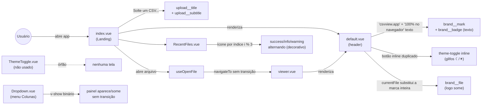
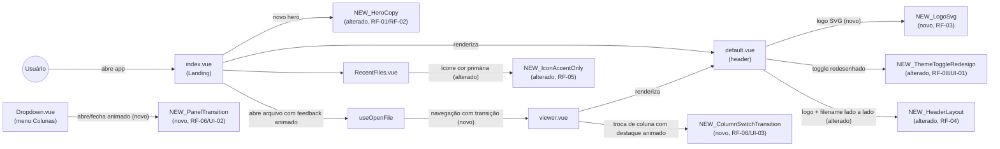

# SPEC: landing-viewer-ui-refresh

## Metadata
- Source: developer description via /plan
- Service: csvview (Nuxt 4 SPA, single repo, `app/` as `srcDir`)
- Tier: standard
- Version: 1.1
- Architecture references: `AGENTS.md`, `docs/agents/architecture.md`, `docs/agents/domain_rules.md`

## Context

CSV View é um explorador de CSV/TSV 100% client-side (Nuxt 4 SPA estático, sem
backend). O MVP (Fases 1–8 de `.spec/init/project-phases.md`) já está implementado —
a landing (`app/pages/index.vue`), o Viewer (`app/pages/viewer.vue`), o layout
compartilhado (`app/layouts/default.vue`) e o design system de componentes
(`app/components/`) existem e têm cobertura de testes em `test/`.

`docs/agents/architecture.md` (AS IS) descreve um estado anterior ao MVP atual —
lista `app/components/CsvCell.vue` como único componente de domínio e
`app/app.vue` como o scaffold padrão do Nuxt (`NuxtWelcome`). O código já avançou
muito além disso (15 componentes, 8 composables, 3 services, páginas reais); a
regra de camadas que o documento estabelece, porém, continua válida e é citada
abaixo. `AGENTS.md` §3 confirma: "`app.vue` is still the default Nuxt welcome
scaffold" é uma nota igualmente desatualizada — não impede a leitura da regra de
responsabilidade por camada.

**Regra de arquitetura citada** (`docs/agents/architecture.md`, tabela "Layer
responsibilities"): `app/components/` possui SFCs **apresentacionais** e
explicitamente **não possui** "Data fetching, parsing, state" — estado e lógica
vivem em `app/composables/` (ex.: `useTheme.ts`, `useViewer.ts`). Esta SPEC
respeita a regra: nenhum requisito RIGID abaixo introduz estado nos componentes
de apresentação; toda lógica de tema/navegação/seleção já existe nos composables
correspondentes e é reaproveitada.

Esta feature é um refresh de UI/UX que não altera parsing, estatísticas,
persistência (IndexedDB) ou o modelo de dados — é escopo estritamente
visual/interativo sobre telas e componentes existentes, conforme os 7 critérios
de aceite confirmados.

**Achado relevante do código** (para RF-08/UI-01): existe um componente dedicado
`app/components/ThemeToggle.vue` (SVG lua/sol, `aria-pressed`, testado em
`test/ThemeToggle.spec.ts`) que **não é usado em nenhum lugar** — o toggle de
tema realmente renderizado é um botão inline duplicado dentro de
`app/layouts/default.vue` (glifos de texto `☾`/`☀`, sem o mesmo tratamento
visual). O redesenho do item 7 deve resolver essa duplicação.

## AS IS — Estado atual

Legenda: a landing usa um wordmark de texto e um selo separado no header; o
Viewer troca a marca inteira pelo nome do arquivo (o logo desaparece); os ícones
decorativos de `RecentFiles.vue` alternam entre três cores semânticas
(`success`/`info`/`warning`) sem significado de estado; há um componente
`ThemeToggle.vue` completo e testado, porém órfão, enquanto o header usa um
botão inline duplicado; nenhuma ação (abrir arquivo, trocar coluna, abrir/fechar
painel, navegar landing→viewer) tem transição — os únicos `transition` no CSS
são micro-hovers de 0.12s–0.15s em bordas/backgrounds.

## TO BE — Estado proposto

Legenda: o header passa a exibir sempre o logo SVG (`RF-03`, `RF-04`), com o
nome do arquivo reposicionado ao lado no Viewer sem ocultar o logo (`RF-04`); o
toggle de tema é consolidado num único controle redesenhado com feedback visual
de estado (`RF-08`, `UI-01`); os ícones decorativos de `RecentFiles.vue` passam
a usar exclusivamente a cor primária (`RF-05`); abrir arquivo, alternar coluna,
abrir/fechar o painel "Colunas" e navegar landing→viewer ganham transições
visuais (`RF-06`, `RF-07`, `UI-02`, `UI-03`).

## Scope
- **In**: textos do hero da landing (título e subtítulo); substituição do
  wordmark de texto do header pela logo SVG (landing e Viewer); reposicionamento
  do nome do arquivo no header do Viewer; unificação da cor de ícones
  decorativos hoje variando entre verde/azul/amarelo para a cor primária/accent
  do tema; animações/transições em abrir arquivo, trocar coluna selecionada,
  abrir/fechar o painel de colunas, e na navegação landing→viewer; redesenho
  visual do controle de alternância dark/light mantendo seu comportamento
  funcional atual (`useTheme`).
- **Out**: parsing, estatísticas de coluna, persistência IndexedDB, busca
  global, redimensionamento/reordenação/fixação de colunas (já entregues em
  fases anteriores e não alterados aqui); cores de ícones/badges **semânticos**
  de estado (erro/sucesso/aviso) — `Badge.vue` (variantes `settled`/`pending`/
  `info`) e as classes `is-positive`/`is-negative`/`is-warning` de
  `StatsPanel.vue` permanecem inalteradas; i18n (interface segue pt-BR); suporte
  a novos formatos de arquivo ou telas novas.

## RIGID (Non-Negotiable)

### Functional Requirements

- RF-01 [Event-Driven]: WHEN a landing page (`app/pages/index.vue`) é renderizada, THE SYSTEM SHALL exibir o título do hero como "O explorador de CSV para quem vive nos dados", substituindo o texto atual "Solte um CSV e comece a explorar." (verified at app/pages/index.vue:52).
  - AC: o DOM renderizado contém o elemento de título do hero com o texto exato "O explorador de CSV para quem vive nos dados" e não contém mais o texto anterior.

- RF-02 [Event-Driven]: WHEN a landing page é renderizada, THE SYSTEM SHALL exibir o texto de apoio do hero como "Abra, filtre e analise arquivos CSV enormes direto no navegador — sem instalar nada e sem enviar seus dados para nenhum servidor.", substituindo o texto atual "Arraste um arquivo ou abra uma sessão recente. Tudo é processado localmente, no seu navegador." (verified at app/pages/index.vue:53-56).
  - AC: o DOM renderizado contém o elemento de subtítulo do hero com o texto exato especificado e não contém mais o texto anterior.

- RF-03 [Event-Driven]: WHEN o header do layout compartilhado (`app/layouts/default.vue`) é renderizado em qualquer rota que hoje exibe o wordmark de texto ("csvview.app" + selo "100% no navegador", verified at app/layouts/default.vue:29-31), THE SYSTEM SHALL substituir os dois elementos de texto por um único elemento de logo em SVG, derivado do arquivo de origem `/mnt/c/Users/werlesson/Desktop/image.svg` (verified: arquivo SVG existe, 2064×512, `file` confirma `SVG Scalable Vector Graphics image`) trazido para os assets versionados do projeto.
  - AC: o DOM do header, fora da rota `/viewer`, não contém mais os nós de texto "csvview.app" nem "100% no navegador"; contém um elemento de imagem/SVG referenciando um asset versionado dentro do repositório (`app/assets/` ou `public/`).

- RF-04 [State-Driven]: WHILE a rota ativa é `/viewer` e há um dataset carregado (`hasDataset` true, verified at app/pages/viewer.vue:20-25), THE SYSTEM SHALL exibir simultaneamente o logo (mesmo elemento do RF-03) e o nome do arquivo aberto no header, com o nome do arquivo posicionado à direita/lateral do logo — substituindo o comportamento atual em que o nome do arquivo ocupa sozinho o lugar da marca (`v-if="currentFile"` / `v-else`, mutuamente exclusivos, verified at app/layouts/default.vue:25-31).
  - AC: no Viewer com dataset carregado, o header contém tanto o elemento de logo quanto o elemento com o nome do arquivo; a ordem no DOM (ou o posicionamento visual resultante) coloca o nome do arquivo depois do logo, na mesma linha do header.

- RF-05 [Ubiquitous]: THE SYSTEM SHALL renderizar os ícones decorativos hoje alternando entre as cores `--success`/`--info`/`--warning` por índice (`recent__icon--0/1/2` em `app/components/RecentFiles.vue`, verified at app/components/RecentFiles.vue:48, 151-164) usando exclusivamente a cor primária/accent do tema (`--accent`) e seu fundo suave (`--accent-soft`), independentemente do índice do item.
  - AC: nenhum ícone de arquivo recente usa `--success`, `--info` ou `--warning`; todos usam `--accent`/`--accent-soft`, em qualquer posição da lista.

- RF-06 [Event-Driven]: WHEN o usuário (a) abre um arquivo (dropzone ou item recente, `useOpenFile`), (b) troca a coluna selecionada para o painel de estatísticas (`selectColumn` em `useViewer`, consumido por `app/pages/viewer.vue:66-74`), ou (c) abre ou fecha o painel "Colunas" (`Dropdown.vue`, `v-show="open"`, verified at app/components/Dropdown.vue:118), THE SYSTEM SHALL exibir uma transição visual perceptível associada à mudança de estado, em vez da troca instantânea atual.
  - AC: para cada uma das três interações, existe uma propriedade CSS de transição/animação (`transition` ou `@keyframes`) aplicada ao elemento afetado, com duração mensurável maior que 0ms; a troca de estado final (dataset carregado, coluna selecionada, painel aberto/fechado) permanece funcionalmente idêntica à atual.

- RF-07 [Event-Driven]: WHEN a navegação ocorre de `/` (landing) para `/viewer` após abrir um arquivo com sucesso, THE SYSTEM SHALL exibir uma transição visual entre as duas telas, em vez da substituição instantânea de página atual (`navigateTo`, sem `pageTransition` configurado hoje, verified: ausência de `Transition`/`pageTransition` em `app/pages/*.vue`, `app/layouts/default.vue`, `nuxt.config.ts`).
  - AC: uma transição de página (Vue `<Transition>`/`pageTransition` do Nuxt ou equivalente) está configurada e observável (classes `*-enter-active`/`*-leave-active` ou equivalente) na troca de `/` para `/viewer`.

- RF-08 [Optional]: WHERE o usuário aciona o controle de alternância de tema no header, THE SYSTEM SHALL alternar entre os temas `dark`/`light` usando o comportamento funcional existente de `useTheme.ts` (`toggleTheme`, persistência em `localStorage`, verified at app/composables/useTheme.ts:45-69) através de um único controle redesenhado — eliminando a duplicação atual entre o componente órfão `ThemeToggle.vue` (verified: nenhuma referência de uso encontrada no código) e o botão inline de `app/layouts/default.vue:33-42`.
  - AC: existe exatamente um controle de alternância de tema renderizado no header, em qualquer rota; acioná-lo chama `toggleTheme` de `useTheme` e persiste a escolha; não há um segundo controle de tema duplicado (órfão ou inline) coexistindo no código após a mudança.

### UI Requirements

- UI-01 [State-Driven]: WHILE o tema ativo é `dark`, o controle de alternância de tema do RF-08 SHALL exibir uma afordância visual distinta (ícone/estado) da exibida WHILE o tema ativo é `light`, com `aria-pressed` refletindo o estado.
  - AC: o atributo `aria-pressed` e o conteúdo visual do controle (ícone) diferem entre os dois temas; a troca de um estado para o outro anima a transição (não é um salto instantâneo de ícone).

- UI-02 [Event-Driven]: WHEN o menu "Colunas" (`Dropdown.vue`) abre ou fecha, THE SYSTEM SHALL animar a transição de opacidade/escala do painel, em vez do `v-show` binário atual.
  - AC: abrir o menu produz um estado intermediário observável (classe de transição ativa) antes do estado final aberto; fechar produz o equivalente na direção inversa.

- UI-03 [Event-Driven]: WHEN o usuário troca a coluna selecionada no Viewer (ação que atualiza `StatsPanel`), THE SYSTEM SHALL aplicar um destaque visual transitório e animado à nova coluna selecionada, distinto da troca instantânea de conteúdo atual do painel.
  - AC: selecionar uma nova coluna dispara uma transição CSS observável no indicador de seleção (cabeçalho da coluna e/ou painel de estatísticas) com duração mensurável maior que 0ms.

- UI-04 [Ubiquitous]: THE SYSTEM SHALL renderizar o logo (RF-03) na landing ocupando a posição do header hoje ocupada pelo wordmark de texto (canto esquerdo do `.brand`, verified at app/layouts/default.vue:85-91), sem alterar a estrutura de layout responsivo existente (breakpoint 640px que hoje esconde `.brand__badge`, verified at app/layouts/default.vue:151-162).
  - AC: em telas ≥640px e <640px, o logo permanece visível e alinhado à esquerda do header, sem quebrar o layout responsivo existente do header.

### Non-Functional Requirements

- RNF-01: Toda transição/animação introduzida pelos RF-06, RF-07, UI-02 e UI-03 SHALL ter duração entre 150ms e 300ms, mantendo consistência com o padrão de micro-transições já presente no código (0.12s–0.15s em `Button.vue`, `Dropzone.vue`, `SearchInput.vue`, `ThemeToggle.vue`, `StatsHistogram.vue`, verified via grep em `app/components/*.vue`).
  - AC: toda propriedade `transition`/`animation-duration` nova introduzida por esta feature está no intervalo [150ms, 300ms].

- RNF-02: Todas as transições/animações introduzidas por esta feature SHALL respeitar a preferência do sistema `prefers-reduced-motion: reduce`, desabilitando ou reduzindo a animação não-essencial quando essa media query está ativa.
  - AC: com `prefers-reduced-motion: reduce` emulado, as transições de RF-06/RF-07/UI-02/UI-03 têm duração igual a 0 ou são substituídas por uma troca instantânea equivalente ao estado atual (sem quebrar funcionalidade).

- RNF-03: A cor `--accent` usada nos ícones unificados pelo RF-05, sobre o fundo `--accent-soft` correspondente, SHALL manter razão de contraste não-textual ≥ 3:1 em ambos os temas (`dark` e `light`), consistente com os pares de tokens já definidos em `app/assets/css/main.css:28-31,64-67`.
  - AC: o par `--accent`/`--accent-soft` de cada tema (dark, light) atende ≥ 3:1 de contraste (WCAG 1.4.11) — validável por ferramenta de contraste sobre os valores hex/rgba já definidos.

- RNF-04: A logo SVG trazida pelo RF-03 SHALL ser servida como asset estático do projeto (sem dependência de rede externa), consistente com o princípio client-side/privacidade do produto (`.spec/init/project-description.md` — fontes já auto-hospedadas pelo mesmo motivo).
  - AC: o build estático (`yarn generate`) inclui o arquivo do logo entre os assets gerados; nenhuma requisição de rede a um host externo é necessária para exibir o logo.

## FLEXIBLE (Implementation Suggestions)

- Copiar `/mnt/c/Users/werlesson/Desktop/image.svg` para `app/assets/images/logo.svg` (ou `public/logo.svg`, se preferível servir sem processamento do Vite); extrair um componente `LogoMark.vue` reutilizável entre a landing e o Viewer.
- Consolidar o toggle de tema: promover `ThemeToggle.vue` (já testado, com SVG lua/sol e `aria-pressed`) para uso real dentro de `app/layouts/default.vue`, removendo o botão inline duplicado — ou, alternativamente, redesenhar `ThemeToggle.vue` in loco e importá-lo pela primeira vez no layout. Em ambos os casos, remover a duplicação de lógica de tema no template do layout.
- Reposicionar o nome do arquivo no header do Viewer: mover `.brand__file` para um elemento irmão à direita do logo dentro de `.app-header__inner`, por exemplo com `margin-left: auto` antes do toggle de tema, ou um bloco central dedicado.
- Para a transição landing→viewer, considerar `definePageMeta({ pageTransition: { name: 'view', mode: 'out-in' } })` (Nuxt) com um par de classes `.view-enter-active`/`.view-leave-active` de fade/slide, respeitando RNF-01/RNF-02.
- Para abrir/fechar o painel "Colunas", envolver o `
` de `Dropdown.vue` num `<Transition name="dropdown">` (Vue) com fade + leve translateY, mantendo o `v-show` atual como gatilho.
- Para a troca de coluna selecionada, aplicar uma transição de `background`/`border-color` no `<th>` selecionado da `ViewerTable.vue` e/ou um fade no conteúdo de `StatsPanel.vue` ao trocar `label`/`stats`.
- Para RF-05, trocar as classes `recent__icon--0/1/2` por uma única classe (ex.: `recent__icon`) usando `--accent`/`--accent-soft`, eliminando o modificador por índice `i % 3` em `RecentFiles.vue`.
- Novos testes sugeridos (seguindo o padrão `test/*.spec.ts` existente): `test/RecentFiles.spec.ts` (assert de cor única do ícone), `test/ThemeToggle.spec.ts` (assert de uso real no layout, se consolidado), um teste de fumaça para o header do Viewer (logo + filename simultâneos).

## Acceptance Criteria Summary

| ID | Criterion | Testable? |
|----|-----------|-----------|
| RF-01 | Título do hero é "O explorador de CSV para quem vive nos dados" | Sim |
| RF-02 | Subtítulo do hero é o novo texto de apoio especificado | Sim |
| RF-03 | Wordmark de texto do header é substituído por logo SVG versionada | Sim |
| RF-04 | Viewer exibe logo + nome do arquivo simultaneamente, nome à direita | Sim |
| RF-05 | Ícones decorativos de `RecentFiles.vue` usam só `--accent`/`--accent-soft` | Sim |
| RF-06 | Abrir arquivo, trocar coluna e abrir/fechar painel têm transição visual | Sim |
| RF-07 | Navegação landing→viewer tem transição de página | Sim |
| RF-08 | Toggle de tema único e redesenhado, comportamento funcional preservado | Sim |
| UI-01 | Toggle de tema reflete estado atual (ícone + `aria-pressed`) animado | Sim |
| UI-02 | Menu "Colunas" anima abertura/fechamento | Sim |
| UI-03 | Troca de coluna selecionada tem destaque animado | Sim |
| UI-04 | Logo mantém posição/layout responsivo do wordmark atual | Sim |
| RNF-01 | Duração de transições novas entre 150ms–300ms | Sim |
| RNF-02 | Transições respeitam `prefers-reduced-motion: reduce` | Sim |
| RNF-03 | Contraste `--accent`/`--accent-soft` ≥ 3:1 em ambos os temas | Sim |
| RNF-04 | Logo servido como asset estático local, sem rede externa | Sim |
