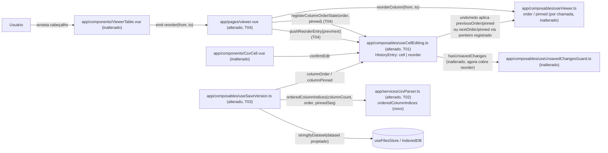

# Implementation Plan

## Request Summary
- Objective: fazer `reorderColumn` (arraste de cabeçalho, `useViewer.ts:432-472`) empilhar exatamente 1 entrada na MESMA pilha cronológica de undo/redo já usada por edição de célula (`useCellEditing.ts`), e fazer `saveNewVersion`/`overwriteOriginal` persistirem o dataset projetado pela ordem de colunas VIGENTE (fixadas + `order`), não pela ordem original do cabeçalho.
- Scope:
  - **In**: 1 entrada de histórico por gesto de arraste completo (RF-01, CT-04), intercalada cronologicamente com edições de célula; undo/redo de reorder restaurando o estado exato de ordem/pin anterior/posterior (RF-02, RF-03, CT-01); descarte de redo pendente ao confirmar nova ação de qualquer tipo (RF-04); `hasUnsavedChanges`/guard reagindo a reorder pendente (RF-05); save projetando header/rows pela ordem completa — fixadas + `order`, nunca `displayColumns` (RF-06, CT-03); `markSaved()` cobrindo reorder (RF-07); reset da pilha compartilhada ao trocar de dataset (RF-08).
  - **Out**: `togglePin` como ação independente no histórico; `resizeColumn`/`toggleColumn`/`sortColumn`/`sortColumnAdditive` como ações undoáveis; persistência durável de `order`/`pinned`/da pilha entre reloads (fora de escopo, feature `sessions`); filtro de colunas ocultas na projeção de salvamento (comportamento inalterado — nenhum filtro por `hidden` hoje, nenhum introduzido).
- Tier: standard
- Architecture references: `AGENTS.md`, `docs/agents/architecture.md`, `docs/agents/domain_rules.md`.

**Regras de layering aplicáveis (fonte da verdade = código + docs vigentes, não stale para esta área):**
- `docs/agents/architecture.md` — tabela "Layer responsibilities" (linha 48): `app/composables/` possui "reactive state + orchestration", incluindo explicitamente "cell edit + undo/redo (`useCellEditing`)" e "edited-dataset persistence (`useSaveVersion`)" — a extensão do histórico compartilhado e da projeção de salvamento DEVE morar nesses composables, não em componentes. `app/components/` NÃO possui "business rules" — `ViewerTable.vue` permanece inalterado nesta feature (o ponto único de emissão `reorder(from,to)`, `ViewerTable.vue:280`, já existe e não muda).
- `AGENTS.md` seção 2 (linha 37) — "Pure domain logic isolated in `app/services/` — framework-free, unit-testable". A função de projeção da ordem completa de colunas (CT-03) é lógica pura (sem `ref`/`computed`) e DEVE viver em `app/services/csvParser.ts` (ao lado de `stringifyDataset`), não como um `computed` dentro de `useViewer.ts` — reconciliando a citação explícita de arquitetura no Contexto da SPEC com a sugestão FLEXIBLE de "novo computed em `useViewer.ts`": o `computed`/orquestração fica no composable consumidor (`useSaveVersion.ts`), o algoritmo puro fica no serviço.
- `docs/agents/domain_rules.md` (linhas 148-179) — as duas regras de domínio estendidas por esta feature ("per-dataset undo/redo stack, reset on dataset switch"; "both re-serializing the in-memory dataset") continuam com o mesmo contrato externo (assinaturas de `undo`/`redo`/`markSaved`/`saveNewVersion`/`overwriteOriginal` inalteradas) — apenas o formato interno das entradas do stack e a fonte dos dados serializados mudam.

## AS IS — Componentes impactados

```mermaid
flowchart LR
  User["Usuário"] -->|"arrasta cabeçalho"| ViewerTable["app/components/ViewerTable.vue"]
  ViewerTable -->|"emit reorder(from, to)"| ViewerPage["app/pages/viewer.vue"]
  ViewerPage -->|"reorderColumn(from, to)"| UseViewer["app/composables/useViewer.ts<br/>order / pinned (por chamada)"]
  User -->|"edita celula"| CsvCell["app/components/CsvCell.vue"]
  CsvCell -->|"confirmEdit"| UseCellEditing["app/composables/useCellEditing.ts<br/>undoStack / redoStack (singleton)"]
  UseCellEditing -->|"hasUnsavedChanges"| UseUnsavedGuard["app/composables/useUnsavedChangesGuard.ts"]
  UseCellEditing -->|"markSaved()"| UseSaveVersion["app/composables/useSaveVersion.ts"]
  UseSaveVersion -->|"stringifyDataset(dataset.header/rows)<br/>ordem original"| FilesStore[("useFilesStore / IndexedDB")]
  UseViewer -.->|"nenhuma ligacao"| UseCellEditing
```

Legenda: `reorderColumn` e `useCellEditing` são hoje completamente desacoplados — uma reordenação nunca vira entrada de undo/redo, nunca marca `hasUnsavedChanges`/aciona o guard, e é ignorada por `saveNewVersion`/`overwriteOriginal`, que sempre serializam `dataset.header`/`dataset.rows` na ordem original. `useViewer()` tem um único ponto de instanciação no código (`app/pages/viewer.vue:75`, verificado via grep).

## TO BE — Componentes propostos

Legenda: `useCellEditing.ts` (alterado, T01) ganha o tipo discriminado `HistoryEntry` (`kind: 'cell' | 'reorder'`), `registerColumnOrderState`/`pushReorderEntry` (mecanismo de integração de CT-02) e `undo`/`redo` capazes de aplicar tanto `previousValue`/`nextValue` de célula quanto `previousOrder`/`previousPinned`/`nextOrder`/`nextPinned` de reorder. `viewer.vue` (alterado, T04) é o ÚNICO ponto de integração explícito: registra os refs `order`/`pinned` da sua instância de `useViewer()` e envolve `reorderColumn` com a captura de snapshot antes/depois, empilhando exatamente 1 entrada por gesto (CT-04). `app/services/csvParser.ts` (alterado, T02) ganha a função pura `orderedColumnIndices` (algoritmo de projeção, CT-03), consumida por `useSaveVersion.ts` (alterado, T03) para projetar `header`/`rows` antes de `stringifyDataset`. `useUnsavedChangesGuard.ts` e `ViewerTable.vue` permanecem inalterados — o primeiro porque `hasUnsavedChanges` já é derivado do mesmo `undoStack` compartilhado (RF-05 satisfeito por construção); o segundo porque o evento `reorder(from,to)` já é emitido no ponto único correto (`ViewerTable.vue:280`).

## Tasks

### T01 — `useCellEditing.ts`: entrada discriminada, ponto de integração e dispatch de undo/redo
- **Files**: `app/composables/useCellEditing.ts`
- **Change**: Substituir `undoStack`/`redoStack: CellEditEntry[]` por `HistoryEntry[]`, onde `HistoryEntry = ({ kind: 'cell' } & CellEditEntry) | ReorderHistoryEntry` e `ReorderHistoryEntry = { kind: 'reorder'; previousOrder: number[]; previousPinned: number[]; nextOrder: number[]; nextPinned: number[] }` (FLEXIBLE, adotado literalmente). `confirmEdit` passa a empilhar `{ kind: 'cell', ...entry }`. Adicionar module-scope holders `let columnOrderRef: Ref<number[]> | null = null` / `let columnPinnedRef: Ref<Set<number>> | null = null` e a função exportada `registerColumnOrderState(order: Ref<number[]>, pinned: Ref<Set<number>>): void` que os atribui — este é o ponto de integração explícito de CT-02, chamado uma única vez por `viewer.vue` (T04) logo após `useViewer(...)`. Adicionar `pushReorderEntry(previousOrder, previousPinned, nextOrder, nextPinned): void` que empilha `{ kind: 'reorder', ... }` em `undoStack` e esvazia `redoStack` (RF-04, mesmo padrão de `confirmEdit`). Atualizar `undo()`/`redo()` para despachar por `entry.kind`: `'cell'` chama `updateCell` como hoje; `'reorder'` atribui `columnOrderRef.value.value = entry.previousOrder` (undo) / `entry.nextOrder` (redo) e `columnPinnedRef.value.value = new Set(entry.previousPinned)` / `new Set(entry.nextPinned)`, com no-op defensivo se os ponteiros forem `null` (nunca deve ocorrer — único call site de `useViewer()` verificado — mas evita exceção). Corrigir `isDirty` para filtrar só entradas `kind === 'cell'` antes de comparar `rowIndex`/`columnIndex` (correção de tipo, união discriminada). Estender o watcher de reset (`useCellEditing.ts:69-79`, `flush: 'sync'`) para também zerar `columnOrderRef = null; columnPinnedRef = null` — falha segura caso uma futura troca de dataset ocorra sem remount de `viewer.vue` (hoje não ocorre, mas evita aplicar undo/redo de reorder contra refs de um `useViewer()` desmontado). Exportar `registerColumnOrderState`, `pushReorderEntry`, `columnOrder: computed(() => columnOrderRef?.value ?? [])`, `columnPinned: computed(() => columnPinnedRef?.value ?? new Set())` no `return`. `markSaved()`/`hasUnsavedChanges` permanecem com a MESMA implementação (`undoStack.value.length`/`savedPosition`) — passam a cobrir reorder automaticamente por construção, sem alteração de código (RF-05, RF-07).
- **Covers**: RF-02, RF-03, RF-04, RF-05, RF-07, CT-01, CT-02, RNF-01
- **Tests**: `test/useCellEditing.spec.ts` — `pushReorderEntry` empilha exatamente 1 entrada e esvazia `redoStack`; `undo()` numa entrada `reorder` restaura `order.value`/`pinned.value` para `previousOrder`/`previousPinned` exatos (via um par de refs registrados com `registerColumnOrderState`); `redo()` reaplica `nextOrder`/`nextPinned` exatos; sequência intercalada edição→reorder→edição e 3× `undo()` desfaz na ordem cronológica inversa real (não agrupada por tipo); nova edição OU novo `pushReorderEntry` após `undo()` esvazia `redoStack` (cobre os dois lados de RF-04); `isDirty` ignora entradas `reorder` (não lança, não falso-positiva); `hasUnsavedChanges` fica `true` após um `pushReorderEntry` isolado e volta a `false` após `markSaved()` (RF-05/RF-07 com reorder); trocar de dataset (novo `setDataset`) zera `undoStack`/`redoStack` mistos e os ponteiros registrados (undo/redo pós-troca são no-op).
- **Risk**: Medium — núcleo do ponto de integração (CT-02); um bug no dispatch por `kind` corrompe undo/redo de célula OU de reorder simultaneamente, já que ambos compartilham a mesma pilha.
- **Dependencies**: none

### T02 — `orderedColumnIndices`: projeção pura da ordem completa de colunas
- **Files**: `app/services/csvParser.ts`
- **Change**: Adicionar função pura exportada `orderedColumnIndices(columnCount: number, order: number[], pinnedSequence: number[]): number[]`, ao lado de `stringifyDataset` (mesma convenção de `app/services/` — framework-free, sem `ref`/`computed`). Algoritmo (CT-03): `effectiveOrder` = `order` se `order.length === columnCount`, senão a ordem identidade (`[0..columnCount)`) — mesma regra de fallback de `effectiveOrder` em `useViewer.ts:125-129`, reimplementada aqui como função pura (sem depender de Vue); `pinnedSet = new Set(pinnedSequence)`; resultado = `pinnedSequence` (filtrando índices `< 0` ou `>= columnCount`, defensivo) seguido de `effectiveOrder.filter(i => !pinnedSet.has(i))` — cada índice original aparece exatamente 1 vez, incluindo colunas ocultas (a função não tem noção de `hidden` — superconjunto de `displayColumns`, CT-03).
- **Covers**: CT-03
- **Tests**: `test/csvParser.spec.ts` — grupo fixado primeiro na sequência de fixação (ordem de `pinnedSequence`, não ordenada numericamente), seguido do grupo não-fixado na sequência de `order`; `order` de tamanho divergente de `columnCount` cai para identidade; resultado cobre cada índice `[0, columnCount)` exatamente 1 vez (nenhum duplicado, nenhum faltante) inclusive quando `pinnedSequence` está vazio ou é igual a `columnCount` inteiro; índice de `pinnedSequence` fora de `[0, columnCount)` é ignorado sem lançar.
- **Risk**: Low — função pura, aditiva, isolada; espelha lógica já testada de `displayColumns`/`effectiveOrder` sem tocá-las.
- **Dependencies**: none

### T03 — `useSaveVersion.ts`: projeção pela ordem completa antes de `stringifyDataset`
- **Files**: `app/composables/useSaveVersion.ts`
- **Change**: Estender `UseSaveVersionOptions.cellEditing` para `Pick<ReturnType<typeof useCellEditing>, 'markSaved' | 'columnOrder' | 'columnPinned'>`, injetando `columnOrder`/`columnPinned` (T01) ao lado de `markSaved`. Reescrever `serializeCurrent()` (`useSaveVersion.ts:42-45`): calcular `const indices = orderedColumnIndices(current.header.length, columnOrder.value, [...columnPinned.value])` (T02); montar `projectedHeader = indices.map(i => current.header[i] ?? '')` e `projectedRows = current.rows.map(row => indices.map(i => row[i] ?? ''))`; chamar `stringifyDataset({ header: projectedHeader, rows: projectedRows }, meta.value!.delimiter as Delimiter)` — `stringifyDataset` em si permanece intocado (CT-03: "antes de chamar `stringifyDataset`"). NÃO usar `displayColumns`/`hidden` (CT-03 — colunas ocultas continuam presentes no arquivo salvo, comportamento já vigente e fora de escopo mudar). `saveNewVersion`/`overwriteOriginal` continuam chamando `markSaved()` sem alteração — cobre reorder automaticamente (RF-07, via T01).
- **Covers**: RF-06, RF-07, CT-03, RNF-02
- **Tests**: `test/useSaveVersion.spec.ts` — reordenar (via um par `order`/`pinned` injetado com `columnOrder`/`columnPinned` mockados) e então `saveNewVersion()` produz `content` com cabeçalho E cada linha na ordem reordenada; idem para `overwriteOriginal()`; grupo fixado aparece primeiro na sequência de fixação seguido do grupo não-fixado; sem nenhuma reordenação (`columnOrder`/`columnPinned` default vazios), o `content` serializado é idêntico ao comportamento anterior (ordem original do cabeçalho) — não regressão.
- **Risk**: Medium — ponto de integração entre dois composables (CT-03); um índice fora de ordem corrompe silenciosamente o arquivo salvo (célula na coluna errada) sem lançar exceção.
- **Dependencies**: T01, T02

### T04 — `viewer.vue`: ponto de integração explícito (registro + captura de snapshot por gesto)
- **Files**: `app/pages/viewer.vue`
- **Change**: Logo após `useViewer(() => dataset.value)` (`viewer.vue:75`) e ao lado da já existente chamada `useCellEditing()` (`viewer.vue:86`), chamar `registerColumnOrderState(order, pinned)` (T01) — os MESMOS refs mutáveis retornados por `useViewer` (já não-`readonly`, `useViewer.ts:527-528`), nunca cópias. Adicionar `function onReorder(from: number, to: number): void` que: copia `previousOrder = [...order.value]` e `previousPinned = [...pinned.value]` ANTES de mutar; chama `reorderColumn(from, to)`; copia `nextOrder = [...order.value]` e `nextPinned = [...pinned.value]` DEPOIS; se `previousOrder`/`previousPinned` diferem de `nextOrder`/`nextPinned` (comparação de conteúdo, ex. `join(',')`), chama `pushReorderEntry(previousOrder, previousPinned, nextOrder, nextPinned)` — nenhuma chamada quando o arraste é um no-op (mesma posição, fora dos limites, ou clampado de volta à origem, `useViewer.ts:434-442`), satisfazendo RF-01 ("a ordem resultante difere da ordem anterior") e CT-04 (exatamente 1 entrada por gesto CONCLUÍDO, nunca por posição intermediária — o evento `reorder` já só dispara no `drop`, `ViewerTable.vue:280`, não durante o arraste). Substituir `@reorder="reorderColumn"` por `@reorder="onReorder"` no template (`viewer.vue:276`).
- **Covers**: RF-01, CT-02, CT-04
- **Tests**: `test/pages/viewer.spec.ts` — simular drag-and-drop completo (`dragstart`/`dragover`/`drop`/`dragend`, mesmo padrão de `viewer.spec.ts:406-409`) e verificar via `useCellEditing().undoStack.value` que exatamente 1 entrada `{ kind: 'reorder', ... }` foi empilhada com os `previousOrder`/`nextOrder` corretos; simular um `drop` na MESMA posição de origem (no-op) e verificar que `undoStack` não cresce; verificar que `registerColumnOrderState` foi chamado com os mesmos refs que `displayColumns` deriva (reorder seguido de leitura de `useCellEditing().columnOrder.value` reflete o `order.value` pós-reorder).
- **Risk**: Medium — único ponto de integração da feature; um bug na comparação antes/depois pode empilhar entradas duplicadas (viola CT-04) ou perder entradas legítimas (viola RF-01).
- **Dependencies**: T01

### T05 — Testes de integração cross-cutting (interleaving cronológico, guard, reset por troca de dataset)
- **Files**: `test/pages/viewer.spec.ts`, `test/useUnsavedChangesGuard.spec.ts`
- **Change**: Nenhuma alteração de produção — apenas testes ponta a ponta, montando `viewer.vue` real (mesmo padrão de `viewer.spec.ts:584-662`): (1) reorder de coluna → edição de célula confirmada → reorder de outra coluna, seguido de 3× "Desfazer" pela toolbar, verificando que cada undo reverte a ação na ordem cronológica REAL (não agrupada por tipo, RF-01); (2) reorder sem salvamento subsequente deixa `hasUnsavedChanges`/o guard de navegação disparando o modal ao clicar "Comparar" (RF-05, via `useUnsavedChangesGuard`, mesmo padrão do guard já validado para edição de célula); (3) reorder → "Salvar nova versão" → reabrir o registro salvo (via `useFilesStore().getFile`) mostra cabeçalho/linhas na ordem reordenada, e `hasUnsavedChanges` volta a `false` (RF-06/RF-07 ponta a ponta); (4) reorder sem salvar → trocar para um dataset diferente (nova navegação `/` → `/viewer`) → reabrir o dataset original → "Desfazer" não tem efeito (`undoStack` vazio) e a ordem de colunas parte do estado padrão da nova sessão (RF-08 ponta a ponta).
- **Covers**: RF-01, RF-05, RF-06, RF-07, RF-08
- **Tests**: `test/pages/viewer.spec.ts` — os 4 cenários acima; `test/useUnsavedChangesGuard.spec.ts` — cenário (2) isolado (guard reage a reorder pendente sem nenhuma edição de célula envolvida).
- **Risk**: Low — só testes; captura regressões de integração entre T01-T04 que specs unitários isolados não pegam (compartilhamento de estado entre `viewer.vue` real e os composables singleton).
- **Dependencies**: T01, T02, T03, T04

## Execution Phases
| Phase | Tasks | Parallel-safe? |
|-------|-------|----------------|
| 1 | T01, T02 | Sim (arquivos distintos: `useCellEditing.ts` × `csvParser.ts`; nenhuma dependência mútua) |
| 2 | T03, T04 | Sim (arquivos distintos: `useSaveVersion.ts` × `viewer.vue`; ambos dependem só de T01/T02, não um do outro) |
| 3 | T05 | Não (integração; depende de T01-T04 todos implementados) |

## Risks
| Risk | Blast radius | Mitigation | Rollback |
|------|-------------|------------|----------|
| Dispatch por `kind` em `undo()`/`redo()` corrompe o caminho de célula ao introduzir o de reorder (mesma função, mesma pilha) | Todo undo/redo, inclusive edição de célula já em produção | T01 mantém o branch `'cell'` com o MESMO código já testado (`updateCell`), só adiciona um `if`/`else`; suíte completa de `useCellEditing.spec.ts` (existente + nova) roda a cada mudança | Reverter T01; `HistoryEntry` volta a `CellEditEntry[]` |
| `registerColumnOrderState` nunca chamado (ou chamado com refs de uma instância desmontada) antes de um `undo()`/`redo()` de reorder | Undo/redo de reorder vira no-op silencioso | Único call site de `useViewer()` verificado via grep (`app/pages/viewer.vue:75`); reset dos ponteiros na troca de dataset (T01); no-op defensivo em vez de exceção | Reverter T04 (volta a `@reorder="reorderColumn"` direto, sem histórico) |
| Comparação antes/depois em `onReorder` (T04) empilha entrada duplicada ou perde uma entrada legítima | Violação de CT-04 (integridade da pilha compartilhada) | Comparação de conteúdo explícita (`join(',')` ou equivalente) nos 4 arrays; `reorderColumn` já retorna cedo sem mutar em todo caso no-op (`useViewer.ts:434-442`), então a comparação por referência já seria suficiente — o teste de T04/T05 cobre ambos os casos | Reverter T04 isoladamente; `viewer.vue` volta a emitir sem histórico |
| Projeção em `useSaveVersion.serializeCurrent` (T03) faz uma segunda passagem O(linhas×colunas) além da já existente em `stringifyDataset` | Tempo de salvamento em datasets ~1M linhas (RNF-02, critério qualitativo) | CT-03 pede explicitamente "projetar... ANTES de chamar `stringifyDataset`" — 2 passagens lineares, mesma ordem de grandeza; sem cópia adicional do dataset ALÉM da projeção em si; RNF-02 é qualitativo (não bloqueante) | Reverter T03; volta à serialização direta sem projeção |
| Índice fora de ordem em `orderedColumnIndices` (T02) corrompe silenciosamente o arquivo salvo (célula na coluna errada, sem lançar) | Integridade do arquivo persistido (RF-06) | Testes de T02 cobrem cobertura-exatamente-1-vez de cada índice original; teste de T03 verifica o `content` serializado real, não só os índices isolados | Reverter T02/T03; volta à ordem original do cabeçalho |

## Open Questions
- Nenhuma pergunta bloqueante identificada — CT-02 deixa o mecanismo exato de integração FLEXIBLE e este plano resolve a decisão (registro de refs + captura de snapshot no ponto de chamada de `viewer.vue`, T01/T04) com base nas 3 alternativas já citadas explicitamente pela própria SPEC, sem necessidade de esclarecimento adicional do solicitante.
- **Informativo, não bloqueante**: `useViewer()` tem hoje um único call site (`viewer.vue:75`, verificado via grep). Se uma feature futura instanciar `useViewer()` numa segunda tela (ex.: um segundo `ViewerTable` na tela de comparação), o mecanismo de registro (T01/T04) precisaria ser chamado também nesse novo call site para manter CT-02 — o design atual não generaliza automaticamente para múltiplas instâncias simultâneas de `useViewer()`. Fora do escopo desta feature (`file-comparison` já usa `CompareTable.vue`, que não instancia `useViewer()` — verificado via grep, sem conflito hoje).

## Assumptions
- `useViewer()` é instanciado em exatamente um ponto do código (`app/pages/viewer.vue:75`) — verificado via grep em `app/`; nenhum outro componente/página chama `useViewer(...)`. Isso torna o mecanismo de registro de ponteiro (T01) seguro sem risco de dois `useViewer()` competindo pelo mesmo ponteiro registrado.
- `reorderColumn` (`useViewer.ts:432-472`) sempre reatribui `order.value`/`pinned.value` por inteiro (nunca muta o array/Set em vigor in-place) nos casos em que efetivamente reordena, e retorna cedo SEM reatribuir nos casos no-op (fora dos limites, `from === to`, `clampedTo === from`) — verificado lendo o código; permite que `onReorder` (T04) compare snapshots com segurança.
- `Set` em JavaScript preserva ordem de inserção na iteração — propriedade padrão do ECMAScript, já usada pela própria `displayColumns` (`useViewer.ts:413`) para a "sequência de fixação"; `orderedColumnIndices` (T02) e as entradas `ReorderHistoryEntry` (T01) dependem da mesma garantia.
- `CellEditEntry`/o tipo do `undoStack`/`redoStack` não são importados por nenhum arquivo fora de `useCellEditing.ts` — verificado via grep (`grep -rn CellEditEntry app/ test/`); a mudança de tipo para `HistoryEntry` não quebra nenhum import externo.
- Validação via `yarn test` (Vitest), não `vue-tsc` — quebrado em TS7 (MEMORY: `vue-tsc-typescript7-broken`). Node ≥22 precisa estar no PATH (MEMORY: `node22-engine-gate`).
- `docs/agents/architecture.md`/`domain_rules.md` já refletem `useCellEditing`/`useSaveVersion`/`useViewer` como implementados (não estão stale para esta área, ao contrário do observado em `table-interactions/PLAN.md` para `ViewerTable`/`columnStats` na época) — verificado lendo os dois documentos nesta sessão.
