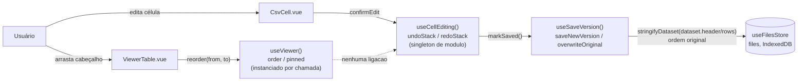
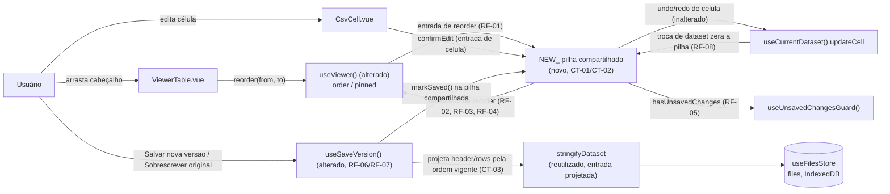

# SPEC: reorder-columns-undo-redo

## Metadata
- Source: developer description via /plan
- Service: csvview (SPA client-side, sem backend)
- Tier: standard
- Version: 1.0
- Architecture references: `AGENTS.md`, `docs/agents/architecture.md`, `docs/agents/domain_rules.md`

## Context
Duas features Tier 1 já implementadas hoje vivem em composables desacoplados: `cell-editing`
mantém uma pilha `undoStack`/`redoStack` de `CellEditEntry { rowIndex, columnIndex,
previousValue, nextValue }` em `app/composables/useCellEditing.ts:43-58`, como estado **singleton
em escopo de módulo**, resetada via `watch` na identidade do `dataset` (`useCellEditing.ts:69-79`)
e usada tanto pelo indicador `hasUnsavedChanges` (`useCellEditing.ts:214`) quanto pelo guard de
navegação (`app/composables/useUnsavedChangesGuard.ts:23,37`) e pelo salvamento
(`useSaveVersion.ts`). Já `table-interactions` mantém `order`/`pinned` (estado de reordenação de
colunas por arraste, `reorderColumn(from, to)`) como refs **criadas a cada chamada** de
`useViewer(source)` (`app/composables/useViewer.ts:72,96-109`) — sem singleton de módulo — e
totalmente alheias à pilha de undo/redo e ao fluxo de salvamento: `useSaveVersion.serializeCurrent`
(`app/composables/useSaveVersion.ts:42-45`) chama `stringifyDataset(dataset.value, ...)` direto
sobre `dataset.header`/`dataset.rows` (verified — nenhuma leitura de `order`/`pinned` no arquivo),
ignorando qualquer reordenação de view.

Esta feature é a integração cross-cutting entre as duas: fazer `reorderColumn` (arrastar
cabeçalho, `useViewer.ts:432-472`, emitido uma única vez por gesto de arraste via `drop`,
`app/components/ViewerTable.vue:280`) produzir uma entrada na MESMA pilha cronológica de undo/redo
usada por edições de célula, e fazer `saveNewVersion`/`overwriteOriginal` persistirem o dataset
projetado pela ordem de colunas vigente, não pela ordem original do cabeçalho.

Regra de camadas aplicável (`docs/agents/architecture.md`, tabela "Layer responsibilities", linha
48): `app/composables/` é quem possui "estado reativo + orquestração" — inclusive "cell edit +
undo/redo (`useCellEditing`)" e "edited-dataset persistence (`useSaveVersion`)" — e explicitamente
NÃO possui "rendering/markup" nem regras de negócio delegadas a componentes; qualquer nova função
pura de projeção de colunas (ex.: derivar a ordem completa a partir de `order`/`pinned`) deve
seguir a mesma convenção de `app/services/` já registrada em `AGENTS.md` (seção 2, linha 37):
"Pure domain logic isolated in `app/services/` — framework-free, unit-testable". `domain_rules.md`
já documenta as duas regras de domínio que esta feature estende, sem alterar seus contratos
internos: "Inline cell editing: ... per-dataset undo/redo stack, reset on dataset switch"
(`domain_rules.md:16,148-164`), "Edited-dataset persistence: ... both re-serializing the in-memory
dataset" (`domain_rules.md:17,166-179`) e "Column layout rules: pin-group clamped reordering, ...
(`app/composables/useViewer.ts`)" (`domain_rules.md:13`).

Ponto de decisão de arquitetura que esta SPEC formaliza sem prescrever a implementação (CT-02): a
pilha de `useCellEditing` é singleton de módulo, mas o `order`/`pinned` relevante é instanciado por
chamada de `useViewer()` — a solução PRECISA de um ponto de integração explícito conectando a
instância de `useViewer()` renderizada em `app/pages/viewer.vue` à MESMA pilha compartilhada
consumida por `useCellEditing().undo/redo/canUndo/canRedo`.

## AS IS — Estado atual

Legenda: hoje `reorderColumn` e `useCellEditing` são completamente desacoplados — uma reordenação
nunca vira entrada de undo/redo, nunca marca `hasUnsavedChanges`, nunca aciona o guard de
navegação e é silenciosamente ignorada por `saveNewVersion`/`overwriteOriginal`, que sempre
serializam a ordem original de `dataset.header`.

## TO BE — Estado proposto

Legenda: `NEW_History` (novo, CT-01/CT-02) é a pilha cronológica compartilhada que passa a receber
tanto entradas de edição de célula (formato inalterado) quanto entradas de reordenação de coluna
geradas por `useViewer()` (alterado, RF-01); `useSaveVersion` (alterado, RF-06/RF-07) projeta
`header`/`rows` pela ordem de colunas vigente antes de chamar `stringifyDataset` (CT-03) e marca a
posição salva na pilha compartilhada; a troca de dataset em `useCurrentDataset` continua zerando a
pilha inteira, agora incluindo reordenações pendentes (RF-08).

## Scope
- **In**: registrar uma entrada de histórico por gesto completo de `reorderColumn` (arrastar
  cabeçalho, incluindo reordenação dentro do grupo de colunas fixadas); intercalar cronologicamente
  essa entrada com entradas de edição de célula na mesma pilha; undo/redo de uma entrada de
  reorder restaurando exatamente o estado de ordem/pin anterior/posterior a essa reordenação;
  `hasUnsavedChanges`/guard de navegação reagindo a reordenações pendentes; `saveNewVersion`/
  `overwriteOriginal` persistindo o dataset com as colunas na ordem vigente (reordenada); reset da
  pilha compartilhada (incluindo reordenações pendentes) ao trocar de dataset.
- **Out**: fixar/desfixar uma coluna via `togglePin`/ícone de pin/menu "Colunas" como ação
  independente no histórico (só a mudança de ORDEM dentro do grupo fixado, produzida pelo próprio
  arraste de `reorderColumn`, entra na pilha); redimensionar largura (`resizeColumn`), mostrar/
  ocultar coluna (`toggleColumn`) e ordenação (`sortColumn`/`sortColumnAdditive`) como ações
  undoáveis; persistência durável de `order`/`pinned`/da própria pilha de undo/redo entre reloads
  (permanece em memória, mesma regra de RF-10 de `cell-editing` — fora de escopo é da feature
  `sessions`); filtragem de colunas ocultas na projeção de salvamento (comportamento inalterado:
  `saveNewVersion`/`overwriteOriginal` já não filtram por `hidden` hoje — verified, nenhuma leitura
  de `hidden` em `useSaveVersion.ts` — e esta feature não introduz esse filtro, apenas corrige a
  ORDEM das colunas, mantendo todas presentes).

## RIGID (Non-Negotiable)

### Functional Requirements

- RF-01 [Event-Driven]: WHEN o usuário conclui um gesto de arraste que reordena uma coluna
  (`reorderColumn(from, to)`, `app/composables/useViewer.ts:432-472`, disparado uma única vez por
  gesto via o evento `drop`, `app/components/ViewerTable.vue:280`) e a ordem resultante difere da
  ordem anterior ao arraste, o sistema SHALL registrar exatamente 1 entrada na MESMA pilha
  cronológica de undo/redo usada pelas edições de célula (`undoStack`/`redoStack`,
  `app/composables/useCellEditing.ts:52-53`), na posição correspondente ao momento em que o gesto
  foi concluído.
  - AC: realizar um arraste de reordenação seguido de uma ou mais edições de célula confirmadas e,
    em seguida, acionar undo repetidamente desfaz a ação mais recente primeiro, respeitando a
    ordem cronológica real das ações — independentemente de ser uma edição de célula ou uma
    reordenação, nunca agrupadas por tipo.
  - AC: arrastar a última coluna diretamente para a 2ª posição (exemplo confirmado) produz
    exatamente 1 entrada de histórico para essa reordenação — nunca múltiplas entradas
    intermediárias por posição de ponteiro durante o arraste.

- RF-02 [Event-Driven]: WHEN o usuário aciona desfazer (undo) e a entrada desfazível mais recente
  da pilha compartilhada é uma entrada de reordenação de coluna, o sistema SHALL restaurar a ordem
  de exibição e o agrupamento de colunas fixadas EXATAMENTE ao estado que existia imediatamente
  antes daquela reordenação, e empilhar essa entrada na pilha de redo.
  - AC: após uma reordenação (ex.: mover a última coluna para a 2ª posição), acionar undo uma vez
    devolve toda coluna à posição exata que ocupava antes dessa reordenação — nenhuma outra coluna
    muda de posição como efeito colateral.

- RF-03 [Event-Driven]: WHEN o usuário aciona refazer (redo) logo após desfazer uma entrada de
  reordenação (sem nenhuma edição de célula ou reordenação confirmada entre os dois), o sistema
  SHALL reaplicar exatamente a ordem/agrupamento de colunas fixadas que existia imediatamente após
  aquela reordenação original.
  - AC: desfazer e, em seguida, refazer uma reordenação restaura a ordem de colunas exatamente
    como estava logo após o arraste original, coluna a coluna.

- RF-04 [Unwanted Behavior]: IF uma nova edição de célula ou uma nova reordenação de coluna é
  confirmada após um ou mais undos (com entradas de redo pendentes, de qualquer tipo) THEN o
  sistema SHALL descartar todas as entradas de redo pendentes da pilha compartilhada a partir
  daquele ponto, consistente com a regra já existente para edição de célula (RF-08 de
  `cell-editing`, `app/composables/useCellEditing.ts:156`).
  - AC: undo → arrastar uma coluna para uma nova posição → acionar redo não reaplica a ação
    desfeita anteriormente (edição de célula ou reordenação); a pilha de redo fica vazia
    imediatamente após essa nova reordenação.

- RF-05 [State-Driven]: WHILE existir ao menos uma entrada de reordenação confirmada e ainda não
  coberta pela última posição salva (mesma semântica de `savedPosition`/`hasUnsavedChanges`,
  `app/composables/useCellEditing.ts:58,214`) na pilha compartilhada, o sistema SHALL reportar
  `hasUnsavedChanges` (e, por extensão, o guard de alterações não salvas,
  `app/composables/useUnsavedChangesGuard.ts:23,37`) como verdadeiro.
  - AC: realizar uma única reordenação sem nenhum salvamento subsequente mantém
    `hasUnsavedChanges` verdadeiro; tentar navegar para fora do Viewer (logo, "Voltar", "Comparar")
    aciona o guard/modal de alterações não salvas exatamente como uma edição de célula não salva
    aciona hoje.

- RF-06 [Event-Driven]: WHEN o usuário aciona "Salvar nova versão" (`saveNewVersion`,
  `app/composables/useSaveVersion.ts`) ou "Sobrescrever original" (`overwriteOriginal`), o sistema
  SHALL serializar e persistir o cabeçalho e TODAS as linhas do dataset projetados pela ordem de
  colunas VIGENTE (refletindo qualquer reordenação confirmada, fixada ou não) — nunca pela ordem
  original do cabeçalho do arquivo — usando o mesmo delimitador já utilizado hoje
  (`stringifyDataset`, `app/services/csvParser.ts:212-221`).
  - AC: reordenar uma coluna e então salvar (qualquer uma das duas ações) faz com que reabrir o
    registro salvo exiba o cabeçalho e as células de cada linha na posição reordenada — a mesma
    ordem exibida no Viewer no momento do salvamento — nunca a ordem original do arquivo.

- RF-07 [Event-Driven]: WHEN "Salvar nova versão"/"Sobrescrever original" é concluído com sucesso,
  o sistema SHALL marcar a posição atual da pilha compartilhada (edições de célula + reordenações)
  como salva (estendendo `markSaved()`, `app/composables/useCellEditing.ts:194-196`), de modo que
  `hasUnsavedChanges` volte a `false` imediatamente após, tanto para futuras edições de célula
  quanto para futuras reordenações medidas a partir desse ponto.
  - AC: reordenar uma coluna → salvar → `hasUnsavedChanges` é falso; desfazer a reordenação já
    salva em seguida faz `hasUnsavedChanges` voltar a verdadeiro (a posição diverge da posição
    salva), no mesmo padrão já validado para edição de célula (`cell-editing` RNF vinculado a
    `savedPosition`).

- RF-08 [Unwanted Behavior]: IF o usuário troca de dataset (abre um novo arquivo ou reabre um
  arquivo recente diferente — mesmo gatilho de RF-10 de `cell-editing`,
  `app/composables/useCellEditing.ts:69-79`, `watch` na identidade de `dataset`) THEN o sistema
  SHALL zerar completamente a pilha compartilhada, incluindo qualquer reordenação pendente — undo
  NÃO PODE reverter uma reordenação realizada num dataset carregado anteriormente.
  - AC: reordenar uma coluna sem salvar, trocar para um arquivo diferente e depois reabrir o
    arquivo original faz com que acionar undo não tenha nenhum efeito (histórico vazio) — a ordem
    de colunas do dataset recém-carregado parte do estado padrão dessa nova sessão, não da
    reordenação feita antes da troca.

### Contracts

Contratos **in-process** (superfície de tipos/dados internos) — não há API HTTP; o app é 100%
client-side (`docs/agents/architecture.md`, seção "External integration points": nenhuma rede).

- CT-01: A pilha compartilhada SHALL conter entradas discrimináveis por tipo — no mínimo `célula`
  (formato inalterado de `CellEditEntry`, `useCellEditing.ts:43-48`) e `reordenação de coluna` —
  cada entrada carregando informação suficiente para restaurar, no undo, o estado EXATO de
  ordem/agrupamento de colunas fixadas (ou o valor da célula) imediatamente anterior à ação, e, no
  redo, o estado EXATO imediatamente posterior — sem depender de reaplicar os `from`/`to`
  originais contra um estado atual possivelmente diferente (`reorderColumn(from, to)` interpreta
  `from`/`to` como posições em `displayColumns` no momento da chamada,
  `app/composables/useViewer.ts:432-434`, que podem deslocar após ocultar/reexibir, fixar ou
  reordenar novamente colunas nesse meio-tempo).
- CT-02: Deve existir exatamente 1 instância de pilha compartilhada por dataset carregado,
  recebendo entradas de célula e de reordenação na ordem cronológica real de confirmação. Como as
  pilhas de `useCellEditing()` são estado singleton de módulo, chaveado pela identidade do dataset
  carregado (`useCellEditing.ts:50-58,69-79`), enquanto o `order`/`pinned` relevante é criado a
  cada chamada de `useViewer(source)` (`useViewer.ts:72,96-109`, sem singleton de módulo), a
  solução DEVE estabelecer um ponto de integração explícito conectando a instância de `useViewer()`
  renderizada em `app/pages/viewer.vue` à MESMA pilha consumida por
  `useCellEditing().undo/redo/canUndo/canRedo` — o mecanismo exato (promover `order`/`pinned` a
  estado de módulo, injetar os refs existentes — já retornados mutáveis, não `readonly()`,
  `useViewer.ts:527-528` — no composable de histórico, ou registrar a entrada no ponto de chamada
  em `viewer.vue`) é decisão de implementação (FLEXIBLE), não congelada por este contrato.
- CT-03: `saveNewVersion`/`overwriteOriginal` (`serializeCurrent`,
  `app/composables/useSaveVersion.ts:42-45`) SHALL projetar o cabeçalho e cada linha pela ordem
  COMPLETA de colunas (grupo fixado primeiro, na sequência de fixação, seguido do grupo não fixado
  na sequência de `order` — `app/composables/useViewer.ts:96-109`) antes de chamar
  `stringifyDataset`, cobrindo cada coluna original exatamente uma vez. A projeção NÃO PODE usar
  `displayColumns` (`useViewer.ts:409-422`) como base, pois esse computed filtra colunas ocultas —
  usá-lo descartaria silenciosamente colunas ocultas do arquivo salvo, o que está fora de escopo
  desta feature (ver Scope/Out).
- CT-04: A entrada de reordenação é criada exatamente uma vez por gesto de arraste-e-soltura
  concluído — o mesmo ponto único de emissão já implementado (`reorder(from, to)` no evento `drop`,
  `app/components/ViewerTable.vue:280`) — nunca uma vez por posição intermediária do ponteiro
  durante o arraste.

### Non-Functional Requirements

- RNF-01: Undo/redo de uma entrada de reordenação DEVE ser síncrono ao acionamento (sem
  debounce nem espera perceptível, consistente com RNF-01 de `cell-editing`) e NÃO DEVE reparsear
  o arquivo nem copiar o array completo de linhas — custo O(colunas), não O(linhas), preservando a
  garantia de complexidade já existente de `reorderColumn` (RNF-03 de `table-interactions`,
  `app/composables/useViewer.ts:432`).
- RNF-02: Persistir com a projeção de ordem de colunas (RF-06) NÃO DEVE introduzir atraso
  perceptível adicional em relação ao salvamento sem reordenação, para o mesmo porte-alvo de
  dataset (~50 MB / ~1.000.000 linhas, `.spec/init/project-phases.md`) — a projeção é uma única
  passagem O(linhas × colunas) equivalente à travessia já existente de `stringifyDataset`, sem
  cópia adicional do dataset completo além da já realizada pela serialização vigente.

## FLEXIBLE (Implementation Suggestions)
- Tipo de entrada sugerido, estendendo `CellEditEntry` com um discriminador:
  `type HistoryEntry = ({ kind: 'cell' } & CellEditEntry) | { kind: 'reorder'; previousOrder:
  number[]; previousPinned: number[]; nextOrder: number[]; nextPinned: number[] }` — captura
  snapshot completo de `order`/`pinned` antes/depois, evitando a fragilidade de reaplicar
  `from`/`to` (CT-01).
- Ponto de integração sugerido (CT-02): promover `order`/`pinned` a estado singleton de módulo
  dentro de `useViewer.ts` (mesmo padrão já usado por `useCellEditing`/`useCurrentDataset`), OU
  expor em `useCellEditing` uma função de registro (`registerColumnOrderState(order, pinned)`)
  chamada uma vez em `viewer.vue` logo após `useViewer(...)`, para que `reorderColumn` capture o
  snapshot anterior, aplique a mutação e empilhe a entrada num único ponto coeso.
- Derivar a "ordem completa" (CT-03) como um novo computed em `useViewer.ts`, ex.
  `fullOrderedIndices` = sequência de `pinned` + sequência de `order` filtrando o que já está em
  `pinned` — superconjunto de `displayColumns` que inclui colunas ocultas — consumido diretamente
  por `useSaveVersion.serializeCurrent`.
- Manter a captura do snapshot "antes" dentro do próprio `reorderColumn` (antes de mutar
  `order`/`pinned`), para que a criação da entrada de histórico fique co-localizada com a mutação
  e não duplicada no ponto de chamada da página.
- Nomes/estruturas acima são sugestões; RIGID não os congela.

## Acceptance Criteria Summary
| ID | Criterion | Testable? |
|----|-----------|-----------|
| RF-01 | Reorder gera 1 entrada, intercalada cronologicamente com edições de célula | Sim |
| RF-02 | Undo de reorder restaura ordem/pin exatos anteriores | Sim |
| RF-03 | Redo de reorder reaplica ordem/pin exatos posteriores | Sim |
| RF-04 | Nova edição/reorder após undo descarta redo pendente (qualquer tipo) | Sim |
| RF-05 | `hasUnsavedChanges`/guard verdadeiro com reorder pendente não salvo | Sim |
| RF-06 | Salvar (nova versão/sobrescrever) persiste colunas na ordem vigente | Sim |
| RF-07 | Salvar com sucesso marca posição salva na pilha compartilhada | Sim |
| RF-08 | Troca de dataset zera a pilha, incluindo reorder pendente | Sim |
| CT-01 | Entradas discrimináveis por tipo, com snapshot completo de estado | Sim |
| CT-02 | 1 pilha compartilhada por dataset; ponto de integração explícito | Sim |
| CT-03 | Save projeta pela ordem completa (fixadas + `order`), não `displayColumns` | Sim |
| CT-04 | 1 entrada por gesto de arraste concluído, nunca por posição intermediária | Sim |
| RNF-01 | Undo/redo de reorder síncrono, O(colunas) | Sim |
| RNF-02 | Save com projeção de ordem sem atraso perceptível adicional | Sim (qualitativo) |
