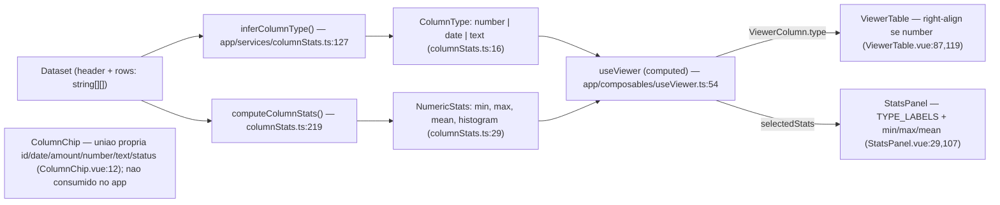
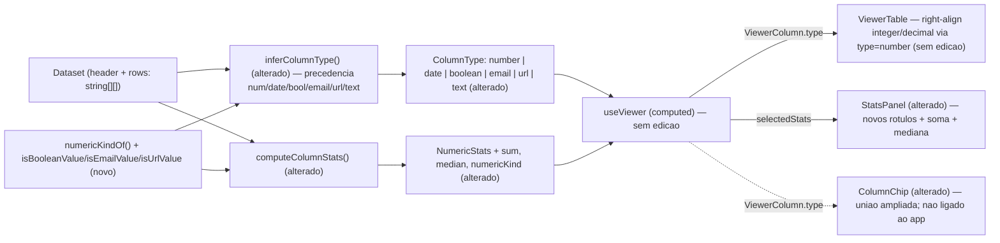

# Implementation Plan

## Request Summary
- Objective: enriquecer o motor de inferência/estatísticas (`app/services/columnStats.ts`) para distinguir inteiro/decimal e reconhecer booleano, e-mail e URL, e acrescentar soma e mediana às métricas numéricas — refletindo em `StatsPanel` e `ColumnChip` sem quebrar consumidores atuais (RF-01..RF-06, UI-01, UI-02, CT-01, CT-02, RNF-01..RNF-03).
- Scope:
  - **In**: tipos/recognizers/precedência no motor; `numericKind` + `sum` + `median` em `NumericStats`; rótulos pt-BR e linhas soma/mediana no `StatsPanel`; ampliação da união do `ColumnChip`; retrocompatibilidade de `useViewer`/`ViewerTable`/suíte atual.
  - **Out**: parsing/normalização de datas e comparadores de ordenação (feature `table-interactions`); realce condicional; links clicáveis para e-mail/URL; filtros por coluna; exportação; qualquer persistência/backend.
- Tier: standard
- Architecture references: `AGENTS.md`, `docs/agents/coding_guidelines.md`, `docs/agents/tech_stack.md` (vinculantes) — `docs/agents/architecture.md` e `docs/agents/domain_rules.md` **stale** (descrevem só `CsvCell`; ver Open Questions). Regra de layering aplicada: `coding_guidelines.md` rule 2 (estado derivado em `computed`) + convenção de-facto (lógica pura em `app/services/`, componentes finos e apresentacionais).

## AS IS — Componentes impactados

Legenda: verificado no código. Hoje `inferColumnType` classifica apenas `number | date | text` e `computeNumericStats` (columnStats.ts:197) produz min/max/mean/histogram; `useViewer` deriva tudo via `computed` e alimenta `ViewerTable` (alinhamento à direita quando `type === 'number'`) e `StatsPanel`. `ColumnChip` tem união própria desacoplada e só é exercido por `test/ColumnChip.spec.ts`.

## TO BE — Componentes propostos

Legenda: `inferColumnType` ganha os reconhecedores novos e a precedência determinística (T02, T03); os helpers puros novos `numericKindOf`/`isBooleanValue`/`isEmailValue`/`isUrlValue` (T02) são compartilhados por inferência e métricas; `NumericStats` recebe `sum`/`median`/`numericKind` em `computeNumericStats` (T04); os contratos de tipo `ColumnType`/`NumericStats` são ampliados (T01). `StatsPanel` exibe rótulos e linhas novas (T05) e `ColumnChip` amplia a união (T06). `useViewer` e `ViewerTable` **não recebem edição** — como `type` permanece `'number'` para colunas numéricas, o alinhamento e as derivações continuam válidos (verificados em T07).

## Tasks

### T01 — Ampliar contratos de tipo `ColumnType` e `NumericStats`
- **Files**: `app/services/columnStats.ts`
- **Change**: expandir `export type ColumnType` (columnStats.ts:16) para `'number' | 'date' | 'boolean' | 'email' | 'url' | 'text'` (preservar `number`/`date`/`text`). Adicionar a `interface NumericStats` (columnStats.ts:29) três campos obrigatórios: `sum: number`, `median: number`, `numericKind: 'integer' | 'decimal'`, com JSDoc; manter nome/tipo/semântica dos campos existentes. Atualizar o JSDoc de cabeçalho do módulo e de `ColumnStats.type`. Nenhuma lógica alterada ainda — apenas os contratos de tipo (CT-01, CT-02). Inteiro/decimal NÃO viram membros de `ColumnType`.
- **Covers**: CT-01, CT-02, RF-06
- **Tests**: `test/columnStats.spec.ts` — asserção de tipo em nível de compilação garantida pela suíte existente permanecer verde (`yarn test`); casos concretos de `sum`/`median`/`numericKind` chegam em T04.
- **Risk**: Medium — amplia união consumida por `useViewer`/`StatsPanel`/`ViewerTable`; um `Record<ColumnType, …>` incompleto quebra compilação (mitigado em T05).
- **Dependencies**: none

### T02 — Helpers puros: reconhecedores e detecção inteiro/decimal
- **Files**: `app/services/columnStats.ts`
- **Change**: adicionar, no padrão de `parseNumber`/`isDateValue` com regex/allowlists constantes no topo do módulo (estilo `NUMBER_RE`/`DATE_ISO_RE`): `isBooleanValue(value)` — token em allowlist **case-insensitive** `{ true, false, sim, não, yes, no }` (`0`/`1` NÃO são booleano); `isEmailValue(value)` — `^[^@\s]+@[^@\s]+\.[^@\s]+$`; `isUrlValue(value)` — apenas esquemas `http://`/`https://`. Adicionar o helper compartilhado `numericKindOf(numbers: readonly number[]): 'integer' | 'decimal'` (decimal se `values.some((n) => !Number.isInteger(n))`; caso contrário integer) — único ponto de decisão inteiro/decimal, reutilizando os números já parseados por `parseNumber`. Todos puros, sem I/O nem locale.
- **Covers**: RF-01 (helper), RF-02, RNF-01
- **Tests**: `test/columnStats.spec.ts` — `isBooleanValue`/`isEmailValue`/`isUrlValue` (positivos e negativos, incluindo `0`/`1` não-booleano, e-mail com espaço rejeitado, `ftp://` rejeitado); `numericKindOf([1,2,-3])==='integer'`, `numericKindOf([1,2.5])==='decimal'`, `["1.0","5.00","2e3"]`→integer via parse.
- **Risk**: Low — funções novas isoladas, sem consumidores externos.
- **Dependencies**: T01

### T03 — Precedência determinística em `inferColumnType`
- **Files**: `app/services/columnStats.ts`
- **Change**: reescrever `inferColumnType` (columnStats.ts:127) para a sequência documentada **por coluna**: número → data → booleano → e-mail → URL → texto (fallback terminal). Ignorar células vazias (`isEmptyCell`); coluna sem célula preenchida → `text`. Manter passagem única O(N) acumulando flags `all*` por tipo e retornando o primeiro tipo cujo conjunto completo de células preenchidas é satisfeito. Documentar a ordem de precedência em JSDoc. Inteiro/decimal permanecem `type === 'number'` (não são retornados aqui).
- **Covers**: RF-02, RF-03, RNF-01, RNF-02
- **Tests**: `test/columnStats.spec.ts` — `["a@b.com","c@d.org"]`→email; `["https://x.io","http://y.io/p"]`→url; tokens booleanos→boolean; `["0","1","1","0"]`→number (não boolean); `["1","2","","3"]`→number; `["",""]`→text; misto→text; determinismo (mesmo input → mesmo tipo em duas execuções).
- **Risk**: Medium — coração da inferência; regressão afeta `columnTypes`/`columnStats` em `useViewer`. Mitigado por RF-06 (T07) e testes de precedência.
- **Dependencies**: T02

### T04 — Métricas numéricas: `sum`, `median`, `numericKind`
- **Files**: `app/services/columnStats.ts`
- **Change**: estender `computeNumericStats` (columnStats.ts:197) para retornar `sum` (soma já acumulada no laço existente), `median` (ordenar uma cópia dos `numbers` já materializados — valor central; média dos dois centrais quando a contagem é par) e `numericKind` (via `numericKindOf` de T02). `min`/`max`/`mean`/`histogram` inalterados para os mesmos inputs. `numeric` continua presente só quando `type === 'number'` (columnStats.ts:249).
- **Covers**: RF-01, RF-04, CT-02, RNF-02
- **Tests**: `test/columnStats.spec.ts` — `[1,2,3,4]`→sum=10, median=2.5; `[5,1,3]`→sum=9, median=3; `numericKind` integer vs decimal; min/max/mean/histogram idênticos aos atuais para os inputs já testados; mediana é a única operação O(N log N) introduzida.
- **Risk**: Low — acréscimo aditivo a struct já consumida via `numeric?`.
- **Dependencies**: T03

### T05 — `StatsPanel`: rótulos pt-BR dos novos tipos + linhas soma/mediana
- **Files**: `app/components/StatsPanel.vue`
- **Change**: tornar `TYPE_LABELS: Record<ColumnType, string>` (StatsPanel.vue:29) exaustivo — manter `number: 'número'`, `date`, `text`; adicionar `boolean: 'booleano'`, `email: 'e-mail'`, `url: 'URL'`. Derivar o rótulo exibido para `type === 'number'` de `numericKind`: `inteiro` quando `numericKind === 'integer'`, `decimal` quando `'decimal'` (novo `computed` sobre `props.stats.numeric?.numericKind`, mantendo `typeLabel` como fallback). Acrescentar ao bloco `stats-panel__rows` (StatsPanel.vue:107-127) duas linhas `data-metric="sum"` (Soma) e `data-metric="median"` (Mediana), reutilizando `formatNumber`/`signClass`. Componente permanece fino/apresentacional (coding_guidelines rule 2) — sem lógica de negócio.
- **Covers**: UI-01
- **Tests**: `test/StatsPanel.spec.ts` — badge `e-mail`/`URL`/`booleano`; coluna numérica inteira mostra `inteiro`, decimal mostra `decimal`; linhas `[data-metric="sum"]` e `[data-metric="median"]` com valores iguais aos do motor.
- **Risk**: Medium — `Record<ColumnType,…>` DEVE cobrir todos os membros novos ou a compilação quebra (RNF-03).
- **Dependencies**: T01, T04

### T06 — `ColumnChip`: ampliar a união de tipo (sem importar o motor)
- **Files**: `app/components/ColumnChip.vue`
- **Change**: ampliar a união local `ColumnType` (ColumnChip.vue:12-18) com `'integer' | 'decimal' | 'boolean' | 'email' | 'url'`, **preservando** `id`, `amount`, `status`, `date`, `number`, `text`. NÃO importar `ColumnType` de `~/services/columnStats` (manter o componente desacoplado do motor). Sem mudança de template/estilo; `type` continua aceitando `ColumnType | string` com default `'text'`.
- **Covers**: UI-02
- **Tests**: `test/ColumnChip.spec.ts` — `<ColumnChip type="integer|decimal|boolean|email|url" />` renderiza o texto do tipo em `.chip__type` sem string vazia; `id`/`amount`/`status` continuam aceitos.
- **Risk**: Low — componente isolado, não consumido pelo app.
- **Dependencies**: none

### T07 — Regressão RF-05/RF-06: alinhamento numérico e suíte verde
- **Files**: `test/ViewerTable.spec.ts`
- **Change**: adicionar caso ao spec do `ViewerTable` cobrindo colunas inteira e decimal — como ambas mantêm `type === 'number'`, o cabeçalho recebe `viewer-table__th--numeric` e a célula recebe `numeric` (paridade com o caso `number` atual em ViewerTable.spec.ts:54-57); colunas `text`/`date`/`boolean`/`email`/`url` NÃO recebem alinhamento à direita. **Nenhuma edição em `ViewerTable.vue`/`useViewer.ts`** (verificar que o gating `type === 'number'` permanece intacto). Rodar `yarn test` e confirmar suíte integral verde (RF-06/RNF-03).
- **Covers**: RF-05, RF-06, RNF-03
- **Tests**: `test/ViewerTable.spec.ts` — coluna integer e decimal alinhadas à direita; demais tipos não; `yarn test` verde end-to-end.
- **Risk**: Low — verificação; não altera código de aplicação.
- **Dependencies**: T04

## Execution Phases
| Phase | Tasks | Parallel-safe? |
|-------|-------|----------------|
| Phase 1: Motor de inferência e métricas (`columnStats.ts`) | T01, T02, T03, T04 | Não — mesmo arquivo, sequenciais |
| Phase 2: Reflexo em componentes e regressão | T05, T06, T07 | Sim — arquivos distintos (`StatsPanel.vue`, `ColumnChip.vue`, `ViewerTable.spec.ts`) |

## Contracts emitted
Nenhum artefato de contrato serializado emitido. CT-01/CT-02 são **contratos de tipo TypeScript in-process** exportados por `app/services/columnStats.ts`; não há superfície REST/gRPC/async (`docs/agents/tech_stack.md` → "External integrations: None"), logo OpenAPI/proto/AsyncAPI não se aplicam. O contrato é expresso diretamente no código-fonte pela tarefa T01 (ampliação de `ColumnType` e `NumericStats`), validado por `yarn test` (RNF-03). Compatibilidade: **aditiva e retrocompatível** — `number`/`date`/`text` e os campos existentes de `NumericStats` preservados; nenhum símbolo exportado removido.

## Risks
| Risk | Blast radius | Mitigation | Rollback |
|------|-------------|------------|----------|
| Conflito de merge com feature `table-interactions` (também edita `columnStats.ts`: `parseDate` + comparadores) | `app/services/columnStats.ts` e todos os consumidores | Sequenciar merges/rebasear; nenhuma feature remove símbolos exportados usados pela outra; ambas adicionam apenas | `git revert` do commit de `columnStats.ts`; símbolos preservados garantem revert limpo |
| `Record<ColumnType, string>` incompleto no `StatsPanel` após ampliar `ColumnType` | Compilação do `StatsPanel.vue` / build | T05 torna `TYPE_LABELS` exaustivo; `yarn test` (T07) falha se faltar chave | Reverter T05; T01 sozinho não quebra runtime |
| `vue-tsc` (TS7) não confiável para validar tipos | Percepção de erro de tipo falso/omisso | Validar via `yarn test` (MEMORY: TS7 quebrado; RNF-03 AC) | n/a |
| Regressão silenciosa na inferência (precedência) muda tipos de colunas existentes | `columnTypes`/`columnStats` em `useViewer` → tabela e painel | Testes de precedência/determinismo (T03) + suíte RF-06 verde (T07) | Reverter T03 |

## Open Questions
- `docs/agents/architecture.md` e `docs/agents/domain_rules.md` estão **desatualizados** (descrevem apenas `CsvCell`) — este plano NÃO foi validado contra eles; a orientação de layering vinculante veio de `docs/agents/coding_guidelines.md` (rule 2) + convenção de-facto (lógica pura em `app/services/`, componentes finos). Impacto: se houver regra arquitetural não documentada sobre onde reside a inferência de tipo, ela não foi considerada. Recomenda-se atualizar os docs stale após esta feature. (Sem bloqueio: decisões-chave já resolvidas na SPEC v1.1.)

## Assumptions
- O diagrama TO BE da SPEC anota `ViewerTable` como "(alterado)", mas as decisões resolvidas (#2, RF-01/RF-05) mantêm `type === 'number'` para colunas numéricas → `ViewerTable.vue` e `useViewer.ts` **não exigem edição de código**; T07 apenas verifica a não-regressão. [Confirmado pelo router e por RF-05 AC.]
- `ColumnChip` permanece **não consumido pelo app**; a exigência UI-02 é apenas que a união suporte os novos tipos (sem wiring ao Viewer). [Verificado: só `test/ColumnChip.spec.ts` o exercita — ColumnChip.vue:20.]
- O "único helper compartilhado entre inferência e métricas" (RF-01) é realizado por `parseNumber` (parse) reutilizado + `numericKindOf` (T02) como ponto único de decisão inteiro/decimal via `Number.isInteger`. [Inferência não distingue integer/decimal; a distinção vive só em `numericKind`, coerente com CT-02.]
- Validação de compilação é feita por `yarn test`, não por `vue-tsc`. [MEMORY: TS7 quebrado; RNF-03 AC.]
