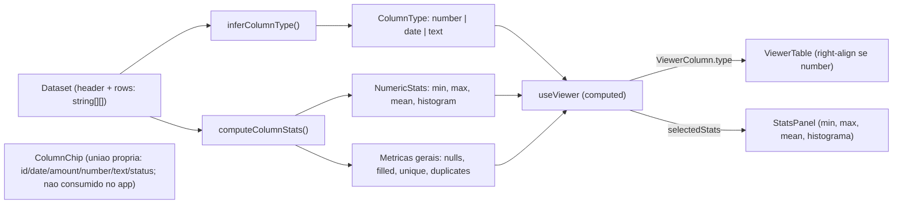
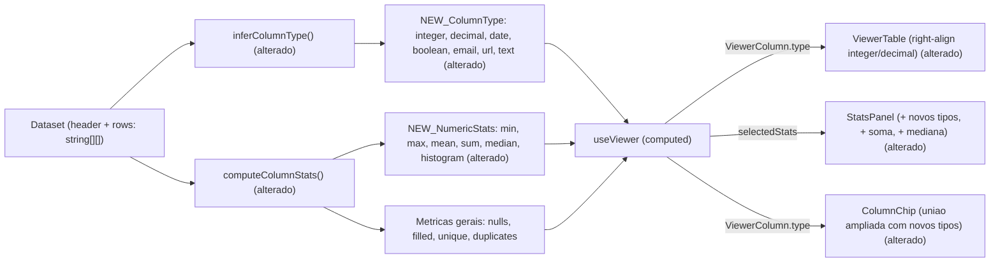

# SPEC: rich-types-and-stats

## Metadata
- Source: developer description via /plan
- Service: csvview (100% client-side, Nuxt 4 SSG — no backend, no HTTP API)
- Tier: standard
- Version: 1.1
- Architecture references: `AGENTS.md`, `docs/agents/coding_guidelines.md`, `docs/agents/tech_stack.md`, `docs/agents/architecture.md` (stale), `docs/agents/domain_rules.md` (stale)

## Context

O motor de inferência de tipo e estatísticas por coluna vive em `app/services/columnStats.ts` (lógica pura, sem UI). Hoje ele infere `ColumnType = 'number' | 'date' | 'text'` (`columnStats.ts:16`) e, para colunas numéricas, calcula `NumericStats { min, max, mean, histogram }` (`columnStats.ts:29-38`) além das métricas gerais nulos/únicos/duplicados/preenchido.

O produto (`.spec/init/project-description.md`, seções "Identificação Inteligente de Tipos" e "Estatísticas Automáticas") posiciona a "leitura rica" da tabela como valor central. Esta feature enriquece o motor: distinguir inteiro de decimal, reconhecer booleano, e-mail e URL, e acrescentar soma e mediana às métricas numéricas — refletindo tudo no `StatsPanel` e no `ColumnChip`, sem quebrar consumidores atuais.

Consumidores do motor mapeados no código:
- `app/composables/useViewer.ts` — deriva `columnTypes` e `columnStats` via `computed` sobre o dataset completo (`useViewer.ts:54-68`); expõe `ViewerColumn.type` (`useViewer.ts:27-36`).
- `app/components/StatsPanel.vue` — apresenta tipo + métricas; possui `TYPE_LABELS: Record<ColumnType, string>` (`StatsPanel.vue:29-33`) e o bloco numérico min/máx/média (`StatsPanel.vue:107-127`).
- `app/components/ViewerTable.vue` — alinha à direita quando `column.type === 'number'` (`ViewerTable.vue:88`, `ViewerTable.vue:119`), propagando `numeric` ao `CsvCell` (`CsvCell.vue:10`).
- `app/components/ColumnChip.vue` — componente do design system com **união de tipo própria e independente** `'id' | 'date' | 'amount' | 'number' | 'text' | 'status'` (`ColumnChip.vue:12-18`); atualmente **não é consumido por nenhum componente de app** (só por `test/ColumnChip.spec.ts`).

Convenção arquitetural aplicável (de `docs/agents/coding_guidelines.md`): rule 2 — estado derivado vive em `computed` refs, não no template; e a convenção de-facto observada no código — lógica pura em `app/services/`, componentes finos e apresentacionais. `architecture.md` e `domain_rules.md` estão desatualizados (descrevem apenas `CsvCell`); a orientação vinculante para esta feature vem de `coding_guidelines.md` + convenção observada.

Coordenação de arquivo compartilhado (risco): a feature `table-interactions` (`.spec/features/table-interactions/SPEC.md`) também edita `app/services/columnStats.ts` (adiciona `parseDate` + comparadores de ordenação). As duas features tocam o mesmo arquivo — ver nota de dependência no FLEXIBLE.

## AS IS — Estado atual

Legenda: hoje o motor infere apenas `number | date | text` e calcula min/máx/média + histograma; `useViewer` deriva tudo por `computed` e alimenta `ViewerTable` (alinhamento à direita quando o tipo é `number`) e `StatsPanel`. O `ColumnChip` existe no design system com união de tipo própria e ainda não está ligado ao Viewer.

## TO BE — Estado proposto

Legenda: `inferColumnType` passa a distinguir inteiro/decimal e a reconhecer booleano, e-mail e URL (RF-01, RF-02, RF-03, CT-01); `computeColumnStats` acrescenta soma e mediana às métricas numéricas (RF-04, CT-02). `StatsPanel` exibe os novos tipos e métricas (UI-01) e `ColumnChip` amplia sua união para refletir o novo tipo (UI-02); `ViewerTable` mantém o alinhamento à direita agora para inteiro/decimal (RF-05).

## Scope
- **In**: enriquecimento do motor `app/services/columnStats.ts` (inferência inteiro/decimal, booleano, e-mail, URL; ordem de precedência determinística documentada; métricas soma e mediana); reflexo no `StatsPanel` (novos tipos e métricas) e no `ColumnChip` (nova união de tipo); manutenção do alinhamento numérico à direita no `ViewerTable`; retrocompatibilidade dos consumidores atuais (`useViewer`, testes existentes).
- **Out**: parsing/normalização de datas e comparadores de ordenação (pertencem à feature `table-interactions`); realce condicional de células; filtros por coluna; exportação; qualquer persistência ou backend; formatação regional/locale de números além do já existente em `StatsPanel`.

## RIGID (Non-Negotiable)

### Functional Requirements

- RF-01 [Conditional] — Quando todas as células preenchidas de uma coluna são números, o motor DEVE distinguir inteiro de decimal **pelo valor numérico** (`Number.isInteger(n)`): se todos os valores são inteiros, a coluna é inteiro; se ao menos um valor não é inteiro, a coluna é decimal. A distinção é derivada de um único helper compartilhado entre inferência e métricas.
  - AC: `["1","2","-3"]` → inteiro; `["1","2.5","3"]` → decimal; `["1.0","5.00","2e3"]` → inteiro (todos são inteiros por valor). Ambas continuam produzindo `NumericStats`.
  - Representação: o `type` exportado permanece `'number'` (não muda); a distinção inteiro/decimal é exposta no subcampo `numericKind: 'integer' | 'decimal'` de `NumericStats` (ver CT-02). Assim `type === 'number'` em `ViewerTable`/`computeColumnStats` fica intacto (RF-05/RF-06).

- RF-02 [Event-Driven] — Ao inferir o tipo de uma coluna, o motor DEVE reconhecer, além de número/inteiro/decimal, data e texto, três novos tipos: booleano, e-mail e URL. Uma coluna cujas células preenchidas são todas do mesmo tipo reconhecível é classificada nesse tipo.
  - AC: Uma coluna só com `["a@b.com","c@d.org"]` → e-mail; só com `["https://x.io","http://y.io/p"]` → URL; só com tokens booleanos → booleano. Casos mistos caem em texto.
  - E-mail: reconhecedor conservador `^[^@\s]+@[^@\s]+\.[^@\s]+$` (sem espaços). URL: apenas esquemas `http://`/`https://`.
  - Booleano: conjunto de tokens **case-insensitive** = `{ true, false, sim, não, yes, no }`. `0`/`1` NÃO são booleano — permanecem inteiro (booleano vem depois de número na precedência, ver RF-03).

- RF-03 [State-Driven] — Enquanto houver células vazias em uma coluna, elas NÃO invalidam o tipo dominante: a inferência considera apenas células não vazias (regra `isEmptyCell`, `columnStats.ts:63`), e uma coluna sem nenhuma célula preenchida permanece texto. A ordem de precedência da inferência DEVE ser determinística e documentada, avaliada **por coluna** (não por célula) na sequência: número (inteiro/decimal) → data → booleano → e-mail → URL → texto (texto é o fallback terminal). A precedência resolve empates quando **todas** as células preenchidas satisfazem mais de um tipo; a coluna assume o primeiro tipo da sequência cujo conjunto completo de células é satisfeito.
  - AC: `["1","2","","3"]` → inteiro (vazia ignorada); `["", ""]` → texto; uma coluna só de `["0","1","1","0"]` → inteiro (não booleano, pois número precede booleano); quando todas as células satisfazem mais de um tipo, a coluna assume sempre o primeiro na sequência de precedência acima, e o mesmo input produz sempre o mesmo tipo (determinístico).

- RF-04 [Event-Driven] — Ao calcular as métricas de uma coluna numérica, o motor DEVE incluir soma e mediana, além de mínimo, máximo e média já existentes. A mediana é o valor central dos valores não vazios ordenados (média dos dois centrais quando a contagem é par).
  - AC: Para `[1,2,3,4]`, soma = 10 e mediana = 2.5; para `[5,1,3]`, soma = 9 e mediana = 3. `min`, `max`, `mean` e `histogram` permanecem com os valores atuais para os mesmos inputs.

- RF-05 [Unwanted] — O alinhamento numérico à direita no `ViewerTable` NÃO DEVE regredir: colunas inteiras e decimais DEVEM continuar sendo renderizadas alinhadas à direita em fonte monoespaçada (propriedade `numeric` do `CsvCell`), exatamente como as colunas `number` são hoje.
  - AC: Após a mudança, uma coluna inteira e uma coluna decimal aplicam `viewer-table__th--numeric` no cabeçalho e `numeric` em `CsvCell` (ambas mantêm `type === 'number'`, ver RF-01/CT-02); colunas texto/data/booleano/e-mail/URL não recebem alinhamento à direita. E-mail e URL renderizam como texto puro — sem alinhamento, sem realce e sem link clicável (fora de escopo, adiado para feature futura).

- RF-06 [Unwanted] — Consumidores atuais do motor NÃO DEVEM quebrar: `useViewer`, `StatsPanel`, `ViewerTable` e a suíte `test/columnStats.spec.ts` (+ demais specs existentes) DEVEM continuar compilando e passando sem alteração de comportamento para inputs que hoje resultam em `number`/`date`/`text`.
  - AC: `yarn test` passa integralmente após a mudança; nenhum teste existente é removido ou afrouxado para acomodar a feature.

### UI Requirements

- UI-01 [Event-Driven] — Ao selecionar uma coluna, o `StatsPanel` DEVE exibir o tipo inferido para os novos tipos (booleano, e-mail, URL e inteiro/decimal) com rótulo em pt-BR e, para colunas numéricas, DEVE apresentar soma e mediana junto de mínimo/máximo/média.
  - Rótulos pt-BR: `booleano`, `e-mail`, `URL`. Para o tipo base `number`, o rótulo exibido deriva de `numericKind`: `inteiro` quando `numericKind === 'integer'`, `decimal` quando `numericKind === 'decimal'`. `TYPE_LABELS` permanece `Record<ColumnType, string>` exaustivo (chave `number` mantida, ex.: rótulo base `número`), e a distinção inteiro/decimal é resolvida a partir de `numericKind` no `StatsPanel`.
  - AC: Selecionar uma coluna e-mail mostra o rótulo `e-mail` no badge (`StatsPanel.vue:79`); selecionar uma coluna numérica inteira mostra `inteiro` e uma decimal mostra `decimal`; a coluna numérica mostra linhas "Soma" e "Mediana" além de Mínimo/Máximo/Média, com os valores iguais aos calculados pelo motor.

- UI-02 [Event-Driven] — Ao exibir uma coluna com um dos novos tipos, o `ColumnChip` DEVE refletir esse tipo. A união de tipo do `ColumnChip` (`ColumnChip.vue:12-18`) DEVE ganhar os membros do motor `integer`, `decimal`, `boolean`, `email` e `url`, **preservando** os membros de design system existentes `id`, `amount` e `status` (além de `date`, `number`, `text`). A união NÃO deve importar `ColumnType` do serviço (mantém o componente desacoplado do motor).
  - AC: `<ColumnChip type="<novo tipo>" />` (para `integer`/`decimal`/`boolean`/`email`/`url`) renderiza o texto do tipo em `chip__type` sem erro de tipo (vue-tsc) e sem exibir string vazia; os membros `id`/`amount`/`status` continuam aceitos. (Ligação do `ColumnChip` ao Viewer está fora de escopo; a exigência é que a união o suporte.)

### Contracts

Contratos in-process (superfície de tipos TypeScript exportada por `app/services/columnStats.ts`) — não há API HTTP; o app é 100% client-side (`docs/agents/tech_stack.md`, "External integrations: None").

- CT-01: `ColumnType` (hoje `'number' | 'date' | 'text'`, verified at `app/services/columnStats.ts:16`) DEVE ser ampliado para `'number' | 'date' | 'boolean' | 'email' | 'url' | 'text'` — acrescentando `boolean`, `email` e `url` e **preservando** `number`, `date` e `text`. Inteiro/decimal NÃO são membros de `ColumnType`; a distinção vive em `numericKind` (ver CT-02), logo `type === 'number'` permanece válido para colunas numéricas.
- CT-02: `NumericStats` (hoje `{ min, max, mean, histogram }`, verified at `app/services/columnStats.ts:29-38`) DEVE ganhar três campos obrigatórios: `sum: number`, `median: number` e `numericKind: 'integer' | 'decimal'`. Os campos existentes mantêm nome, tipo e semântica. `numericKind` só existe onde `NumericStats` existe (colunas `type === 'number'`).

### Non-Functional Requirements

- RNF-01: A inferência e o cálculo DEVEM permanecer puros e determinísticos (mesmo input → mesma saída), sem I/O, rede ou dependência de locale para a inferência de tipo — coerente com `columnStats.ts:10` e US-3.1. AC: dois cálculos consecutivos sobre o mesmo dataset produzem `ColumnStats` estruturalmente iguais.
- RNF-02: Para uma coluna de N linhas, a inferência de tipo DEVE permanecer em uma única passagem O(N) sobre as células (como hoje, `columnStats.ts:127-144`); as métricas numéricas adicionais DEVEM acrescentar no máximo uma passagem O(N) (soma) e uma ordenação O(N log N) (mediana). AC: nenhuma operação da inferência de tipo é O(N²); a mediana é a única operação com custo super-linear introduzida.
- RNF-03: A mudança DEVE ser retrocompatível em compilação: `vue-tsc`/`yarn test` não acusam erro de tipo nos consumidores atuais após a ampliação de `ColumnType` e `NumericStats`. AC: `yarn test` verde (o projeto valida via `yarn test`, não `vue-tsc` — ver MEMORY: TS7 quebrado).

## FLEXIBLE (Implementation Suggestions)

- Representação de inteiro/decimal: **decidido** — manter `type: 'number'` e adicionar `numericKind: 'integer' | 'decimal'` em `NumericStats` (preserva `column.type === 'number'` no `ViewerTable`/`computeColumnStats` sem mudança). Ver RF-01/CT-02.
- Reconhecedores por tipo como funções puras (`isBooleanValue`, `isEmailValue`, `isUrlValue`) no padrão dos já existentes `parseNumber`/`isDateValue`, com regex/allowlists constantes no topo do módulo (estilo `NUMBER_RE`, `DATE_ISO_RE`).
- Inteiro vs decimal: **decidido** — derivar de `Number.isInteger(n)` (valor numérico, não texto: `"1.0"`/`"2e3"` → inteiro); centralizar num único helper compartilhado entre inferência e métricas.
- Mediana: ordenar uma cópia dos numéricos já coletados em `computeNumericStats` (`columnStats.ts:197`) — os valores já são materializados em `numbers` (`columnStats.ts:224-235`).
- `StatsPanel`: acrescentar `TYPE_LABELS` para os novos tipos e duas linhas (`data-metric="sum"`, `data-metric="median"`) no bloco `stats-panel__rows`, reaproveitando `formatNumber`/`signClass`.
- Componentes finos e apresentacionais; toda a lógica nova em `app/services/columnStats.ts` (convenção de-facto + `coding_guidelines.md` rule 2). Novos casos cobertos em `test/columnStats.spec.ts`, `test/StatsPanel.spec.ts` e `test/ColumnChip.spec.ts`.
- **Dependência de arquivo compartilhado**: coordenar com a feature `table-interactions`, que também edita `app/services/columnStats.ts` (adiciona `parseDate` + comparadores). Sequenciar os merges ou rebasear para evitar conflito; nenhuma das duas deve remover símbolos exportados usados pela outra.

## Acceptance Criteria Summary
| ID | Criterion | Testable? |
|----|-----------|-----------|
| RF-01 | Inteiro vs decimal distinguidos por presença de casa decimal | Sim (unit) |
| RF-02 | Booleano, e-mail e URL reconhecidos; misto → texto | Sim (unit) |
| RF-03 | Vazias ignoradas; precedência determinística documentada | Sim (unit) |
| RF-04 | Soma e mediana adicionadas às métricas numéricas | Sim (unit) |
| RF-05 | Alinhamento à direita mantido para inteiro/decimal | Sim (component) |
| RF-06 | Consumidores e testes atuais não quebram | Sim (`yarn test`) |
| UI-01 | StatsPanel exibe novos tipos + soma/mediana | Sim (component) |
| UI-02 | ColumnChip aceita/reflete o novo tipo | Sim (component) |
| CT-01 | ColumnType ampliado (date/text preservados) | Sim (type/compile) |
| CT-02 | NumericStats ganha sum e median obrigatórios | Sim (type/unit) |
| RNF-01 | Puro e determinístico, sem locale na inferência | Sim (unit) |
| RNF-02 | Inferência O(N) 1 passagem; mediana única op O(N log N) | Sim (review/unit) |
| RNF-03 | Retrocompatível em compilação; `yarn test` verde | Sim (`yarn test`) |

## Resolved Clarifications

- #1 (tokens booleanos) — Conjunto **case-insensitive** `{ true, false, sim, não, yes, no }`. `0`/`1` excluídos: permanecem inteiro (booleano fica depois de número na precedência, sem colisão). Aplicado em RF-02/RF-03.
- #2 (representação inteiro/decimal) — `type` permanece `'number'`; distinção via `numericKind: 'integer' | 'decimal'` em `NumericStats`. `type === 'number'` intacto em `ViewerTable`/`computeColumnStats`. Aplicado em RF-01/CT-01/CT-02/FLEXIBLE.
- #3 (visual e-mail/URL) — Nenhum tratamento especial: texto puro, sem alinhamento, realce ou link clicável (adiado para feature futura). Aplicado em RF-05.
- Nota de precedência (do QA) — Resolução **por coluna** (todas as células satisfazem múltiplos tipos), não por célula. Aplicado em RF-03.
