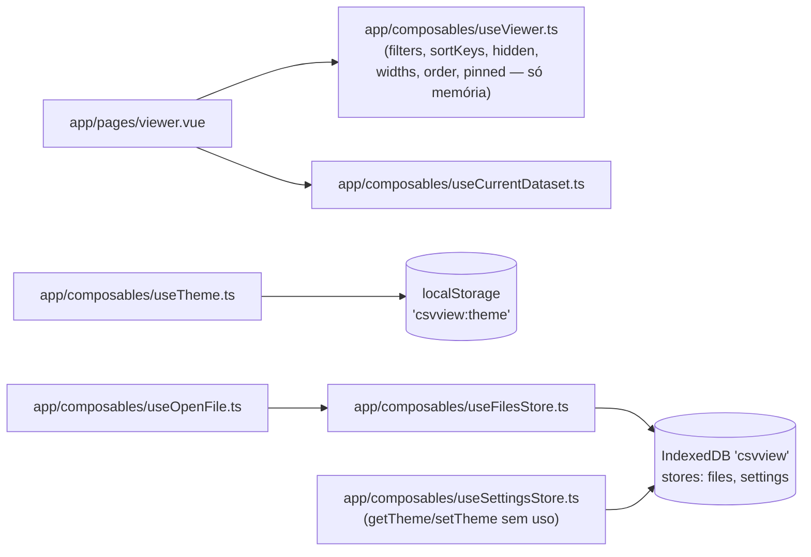
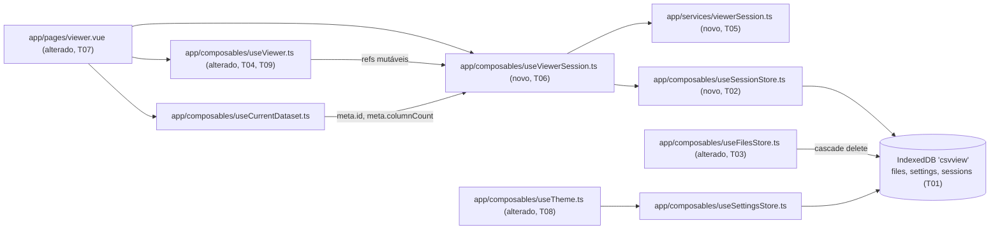

# Implementation Plan

## Request Summary
- Objective: persistir de forma durável (IndexedDB), por `FileRecord.id`, o estado de sessão do Viewer hoje só em memória (`useViewer.ts`: `filters`, `sortKeys`, `hidden`, `widths`, `order`, `pinned`) — restaurando-o num F5/remount do dataset atual e ao reabrir o mesmo arquivo pela lista de recentes — e unificar a preferência de tema no store `settings` do IndexedDB, substituindo o caminho hoje exclusivo por `localStorage`.
- Scope:
  - In: novo object store `sessions` (IndexedDB `csvview`, `DB_VERSION` 1→2); composable(s) novos de persistência/CRUD e de restauração+escrita debounced; degradação graciosa quando `FileRecord.id` é indefinido (RF-05, sem fallback) e quando o schema diverge por `column_count` (RF-06, descarte total); remoção em cascata do estado de sessão ao excluir/evictar um arquivo recente (RF-07/CT-03); `useTheme.ts` delegando a `useSettingsStore` (RF-04/CT-02).
  - Out: sincronização entre dispositivos/abas ou backend; persistência de `search`/`selectedIndex`; histórico/undo de sessão; export/import de sessão; UI dedicada de "gerenciar sessões"; migração automática de um valor de tema pré-existente em `localStorage`.
- Tier: standard (sem contrato HTTP/gRPC/async — feature 100% client-side; contratos CT-01/02/03 são in-process, cobertos inline nas tasks, não geram artefato OpenAPI/proto/AsyncAPI).
- Architecture references: `AGENTS.md`, `docs/agents/architecture.md` (tabela "Layer responsibilities": persistência IndexedDB é responsabilidade de `app/composables/`, nunca de `app/components/`/`app/pages/` além da fiação), `docs/agents/domain_rules.md` ("Column pin/reorder rule": estado de coluna é chaveado por índice **original**, não posição renderizada), `docs/agents/coding_guidelines.md` (regra 2: estado de composable como singleton de módulo com `readonly()`; regra 3: injeção de dependências via options objects defaultados).

## AS IS — Componentes impactados

Legenda: `useViewer.ts` documenta explicitamente "nada é gravado em IndexedDB" (5 ocorrências, `useViewer.ts:82,89,97,104,111`); um remount do Viewer (ou F5, dentro da convenção de teste já usada neste repo — ver Open Questions) reinicia todo o estado de interação para o padrão. O tema só persiste em `localStorage`; `useSettingsStore.getTheme`/`setTheme` existem mas estão sem uso (verificado por grep).

## TO BE — Componentes propostos

Legenda: `useDatabase.ts` (T01) ganha o store `sessions`; `useSessionStore.ts` (T02, novo) faz CRUD puro sobre ele; `viewerSession.ts` (T05, novo, `app/services/`) contém a serialização/validação pura (schema-drift RF-06, sanitização RNF-03); `useViewerSession.ts` (T06, novo) orquestra restauração (RF-02, RF-03, RF-05) e escrita debounced (RF-01, RNF-01) sobre os refs do `useViewer.ts` (que ganha `hidden` exposto em T04 e tem seus comentários "RNF-04" corrigidos em T09); `viewer.vue` (T07) apenas fia o novo composable, sem lógica própria; `useFilesStore.ts` (T03) propaga exclusão para `sessions`; `useTheme.ts` (T08) delega ao `useSettingsStore` já existente.

## Tasks

### T01 — Object store `sessions` no banco IndexedDB
- **Files**: `app/composables/useDatabase.ts`
- **Change**: bump `DB_VERSION` de `1` para `2`; adicionar `SESSIONS_STORE = 'sessions'`; adicionar `SessionRecord` (`fileId: number` como keyPath, `columnCount: number`, `filters`, `sortKeys`, `hidden: number[]`, `widths: [number, number][]`, `order: number[]`, `pinned: number[]`, `updated_at: number` — forma exata definida junto com T05); estender `CsvViewDBSchema` e `upgrade()` com `if (!db.objectStoreNames.contains(SESSIONS_STORE)) { db.createObjectStore(SESSIONS_STORE, { keyPath: 'fileId' }) }`, seguindo o padrão condicional já usado para `files`/`settings` (`useDatabase.ts:97-106`).
- **Covers**: CT-01 (forma do registro), RNF-02 (abertura idempotente, sem migração dos stores existentes)
- **Tests**: `test/useDatabase.spec.ts` — abrir o banco cria o store `sessions` com keyPath `fileId`; reabrir (idempotente) não duplica/recria stores; um banco pré-existente com apenas `files`/`settings` (schema v1, sem `sessions`) abre sem erro após a mudança e preserva os registros desses dois stores.
- **Risk**: Medium — módulo compartilhado por toda a persistência; mitigado por criação estritamente aditiva (guardada por `objectStoreNames.contains`), mesmo padrão comprovado dos dois stores existentes.
- **Dependencies**: none

### T02 — Composable `useSessionStore.ts` (CRUD do store `sessions`)
- **Files**: `app/composables/useSessionStore.ts` (novo)
- **Change**: `getSession(fileId): Promise<SessionRecord | undefined>`, `saveSession(record: SessionRecord): Promise<void>`, `deleteSession(fileId): Promise<void>`, usando `openDatabase()`/`SESSIONS_STORE` (T01), no mesmo padrão de `useSettingsStore.ts`/`useFilesStore.ts` (get/put/delete diretos, sem lógica de domínio aqui — validação/serialização fica em T05).
- **Covers**: CT-01
- **Tests**: `test/useSessionStore.spec.ts` (novo) — salvar/recuperar preserva os campos; `deleteSession` remove o registro; `getSession` de um `fileId` inexistente retorna `undefined`; sobrescrever (mesmo `fileId`) substitui o registro anterior (idempotência de `put`).
- **Risk**: Low — CRUD fino, mesmo padrão comprovado de `useSettingsStore.ts`.
- **Dependencies**: T01

### T03 — Cascade delete de sessão em `useFilesStore.ts` (RF-07/CT-03)
- **Files**: `app/composables/useFilesStore.ts`
- **Change**: importar `SESSIONS_STORE` de `useDatabase.ts`; ampliar o escopo da transação em `deleteFile(id)` e no laço de eviction LRU dentro de `saveFile()` (`useFilesStore.ts:64-70`) para `db.transaction([FILES_STORE, SESSIONS_STORE], 'readwrite')`, deletando (via `tx.objectStore(SESSIONS_STORE).delete(id)`) o registro de sessão de cada `id` de `FileRecord` removido — manual (`deleteFile`) ou evictado (cursor LRU) — na mesma transação, evitando janela de inconsistência (FLEXIBLE, `useFilesStore.ts:64-70`). Sem chamar `useSessionStore()` aqui (evitaria uma segunda transação) — opera diretamente no mesmo `tx`.
- **Covers**: RF-07, CT-03
- **Tests**: extend `test/useFilesStore.spec.ts` — excluir manualmente um arquivo com sessão salva remove ambos (`getFile`/uma leitura de `sessions` via `useSessionStore().getSession`); inserir um 11º arquivo evictando o mais antigo remove também a sessão do evictado; consultar a sessão de um `id` já excluído (por qualquer via) não retorna registro; casos existentes de CRUD/listagem/LRU/touch continuam passando inalterados (regressão).
- **Risk**: Medium — altera transações de um módulo já em produção; mitigado por manter as operações de `files` bit-a-bit iguais (só amplia o escopo da tx) e reexecutar a suíte existente sem alterações.
- **Dependencies**: T01

### T04 — Expor `hidden` no retorno de `useViewer.ts`
- **Files**: `app/composables/useViewer.ts`
- **Change**: adicionar `hidden` ao objeto retornado por `useViewer()` (já existe como ref local, `useViewer.ts:76`, só não é exposto) — necessário para que um composable externo possa ler e restaurar colunas ocultas (CT-01); nenhuma outra assinatura muda.
- **Covers**: CT-01 (pré-requisito)
- **Tests**: extend `test/useViewer.spec.ts` — `hidden` está presente no retorno; atribuir diretamente `hidden.value = new Set([...])` de fora reflete em `columns`/`visibleColumns` do mesmo jeito que `toggleColumn` já reflete (mesma reatividade, só um novo ponto de entrada).
- **Risk**: Low — mudança aditiva, nenhum consumidor existente é renomeado/removido.
- **Dependencies**: none

### T05 — Serialização/validação pura da sessão (`app/services/viewerSession.ts`)
- **Files**: `app/services/viewerSession.ts` (novo)
- **Change**: funções puras, sem import de Vue/composables (framework-free, igual às demais em `app/services/`):
  - `serializeViewerSession(snapshot, columnCount): SessionPayload` — converte `filters: ColumnFilter[]` (reaproveita o tipo de `~/services/columnFilters`), `sortKeys: { index; direction }[]`, `hidden: Set<number>` → `number[]`, `widths: Map<number, number>` → `[number, number][]`, `order: number[]`, `pinned: Set<number>` (ordem de iteração preservada) → `number[]`.
  - `deserializeViewerSession(record, columnCount): ViewerSessionSnapshot | null` — RF-06: se `record.columnCount !== columnCount`, retorna `null` (descarte total, sinalizando ao chamador que o registro deve ser removido); RNF-03 (defesa adicional): quando o `columnCount` bate, ainda assim filtra/descarta entradas de `hidden`/`widths`/`order`/`pinned`/`filters[].column`/`sortKeys[].index` fora do intervalo `[0, columnCount)`, e trata qualquer campo ausente/malformado (tipo errado, não-array) como lista vazia — nunca lança exceção.
- **Covers**: CT-01, RF-06, RNF-03
- **Tests**: `test/viewerSession.spec.ts` (novo) — roundtrip serialize→deserialize preserva os seis aspectos; `columnCount` divergente → `null`; com `columnCount` igual, índices fora de `[0, columnCount)` em cada um dos seis campos são removidos individualmente sem afetar os demais; um registro estruturalmente malformado (campo ausente, tipo errado, `undefined`) não lança e degrada para lista vazia nesse campo.
- **Risk**: Low — funções puras, cobertura unitária direta, sem I/O.
- **Dependencies**: none

### T06 — Composable `useViewerSession.ts` (restauração + escrita debounced)
- **Files**: `app/composables/useViewerSession.ts` (novo)
- **Change**: `useViewerSession(viewer, meta, options?)`, onde `viewer` é o subconjunto `{ filters, sortKeys, hidden, widths, order, pinned }` retornado por `useViewer` (T04) e `meta` é o `Ref`/`ComputedRef` de `DatasetMeta | null` de `useCurrentDataset`. Dependências injetáveis com default de produção (`sessionStore = useSessionStore()`, `debounceMs = 300`), seguindo o padrão de `useOpenFile.ts` (coding_guidelines regra 3).
  - **Restauração** (RF-02, RF-03, RF-05): `watch(meta, ..., { immediate: true })` — se `meta.value?.id` for `undefined`, não faz nenhuma leitura em store algum (RF-05, sem fallback); se definido, chama `sessionStore.getSession(id)` e `deserializeViewerSession(record, meta.value.columnCount)` (T05); resultado `null` (ausente, corrompido ou schema divergente) → se havia um registro com `columnCount` divergente, chama `sessionStore.deleteSession(id)` (RF-06, mesmo descarte usado por RF-07/CT-03) e mantém os refs no estado padrão atual (RNF-03); resultado válido → atribui aos refs (`filters.value = ...`, etc.) sob uma flag `isRestoring` para não disparar imediatamente a escrita abaixo com os mesmos dados.
  - **Escrita debounced** (RF-01, RNF-01): `watch([filters, sortKeys, hidden, widths, order, pinned], ..., { flush: 'post' })`, com debounce (`debounceMs`) por trás de um `setTimeout` cancelável; ao dispersar, lê `meta.value?.id` **no momento do disparo** — `undefined` → não escreve em nenhum store (RF-05 AC2, sem retroatividade quando o `id` surge depois: só mutações após a transição são lidas com `id` definido); definido → `serializeViewerSession(...)` (T05) + `sessionStore.saveSession(...)` dentro de `try/catch`, erro apenas logado via `console.error` e engolido, nunca lançado (RNF-01).
- **Covers**: RF-01, RF-02, RF-03, RF-05, RF-06 (fiação), RNF-01, RNF-03 (fiação)
- **Tests**: `test/useViewerSession.spec.ts` (novo, `vi.useFakeTimers()`) —
  - sem `id` (`meta.value.id === undefined`): mutar todos os seis aspectos e avançar os timers não chama `saveSession` nenhuma vez;
  - com `id`: mutar e avançar o debounce chama `saveSession` uma vez com o payload serializado correto; múltiplas mutações dentro da janela de debounce coalescem numa única chamada;
  - restauração: pré-semear um `SessionRecord` válido para o `id`, montar o composable com o `meta` correspondente → os refs do viewer são populados com os valores restaurados;
  - schema divergente: pré-semear um registro com `columnCount` diferente do `meta.columnCount` atual → refs permanecem no padrão E `deleteSession` é chamado para aquele `id`;
  - falha de escrita: mockar `saveSession` para rejeitar → nenhuma exceção propaga, `console.error` é chamado, e uma mutação subsequente do viewer continua funcionando normalmente;
  - transição de `id`: mutar com `meta.value.id === undefined`, depois definir o `id` e mutar novamente → `saveSession` só é chamado para a mutação posterior à transição (nunca para o estado acumulado antes dela).
- **Risk**: High — ponto de integração central (timers assíncronos, múltiplos `watch`, casos de borda de RF-05/RF-06); mitigado por isolar toda a lógica pura/testável em T05, usar fake timers determinísticos e injeção de dependência (`sessionStore` mockável) para não depender de IndexedDB real nos testes de timing.
- **Dependencies**: T02, T04, T05

### T07 — Fiar `useViewerSession` em `viewer.vue`
- **Files**: `app/pages/viewer.vue`
- **Change**: após `const { ... } = useViewer(...)`, chamar `useViewerSession({ filters, sortKeys, hidden, widths, order, pinned }, meta)` (T06), onde `meta` já vem de `useCurrentDataset()` (`viewer.vue:25`). Fiação pura — nenhuma marcação nova no `<template>`, nenhuma lógica própria na página (respeita `app/pages/` como camada de composição, não de regra de negócio).
- **Covers**: RF-01, RF-02, RF-03 (fim a fim)
- **Tests**: extend `test/pages/viewer.spec.ts` — montar o Viewer com um dataset cujo `meta.id` é definido, aplicar um filtro, ordenar por duas colunas (Shift+clique), ocultar uma coluna, redimensionar outra, reordenar duas e fixar uma; avançar os fake timers do debounce; desmontar e remontar `ViewerPage` (mesmo dataset/meta ainda em memória em `useCurrentDataset`, convenção de "reload" já usada neste repo — ver Open Questions) → os seis aspectos voltam idênticos; reabrir com um `meta.id` **diferente** não herda a sessão do primeiro arquivo (isolamento por `id`); um dataset com `meta.id === undefined` continua totalmente funcional e não dispara `indexedDB.open`/`localStorage` extra além do já esperado (spy, mesmo padrão de `"não acessa IndexedDB nem localStorage ao aplicar/remover filtros"`, `test/pages/viewer.spec.ts:161`).
- **Risk**: Medium — teste de componente completo, mas a lógica pesada já foi validada em T06; risco reduzido à fiação (nomes/props corretos).
- **Dependencies**: T06

### T08 — `useTheme.ts` delega a `useSettingsStore` (RF-04/CT-02)
- **Files**: `app/composables/useTheme.ts`
- **Change**: manter a superfície pública (`theme`, `setTheme`, `toggleTheme`) idêntica em nome/assinatura (CT-02). Primeira chamada de `useTheme()`: mantém a leitura síncrona de `localStorage` (`readStoredTheme()`) como cache de primeira pintura (evita flash, FLEXIBLE) e, uma única vez por módulo, dispara `useSettingsStore().getTheme()` assíncrono que — ao resolver — sobrescreve `theme.value`/`applyTheme` se o valor persistido divergir do cache. `setTheme(value)`: continua síncrono (ref + `applyTheme` imediatos) e, adicionalmente, chama `useSettingsStore().setTheme(value)` (fire-and-forget, `try/catch` com log em `console.error`, nunca expõe a Promise — preserva a assinatura `void`); mantém a escrita em `localStorage` como cache secundário, não mais como único caminho (RF-04 AC2).
- **Covers**: RF-04, CT-02
- **Tests**: extend `test/useTheme.spec.ts` — depois de `setTheme('light')`, uma nova instância de `useSettingsStore().getTheme()` resolve `'light'` (persistência efetiva via IndexedDB); limpar `localStorage` mas manter um valor gravado no store `settings` ainda resolve o tema correto após aguardar a resolução assíncrona (`await flushPromises()`); os três testes síncronos existentes continuam passando inalterados (o fast-path de `localStorage` para a primeira pintura não muda). Regressão: `test/ThemeToggle.spec.ts` e `test/DefaultLayout.spec.ts` (consumidores de `useTheme`) continuam verdes sem alteração.
- **Risk**: Medium — `useTheme` é consumido globalmente (`app.vue`, `ThemeToggle.vue`, layout); mitigado por preservar o fast-path síncrono existente (nenhuma asserção imediata pós-chamada muda de valor) e por rodar a suíte completa antes de finalizar.
- **Dependencies**: none

### T09 — Corrigir comentários "RNF-04" obsoletos em `useViewer.ts`
- **Files**: `app/composables/useViewer.ts`
- **Change**: atualizar as 5 ocorrências de JSDoc que hoje afirmam "nada é gravado em IndexedDB (RNF-04)" (`useViewer.ts:82,89,97,104,111`, citadas no Contexto da SPEC) para refletir que a persistência durável agora existe — via `useViewerSession.ts` (T06), um composable irmão — sem que `useViewer.ts` em si ganhe qualquer import de `idb`/`useDatabase` (preserva a regra 2 de `coding_guidelines.md`: `useViewer` continua estado derivado puro, desacoplado de IndexedDB).
- **Covers**: manutenção de documentação (nenhum RF novo; evita a `architecture.md`/`domain_rules.md` citarem um comportamento já superseded)
- **Tests**: `test/useViewer.spec.ts` — suíte existente continua verde sem alteração (mudança é só de comentário); verificação manual de que nenhuma ocorrência de "nada é gravado em IndexedDB" permanece em `useViewer.ts`.
- **Risk**: Low — comentário apenas, zero mudança de comportamento.
- **Dependencies**: T04 (mesmo arquivo — sequencial, não paralelo)

## Execution Phases
| Phase | Tasks | Parallel-safe? |
|-------|-------|----------------|
| 1 | T01, T04, T05, T08 | Sim — arquivos distintos (`useDatabase.ts`, `useViewer.ts`, `viewerSession.ts` novo, `useTheme.ts`), sem dependências entre si |
| 2 | T02, T03, T09 | Sim — arquivos distintos (`useSessionStore.ts` novo, `useFilesStore.ts`, `useViewer.ts`); T02/T03 dependem só de T01 (fase 1); T09 depende só de T04 (fase 1, mesmo arquivo, por isso não pode compartilhar fase com T04) |
| 3 | T06 | Não aplicável (task única) — depende de T02, T04, T05 |
| 4 | T07 | Não aplicável (task única) — depende de T06 |

## Risks
| Risk | Blast radius | Mitigation | Rollback |
|------|-------------|------------|----------|
| Bump de `DB_VERSION` (1→2) quebra bancos existentes de usuários reais | Todo usuário com dados já persistidos em `files`/`settings` | Criação do store `sessions` estritamente aditiva (guardada por `objectStoreNames.contains`, mesmo padrão já usado pelos dois stores atuais); teste de regressão simula um banco v1 pré-existente | Reverter só `useDatabase.ts`; navegadores que já abriram a v2 não regridem sozinhos, mas os stores extras ficam inofensivos se não referenciados |
| `useViewerSession.ts` (T06) introduz condição de corrida entre restauração assíncrona e a primeira escrita debounced | Todo dataset com `FileRecord.id` definido — pode sobrescrever uma sessão salva com o estado padrão | Flag `isRestoring` explícita ao aplicar valores restaurados, testada com fake timers (T06) antes de qualquer fiação em `viewer.vue` (T07) | Página pode deixar de chamar `useViewerSession` (T07 é um único ponto de fiação) sem tocar em `useViewer.ts`/`useSessionStore.ts` |
| Mudança de escopo de transação em `useFilesStore.ts` (T03) | Fluxo de abrir/reabrir arquivo (`useOpenFile.ts`) e a lista de recentes — usados em toda sessão do app | Manter as operações sobre `files` bit-a-bit idênticas (só amplia a `tx` para incluir `sessions`); suíte existente de `useFilesStore.spec.ts` roda sem alteração antes de aceitar a mudança | Reverter para transação single-store + uma chamada separada de `deleteSession` (funcionalmente equivalente, só perde a atomicidade entre os dois stores) |
| `useTheme.ts` (T08) passa a depender de IndexedDB (via `useSettingsStore`) num composable hoje 100% síncrono, consumido globalmente | `app.vue`, `ThemeToggle.vue`, `layouts/default.vue` — carregados em toda página | Preservar o fast-path síncrono via `localStorage` (nenhuma asserção imediata muda); escrita ao store `settings` é fire-and-forget com `try/catch`; rodar `test/ThemeToggle.spec.ts`/`test/DefaultLayout.spec.ts` como regressão | Reverter só `useTheme.ts` para o caminho 100% `localStorage` anterior |
| Trade-off aceito de RF-06 (mesma `column_count`, colunas renomeadas/reordenadas) aplica estado de sessão a colunas semanticamente diferentes | Qualquer arquivo reaberto com cabeçalho alterado mas mesma contagem de colunas | Nenhuma — comportamento aceito e documentado explicitamente pela própria SPEC (RF-06, "Trade-off aceito"); fora de escopo mitigar aqui | N/A — decisão de produto já fechada na SPEC |

## Open Questions
- **Semântica de "F5" em RF-02/RF-03 — RESOLVIDO**: hoje, `viewer.vue` redireciona para `/` sempre que `hasDataset.value` é falso no `setup()` (`viewer.vue:28-30`), e o dataset carregado vive só em memória de módulo (`useCurrentDataset.ts:36-37`, sem persistência própria) — um F5 real do navegador na URL `/viewer` zera esse módulo e hoje sempre volta para o Upload, **independentemente** de qualquer trabalho desta SPEC. Este plano havia levantado a dúvida sobre se RF-02/RF-03 exigiam re-hidratação do dataset a partir de `files` num hard-reload literal. **O desenvolvedor confirmou a interpretação recomendada**: RF-02/RF-03 significam "remount do Viewer com o dataset/meta ainda presentes em `useCurrentDataset` (singleton de módulo)" — a mesma convenção de teste já usada neste repo para simular "reload" (ex.: `test/useSettingsStore.spec.ts` fecha/reabre a conexão do banco, não o processo inteiro) — e **não** um recarregamento literal de página com re-hidratação do dataset via IndexedDB. Nenhuma task nova é necessária; as 9 tasks do PLAN permanecem como escopo final (decisão registrada aqui apenas para trilha de auditoria).
- **Valor exato do debounce (RF-01/RNF-01)**: a SPEC não define um número (apenas "qualitativo", FLEXIBLE sugere 200–500ms); este plano assume `300ms` como default configurável (`useViewerSession(..., { debounceMs })`) — não bloqueante, mas vale confirmar se há uma preferência de produto.

## Assumptions
- Nomes/estrutura sugeridos (`useSessionStore`, `useViewerSession`, `viewerSession.ts`, store `sessions` com keyPath `fileId`) são FLEXIBLE por definição da própria SPEC — não congelados; a forma dos campos do `SessionRecord` (CT-01) é o que é RIGID.
- `widths`, `hidden`, `order`, `pinned` são sempre reatribuídos por inteiro (nunca mutados in-place) em `useViewer.ts` (verificado em `useViewer.ts:264-469`: cada função de mutação cria um novo `Map`/`Set`/array e faz `x.value = next`) — por isso um `watch` raso (não `deep`) sobre esses seis refs em T06 é suficiente para capturar toda mutação, sem overhead de deep-watch.
- `DatasetMeta.columnCount` (síncrono, via `useCurrentDataset().meta`) espelha fielmente `FileRecord.column_count` do arquivo reaberto em todos os fluxos existentes (`useOpenFile.ts` sempre popula os dois a partir do mesmo `ParseResult`) — por isso a checagem de schema-drift de RF-06 não precisa de uma leitura extra em `files` além da já feita por `useOpenFile`/`useCurrentDataset`.
- `fake-indexeddb/auto` (`test/setup.ts:5`) já cobre os testes novos de IndexedDB (T01, T02, T03, parte de T06/T08) sem setup adicional, seguindo a convenção existente (`useDatabase.spec.ts`, `useFilesStore.spec.ts`, `useSettingsStore.spec.ts`).
