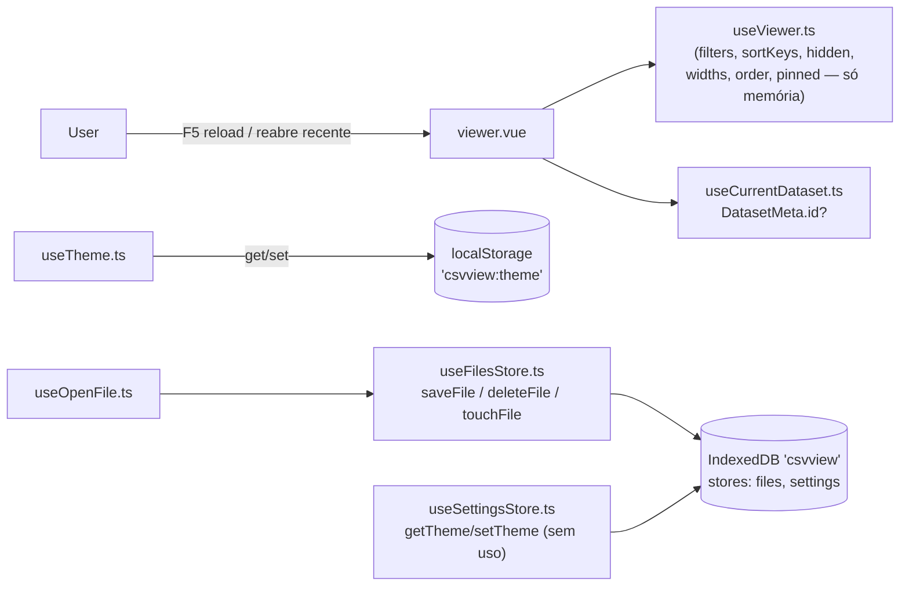
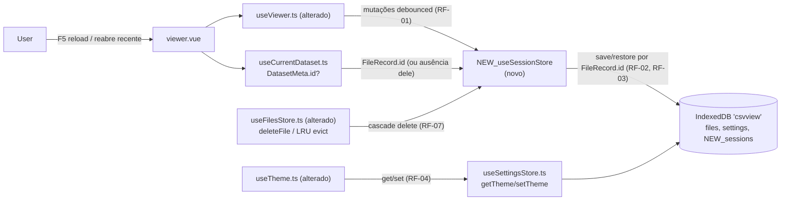

# SPEC: sessions

## Metadata
- Source: developer description via /plan
- Service: csvview (SPA estática Nuxt 4, 100% client-side, sem backend — `ssr:false`, Nitro `preset:'static'`, `nuxt.config.ts:12-15`)
- Tier: standard
- Version: 1.1
- Architecture references: `AGENTS.md`, `docs/agents/architecture.md`, `docs/agents/domain_rules.md`
  - Regra concreta citada (`architecture.md:43-44`, tabela "Layer responsibilities"): `app/composables/` é dono de "IndexedDB schema/access (`useDatabase`, `useFilesStore`, `useSettingsStore`)" e NÃO é dono de "Rendering/markup"; `app/components/` NÃO é dono de "Persistência, parsing, business rules (delegated to composables/services)". Logo, a persistência de sessão desta feature DEVE viver em `app/composables/` (novo composable ou extensão de `useViewer`/`useSettingsStore`), nunca em `ViewerTable.vue`/`ViewerToolbar.vue`/`viewer.vue`.
  - Regra concreta citada (`domain_rules.md:94`, "Column pin/reorder rule"): "Width/order/pin state is tracked by the column's **original** header index, so it survives hide/show and reordering." O estado persistido DEVE preservar essa mesma chave (índice original), não a posição renderizada.

## Context

O Viewer (`app/composables/useViewer.ts`) já mantém, inteiramente em memória, o estado de busca/colunas/ordenação/filtros: `hidden: Set<number>`, `sortKeys: SortKey[]` (`{ index, direction }`, `useViewer.ts:58-63`), `widths: Map<number, number>` (`useViewer.ts:92`, piso `MIN_COLUMN_WIDTH = 48`, `useViewer.ts:68`, default `DEFAULT_COLUMN_WIDTH = 180`, `useViewer.ts:70`), `order: number[]` (`useViewer.ts:99`), `pinned: Set<number>` (`useViewer.ts:106`) e `filters: ColumnFilter[]` (`{ column, operator, value }`, `app/services/columnFilters.ts:47-51`, tipo `FilterOperator` em `columnFilters.ts:22-34`). O comentário no próprio arquivo é explícito: "RNF-04: nada é gravado em IndexedDB" (`useViewer.ts:82,89,97,104,111`). As duas features irmãs já carvam esse limite por nome: `.spec/features/table-interactions/SPEC.md` (RNF-04) e `.spec/features/filters/SPEC.md` (RF-07) — ambas deferem a persistência durável para esta feature `sessions`.

A camada de IndexedDB já existe (`app/composables/useDatabase.ts`): banco `csvview` (`DB_NAME`, `useDatabase.ts:20`), `DB_VERSION = 1` (`useDatabase.ts:23`), stores `files` (keyPath `id` auto-incremento, índice `last_opened_at`, `useDatabase.ts:97-103`) e `settings` (keyPath `key`, `useDatabase.ts:104-106`). `app/composables/useFilesStore.ts` implementa CRUD + LRU (`MAX_RECENT_FILES = 10`, `useFilesStore.ts:18`) sobre `files`; `app/composables/useSettingsStore.ts` já expõe `getTheme`/`setTheme` (`useSettingsStore.ts:58-65`) sobre o store `settings` — mas esses dois métodos estão **sem uso** em qualquer lugar do código (verificado por grep). O tema hoje é lido/escrito exclusivamente em `localStorage` por `app/composables/useTheme.ts` (`THEME_STORAGE_KEY = 'csvview:theme'`, `useTheme.ts:17`), com um comentário próprio no arquivo já anunciando essa migração futura ("Na Fase 3 este ponto passa a integrar com o store `settings`").

`DatasetMeta` (`app/composables/useCurrentDataset.ts:19-32`) tem `id?: number` — hoje sempre preenchido na prática (tanto `openFile` quanto `reopenRecent`, em `app/composables/useOpenFile.ts`, persistem o arquivo em `files` antes de chamar `setDataset`), mas o tipo permite `id` indefinido, e esta feature explora esse caso de borda (AC4). Não existe, em lugar nenhum do código (verificado por grep), qualquer conceito de fingerprint/hash de schema (contagem/nome/tipo de colunas) — qualquer detecção de "schema mudou" é desenho novo desta feature.

Esta feature adiciona a camada de persistência durável que falta: gravar o estado de sessão do Viewer (filtros, ordenação, colunas ocultas, larguras, ordem, colunas fixadas) por dataset (chaveado pelo `id` do `FileRecord`), unificar o tema no store `settings` do IndexedDB, e cobrir os casos de borda de dataset sem `id`, schema divergente e remoção de arquivo recente.

## AS IS — Estado atual

Legenda: o estado de interação do Viewer é volátil por design atual (`useViewer.ts` documenta "RNF-04: nada é gravado em IndexedDB"); o tema persiste só em `localStorage`, ignorando `useSettingsStore.getTheme`/`setTheme` que já existem e apontam para o mesmo store `settings`. Um F5 ou reabertura de recente hoje sempre reinicia filtros/ordenação/colunas para o estado padrão.

## TO BE — Estado proposto

Legenda: um composable novo (`NEW_useSessionStore`, nome FLEXIBLE) realiza RF-01 (persistência debounced), RF-02 (restauração no F5) e RF-03 (restauração ao reabrir recente), gravando num store novo do IndexedDB chaveado por `FileRecord.id`. `useTheme.ts` (alterado) passa a delegar a `useSettingsStore` (RF-04), unificando com o store `settings` já existente. `useFilesStore.ts` (alterado) propaga a exclusão para o estado de sessão associado, tanto na remoção manual quanto na eviction LRU (RF-07). Nenhum nó novo depende de rede.

## Scope
- **In**: persistência durável, chaveada por `FileRecord.id`, de filtros de coluna (`ColumnFilter[]`), chaves de ordenação (`SortKey[]`), colunas ocultas, larguras de coluna, ordem de colunas e colunas fixadas; restauração exata desse estado num F5 do dataset atual e ao reabrir o mesmo arquivo pela lista de recentes; persistência do tema no store `settings` do IndexedDB, independente de qualquer dataset, substituindo o caminho exclusivo por `localStorage`; comportamento definido quando o dataset ainda não tem `id` (sem save/restore, Viewer funcional); degradação graciosa quando o schema do arquivo muda entre sessões; escrita assíncrona/debounced das mutações de sessão; remoção em cascata do estado de sessão ao excluir um arquivo recente (manual ou LRU).
- **Out**: sincronização entre dispositivos/abas ou qualquer backend (não há servidor); persistência do termo de busca global (`search`) — não listado nas ACs confirmadas; persistência da coluna selecionada para o painel de estatísticas (`selectedIndex`) — não listado nas ACs confirmadas; histórico/undo de estados de sessão; exportação/importação do estado de sessão; qualquer UI nova dedicada a "gerenciar sessões" (fora das ACs); migração automática de um valor de tema pré-existente em `localStorage` para o store `settings` (não coberto pelas ACs confirmadas — ver FLEXIBLE).

## RIGID (Non-Negotiable)

### Functional Requirements

- RF-01 [Event-Driven]: QUANDO o usuário altera o estado do Viewer via filtro, ordenação, ocultar/reexibir coluna, redimensionamento, reordenação ou fixação de coluna, o sistema DEVE persistir o estado resultante de forma assíncrona e debounced, sem bloquear a interação do usuário durante a mutação.
  - AC: uma sequência de mutações rápidas (ex.: redimensionar uma coluna arrastando) não bloqueia a resposta da UI à interação em andamento; a persistência ocorre de forma assíncrona após a mutação.
  - AC: recarregar a página logo após uma mutação (sem esperar deliberadamente) eventualmente reflete o último estado mutado, sem exigir uma ação explícita de "salvar".

- RF-02 [Event-Driven]: QUANDO a página do Viewer é recarregada (F5) com um dataset carregado a partir de um arquivo já persistido (`FileRecord.id` definido), o sistema DEVE restaurar filtros de coluna, colunas ocultas, chaves de ordenação, larguras de coluna, ordem de colunas e colunas fixadas exatamente como estavam antes do reload.
  - AC: após aplicar um filtro, ordenar por duas colunas (Shift+clique), ocultar uma coluna, redimensionar outra, reordenar duas colunas e fixar uma, um F5 restaura os seis aspectos de estado de forma idêntica ao imediatamente anterior ao reload.

- RF-03 [Event-Driven]: QUANDO o usuário reabre um arquivo a partir da lista de recentes, o sistema DEVE restaurar o mesmo estado de sessão salvo associado ao `FileRecord.id` daquele arquivo.
  - AC: fechar o Viewer (ou navegar para o Upload), reabrir o mesmo arquivo pela lista de recentes e obter exatamente o mesmo filtro/ordenação/colunas ocultas/larguras/ordem/colunas fixadas que estavam ativos da última vez que aquele arquivo esteve aberto.

- RF-04 [Event-Driven]: A preferência de tema DEVE ser persistida através do store `settings` do IndexedDB (reaproveitando `getTheme`/`setTheme` de `useSettingsStore.ts:58-65`, chave `THEME_KEY = 'theme'`, `useSettingsStore.ts:14`), unificando com — e substituindo — o caminho hoje exclusivo por `localStorage` (`THEME_STORAGE_KEY`, `useTheme.ts:17`) em `useTheme.ts`. A restauração do tema DEVE ocorrer independentemente de haver ou não um dataset carregado.
  - AC: alternar o tema e recarregar a página (com ou sem dataset carregado, inclusive na tela de Upload) restaura o tema escolhido, lido do store `settings` do IndexedDB.
  - AC: `useTheme.ts` não grava mais a preferência de tema em `localStorage` como único caminho de persistência (a leitura/escrita efetiva passa a ser via `useSettingsStore`).

- RF-05 [Unwanted]: ENQUANTO o dataset ativo não tiver um `id` definido em `DatasetMeta` (`useCurrentDataset.ts:21`) — ou seja, o arquivo ainda não foi persistido no store `files` —, o sistema NÃO DEVE tentar salvar nem restaurar estado de sessão para esse dataset, em store algum (IndexedDB ou qualquer outro, incluindo `sessionStorage`), e o Viewer DEVE permanecer totalmente funcional (filtros, ordenação, colunas etc. continuam operando em memória, como hoje). Comportamento estrito, sem fallback intermediário: NÃO existe um caminho alternativo de persistência (ex.: `sessionStorage` chaveado por nome+tamanho) enquanto o `id` é indefinido. Se o `id` só surgir depois (ex.: conclusão assíncrona da persistência do arquivo em `files` após o Viewer já estar aberto), o estado de sessão acumulado em memória até então é perdido — não é copiado retroativamente para o novo `id`.
  - AC: com um dataset cujo `DatasetMeta.id` é `undefined`, nenhuma escrita ocorre em qualquer store de sessão (IndexedDB ou `sessionStorage`) ao mutar filtros/ordenação/colunas, e todas as interações do Viewer continuam respondendo normalmente.
  - AC: se o `DatasetMeta.id` transicionar de `undefined` para definido durante a sessão (ex.: persistência assíncrona do arquivo concluída após abertura do Viewer), o estado de sessão acumulado até esse instante NÃO é retroativamente salvo para o novo `id`; apenas mutações subsequentes à transição passam a ser persistidas.

- RF-06 [Conditional]: SE o schema do arquivo divergir entre sessões — detectado exclusivamente pela comparação de `column_count` (`FileRecord.column_count`, `useDatabase.ts:50`) entre o valor registrado no estado de sessão salvo e o valor atual do arquivo reaberto —, ENTÃO o sistema DEVE descartar integralmente o registro de sessão daquele arquivo (filtros + ordenação + colunas ocultas + larguras + ordem + colunas fixadas), em vez de aplicar qualquer índice de coluna potencialmente obsoleto, e a tabela DEVE continuar renderizando normalmente (sem erro, sem coluna quebrada, sem índice fora do intervalo). O descarte é total (equivalente à mesma operação de remoção de registro de sessão usada por RF-07/CT-03), não parcial: esta SPEC não define nem exige um caminho de descarte seletivo por aspecto.
  - AC: reabrir um arquivo cujo cabeçalho mudou de contagem de colunas em relação à sessão salva não lança erro nem quebra a renderização da tabela; nenhum índice de coluna do estado restaurado aponta para fora do intervalo `[0, columnCount)` do dataset atual (porque nenhum estado é restaurado — o registro de sessão inteiro foi descartado).
  - AC: a detecção de divergência usa exclusivamente `column_count`; nenhum fingerprint de nomes/tipos de coluna é computado ou persistido por esta SPEC.
  - **Trade-off aceito, documentado explicitamente**: um arquivo reaberto com a MESMA contagem de colunas, mas com colunas renomeadas e/ou reordenadas no cabeçalho, NÃO é detectado como schema divergente por esta regra — o estado de sessão salvo (filtros, ordenação, colunas ocultas, larguras, ordem, fixação) é restaurado e aplicado aos índices de coluna atuais, que podem agora corresponder semanticamente a colunas diferentes das originais. Este é um limite aceito desta SPEC (falso-negativo de detecção por desenho), não um bug a ser prevenido aqui; qualquer detecção mais forte (fingerprint de nomes/tipos) fica fora de escopo.

- RF-07 [Event-Driven]: QUANDO um arquivo recente é removido — seja por exclusão manual (`useFilesStore.deleteFile`, `useFilesStore.ts:93-96`) seja por eviction LRU automática (`useFilesStore.saveFile`, cursor de exclusão em `useFilesStore.ts:64-70`) —, o sistema DEVE também remover o estado de sessão persistido associado ao `id` daquele `FileRecord`, sem deixar registro órfão.
  - AC: excluir manualmente um arquivo recente remove, na mesma operação (ou imediatamente em seguida, antes de qualquer nova leitura), o estado de sessão salvo para aquele `id`; inserir um 11º arquivo (disparando a eviction do mais antigo, `MAX_RECENT_FILES = 10`, `useFilesStore.ts:18`) remove também o estado de sessão do arquivo evictado.
  - AC: uma consulta pelo estado de sessão de um `id` de arquivo já excluído (por qualquer via) não retorna nenhum registro.

### Contracts

Contratos **in-process** (superfície de tipos/dados persistidos) — não há API HTTP; o app é 100% client-side.

- CT-01: O registro de sessão persistido DEVE referenciar o arquivo pelo seu `FileRecord.id` (`useDatabase.ts:40`) e carregar, no mínimo, os seguintes campos, preservando a chave por **índice original de coluna** (não posição renderizada, conforme `domain_rules.md:94`):
  - `filters`: equivalente serializável de `ColumnFilter[]` (`{ column: number; operator: FilterOperator; value?: string | number | FilterRange }`, `app/services/columnFilters.ts:47-51,22-34`).
  - `sortKeys`: equivalente serializável de `SortKey[]` (`{ index: number; direction: 'asc' | 'desc' }`, `useViewer.ts:58-63`).
  - `hidden`: conjunto de índices de coluna ocultos (serialização de `Set<number>`, `useViewer.ts:76`).
  - `widths`: mapa índice de coluna → largura em pixels (serialização de `Map<number, number>`, `useViewer.ts:92`; a largura mínima de 48px, `MIN_COLUMN_WIDTH`, `useViewer.ts:68`, é reaplicada na restauração).
  - `order`: array de índices de coluna na ordem de exibição das não-fixadas (`useViewer.ts:99`).
  - `pinned`: conjunto/sequência de índices de coluna fixados, preservando a ordem de fixação (serialização de `Set<number>`, `useViewer.ts:106`).
  - Nome do object store/composable de acesso é FLEXIBLE (não congelado por esta SPEC); a forma dos campos acima é RIGID.
- CT-02: `useTheme.ts` (verified at `app/composables/useTheme.ts`) DEVE manter sua superfície pública atual (`theme`, `setTheme`, `toggleTheme`) inalterada em nome/assinatura, mas a leitura inicial e a escrita DEVEM delegar a `useSettingsStore().getTheme()`/`useSettingsStore().setTheme()` (`useSettingsStore.ts:58-65`) em vez de `localStorage` como único caminho.
- CT-03: `useFilesStore.deleteFile(id)` (`useFilesStore.ts:93-96`) e a rotina de eviction LRU dentro de `saveFile` (`useFilesStore.ts:64-70`) DEVEM, para o(s) `id`(s) removido(s), também acionar a remoção do registro de sessão associado — a exclusão de `FileRecord` e a exclusão do estado de sessão correspondente NUNCA devem divergir (nenhum `id` de arquivo excluído pode reter um registro de sessão órfão).

### Non-Functional Requirements

- RNF-01: A escrita do estado de sessão mutado DEVE ocorrer de forma assíncrona e não DEVE bloquear perceptivelmente a interação do usuário durante mutações de filtro/ordenação/ocultar/redimensionar/reordenar/fixar (RF-01). Não há limite numérico de debounce definido pela AC confirmada; o critério é qualitativo — a interação (arrastar para redimensionar/reordenar, clicar para ordenar/ocultar/fixar) NÃO DEVE congelar perceptivelmente enquanto a escrita ocorre. Falhas na escrita do estado de sessão (ex.: quota do IndexedDB excedida, transação abortada) DEVEM ser engolidas e logadas no console — NUNCA bloqueiam a UI nem exibem erro ao usuário —, consistente com a filosofia já adotada por RNF-03 para o caminho de leitura.
  - AC: uma sequência de redimensionamentos por arraste no mesmo gesto não apresenta travamento perceptível da UI atribuível à escrita em IndexedDB.
  - AC: forçar uma falha de escrita do estado de sessão (ex.: mock rejeitando a transação/quota excedida) não bloqueia a interação do usuário, não exibe erro na UI, e resulta apenas em um log no console.
- RNF-02: A introdução do(s) novo(s) object store(s) de sessão DEVE preservar a abertura idempotente do banco `csvview` (`openDatabase`, `useDatabase.ts:93-111`) e não DEVE quebrar os stores `files`/`settings` existentes nem exigir migração de dados já persistidos nesses dois stores.
  - AC: após a mudança, abrir o banco em um perfil de navegador com dados pré-existentes em `files`/`settings` (schema anterior) não lança erro e preserva os registros existentes desses dois stores.
- RNF-03: A restauração de estado de sessão (RF-02, RF-03) e a checagem de compatibilidade de schema (RF-06) NÃO DEVEM impedir a renderização do dataset mesmo quando o registro de sessão está ausente, corrompido ou incompatível — a ausência ou descarte de estado de sessão equivale ao estado padrão atual do Viewer (sem filtros/ordenação/colunas ocultas/larguras/ordem/colunas fixadas), nunca a uma tela quebrada.
  - AC: forçar um registro de sessão inconsistente (ex.: índice de coluna fora do intervalo do dataset atual) não impede a tabela de renderizar; o Viewer abre normalmente com o(s) aspecto(s) afetado(s) revertido(s) ao padrão.

## FLEXIBLE (Implementation Suggestions)

- Nome/estrutura sugeridos: um composable novo `useSessionStore` (ou extensão de `useViewer`) e um object store novo (ex.: `sessions`, keyPath `fileId`) no mesmo banco `csvview`, exigindo incrementar `DB_VERSION` para `2` em `useDatabase.ts` e estender o `upgrade()` existente (`useDatabase.ts:93-111`) com `if (!db.objectStoreNames.contains(SESSIONS_STORE)) { ... }`, seguindo o padrão já usado para `files`/`settings`.
- Debounce sugerido: um pequeno utilitário de debounce (200–500ms, a calibrar) envolvendo a escrita do estado de sessão, disparado a partir de um `watch`/`watchEffect` sobre `filters`, `sortKeys`, `hidden`, `widths`, `order`, `pinned` em `useViewer.ts` — sem acoplar `useViewer` diretamente ao `idb`, delegando a um composable de persistência dedicado (mantém `useViewer` como estado derivado puro, coding_guidelines rule 2).
- `useTheme.ts`: ler o tema inicial de forma assíncrona via `useSettingsStore().getTheme()` na primeira chamada de `useTheme()` (hoje síncrona via `readStoredTheme()`, `useTheme.ts:28-32`) — como o app é `ssr:false`, um "flash" breve do tema padrão antes da leitura assíncrona resolver é aceitável; considerar manter `localStorage` como cache síncrono de primeira pintura, sempre sobrescrito pelo valor do IndexedDB assim que disponível (não migração de dado antigo — apenas cache de exibição).
- Detecção de schema (RF-06, resolvido): usar exclusivamente `column_count` (já existe em `FileRecord`), conforme travado no RIGID. Um fingerprint mais forte (ex.: hash dos nomes de coluna do cabeçalho) foi avaliado e descartado nesta SPEC — fica fora de escopo, não é candidato pendente.
- Cascade delete (RF-07/CT-03): implementar dentro da mesma transação de `deleteFile`/eviction LRU quando o `idb` permitir múltiplos stores na mesma `db.transaction([...])`, evitando janela de inconsistência entre exclusão do `FileRecord` e exclusão do registro de sessão.
- Testes: seguir a convenção existente (`test/useDatabase.spec.ts`, `test/useFilesStore.spec.ts`, `test/useSettingsStore.spec.ts`, `test/useTheme.spec.ts`, `fake-indexeddb`) — um `test/useSessionStore.spec.ts` novo (ou extensão de `test/useViewer.spec.ts` se existente) cobrindo save/restore/cascade-delete/schema-drift.

## Acceptance Criteria Summary
| ID | Criterion | Testable? |
|----|-----------|-----------|
| RF-01 | Mutações de sessão persistem assíncrono/debounced sem bloquear interação | Sim (qualitativo) |
| RF-02 | F5 restaura filtros/ordenação/colunas ocultas/larguras/ordem/pin para dataset já persistido | Sim |
| RF-03 | Reabrir recente restaura o mesmo estado de sessão daquele `FileRecord.id` | Sim |
| RF-04 | Tema persiste via store `settings` do IndexedDB, restaurado independente de dataset | Sim |
| RF-05 | Sem `id` de dataset: nenhum save/restore de sessão (nenhum fallback, sem retroatividade); Viewer funcional | Sim |
| RF-06 | Schema divergente (detectado por `column_count`) descarta o registro de sessão inteiro do arquivo; renderização nunca quebra | Sim |
| RF-07 | Excluir/evictar arquivo recente remove o estado de sessão associado (sem órfãos) | Sim |
| CT-01 | Forma mínima do registro de sessão persistido, chaveado por índice original de coluna | Sim (type/unit) |
| CT-02 | `useTheme` mantém superfície, delega a `useSettingsStore` | Sim (unit) |
| CT-03 | Exclusão de `FileRecord` (manual ou LRU) sempre remove a sessão associada | Sim (unit) |
| RNF-01 | Escrita assíncrona não trava a interação perceptivelmente; falhas de escrita são engolidas e apenas logadas | Sim (qualitativo) |
| RNF-02 | Novo(s) store(s) não quebram `files`/`settings` existentes; abertura idempotente | Sim |
| RNF-03 | Sessão ausente/corrompida/incompatível nunca quebra a renderização | Sim |

## Open Clarifications
Nenhuma pendência aberta — ambos os pontos previamente sinalizados foram resolvidos pelo desenvolvedor:
1. **RF-05 / AC4** — Resolvido: comportamento estrito confirmado. Sem fallback via `sessionStorage` (ou qualquer outro store) antes de `DatasetMeta.id` existir; sem cópia retroativa do estado acumulado em memória caso o `id` surja depois.
2. **RF-06 / AC5** — Resolvido: descarte total do registro de sessão do arquivo (não parcial) quando o schema diverge; detecção exclusivamente por `column_count` (trade-off de falso-negativo para renomeação/reordenação de colunas com a mesma contagem, aceito e documentado em RF-06).
