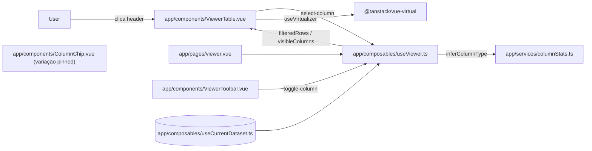
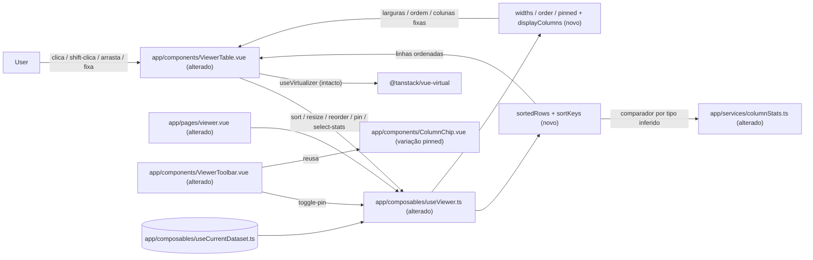

# Implementation Plan

## Request Summary
- Objective: adicionar quatro interações de cabeçalho ao Viewer — ordenação (clique / Shift+clique por tipo inferido), redimensionamento de largura, reordenação e fixação (pin) de colunas — preservando a virtualização de linhas e mantendo todo o estado apenas em memória de sessão.
- Scope:
  - **In**: ordenação single/multi-coluna com indicadores e prioridade (RF-01, RF-02, RF-03, UI-01, UI-02); redimensionamento por arraste com mínimo de 48px (RF-04, UI-03); reordenação por arraste dentro de grupos (RF-05, UI-04); pin à esquerda com sticky e ordem de fixação (RF-06, UI-05); affordance dedicado de seleção para estatísticas (UI-06); preservação da virtualização (RF-07); estado síncrono/em memória (RNF-01..RNF-04).
  - **Out**: persistência durável em IndexedDB (feature `sessions`); pin à direita; agrupamento/pivot; ordenação server-side; virtualização de colunas; filtros avançados/exportação; reordenação por teclado.
- Tier: standard
- Architecture references: `AGENTS.md`, `docs/agents/architecture.md` (stale), `docs/agents/domain_rules.md` (stale), `docs/agents/coding_guidelines.md`, `docs/agents/tech_stack.md`.

**Regras de layering aplicáveis (fonte da verdade = código + `coding_guidelines.md`):**
- `docs/agents/coding_guidelines.md` regra 1 — SFCs `<script setup lang="ts">` com props tipadas (`defineProps<{...}>()`).
- `docs/agents/coding_guidelines.md` regra 2 — **estado derivado via `computed`**, lógica fora do template; observada em `useViewer.ts` e `CsvCell.vue`.
- `docs/agents/coding_guidelines.md` regra 4 — cada componente/serviço acompanha um spec Vitest (`@vue/test-utils` `mount` para SFC; import direto para serviço/composable), aliases `~`/`@` → `./app` (`vitest.config.ts`).
- Convenção de-facto (não em `architecture.md`, que está stale) — **lógica reativa pura vive em composables/serviços** (`app/composables/useViewer.ts`, `app/services/columnStats.ts`); componentes permanecem finos/presentacionais (`ViewerTable.vue`, `ViewerToolbar.vue`). A extensão de ordenação/estado de colunas DEVE morar em `useViewer.ts`, não na SFC.
- `docs/agents/tech_stack.md` — validar com `yarn test` (vue-tsc/TS7 quebrado, ver MEMORY); nunca `npm`/`pnpm`; Node ≥ 22.12.

## AS IS — Componentes impactados

Legenda: `viewer.vue` compõe `useViewer` (busca, colunas visíveis, seleção) sobre o dataset em memória de `useCurrentDataset`; `ViewerTable.vue` renderiza só as linhas visíveis via `useVirtualizer` com `COL_WIDTH` uniforme (`ViewerTable.vue:45`). Hoje o clique no cabeçalho apenas seleciona a coluna para o painel de estatísticas — não ordena, redimensiona, reordena nem fixa. `ColumnChip.vue` já possui a variação visual `pinned` (`ColumnChip.vue:26-40`) ainda não usada pelo Viewer.

## TO BE — Componentes propostos

Legenda: `useViewer.ts` (alterado) ganha `parseDate`+comparador em `columnStats.ts` (T01, T02), a máquina de estados de ordenação `sortKeys`/`sortedRows` (T03) que realiza RF-01/RF-02/RF-03/RNF-02, o estado de larguras (T04, RF-04) e o estado de ordem+pin com `displayColumns` (T05, RF-05/RF-06). `ViewerTable.vue` (alterado) expõe os affordances de ordenação+indicadores+seleção-de-stats (T06, UI-01/UI-02/UI-06), redimensionamento (T07, RF-04/UI-03), arraste de reordenação (T08, RF-05/UI-04) e renderização de pin sticky (T09, RF-06/UI-05a), mantendo `useVirtualizer` intacto (RF-07/RNF-01, coberto por T12). `ViewerToolbar.vue` (alterado) ganha o controle de pin no menu "Colunas" reusando `ColumnChip` pinned (T10, UI-05b). `viewer.vue` (alterado) faz a fiação ponta-a-ponta (T11). Nenhum nó novo depende de rede ou código não verificado.

## Tasks

### T01 — `parseDate`: conversão de célula-data em valor comparável (pt-BR DMY)
- **Files**: `app/services/columnStats.ts`
- **Change**: adicionar função pura exportada `parseDate(value: Cell): number | null` que devolve um timestamp comparável (ou `null` para vazio/não-data), reusando os regexes já presentes (`DATE_ISO_RE`, `DATE_DMY_RE`, `ViewerTable`/`columnStats.ts:83-117`). Formato ISO usa ano/mês/dia; para o ramo `DD..MM..YYYY` ambíguo assumir sempre **dia/mês/ano (DMY)** para a coluna inteira (RF-03), sem detecção de ordem dominante. Não alterar `isDateValue`/`inferColumnType`.
- **Covers**: RF-03
- **Tests**: `test/columnStats.spec.ts` — `parseDate('2026-01-02') < parseDate('2026-01-10')`; `parseDate('03/02/2026')` equivale a 3 de fevereiro (DMY, não 2 de março); `parseDate('')`/`parseDate(null)`/`parseDate('foo')` → `null`.
- **Risk**: Low — função aditiva e pura; não toca a inferência existente.
- **Dependencies**: none

### T02 — Comparador por tipo inferido com vazios ao fim
- **Files**: `app/services/columnStats.ts`
- **Change**: adicionar `makeComparator(type: ColumnType, direction: 'asc' | 'desc'): (a: Cell, b: Cell) => number` puro. Regras (RF-03): células vazias por `isEmptyCell` (`columnStats.ts:63`) sempre AO FINAL, independentemente da direção; `number` compara por `parseNumber`; `date` por `parseDate` (T01); `text` por comparação estável (`localeCompare` ou code-point). Empates retornam `0` (a estabilidade do `Array.prototype.sort` do V8 preserva a ordem — viabiliza multi-key). Manter a lógica no serviço (regra de layering), sem tocar componentes.
- **Covers**: RF-03
- **Tests**: `test/columnStats.spec.ts` — coluna `number` ordena `2 < 10 < 100` (não como texto); coluna `date` ordena `2026-01-02` antes de `2026-01-10`; em `asc` e em `desc` os vazios (`''`, `null`, `undefined`) aparecem após todos os preenchidos.
- **Risk**: Low — pura e isolada; espelha o padrão testável de `columnStats.ts`.
- **Dependencies**: T01

### T03 — Máquina de estados de ordenação + `sortedRows` em `useViewer`
- **Files**: `app/composables/useViewer.ts`
- **Change**: adicionar estado reativo `sortKeys: Ref<{ index: number; direction: 'asc' | 'desc' }[]>` (chave = índice ORIGINAL da coluna) e ações `sortColumn(index)` / `sortColumnAdditive(index)`. `sortColumn` (clique simples, RF-01): reduz a uma única chave nessa coluna e avança o ciclo `asc → desc → sem-ordenação` (na 3ª vez esvazia). `sortColumnAdditive` (Shift+clique, RF-02): adiciona a coluna ao fim das chaves preservando a ordem de prioridade das existentes; cada chave percorre `asc → desc → sem-ordenação` e ao chegar em "sem-ordenação" é REMOVIDA (as demais mantêm ordem relativa). Expor `computed sortedRows` derivado de `filteredRows` (`useViewer.ts:93-101`): sem chaves → retorna `filteredRows` intacto; com chaves → cópia ordenada aplicando `makeComparator` (T02) por tipo (de `columnTypes`) em ordem de prioridade decrescente, **síncrono** (`computed`, sem Worker/chunking — RNF-02). Estado só em memória, nada gravado em IndexedDB (RNF-04). Incluir `sortKeys`, `sortColumn`, `sortColumnAdditive`, `sortedRows` no `return`.
- **Covers**: RF-01, RF-02, RF-03, RNF-02, RNF-04
- **Tests**: `test/useViewer.spec.ts` — 3 chamadas de `sortColumn(i)` produzem asc, desc e ordem original de `filteredRows`; após multi-sort, `sortColumn` reduz a uma chave; `sortColumnAdditive(A)` então `(B)` ordena por A e, em empate, por B com prioridade A=1/B=2; 3º `sortColumnAdditive(A)` remove A e B assume prioridade 1; `sortedRows` reflete a busca ativa (deriva de `filteredRows`).
- **Risk**: Medium — núcleo comportamental multi-key; cópia O(n·log n) por ordenação é intencional (não O(linhas) por interação de coluna, RNF-03).
- **Dependencies**: T02

### T04 — Estado de larguras de coluna em `useViewer` (chave = índice original)
- **Files**: `app/composables/useViewer.ts`
- **Change**: adicionar `widths: Ref<Map<number, number>>` com chave no índice ORIGINAL da coluna (sobrevive a ocultar/reexibir e reordenar — RF-04) e ação `resizeColumn(index: number, width: number)` que aplica `Math.max(48, width)` (mínimo 48px, sem máximo — RF-04). Expor um helper `columnWidth(index): number` (fallback ao default `180`) para o componente consumir. Apenas em memória (RNF-04); operação O(1), sem re-parse nem cópia de linhas (RNF-03). Incluir no `return`.
- **Covers**: RF-04, RNF-03, RNF-04
- **Tests**: `test/useViewer.spec.ts` — `resizeColumn(0, 300)` → `columnWidth(0) === 300`; `resizeColumn(0, 10)` clampa em `48`; alterar visibilidade de outra coluna não muda `columnWidth(0)` (chave por índice original).
- **Risk**: Low — estado aditivo isolado; não interfere em `sortedRows`.
- **Dependencies**: T03 (mesmo arquivo; sequenciado para evitar conflito de edição)

### T05 — Estado de ordem + pin e `displayColumns` em `useViewer`
- **Files**: `app/composables/useViewer.ts`
- **Change**: adicionar `order: Ref<number[]>` (posição → índice original, default = ordem do header), `pinned: Ref<Set<number>>` (chave = índice original) com registro da SEQUÊNCIA de fixação para a ordem do grupo fixado (RF-06). Ações: `pinColumn(index)`/`unpinColumn(index)`/`togglePin(index)`; `reorderColumn(from: number, to: number)` que reposiciona DENTRO do grupo do índice (fixado vs não-fixado), respeitando o limite entre grupos — nunca move uma coluna não-fixada para dentro do grupo fixado nem vice-versa (RF-05). Expor `computed displayColumns: ViewerColumn[]` = colunas VISÍVEIS na ordem final = [grupo fixado na ordem de fixação] ++ [grupo não-fixado na ordem de `order`], cada uma anotada com `pinned`/largura via os helpers. Adicionar `pinned` ao tipo `ViewerColumn`. Estado só em memória (RNF-04), reordenar/fixar são O(colunas) sobre estado de visualização, sem re-parse nem cópia O(linhas) (RNF-03). Incluir tudo no `return`.
- **Covers**: RF-05, RF-06, RNF-03, RNF-04
- **Tests**: `test/useViewer.spec.ts` — `reorderColumn(2,0)` move a coluna da posição 3 para 1 em `displayColumns`; tentar soltar uma coluna não-fixada à esquerda de uma fixada mantém-na no grupo não-fixado; `pinColumn(C)` depois `pinColumn(A)` faz `displayColumns` começar por C, A (ordem de fixação), ambas antes das não-fixadas; ocultar/reexibir preserva ordem/pin (chave por índice original).
- **Risk**: Medium — invariante de dois grupos e ordem de pin; regressão possível em `displayColumns`.
- **Dependencies**: T04 (mesmo arquivo; sequenciado)

### T06 — `ViewerTable`: ordenação por clique, indicadores/prioridade e affordance de estatísticas
- **Files**: `app/components/ViewerTable.vue`
- **Change**: trocar o clique de seleção-de-stats do `<th>` (`ViewerTable.vue:93-100`) por: clique simples no cabeçalho → emitir `sort` (RF-01); `@click` com `event.shiftKey` → emitir `sort-additive` (RF-02). Adicionar prop `sortKeys` (índice+direção+prioridade derivada) para renderizar UI-01 (indicador asc/desc por FORMA/ícone, nada quando sem ordenação, distinguível sem depender só de cor) e UI-02 (número de prioridade em multi-sort). Adicionar um affordance DEDICADO (ícone/botão) para `select-column` (stats) distinto do clique de ordenação (UI-06). Manter `useVirtualizer` e o corpo intactos (RF-07). Estilo via `<style scoped>` + custom properties/tokens (convenção de-facto do Viewer; regra Tailwind de `coding_guidelines.md` está stale para o Viewer).
- **Covers**: RF-01, RF-02, UI-01, UI-02, UI-06
- **Acceptance criteria**: um clique simples ordena e NÃO abre stats; o cabeçalho ordenado mostra ícone asc/desc distinguível por forma; em multi-sort cada cabeçalho participante mostra seu número de prioridade correto (1,2,3…); o affordance dedicado abre/atualiza o painel de stats sem mexer na ordenação. Ref de design: `.spec/init/design/README.md#screen-2--visualizador-principal` e `.spec/init/design/screen-2-visualizador.png`.
- **Risk**: Medium — muda a semântica de clique existente (seleção → ordenação); atualizar `ViewerTable.spec.ts` e a fiação em T11.
- **Dependencies**: T03

### T07 — `ViewerTable`: redimensionamento por arraste e larguras por coluna
- **Files**: `app/components/ViewerTable.vue`
- **Change**: adicionar handle de resize (faixa ~6px na borda direita do `<th>`) com Pointer Events emitindo `resize` (índice original, nova largura) para `resizeColumn` (T04); cursor `col-resize` distinto do restante do cabeçalho (UI-03). Substituir `gridWidth` uniforme (`ViewerTable.vue:55`) pela SOMA das larguras por coluna e aplicar `--col-w` por `<th>`/célula a partir da largura de cada coluna (`ViewerTable.vue:139` já herda `--col-w`). Preservar virtualização (RF-07).
- **Covers**: RF-04, UI-03, RF-07
- **Acceptance criteria**: arrastar a borda muda a largura renderizada correspondente e ela permanece ao rolar/ordenar/alternar visibilidade; arrastar além do limite não reduz abaixo de 48px; o ponteiro sobre a borda mostra affordance de resize, distinto da área de ordenação/arraste. Ref de design: `.spec/init/design/screen-2-visualizador.png`.
- **Risk**: Medium — `gridWidth`/`table-layout: fixed` é sensível a alinhamento (ver histórico de fixes de desalinhamento); manter larguras definidas.
- **Dependencies**: T04, T06 (mesmo arquivo; sequenciado)

### T08 — `ViewerTable`: reordenação de colunas por arraste com feedback
- **Files**: `app/components/ViewerTable.vue`
- **Change**: tornar o corpo do `<th>` arrastável (Pointer Events / drag) emitindo `reorder(from, to)` para `reorderColumn` (T05) ao concluir o arraste, refletindo a nova ordem imediatamente via `displayColumns` (RF-05). Respeitar o limite de grupos (soltar em grupo alheio é no-op, garantido no estado T05). Feedback visual UI-04 (coluna em movimento e/ou marcador da posição-alvo). Zona de arraste distinta do handle de resize (UI-03) e do affordance de stats (UI-06). Preservar virtualização (RF-07).
- **Covers**: RF-05, UI-04, RF-07
- **Acceptance criteria**: arrastar a coluna da posição 3 para 1 re-renderiza cabeçalho e células nessa posição sem recarregar; há indicação visível da coluna movida ou do ponto de inserção; soltar uma coluna não-fixada à esquerda de uma fixada não a insere no grupo fixado. Ref de design: `.spec/init/design/screen-2-visualizador.png`.
- **Risk**: Medium — coordenar drag de reorder com clique de ordenação e handle de resize no mesmo `<th>` sem conflito de gestos.
- **Dependencies**: T05, T07 (mesmo arquivo; sequenciado)

### T09 — `ViewerTable`: renderização de pin (sticky) e controle de pin no cabeçalho
- **Files**: `app/components/ViewerTable.vue`
- **Change**: renderizar as colunas fixadas com `position: sticky; left: <offset>` acumulando as larguras das colunas fixadas à esquerda (RF-06), aplicando estado visual "fixada" distinto (UI-05a). Adicionar ícone/botão de pin no `<th>` emitindo `toggle-pin(index)` para `togglePin` (T05). Consumir `displayColumns` (grupo fixado primeiro, na ordem de fixação). Preservar virtualização e alinhamento das células fixadas no corpo (RF-07).
- **Covers**: RF-06, UI-05, RF-07
- **Acceptance criteria**: com scroll horizontal (dataset mais largo que a viewport) a coluna fixada permanece na borda esquerda enquanto as não-fixadas rolam sob ela; fixar C depois A renderiza C à esquerda de A antes das não-fixadas; a coluna fixada é visualmente distinguível; o botão de pin do cabeçalho alterna a fixação. Ref de design: `.spec/init/design/screen-2-visualizador.png`.
- **Risk**: Medium — `sticky` sobre `table-layout: fixed` com corpo virtualizado (linhas `position: absolute`, `ViewerTable.vue:186-190`) exige offsets corretos para não desalinhar.
- **Dependencies**: T05, T08 (mesmo arquivo; sequenciado)

### T10 — `ViewerToolbar`: controle de pin no menu "Colunas" reusando `ColumnChip`
- **Files**: `app/components/ViewerToolbar.vue`
- **Change**: adicionar em cada item do menu "Colunas" (`ViewerToolbar.vue:68-81`) um controle equivalente de fixar/desfixar, emitindo `toggle-pin(index)`, e refletir o estado "pinned" reusando a variação visual de `ColumnChip.vue` (`ColumnChip.vue:26-40`). Requer `pinned` no tipo `ViewerColumn` (T05). Mesmo estado de fixação do cabeçalho (UI-05 — dois controles equivalentes).
- **Covers**: UI-05
- **Acceptance criteria**: fixar/desfixar pelo menu "Colunas" produz o mesmo resultado que pelo cabeçalho (mesmo estado); o item de coluna fixada é visualmente distinguível reusando a variação `pinned` de `ColumnChip`. Ref de design: `.spec/init/design/screen-2-visualizador.png`.
- **Risk**: Low — aditivo à toolbar; nenhum conflito com a busca/toggle existentes.
- **Dependencies**: T05

### T11 — `viewer.vue`: fiação ponta-a-ponta das novas interações
- **Files**: `app/pages/viewer.vue`
- **Change**: extrair de `useViewer` os novos itens (`sortKeys`, `sortColumn`, `sortColumnAdditive`, `sortedRows`, `resizeColumn`, `columnWidth`, `reorderColumn`, `togglePin`, `displayColumns`); passar `displayColumns` como `:columns` e `sortedRows` como `:rows` ao `ViewerTable` (`viewer.vue:53-58`, hoje `visibleColumns`/`filteredRows`); ligar os handlers `@sort`, `@sort-additive`, `@resize`, `@reorder`, `@toggle-pin`, `@select-column`; passar `columns` (com `pinned`) e `@toggle-pin` ao `ViewerToolbar` (`viewer.vue:45-50`).
- **Covers**: RF-01, RF-02, RF-04, RF-05, RF-06, UI-05, UI-06
- **Acceptance criteria**: no Viewer real, ordenar/redimensionar/reordenar/fixar pelo cabeçalho e o pin pelo menu "Colunas" produzem o efeito descrito nas ACs de RF-01..RF-06; a tabela recebe linhas ordenadas e colunas na ordem de exibição; recarregar a página descarta todo o estado (RNF-04).
- **Risk**: Medium — ponto de integração; troca de `visibleColumns`/`filteredRows` por `displayColumns`/`sortedRows` deve manter as invariantes de busca (`useViewer.ts:93-101`).
- **Dependencies**: T06, T07, T08, T09, T10

### T12 — Invariante de virtualização sob todas as interações
- **Files**: `test/ViewerTable.spec.ts`
- **Change**: adicionar caso(s) garantindo que, com um dataset grande e ordenação/redimensionamento/reordenação/fixação aplicados, o número de `<tr>` de corpo no DOM permanece limitado a (linhas visíveis + overscan=12, `ViewerTable.vue:64`) e não cresce proporcionalmente ao total de linhas (RF-07, RNF-01). Ajustar os specs existentes de `ViewerTable` para a nova semântica de clique (sort em vez de select) e novas props, mantendo o padrão `@vue/test-utils mount` (regra 4).
- **Covers**: RF-07, RNF-01
- **Acceptance criteria**: montando `ViewerTable` com N grande (ex.: milhares) de linhas e cada interação aplicada, a contagem de `<tr>` de corpo permanece na ordem de (visíveis + 12), independente de N; os specs de `ViewerTable` passam com a nova semântica (`yarn test`).
- **Risk**: Low — teste; happy-dom pode exigir stub de dimensões do scroller para o virtualizer.
- **Dependencies**: T06, T07, T08, T09

## Execution Phases
| Phase | Tasks | Parallel-safe? |
|-------|-------|----------------|
| 1 | T01 | N/A (tarefa única) |
| 2 | T02 | Não (mesmo arquivo de T01; depende de T01) |
| 3 | T03 | Não (depende de T02) |
| 4 | T04 | Não (mesmo arquivo de T03) |
| 5 | T05 | Não (mesmo arquivo de T04) |
| 6 | T06 | Não (depende de T03) |
| 7 | T07 | Não (mesmo arquivo de T06; depende de T04) |
| 8 | T08 | Não (mesmo arquivo de T07; depende de T05) |
| 9 | T09, T10 | Sim (arquivos distintos: ViewerTable.vue × ViewerToolbar.vue; ambos dependem de T05) |
| 10 | T11 | Não (integração; depende de T06–T10) |
| 11 | T12 | Não (depende de T06–T09) |

## Risks
| Risk | Blast radius | Mitigation | Rollback |
|------|-------------|------------|----------|
| Ordenação síncrona de ~1M linhas congela a UI | Todo o Viewer durante a ordenação | `sortedRows` como `computed` estável (V8), sem cópia por interação de coluna; critério qualitativo (RNF-02); só copia ao ordenar, não ao redimensionar/reordenar/fixar (RNF-03) | Reverter T03; retorno de `filteredRows` sem ordenação |
| `sticky` + `table-layout: fixed` + corpo virtualizado desalinha colunas fixadas | Renderização da tabela (regressão visual conhecida no histórico de fixes) | Offsets acumulados por soma de larguras; validar alinhamento cabeçalho/corpo; T12 cobre a virtualização | Reverter T09; render sem pin |
| Conflito de gestos no `<th>`: clique-ordenar × handle-resize × drag-reorder × affordance-stats | Interações de cabeçalho | Zonas distintas (resize ~6px na borda, UI-03; stats em botão dedicado, UI-06; ordenar = clique no corpo; reorder = arraste), sequenciamento T06→T07→T08→T09 no mesmo arquivo | Reverter a task do gesto conflitante isoladamente |
| Troca de `visibleColumns`/`filteredRows` por `displayColumns`/`sortedRows` quebra busca/visibilidade | Integração do Viewer | Manter invariante de busca (`useViewer.ts:93-101`); `displayColumns` filtra por `visible`; T11 valida ponta-a-ponta | Reverter T11; voltar a `visibleColumns`/`filteredRows` |
| Estado vaza para IndexedDB, invadindo escopo de `sessions` | Persistência / fronteira de feature | Todo estado em `ref`/`Map`/`Set` de sessão; nenhuma escrita em `useDatabase`/stores; AC de RNF-04 | Nenhuma escrita adicionada — sem rollback de dados |

## Open Questions
- **Docs de arquitetura desatualizadas (não bloqueante).** `docs/agents/architecture.md` e `docs/agents/domain_rules.md` afirmam que só existe `CsvCell.vue` e "nenhum estado/tabela implementado", o que contradiz o código entregue (Fases 6–8: `ViewerTable.vue`, `useViewer.ts`, `columnStats.ts`). O plano segue o CÓDIGO + `coding_guidelines.md` (fonte da verdade), não o texto stale. Impacto: este plano NÃO pode ser apresentado como validado por `architecture.md`; recomenda-se rerun de `/ai-context` após a feature. Não bloqueia a execução.
- **Convenção de estilo Tailwind vs `<style scoped>` (baixo impacto).** `coding_guidelines.md` regra 3 documenta "Tailwind utility classes, sem `<style scoped>`", mas os componentes do Viewer (`ViewerTable.vue`, `ViewerToolbar.vue`, `ColumnChip.vue`) usam `<style scoped>` com custom properties/tokens. O plano segue a convenção de-facto do Viewer (scoped + tokens). Impacto: apenas estilo; nenhuma AC afetada.
- **Coluna ordenada porém oculta (baixo impacto).** RF-04/RF-05/RF-06 dizem que larguras/ordem/pin (chave por índice original) sobrevivem a ocultar/reexibir; a especificação não diz explicitamente se uma chave de ordenação (RF-01/RF-02) deve continuar aplicada quando a coluna correspondente está OCULTA. Assunção adotada (ver Assumptions): `sortKeys` persiste por índice original e a ordenação continua aplicada mesmo com a coluna oculta, coerente com o comportamento das demais chaves.

## Assumptions
- A extensão de estado vive em `useViewer.ts` (não em um `useTableInteractions` irmão): decisão FLEXIBLE resolvida pela menor superfície de fiação e pela composição única já feita em `viewer.vue` — verificado em `viewer.vue:27-38`.
- `Array.prototype.sort` do V8 é estável (Node ≥ 22), habilitando o multi-key incremental e a preservação da ordem original em empates — base do FLEXIBLE do SPEC.
- `ColumnChip.vue` já expõe a variação `pinned` reutilizável (`ColumnChip.vue:26-40`) — verificado; T10 a reusa em vez de recriar o visual.
- O overscan permanece 12 (`ViewerTable.vue:64`) e `--col-w` por célula é o mecanismo vigente de largura (`ViewerTable.vue:139`) — verificado; T07 soma larguras por coluna a partir desse padrão.
- `sortKeys`/`widths`/`order`/`pinned` persistem por índice ORIGINAL da coluna e continuam válidos após ocultar/reexibir/reordenar (RF-04/05/06); uma chave de ordenação de coluna oculta permanece aplicada — [UNVERIFIED: não afirmado literalmente na SPEC; inferido por coerência com RF-01/02 e a regra de chave-por-índice-original].
- Validação de tipos via `yarn test` (Vitest), não `vue-tsc` — vue-tsc/TS7 quebrado (MEMORY: `vue-tsc-typescript7-broken`).
