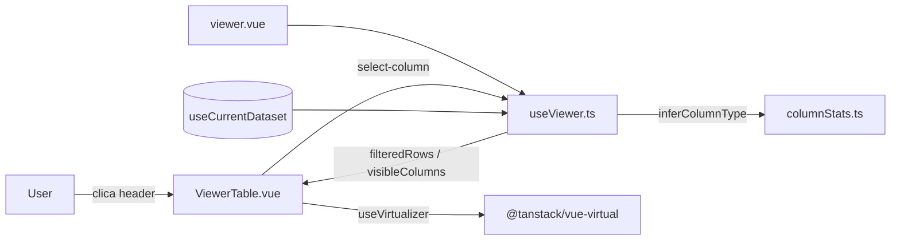
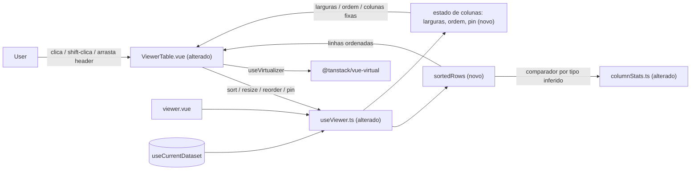

# SPEC: table-interactions

## Metadata
- Source: developer description via /plan
- Service: csvview (SPA estática Nuxt 4, 100% client-side, sem backend)
- Tier: standard
- Version: 1.1
- Architecture references: `AGENTS.md`, `docs/agents/architecture.md`, `docs/agents/domain_rules.md`, `docs/agents/coding_guidelines.md`, `docs/agents/tech_stack.md`
  - NOTA: `architecture.md`/`domain_rules.md` estão desatualizados — descrevem apenas `CsvCell.vue` e afirmam que "nenhum estado/tabela está implementado", o que já não corresponde ao código (Fases 6–8 entregues: `ViewerTable.vue`, `useViewer.ts`, `columnStats.ts`). As regras de layering aplicáveis foram extraídas de `coding_guidelines.md` e da convenção de-facto observada no código.

## Context

O Viewer já entrega (Fases 7–8) uma tabela virtualizada com busca global, seletor de colunas (mostrar/ocultar) e painel de estatísticas. A lógica de apresentação vive no composable `app/composables/useViewer.ts` (busca, colunas visíveis, tipos inferidos, seleção), consumindo o dataset em memória de `app/composables/useCurrentDataset.ts` e a inferência de tipo de `app/services/columnStats.ts` (`inferColumnType`, tipos `number`/`date`/`text`). A renderização virtualizada está em `app/components/ViewerTable.vue` via `useVirtualizer` do `@tanstack/vue-virtual` (`ViewerTable.vue:59-66`), com largura de coluna fixa em `COL_WIDTH = 180` (`ViewerTable.vue:45`) e `table-layout: fixed`.

Esta feature adiciona, pós-MVP, quatro interações de cabeçalho preservando a virtualização: ordenação (clique / Shift+clique multi-coluna, respeitando o tipo inferido), redimensionamento de largura (arrastar borda), reordenação de colunas (arrastar cabeçalho) e fixação à esquerda (pin). Estado (larguras, ordem, colunas fixadas, ordenação) é **apenas em memória de sessão** — a persistência durável em IndexedDB é escopo da feature `sessions`, fora daqui. A convenção do repositório coloca a lógica reativa em composables/serviços puros e mantém os componentes presentacionais (observado em `useViewer.ts`, `columnStats.ts`; `coding_guidelines.md` regra 2 "Derived state via computed"): a extensão de ordenação/estado de colunas deve morar em `useViewer` (ou um composable irmão), não na SFC.

## AS IS — Estado atual

Legenda: `viewer.vue` compõe `useViewer` (busca, colunas visíveis, seleção) sobre o dataset em memória de `useCurrentDataset`; `ViewerTable.vue` renderiza apenas as linhas visíveis via `useVirtualizer`. O clique no cabeçalho hoje apenas seleciona a coluna para o painel de estatísticas — não ordena, redimensiona, reordena nem fixa.

## TO BE — Estado proposto

Legenda: `useViewer` ganha `sortedRows` (novo) realizando RF-01, RF-02 e RF-03, e um estado de colunas (novo) para larguras/ordem/pin realizando RF-04, RF-05 e RF-06. `ViewerTable.vue` (alterado) passa a expor os affordances de ordenação, redimensionamento, arraste e fixação (UI-01..UI-05) mantendo `useVirtualizer` intacto (RF-07). `columnStats.ts` (alterado) fornece o comparador por tipo inferido consumido por RF-03. Nenhum nó novo depende de rede ou de código não verificado.

## Scope
- **In**: ordenação de coluna única e multi-coluna com indicadores; ordenação por tipo inferido com nulos ao fim; redimensionamento de largura por arraste (persistência em memória de sessão); reordenação de colunas por arraste; fixação (pin) de coluna à esquerda; preservação da virtualização de linhas em todas as interações.
- **Out**: persistência durável de larguras/ordem/pin em IndexedDB (feature `sessions`); fixação à direita; agrupamento/pivot; ordenação server-side; virtualização de colunas; filtros avançados e exportação (adiados no MVP); reordenação por teclado (não especificada nas ACs).

## RIGID (Non-Negotiable)

### Functional Requirements

- RF-01 [Event-Driven]: QUANDO o usuário dá um clique simples (sem Shift) no cabeçalho de uma coluna, o sistema DEVE tratar essa coluna como a única chave de ordenação — descartando quaisquer outras chaves ativas — e avançar seu estado no ciclo `asc → desc → sem ordenação`, reordenando as linhas exibidas conforme o estado resultante. O clique simples é a ação de ordenação: a seleção de coluna para o painel de estatísticas NÃO é mais disparada pelo clique simples no cabeçalho, mas por um affordance dedicado (ver UI-06).
  - AC: partindo de "sem ordenação", três cliques simples sucessivos no mesmo cabeçalho produzem, nesta ordem, linhas ascendentes, linhas descendentes e a ordem original do dataset.
  - AC: com uma ordenação multi-coluna ativa (RF-02), um clique simples em qualquer cabeçalho reduz a ordenação a uma única chave nessa coluna (as demais chaves são descartadas).

- RF-02 [Event-Driven]: QUANDO o usuário aciona o modificador Shift ao clicar em um cabeçalho, o sistema DEVE adicionar essa coluna às chaves de ordenação ativas sem descartar as anteriores, tratando as colunas como chaves em ordem de prioridade decrescente na sequência em que foram adicionadas. Cada chave percorre o mesmo ciclo de três estados `asc → desc → sem ordenação`; ao atingir "sem ordenação", a coluna é REMOVIDA do conjunto de chaves ativas (as demais chaves mantêm sua ordem relativa de prioridade).
  - AC: com a coluna A já ordenada, Shift+clique em B ordena as linhas primeiro por A e, em empates de A, por B; a prioridade de A (1) e B (2) é distinguível.
  - AC: com A e B ativas, o terceiro Shift+clique em A a remove das chaves; B permanece ativa e assume a prioridade 1.

- RF-03 [State-Driven]: ENQUANTO houver ordenação ativa, o sistema DEVE comparar valores respeitando o tipo inferido da coluna (`number` por valor numérico, `date` cronologicamente, `text` lexicograficamente) e agrupar células vazias (`null`/`undefined`/`''` conforme `isEmptyCell`, `columnStats.ts:63`) ao final, independentemente da direção asc/desc. Para o ramo `date`, quando o formato dia/mês for ambíguo (ex.: `DD/MM/YYYY` vs `MM/DD/YYYY`), o sistema DEVE assumir a convenção pt-BR **dia/mês/ano (DMY)** para a coluna inteira; não há detecção de ordem dominante por coluna.
  - AC: uma coluna `number` ordena `2 < 10 < 100` (não como texto); uma coluna `date` ordena `2026-01-02` antes de `2026-01-10`; uma coluna `date` com valores ambíguos como `03/02/2026` é interpretada como 3 de fevereiro (DMY) ao comparar; em qualquer direção, as células vazias aparecem após todas as células preenchidas.

- RF-04 [Event-Driven]: QUANDO o usuário arrasta a borda direita de um cabeçalho de coluna, o sistema DEVE ajustar a largura dessa coluna conforme o deslocamento, respeitando uma largura mínima de **48px** (sem largura máxima), e reter a largura resultante durante a sessão atual. NÃO há auto-ajuste ("auto-fit") nem duplo-clique para dimensionar ao conteúdo. A largura DEVE ser mantida no estado com chave pelo **índice original da coluna** (não pela posição renderizada), de modo a sobreviver a ocultar/reexibir e reordenar colunas.
  - AC: após arrastar a borda, a largura renderizada da coluna muda de forma correspondente e permanece a mesma ao rolar, ordenar ou alternar visibilidade de colunas na mesma sessão.
  - AC: arrastar a borda além do limite inferior não reduz a largura da coluna abaixo de 48px.

- RF-05 [Event-Driven]: QUANDO o usuário arrasta o corpo de um cabeçalho para outra posição, o sistema DEVE reposicionar a coluna arrastada na nova posição e refletir a nova ordem na tabela imediatamente ao concluir o arraste. A reordenação opera DENTRO de cada grupo (grupo fixado / grupo não fixado): uma coluna não fixada NÃO pode ser solta à esquerda de uma coluna fixada, nem vice-versa — o limite entre os grupos é respeitado (ver RF-06). A ordem DEVE ser mantida no estado com chave pelo índice original da coluna.
  - AC: arrastar a coluna da posição 3 para a posição 1 faz com que cabeçalho e células dessa coluna passem a ser renderizados na posição 1 sem recarregar a página.
  - AC: tentar soltar uma coluna não fixada à esquerda de uma coluna fixada não a insere no grupo fixado; ela permanece no grupo não fixado.

- RF-06 [State-Driven]: ENQUANTO uma coluna estiver fixada (pin) à esquerda, o sistema DEVE deslocá-la para a borda esquerda da tabela (à frente de todas as colunas não fixadas) e mantê-la visível e em posição fixa durante o scroll horizontal. Quando houver múltiplas colunas fixadas, sua ordem relativa da esquerda para a direita DEVE seguir a **sequência em que foram fixadas** (ordem de pin). O conjunto de colunas fixadas DEVE ser mantido no estado com chave pelo índice original da coluna.
  - AC: com scroll horizontal aplicado a um dataset mais largo que a viewport, a coluna fixada permanece renderizada na borda esquerda enquanto as colunas não fixadas rolam sob ela.
  - AC: fixar C e depois A renderiza C à esquerda de A no grupo fixado (ordem de fixação), ambas antes de qualquer coluna não fixada.

- RF-07 [State-Driven]: ENQUANTO qualquer das interações (ordenar, redimensionar, reordenar, fixar) estiver ativa ou aplicada, o sistema DEVE manter a virtualização de linhas (`@tanstack/vue-virtual`), renderizando apenas as linhas visíveis mais o overscan e sem materializar todas as linhas do dataset no DOM.
  - AC: com um dataset de ~1.000.000 linhas e qualquer interação aplicada, o número de elementos `<tr>` de corpo no DOM permanece limitado às linhas visíveis + overscan (não cresce proporcionalmente ao total de linhas).

### UI Requirements

- UI-01 [Ubiquitous]: O cabeçalho de uma coluna ordenada DEVE exibir um indicador visual da direção de ordenação (ascendente, descendente) e nenhum indicador quando não há ordenação.
  - AC: o indicador reflete asc/desc/nenhum de forma distinguível por forma/ícone (não apenas por cor).

- UI-02 [Ubiquitous]: Em ordenação multi-coluna, cada cabeçalho participante DEVE exibir seu número de prioridade (1, 2, 3…).
  - AC: com 3 colunas ordenadas, cada cabeçalho mostra seu índice de prioridade correto e distinto.

- UI-03 [Ubiquitous]: A borda de redimensionamento do cabeçalho DEVE apresentar um affordance de arraste (ex.: cursor `col-resize`) distinto da área de reordenação/ordenação, para não conflitar com o clique de ordenação (RF-01) nem com o arraste de reordenação (RF-05).
  - AC: posicionar o ponteiro sobre a borda de redimensionamento apresenta o affordance de resize; o resto do cabeçalho, o affordance de ordenação/arraste.

- UI-04 [Ubiquitous]: Durante o arraste de reordenação, o sistema DEVE apresentar feedback visual da coluna em movimento e/ou da posição-alvo de soltura.
  - AC: ao arrastar um cabeçalho, há indicação visível da coluna sendo movida ou do ponto onde ela será inserida.

- UI-05 [Ubiquitous]: Uma coluna fixada DEVE ter estado visual de "fixada" distinto das colunas não fixadas, e o usuário DEVE dispor de dois controles equivalentes para fixar/desfixar: (a) um ícone/botão de pin no próprio cabeçalho da coluna e (b) um item no menu "Colunas" do `ViewerToolbar`, reutilizando a variação visual "pinned" de `ColumnChip.vue` (`ColumnChip.vue:26-40`). Ambos os controles operam sobre o mesmo estado de fixação.
  - AC: uma coluna fixada é visualmente distinguível de uma não fixada; fixar/desfixar pelo ícone do cabeçalho e pelo menu "Colunas" produz o mesmo resultado.

- UI-06 [Ubiquitous]: A seleção de uma coluna para o painel de estatísticas DEVE ser disparada por um affordance dedicado no cabeçalho (ícone/botão), distinto do clique simples (agora reservado à ordenação, RF-01) e das zonas de redimensionamento (UI-03) e arraste de reordenação (RF-05).
  - AC: acionar o affordance de estatísticas de uma coluna abre/atualiza o painel de estatísticas dessa coluna sem alterar o estado de ordenação; o clique simples no cabeçalho ordena e não seleciona a coluna para estatísticas.

### Non-Functional Requirements

- RNF-01: Em todas as interações, o número de elementos `<tr>` de corpo materializados no DOM DEVE permanecer limitado a (linhas visíveis + overscan), com overscan = 12 (`ViewerTable.vue:64`), independentemente do total de linhas do dataset (até ~1.000.000 / ~50 MB, alvo do MVP em `.spec/init/project-phases.md`).
- RNF-02: A aplicação de uma nova ordenação sobre um dataset de ~1.000.000 linhas DEVE ser executada de forma síncrona na main thread (`sortedRows` permanece um `computed` síncrono; sem Web Worker e sem chunking para ordenação). Não há limite numérico de latência definido; o critério é qualitativo: a ordenação NÃO DEVE congelar perceptivelmente a interface.
  - AC: aplicar uma ordenação em um dataset de ~1.000.000 linhas conclui sem travar a interface de forma perceptível; `sortedRows` é derivado sincronamente de `filteredRows`.
- RNF-03: Redimensionar, reordenar e fixar colunas DEVE operar sobre estado de visualização (larguras, ordem, conjunto de colunas fixadas) sem re-parsear o arquivo nem copiar o array completo de linhas por interação.
  - AC: uma sessão de perfil não registra chamada de parsing nem alocação proporcional ao total de linhas ao redimensionar/reordenar/fixar.
- RNF-04: O estado de larguras, ordem, colunas fixadas e ordenação DEVE ser mantido apenas em memória durante a sessão e NÃO DEVE ser gravado em IndexedDB nesta feature (fronteira de escopo com a feature `sessions`).
  - AC: recarregar a página descarta larguras/ordem/pin/ordenação; nenhum registro novo é criado nos object stores `files`/`settings`.

## FLEXIBLE (Implementation Suggestions)
- Estender `useViewer.ts` (ou compor um `useTableInteractions` irmão) com estado reativo: `sortKeys: { index: number; direction: 'asc' | 'desc' }[]`, `widths: Map<number, number>`, `order: number[]` (mapeando posição → índice original) e `pinned: Set<number>`; expor um computed `sortedRows` derivado de `filteredRows` (mantendo a invariante de que a busca casa em qualquer coluna, `useViewer.ts:93-101`).
- Comparador por tipo: reutilizar `parseNumber` (`columnStats.ts:75`) para `number` e adicionar um `parseDate` a `columnStats.ts` (hoje só existe `isDateValue`, `columnStats.ts:100`, sem conversão para valor comparável) para o ramo `date`; o `parseDate` deve resolver formatos ambíguos assumindo pt-BR DMY (RF-03). `text` via `localeCompare` ou comparação de código de ponto. Nulos ao fim via `isEmptyCell` antes da comparação.
- `gridWidth` em `ViewerTable.vue:53` hoje assume largura uniforme (`columns.length * COL_WIDTH`); com o redimensionamento por coluna (RF-04) ele DEVE passar a somar as larguras por coluna. Larguras/ordem/pin são endereçados pelo índice original da coluna (não pela posição renderizada) para sobreviver a ocultar/reexibir (RF-04, RF-05, RF-06).
- Renderizar largura por coluna via custom property CSS por `<th>`/célula (o `--col-w` herdado em `ViewerTable.vue:139` já é o padrão vigente); pin à esquerda via `position: sticky; left: <offset>` acumulando larguras das colunas fixadas.
- Usar Pointer Events para redimensionamento e reordenação (arraste HTML5 ou pointer-drag); zona de resize = faixa de ~6px na borda direita do `<th>`, separada do clique de ordenação.
- Estabilidade: usar ordenação estável (o `Array.prototype.sort` do V8 é estável) para preservar a ordem original em empates e viabilizar o multi-key incremental.
- Estes nomes/estruturas são sugestões; RIGID não os congela.

## Acceptance Criteria Summary
| ID | Criterion | Testable? |
|----|-----------|-----------|
| RF-01 | Ciclo asc → desc → sem ordenação em cliques sucessivos no mesmo header | Sim |
| RF-02 | Shift+clique adiciona chave secundária, prioridade distinguível | Sim |
| RF-03 | Ordena por tipo inferido; vazios ao fim em ambas as direções | Sim |
| RF-04 | Arraste da borda muda a largura; largura retida na sessão | Sim |
| RF-05 | Arraste do header reordena; nova ordem imediata | Sim |
| RF-06 | Coluna fixada permanece visível no scroll horizontal | Sim |
| RF-07 | DOM de linhas limitado a visíveis + overscan sob qualquer interação | Sim |
| UI-01 | Indicador de direção (forma/ícone, não só cor) | Sim |
| UI-02 | Números de prioridade em multi-sort | Sim |
| UI-03 | Affordance de resize distinto do de ordenar/arrastar | Sim |
| UI-04 | Feedback visual durante o arraste de reordenação | Sim |
| UI-05 | Estado visual de fixada + controle no cabeçalho e no menu "Colunas" | Sim |
| UI-06 | Affordance dedicado de seleção para estatísticas, distinto do clique de ordenação | Sim |
| RNF-01 | Contagem de `<tr>` limitada independente do total de linhas | Sim |
| RNF-02 | Ordenação síncrona na main thread, sem congelar a UI perceptivelmente | Sim (qualitativo) |
| RNF-03 | Interações sem re-parse nem cópia O(linhas) | Sim |
| RNF-04 | Estado apenas em memória; nada gravado em IndexedDB | Sim |
</content>
</invoke>
