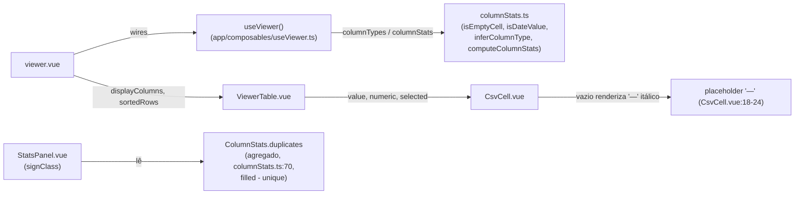
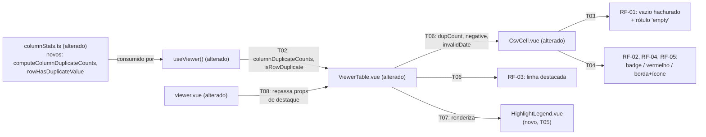

# Implementation Plan

## Request Summary
- Objective: destacar automaticamente, célula a célula, quatro condições de qualidade de dado
  (vazio, duplicado, negativo, data inválida) no Viewer, sem toggle de UI, mais uma legenda fixa
  no topo da tabela com os quatro tipos — sem exigir ação do usuário.
- Scope:
  - In: RF-01 (vazio: hachurado + rótulo), RF-02 (duplicado: badge "dup ×N", helper novo em
    `columnStats.ts`), RF-03 (linha com célula duplicada: fundo distinguível), RF-04 (negativo:
    texto `--error`), RF-05 (data inválida: borda laranja + ícone + valor bruto), RF-06 (tudo
    automático, sem interação), UI-01 (legenda fixa com 4 swatch+rótulo), RNF-01 (compõe com
    seleção/numérico/pin, sem regressão), RNF-02 (helper O(N) por coluna).
  - Out: toggle configurável por tipo de destaque; 5º tipo "valores inconsistentes" (sem critério
    definido); qualquer alteração em `filters`.
- Tier: standard
- Architecture references: `AGENTS.md` (seção 2, linha 37 — "Pure domain logic isolated in
  `app/services/` ... kept framework-free and unit-testable"), `docs/agents/architecture.md`
  (tabela "Layer responsibilities", linha 42 — `app/services/` não possui reatividade Vue/DOM,
  `app/components/` não possui regras de negócio, delegadas a composables/services),
  `docs/agents/domain_rules.md` (invariante "estatísticas de coluna independem de
  visibilidade/filtros", citada também em RF-02 do SPEC).

## AS IS — Componentes impactados

Legenda: `ViewerTable`/`CsvCell` hoje só recebem tipo/seleção/pin, sem nenhum sinal de qualidade
de dado por célula; a única referência a duplicados é o agregado por coluna consumido pelo
`StatsPanel` (`ColumnStats.duplicates`), insuficiente para saber qual célula específica destacar
ou qual N exibir (RF-02). Todos os nós foram verificados por leitura direta do código-fonte.

## TO BE — Componentes propostos

Legenda: `ColumnStatsTs` ganha o novo helper puro (T01, RF-02/RNF-02); `UseViewer` expõe a
derivação reativa correspondente (T02); `CsvCell`/`ViewerTable` (alterados) recebem e aplicam os
sinais de destaque já calculados (T03, T04, T06); `NEW_Legend` (T05, UI-01) é o componente novo da
legenda fixa, renderizado por `ViewerTable` (T07); `viewer.vue` (T08) faz a fiação final entre
`useViewer` e `ViewerTable`.

## Tasks

### T01 — Helper de contagem de duplicados por valor + verificação de duplicidade de linha
- **Files**: `app/services/columnStats.ts`
- **Change**: adicionar dois exports puros, framework-free, ao lado de `isEmptyCell`/`isDateValue`
  (`AGENTS.md` seção 2, linha 37; `docs/agents/architecture.md` linha 42):
  1. `computeColumnDuplicateCounts(values: readonly Cell[]): Map<string, number>` — uma única
     passagem O(N) sobre os valores da coluna, pulando `isEmptyCell` (mesma convenção de
     `computeColumnStats`, `columnStats.ts:429-439`), acumulando `value.trim() → nº de
     ocorrências` num `Map`.
  2. `rowHasDuplicateValue(row: readonly Cell[], duplicateCounts: readonly Map<string, number>[]): boolean`
     — para uma linha completa (todas as colunas do dataset, não só as visíveis, consistente com a
     invariante de `docs/agents/domain_rules.md` de que estatísticas independem de visibilidade),
     retorna `true` se `duplicateCounts[i].get(String(row[i]).trim())` for `> 1` para algum índice
     `i`. Pura, sem laço O(N²): itera apenas as colunas da linha (O(colunas)), recebendo os mapas
     já calculados por `computeColumnDuplicateCounts`.
- **Covers**: RF-02, RF-03, RNF-02
- **Tests**: `test/columnStats.spec.ts` — novo `describe('duplicate-counts')`: (a) coluna
  `["A","B","A","A"]` → `computeColumnDuplicateCounts` retorna `Map{A→3, B→1}`; (b) células vazias
  (`''`/`null`/`undefined`) são ignoradas na contagem; (c) `rowHasDuplicateValue` retorna `true`
  para uma linha com ao menos uma célula cujo valor tem contagem `>1` no mapa da sua coluna e
  `false` quando nenhuma célula é duplicada; (d) execução em uma única iteração por coluna (sem
  comparação par a par) — validar indiretamente pela assinatura (um `for`/`reduce` único sobre
  `values`, não iteração aninhada).
- **Risk**: Low — função pura nova, sem alterar assinaturas existentes.
- **Dependencies**: none

### T02 — Expor `columnDuplicateCounts` e `isRowDuplicate` em `useViewer`
- **Files**: `app/composables/useViewer.ts`
- **Change**: adicionar um `computed` `columnDuplicateCounts: Map<string, number>[]` (por índice
  de coluna, paralelo a `columnStats`), calculado com `computeColumnDuplicateCounts` sobre
  `dataset.value` **completo** (todas as linhas carregadas, igual a `columnStats`/`columnTypes` —
  não sobre `filteredRows`/`sortedRows`), preservando a invariante de
  `docs/agents/domain_rules.md` de que estatísticas independem de filtros/busca/visibilidade
  (RF-02). Adicionar uma função `isRowDuplicate(row: string[]): boolean` que envolve
  `rowHasDuplicateValue(row, columnDuplicateCounts.value)` (RF-03). Adicionar ambos ao objeto
  retornado pelo composable.
- **Covers**: RF-02, RF-03
- **Tests**: `test/useViewer.spec.ts` — novos casos: (a) `columnDuplicateCounts` reflete o dataset
  completo mesmo com uma busca/filtro ativo reduzindo `filteredRows` (RF-02 AC: "dup ×3" não vira
  "dup ×2" com um filtro ativo); (b) `isRowDuplicate` retorna `true`/`false` corretamente para
  linhas de um dataset fixo com uma coluna com valores repetidos; (c) ocultar uma coluna (`hidden`)
  não altera `columnDuplicateCounts` nem `isRowDuplicate` (consistente com US-2.3 já testada para
  `columnStats`).
- **Risk**: Medium — estende um composable central; risco de acoplar o cálculo às linhas erradas
  (`filteredRows` em vez de `dataset.value`) quebraria a invariante RF-02 silenciosamente.
- **Dependencies**: T01

### T03 — `CsvCell.vue`: célula vazia com padrão hachurado + rótulo "empty" (RF-01)
- **Files**: `app/components/CsvCell.vue`, `test/CsvCell.spec.ts`
- **Change**: substituir o placeholder `'—'` itálico (`CsvCell.vue:18-24,64-67`) por um padrão de
  fundo hachurado (`repeating-linear-gradient`, tokens `--border`/`--bg-2`, sem nova dependência —
  FLEXIBLE) e o texto "empty" centralizado, mantendo a classe `csv-cell--empty` e sem remover
  `csv-cell--numeric`/`csv-cell--selected` (RNF-01 — os três conjuntos de classe devem compor).
  Atualizar `test/CsvCell.spec.ts:12` ("renders a placeholder for empty values"), cuja asserção do
  `'—'` antigo deixa de ser válida por decisão explícita de RF-01 — isto NÃO é uma regressão
  coberta por RNF-01 (que protege apenas seleção/numérico/pin, não o placeholder de vazio); a
  asserção deve ser atualizada para checar o padrão hachurado + o texto "empty".
- **Covers**: RF-01, RNF-01
- **Tests**: `test/CsvCell.spec.ts` — (a) valor vazio (`null`/`undefined`/`''`) exibe o texto
  "empty" e a classe do padrão hachurado, não mais "—"; (b) uma célula vazia numérica continua
  alinhada à direita (`csv-cell--numeric` preservada); (c) uma célula vazia numa coluna selecionada
  continua com `csv-cell--selected` (as duas classes compõem, não se substituem).
- **Risk**: Medium — muda uma asserção de teste existente (intencional, ver acima); qualquer outro
  teste que dependa do texto "—" (buscar em `test/ViewerTable.spec.ts`) precisa de verificação.
- **Dependencies**: none

### T04 — `CsvCell.vue`: badge de duplicado, texto negativo e borda de data inválida (RF-02, RF-04, RF-05)
- **Files**: `app/components/CsvCell.vue`, `test/CsvCell.spec.ts`
- **Change**: adicionar três props opcionais — `dupCount?: number`, `negative?: boolean`,
  `invalidDate?: boolean` (FLEXIBLE) — e a renderização condicional correspondente:
  - `dupCount` (quando `> 1`): badge "dup ×N" ao lado do valor (RF-02), cor sugerida
    `--accent`/`--accent-soft` (evita conflito com `--warning` de data inválida e `--error` de
    negativo, `main.css:28-31,36-39,64-67,72-75`).
  - `negative`: texto na cor `--error` (mesmo tom de `signClass` em `StatsPanel.vue:92-93`).
  - `invalidDate`: borda laranja (`--warning`) ao redor da célula + ícone de alerta + valor bruto
    prefixado (ex.: "⚠ 05/13/26") — o valor já chega sem reformatação (`display`, `CsvCell.vue:18-22`
    apenas coerciona para string), então nenhuma lógica de parsing/formatação é adicionada aqui.
  - Todas as três classes/estilos devem compor com `csv-cell--empty`/`--numeric`/`--selected`
    (RNF-01) — nenhuma sobrescreve as demais.
- **Covers**: RF-02, RF-04, RF-05, RNF-01
- **Tests**: `test/CsvCell.spec.ts` — (a) `dupCount={3}` exibe "dup ×3"; `dupCount` ausente/`1` não
  exibe badge; (b) `negative` aplica a cor `--error` ao texto; ausência não aplica; (c)
  `invalidDate` aplica borda laranja + prefixo "⚠ " mantendo o valor bruto exatamente como recebido
  (sem reformatar); (d) as três props coexistem com `numeric`/`selected` sem removê-las (RNF-01).
- **Risk**: Medium — várias props/classes novas no mesmo componente; risco de layout (badge +
  alinhamento numérico à direita) — mitigar mantendo `white-space: nowrap`/`text-overflow:
  ellipsis` já existentes (`CsvCell.vue:57-59`).
- **Dependencies**: T03

### T05 — `HighlightLegend.vue` (novo componente): legenda fixa dos 4 tipos de destaque (UI-01)
- **Files**: `app/components/HighlightLegend.vue` (novo), `test/HighlightLegend.spec.ts` (novo)
- **Change**: componente apresentacional, sem lógica de negócio (`docs/agents/architecture.md`
  linha 44 — `app/components/` não possui regras de negócio), com 4 pares swatch+rótulo fixos:
  "vazio" (padrão hachurado), "duplicado" (`--accent`), "negativo" (`--error`), "data inválida"
  (`--warning`) — fiel a `.spec/init/design/screen-5-highlights.png`. Sem props dinâmicas: os 4
  tipos são sempre os mesmos (RF-06, sem toggle).
- **Covers**: UI-01
- **Tests**: `test/HighlightLegend.spec.ts` — renderiza exatamente 4 pares swatch+rótulo, um por
  tipo, com os rótulos "vazio", "duplicado", "negativo", "data inválida".
- **Risk**: Low — componente novo, sem integração ainda (isolado nesta task).
- **Dependencies**: none

### T06 — `ViewerTable.vue`: fiar os sinais de destaque por célula e o destaque de linha duplicada
- **Files**: `app/components/ViewerTable.vue`, `test/ViewerTable.spec.ts`
- **Change**: adicionar duas novas props — `columnDuplicateCounts?: Map<string, number>[]` e
  `isRowDuplicate?: (row: string[]) => boolean` — e, no corpo virtualizado:
  - calcular `dupCount` por célula: `columnDuplicateCounts?.[column.index]?.get(String(value).trim())`,
    repassado ao `CsvCell` (RF-02).
  - calcular `negative`: `column.type === 'number' && parseNumber(value) !== null && parseNumber(value)! < 0`
    (importar `parseNumber` de `~/services/columnStats`, RF-04).
  - calcular `invalidDate`: `column.type === 'date' && !isEmptyCell(value) && !isDateValue(value)`
    (importar `isEmptyCell`/`isDateValue`, RF-05) — mesmo padrão já usado para `numeric` (linha
    443, `column.type === 'number'`), sem introduzir regra de negócio nova no componente (apenas
    chama funções puras já existentes/adicionadas em `columnStats.ts`).
  - aplicar uma nova classe `viewer-table__row--duplicate` na `<tr>` do corpo quando
    `isRowDuplicate?.(rows[virtualRow.index])` for `true` (RF-03), com `background-color`
    distinguível tanto do fundo padrão quanto de `.viewer-table__body .viewer-table__row:hover`
    (`ViewerTable.vue:675-677`) — classe adicional, não substitui o hover existente (RNF-01).
  - preservar `csv-cell--selected`/`--numeric` e o offset sticky de colunas fixadas
    (`ViewerTable.vue:193-206`) inalterados — os novos props só adicionam classes/estilos, nunca
    substituem os existentes (RNF-01).
- **Covers**: RF-02, RF-03, RF-04, RF-05, RNF-01
- **Tests**: `test/ViewerTable.spec.ts` — (a) uma célula com valor duplicado (dataset de teste com
  `columnDuplicateCounts` mockado) recebe `dupCount` correto passado ao `CsvCell`; (b) uma linha
  cujo `isRowDuplicate` retorna `true` recebe a classe `viewer-table__row--duplicate` com
  `background-color` computado diferente do padrão e do hover; (c) célula `number` negativa recebe
  `negative=true`; célula `date` inválida recebe `invalidDate=true`; (d) regressão: as suítes
  existentes de seleção (`viewer-table__th--selected`), alinhamento numérico e pin
  (`test/ViewerTable.spec.ts:185-458`) continuam passando sem alteração de asserção (RNF-01); (e)
  regressão da invariante de virtualização (`test/ViewerTable.spec.ts:458-597`, contagem de `<tr>`
  limitada) — os novos lookups por linha renderizada não devem aumentar o nº de linhas no DOM.
- **Risk**: High — ponto central de renderização; maior superfície de regressão (compõe com
  seleção/pin/resize/reorder/virtualização já testados). Mitigação: `dupCount`/`negative`/
  `invalidDate`/`isRowDuplicate` são todos O(colunas) por linha **renderizada** (bounded pelo
  overscan da virtualização), não O(N) sobre o dataset inteiro — preserva RNF-02 e a invariante de
  performance da virtualização.
- **Dependencies**: T02, T04

### T07 — `ViewerTable.vue`: renderizar `HighlightLegend` fixa acima do cabeçalho (UI-01)
- **Files**: `app/components/ViewerTable.vue`, `test/ViewerTable.spec.ts`
- **Change**: importar e renderizar `HighlightLegend` dentro de `.viewer-table`, acima do
  `<thead>`, com a mesma técnica de sticky já usada por `.viewer-table__head`
  (`ViewerTable.vue:489-500`, `position: sticky; top: 0`) — a legenda fica sempre visível durante o
  scroll vertical, e o `<thead>` ajusta seu `top` para a altura da legenda (evitar sobreposição).
- **Covers**: UI-01
- **Tests**: `test/ViewerTable.spec.ts` — a legenda está presente no DOM montado e contém
  exatamente 4 pares swatch+rótulo (delegado ao `HighlightLegend`, aqui só valida a integração:
  presença e posição antes do `<thead>`).
- **Risk**: Low — adição de um bloco visual sem lógica; risco baixo de quebrar o layout sticky
  existente do cabeçalho (mitigado testando a posição relativa legenda/thead).
- **Dependencies**: T05, T06

### T08 — `viewer.vue`: repassar `columnDuplicateCounts`/`isRowDuplicate` ao `ViewerTable`
- **Files**: `app/pages/viewer.vue`
- **Change**: desestruturar `columnDuplicateCounts`/`isRowDuplicate` de `useViewer(...)` e passá-los
  como props ao `<ViewerTable>` (ao lado de `displayColumns`/`sortedRows` já fiados,
  `viewer.vue:118-132`).
- **Covers**: RF-02, RF-03
- **Tests**: `test/pages/viewer.spec.ts` — a página monta sem erro com um dataset contendo as
  quatro condições (vazio, duplicado, negativo, data inválida) e o `ViewerTable` recebe as novas
  props não vazias.
- **Risk**: Low — fiação direta, sem lógica nova.
- **Dependencies**: T02, T06

### T09 — Teste de integração: todos os destaques no primeiro render, sem interação (RF-06)
- **Files**: `test/pages/viewer.spec.ts` (ou `test/ViewerTable.spec.ts`, conforme granularidade
  disponível no arquivo)
- **Change**: nenhuma mudança de produção — task de teste dedicada (RF-06 é uma exigência
  ubíqua/combinada que nenhuma task anterior isoladamente cobre).
- **Covers**: RF-06
- **Tests**: montar o Viewer com um dataset fixo contendo as quatro condições numa única passada
  (uma célula vazia, um par de valores duplicados na mesma coluna, um número negativo, uma data
  fora do formato ISO/DMY da coluna) e, **sem nenhuma interação/clique prévio**, afirmar que os
  quatro destaques aparecem simultaneamente: rótulo "empty" + padrão hachurado, badge "dup ×N",
  cor `--error`/classe correspondente no valor negativo, borda+ícone na data inválida, e a legenda
  com os 4 pares presente.
- **Risk**: Low — teste puramente aditivo; risco de flakiness se depender de detalhes de timing da
  virtualização (mitigar aguardando `nextTick`, conforme padrão já usado nos testes existentes de
  `ViewerTable.spec.ts`).
- **Dependencies**: T07, T08

### T10 — `isDateLikeColumn`: corrigir o gate inatingível de RF-05 (achado em verificação pós-implementação)
- **Files**: `app/services/columnStats.ts`, `app/components/ViewerTable.vue`,
  `test/columnStats.spec.ts`, `test/ViewerTable.spec.ts`
- **Change**: ver `SPEC.md` § Amendments v1.2 para o diagnóstico completo. Verificação manual em
  navegador (Playwright, CSV real) mostrou que RF-05 nunca dispara: `invalidDateFor` em
  `ViewerTable.vue:346-347` exige `column.type === 'date'`, mas `inferColumnType` só tipa a coluna
  como `date` quando 100% das células preenchidas satisfazem `isDateValue` — a própria célula
  "inválida" que RF-05 precisa detectar impede a coluna de ser tipada `date`.
  1. Novo export puro em `app/services/columnStats.ts`, ao lado de `isDateValue`:
     `isDateLikeColumn(values: readonly Cell[]): boolean` — uma passagem O(N) sobre os valores,
     pulando `isEmptyCell`; retorna `true` quando há ao menos uma célula preenchida E a razão
     `dates / filled` é `> 0.5` (maioria). NÃO altera `inferColumnType`/`ColumnType` — usados por
     ordenação, `StatsPanel` e filtros futuros, fora do escopo desta feature.
  2. Em `ViewerTable.vue`, `invalidDateFor` passa a receber os valores da coluna (ou um
     `isDateLikeColumn` pré-calculado por coluna, mesmo padrão de `columnDuplicateCounts` em T02 —
     evitar recomputar `isDateLikeColumn` por célula renderizada; calcular uma vez por coluna e
     reusar) e usa esse predicado no lugar de `column.type === 'date'`:
     `isDateLikeColumn(columnValues) && !isEmptyCell(value) && !isDateValue(value)`.
  3. Atualizar a fixture de `test/ViewerTable.spec.ts:620-632` (`highlightColumns`/`highlightRows`)
     para refletir um dataset real: a coluna `created` NÃO precisa ter `type: 'date'` hardcoded —
     o teste deve montar linhas onde a maioria dos valores da coluna passam `isDateValue` (ex.:
     `['2026-01-04']`/`['2026-01-05']` válidas e `['05/13/26']` inválida) e verificar que
     `isDateLikeColumn` (não `column.type`) decide o destaque.
- **Covers**: RF-05 (correção)
- **Tests**:
  - `test/columnStats.spec.ts` — novo `describe('isDateLikeColumn')`: (a) coluna com 3 valores ISO
    válidos e 1 inválido (`> 50%` válidos) → `true`; (b) coluna com maioria inválida (ex.: 1 válido
    em 3) → `false`; (c) coluna só com células vazias → `false` (sem preenchidas, não há maioria);
    (d) execução em uma única passagem O(N) (sem comparação par a par), mesmo padrão de
    `computeColumnDuplicateCounts` (T01).
  - `test/ViewerTable.spec.ts` — RF-05 (revisado): uma coluna com 2 de 3 células ISO válidas e 1
    célula `'05/13/26'` aplica `invalidDate=true` **somente** na célula inválida, mesmo com
    `column.type` computado como `'text'` (dataset real via `useViewer`, não fixture com `type`
    forçado); uma coluna cuja maioria falha `isDateValue` (ex.: coluna de texto livre) NÃO aplica o
    destaque a nenhuma célula, mesmo que uma célula isolada coincidentemente satisfaça
    `isDateValue`.
- **Risk**: Medium — ponto de regressão é o mesmo de T06 (`ViewerTable.vue`, corpo virtualizado);
  mitigar rodando a suíte completa de `ViewerTable.spec.ts` (seleção/pin/numérico/virtualização)
  após a mudança, confirmando RNF-01 intacto.
- **Dependencies**: T06

### T11 — Remover o destaque de linha inteira (RF-03 revogado — ver SPEC.md § Amendments v1.3)
- **Files**: `app/services/columnStats.ts`, `app/composables/useViewer.ts`,
  `app/components/ViewerTable.vue`, `app/pages/viewer.vue`, `test/columnStats.spec.ts`,
  `test/useViewer.spec.ts`, `test/ViewerTable.spec.ts`, `test/pages/viewer.spec.ts`
- **Change**: decisão de produto do developer, após uso real com um dataset de 767 linhas: o
  destaque de fundo na linha inteira (RF-03) tingia a maioria das linhas (qualquer célula
  duplicada em qualquer coluna já acionava o destaque), esvaziando o sinal. O badge "dup ×N" por
  célula (RF-02) permanece — é suficiente. Remover, sem deixar código morto:
  1. `app/services/columnStats.ts`: remover o export `rowHasDuplicateValue` (linha ~507) — não tem
     mais nenhum consumidor após esta task.
  2. `app/composables/useViewer.ts`: remover a função `isRowDuplicate` (linha ~165-167), o import
     de `rowHasDuplicateValue` (linha 9) e sua entrada no objeto retornado (linha ~516).
     `columnDuplicateCounts` **permanece** — ainda usado pelo badge "dup ×N" (RF-02).
  3. `app/components/ViewerTable.vue`: remover a prop `isRowDuplicate?: (row: string[]) => boolean`
     (linha ~70), a classe condicional `viewer-table__row--duplicate` na `<tr>` (linha ~490) e a
     regra CSS `.viewer-table__row--duplicate` (linha ~759, incluindo o comentário que a
     acompanha).
  4. `app/pages/viewer.vue`: remover a desestruturação de `isRowDuplicate` (linha ~64) e a prop
     `:is-row-duplicate="isRowDuplicate"` (linha ~128) passada ao `<ViewerTable>`.
  5. Testes: remover os casos que exercitam exclusivamente o comportamento removido —
     `test/columnStats.spec.ts` (`rowHasDuplicateValue`), `test/useViewer.spec.ts`
     (`isRowDuplicate`), `test/ViewerTable.spec.ts` (os testes "RF-03" e as asserções de
     `viewer-table__row--duplicate` dentro de outros testes, ex. o de virtualização/regressão que
     hoje também afirma a classe), `test/pages/viewer.spec.ts` (a asserção de
     `.viewer-table__row--duplicate`). RF-06 (integração, T09) deixa de mencionar o destaque de
     linha — os quatro destaques verificados no primeiro render passam a ser
     vazio/duplicado(badge)/negativo/data-inválida.
- **Covers**: RF-03 (removido), RF-06 (revisado)
- **Tests**: suíte completa após a remoção (`yarn test`) sem nenhuma referência residual a
  `isRowDuplicate`/`rowHasDuplicateValue`/`viewer-table__row--duplicate` em `app/` ou `test/`
  (`grep -rl` deve retornar vazio); nenhuma regressão nos destaques que permanecem (RF-01, RF-02,
  RF-04, RF-05) nem em RNF-01 (seleção/numérico/pin).
- **Risk**: Low — remoção pura, sem lógica nova; risco é esquecer uma referência residual (import
  não usado, teste órfão) — mitigado pelo `grep` de verificação acima.
- **Dependencies**: T06, T02

## Execution Phases
| Phase | Tasks | Parallel-safe? |
|-------|-------|----------------|
| 1 | T01, T03, T05 | Sim — três arquivos distintos (`columnStats.ts`, `CsvCell.vue`, `HighlightLegend.vue`), sem dependências entre si. |
| 2 | T02, T04 | Sim — arquivos distintos (`useViewer.ts` vs `CsvCell.vue`); cada um depende apenas de uma task da Fase 1 (T01 e T03, respectivamente). |
| 3 | T06 | Não — task única; depende de T02 e T04 (primeira vez que `ViewerTable.vue` é tocado nesta feature). |
| 4 | T07, T08 | Sim — arquivos distintos (`ViewerTable.vue` novamente, mas após T06 concluída, vs `viewer.vue`); T07 depende de T05+T06, T08 depende de T02+T06. |
| 5 | T09 | Não — task única, depende de T07 e T08 (integra tudo). |
| 6 | T10 | Não — task única; corrige o gate de RF-05 achado em verificação pós-implementação (pós T06, já implementada e commitada). |
| 7 | T11 | Não — task única; remove o destaque de linha (RF-03), decisão de produto pós-verificação com dados reais (pós T06/T10). |

## Risks
| Risk | Blast radius | Mitigation | Rollback |
|------|-------------|------------|----------|
| Destaque de linha (RF-03, `--accent`/`--accent-soft`) visualmente confundível com `csv-cell--selected` e o gradiente fixado+selecionado já existentes (`ViewerTable.vue:202-204`, mesma família de cor) | `ViewerTable.vue`, todas as linhas do corpo | Reservar um tom/opacidade distinto para o tint de linha (camada de fundo separada da seleção de coluna) e validar visualmente que uma linha duplicada + uma coluna selecionada permanecem distinguíveis uma da outra (RNF-01 exige composição, não fusão indistinguível) | Remover a classe `viewer-table__row--duplicate` (aditiva, sem substituir estados existentes) |
| Ponto central de renderização (T06) quebra a invariante de virtualização (contagem de `<tr>` limitada, `test/ViewerTable.spec.ts:458-597`) ou os testes de seleção/numérico/pin (RNF-01) | `ViewerTable.vue`, toda a tabela | Lookups (`dupCount`/`negative`/`invalidDate`/`isRowDuplicate`) são O(colunas) por linha **renderizada** (bounded pelo overscan), nunca O(N) sobre o dataset; rodar a suíte completa de `ViewerTable.spec.ts` antes de prosseguir para T07/T08 | Reverter T06 isoladamente; T04 (CsvCell) permanece no-op sem a fiação do ViewerTable (props opcionais, default ausente) |
| `columnDuplicateCounts` (T02) calculado sobre `filteredRows`/`sortedRows` em vez de `dataset.value` completo, quebrando silenciosamente a invariante RF-02 (N deve refletir o dataset inteiro, não filtrado) | `useViewer.ts`, todo consumidor de `columnDuplicateCounts` | Teste dedicado (T02) que ativa um filtro/busca e confirma que o badge não muda; revisão de código explícita apontando para `dataset.value` (não `filteredRows.value`) | Corrigir a fonte do `computed` isoladamente, sem impacto em outras partes do composable |
| Atualização da asserção existente em `test/CsvCell.spec.ts:12` (placeholder "—") é uma mudança de comportamento intencional (RF-01), não uma regressão coberta por RNF-01 — risco de o executor tratar isso como "não pule nenhum item" vs. "RNF-01 protege os testes existentes" e travar indevidamente | `test/CsvCell.spec.ts` | T03 documenta explicitamente que esta asserção específica MUDA por decisão de RF-01; RNF-01 protege apenas seleção/numérico/pin | Reverter a mudança de template de T03 restaura o "—" e a asserção antiga volta a valer |

## Open Questions
- ~~RF-03 não especifica se uma linha deve ser destacada quando o valor duplicado existe apenas
  numa coluna **oculta**...~~ **Moot (v1.3):** RF-03 foi removido (ver SPEC.md § Amendments v1.3,
  T11) — a pergunta não se aplica mais, pois não há mais destaque de linha inteira. `rowHasDuplicateValue`
  foi removido; `columnDuplicateCounts` continua escaneando todas as colunas (inclusive ocultas)
  apenas para o badge "dup ×N" (RF-02), que já é por célula/coluna, sem esta ambiguidade.
- ~~RF-03 (SPEC) e as sugestões FLEXIBLE não atribuem um token de cor explícito ao destaque de
  linha duplicada...~~ **Resolvido (verificação manual pós-Fase 6):** a implementação de T06 havia
  usado `--warning-soft` (não `--accent-soft`, como este plano já assumia), colidindo visualmente
  com o destaque de "data inválida" (RF-05) — um usuário reportou confusão ("por que estão
  laranjas?") ao ver linhas duplicadas com a mesma cor reservada para data inválida. Corrigido
  diretamente em `ViewerTable.vue:753-764` para `--accent-soft`, alinhado com o swatch "duplicado"
  da legenda (`HighlightLegend.vue:70-73`) e com a recomendação original deste plano. `yarn test`
  (448/448) e verificação visual (Playwright) confirmam a composição com `csv-cell--selected`
  ainda distinguível (seleção tinge uma coluna, duplicado tinge a linha inteira).

## Assumptions
- O valor bruto de uma célula nunca é reformatado em nenhum ponto do pipeline atual (`CsvCell.vue`
  apenas coage para string, `columnStats.ts` não expõe formatação) — por isso RF-05 ("valor bruto")
  não exige nenhuma mudança adicional além do prefixo "⚠ ". Verificado por leitura de
  `CsvCell.vue:18-22`.
- Os tokens de cor `--accent`/`--accent-soft` (duplicado), `--error` (negativo), `--warning` (data
  inválida) e `--border`/`--text-3` (vazio) já existem em `app/assets/css/main.css` para os dois
  temas (light/dark) — não é necessário criar novos tokens. Verificado por `grep` em
  `app/assets/css/main.css` (linhas citadas nas tasks).
- `test/useViewer.spec.ts` e `test/pages/viewer.spec.ts` já existem e seguem o padrão de teste
  usado nas demais tasks (Vitest + `happy-dom` + `@vue/test-utils`) — verificado por leitura do
  diretório `test/`.
- Nenhum outro teste além de `test/CsvCell.spec.ts:12` depende do texto literal "—" para célula
  vazia — não verificado exaustivamente (`grep` recomendado em T03 antes de editar) — [UNVERIFIED].
