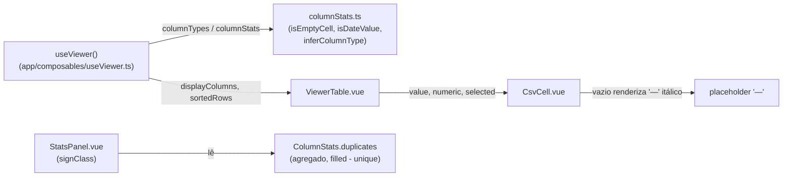
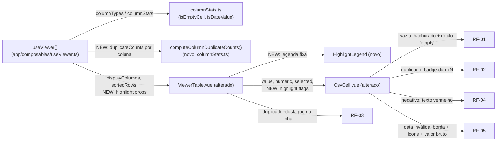

# SPEC: visual-highlights

## Metadata
- Source: developer description via /plan
- Service: csvview (única app, SPA client-side)
- Tier: standard
- Version: 1.1
- Architecture references: `AGENTS.md`, `docs/agents/architecture.md`, `docs/agents/domain_rules.md`

## Context
O Viewer (`app/pages/viewer.vue` + `ViewerTable.vue` + `CsvCell.vue`) já renderiza o dataset
com tipos inferidos e estatísticas por coluna via o motor `app/services/columnStats.ts` (Fase 5,
feature `rich-types-and-stats`, já implementada). Hoje nenhuma célula recebe destaque visual
automático além do placeholder "—" para vazio e do alinhamento numérico à direita.

Esta feature adiciona destaque **automático, célula a célula**, para quatro condições de
qualidade de dado — vazio, duplicado, negativo, data inválida — sem exigir nenhuma ação do
usuário (sem toggle por tipo nesta fase), com uma legenda fixa no topo da tabela explicando os
quatro tipos. Referência visual: `.spec/init/design/screen-5-highlights.png`.

O motor atual só expõe a contagem **agregada** de duplicados por coluna
(`ColumnStats.duplicates`, `app/services/columnStats.ts:70` — `filled - unique`). Para saber
**quais células específicas** destacar e **qual N** exibir no badge, é necessário um novo
helper puro que, por coluna, mapeie cada valor preenchido → nº de ocorrências. Este helper deve
viver em `app/services/columnStats.ts`, ao lado de `isEmptyCell`/`isDateValue`, respeitando a
regra de camadas: **lógica de domínio pura e framework-free em `app/services/`** — "Pure domain
logic isolated in `app/services/` ... kept framework-free and unit-testable" (`AGENTS.md`
seção 2, linha 37) — e a tabela de responsabilidades de `docs/agents/architecture.md` (linha 42),
que exclui de `app/services/` qualquer reatividade Vue/DOM e exclui de `app/components/` regras
de negócio (delegadas a composables/services).

Dependência confirmada: `rich-types-and-stats` (`.spec/features/rich-types-and-stats/SPEC.md`),
que define `ColumnType`, `isEmptyCell`, `isDateValue`, `numericKind`. Esta feature NÃO depende de
`filters`.

## AS IS — Estado atual

Legenda: `ViewerTable`/`CsvCell` hoje só recebem tipo/seleção/pin, sem nenhum sinal de
qualidade de dado por célula; a única referência a duplicados é o agregado por coluna consumido
pelo `StatsPanel`, insuficiente para saber qual célula específica destacar.

## TO BE — Estado proposto

Legenda: `NEW_DupHelper` (RF-02) é o novo helper puro em `columnStats.ts` que resolve a
contagem por valor; `ViewerTable`/`CsvCell` (alterados) passam a receber os sinais de destaque
já calculados e aplicam os quatro tratamentos visuais (RF-01, RF-02, RF-03, RF-04, RF-05);
`NEW_Legend` (UI-01) é o componente novo da legenda fixa no topo da tabela.

## Scope
- **In**: destaque automático de célula vazia, duplicada (badge + realce de linha), negativa e
  data inválida; legenda fixa no topo da tabela com os 4 tipos; convivência com seleção de
  coluna, alinhamento numérico e fixação (pin) de colunas existentes.
- **Out**: toggle configurável para ligar/desligar um tipo de destaque individualmente (decisão
  do developer — destaques são sempre ligados nesta fase, sem controle de UI para isso); o 5º
  item do backlog de destaques "valores inconsistentes" (não aparece na referência visual, sem
  critério definido — não assumir definição); qualquer alteração na feature `filters` (sem
  dependência).

## RIGID (Non-Negotiable)

### Functional Requirements

- RF-01 [Event-Driven]: QUANDO uma célula de qualquer coluna satisfaz `isEmptyCell`
  (`app/services/columnStats.ts:82`), a `ViewerTable`/`CsvCell` SHALL renderizar a célula com um
  padrão de fundo hachurado (listras diagonais) e um rótulo "empty" centralizado, substituindo o
  placeholder atual "—" itálico (`csv-cell--empty`, `app/components/CsvCell.vue:64-67`).
  - AC: uma célula vazia (`null`/`undefined`/string em branco) exibe o padrão hachurado E o texto
    "empty" centralizado; nenhuma célula vazia continua exibindo apenas "—".

- RF-02 [Event-Driven]: QUANDO uma célula preenchida de uma coluna tem um valor que ocorre mais
  de uma vez entre as células preenchidas daquela MESMA coluna, a célula SHALL exibir um badge
  "dup ×N" ao lado do valor, onde N é o nº de ocorrências **daquele valor específico** naquela
  coluna — obtido por um novo helper puro em `app/services/columnStats.ts` que mapeia, por
  coluna, cada valor preenchido → nº de ocorrências (distinto do agregado
  `ColumnStats.duplicates`, `app/services/columnStats.ts:70`, que só informa `filled - unique`
  por coluna, sem apontar quais células nem qual N). Este helper opera sobre o **dataset
  completo** (todas as linhas carregadas), não sobre linhas filtradas/buscadas: N SHALL refletir
  sempre as ocorrências no dataset inteiro, independente de `filters`/busca estarem ativos ou não
  — consistente com a invariante de `docs/agents/domain_rules.md` de que estatísticas de coluna
  independem de visibilidade/filtros. O helper NÃO depende do módulo `filters` e recalcula
  normalmente quando o dataset muda (ex.: novo arquivo carregado); não há cache stale a
  considerar.
  - AC: para uma coluna com os valores preenchidos `["A","B","A","A"]`, as três células com
    valor "A" exibem o badge "dup ×3"; a célula "B" (única) não exibe badge; o valor original da
    célula continua visível ao lado do badge. Com um filtro/busca ativo que oculte uma das
    células "A", as duas células "A" ainda visíveis continuam exibindo "dup ×3" (não "dup ×2").

- RF-03 [State-Driven]: ENQUANTO uma linha contém ao menos uma célula cujo valor está duplicado
  em sua coluna (conforme RF-02, contagem sobre o dataset completo, não sobre linhas
  filtradas/exibidas), a `ViewerTable` SHALL aplicar um destaque de fundo distinguível à linha
  inteira (cor de fundo diferente da linha padrão e do estado de hover
  `.viewer-table__body .viewer-table__row:hover`, `app/components/ViewerTable.vue:675-677`).
  - AC: uma linha com pelo menos uma célula duplicada tem `background-color` computado diferente
    do padrão e do hover; uma linha sem nenhuma célula duplicada mantém o fundo padrão; o destaque
    de linha persiste mesmo quando um filtro/busca ativo reduz o conjunto de linhas visíveis.

- RF-04 [Conditional]: SE uma coluna tem tipo inferido `number` (`ColumnType`,
  `app/services/columnStats.ts:22`) E o valor numérico de uma célula preenchida é `< 0`, ENTÃO a
  célula SHALL exibir o texto em vermelho, no mesmo tom usado por `signClass` para valores
  negativos em `app/components/StatsPanel.vue:92` (`is-negative` → `var(--error)`).
  - AC: uma célula de coluna `number` com valor `-320` exibe o texto na cor `--error`; uma célula
    da mesma coluna com valor `+149` não recebe essa cor.

- RF-05 [Conditional]: SE uma coluna tem tipo inferido `date` E uma célula preenchida daquela
  coluna NÃO satisfaz `isDateValue` (`app/services/columnStats.ts:136`), ENTÃO a célula SHALL
  exibir uma borda laranja ao redor da célula, um ícone de alerta e o valor bruto (não
  reformatado) prefixado pelo ícone (ex.: "⚠ 05/13/26").
  - AC: numa coluna `date` cujas demais células são ISO `YYYY-MM-DD`, uma célula com o valor
    bruto `05/13/26` (mês 13 inválido, reprovado por `isDateValue`) exibe borda laranja e o texto
    "⚠ 05/13/26" exatamente como armazenado; uma célula com `2026-01-04` (válida) não recebe essa
    borda/ícone.

- RF-06 [Ubiquitous]: A `ViewerTable` SHALL aplicar os quatro destaques (RF-01 a RF-05)
  automaticamente a toda célula/linha renderizada, sem exigir nenhuma ação do usuário e sem
  nenhum controle de UI para ligar/desligar um tipo individualmente nesta fase (ver Scope Out).
  - AC: ao carregar o Viewer com um dataset contendo as quatro condições, todos os destaques
    aplicáveis aparecem no primeiro render, sem clique ou interação prévia.

### UI Requirements

- UI-01 [Ubiquitous]: A `ViewerTable` SHALL exibir uma legenda fixa no topo da tabela (acima do
  cabeçalho de colunas, presente em todo scroll) com um swatch + rótulo para cada um dos quatro
  tipos de destaque: "vazio" (padrão hachurado), "duplicado", "negativo", "data inválida" — fiel
  a `.spec/init/design/screen-5-highlights.png` ("Destaques na tabela").
  - AC: a legenda está sempre visível no topo da tabela (não requer interação para aparecer) e
    contém exatamente 4 pares swatch+rótulo, um por tipo de destaque.

### Non-Functional Requirements

- RNF-01: A introdução dos destaques SHALL preservar, sem regressão, o comportamento existente
  de seleção de coluna (`csv-cell--selected`), alinhamento numérico à direita
  (`csv-cell--numeric`) e fixação de colunas (`position: sticky` + offset acumulado,
  `app/components/ViewerTable.vue:193-206`) — nenhuma classe/estilo de destaque SHALL sobrescrever
  ou remover esses estados; os dois conjuntos de estilo SHALL compor (aditivos), inclusive quando
  uma coluna fixada e/ou selecionada também contém uma célula destacada.
  - AC: os testes existentes de `ViewerTable.vue`/`CsvCell.vue` (seleção, alinhamento numérico,
    pin) continuam passando sem alteração de asserção após a implementação desta feature.

- RNF-02: O novo helper de contagem de ocorrências por valor (RF-02) SHALL computar suas
  contagens em uma única passagem O(N) por coluna, consistente com o perfil de desempenho do
  motor existente (`computeColumnStats`/`computeDatasetStats`, uma passagem O(N) por coluna,
  `app/services/columnStats.ts:422-481`) — sem passagens adicionais O(N²) sobre o dataset.
  - AC: para uma coluna com N células, o novo helper executa em O(N) (uma iteração sobre os
    valores, sem comparação par a par).

## FLEXIBLE (Implementation Suggestions)
- Novo export em `app/services/columnStats.ts`, ex. `computeColumnDuplicateCounts(values):
  Map<string, number>` — mapa valor (após trim) → nº de ocorrências entre células preenchidas;
  reusa `isEmptyCell` para pular vazios, mesma convenção de `computeColumnStats`.
- Em `useViewer.ts`, um `computed` `columnDuplicateCounts: Map<string, number>[]` (por índice de
  coluna, paralelo a `columnStats`), calculado sobre o dataset completo — mantendo a invariante
  já documentada em `docs/agents/domain_rules.md` de que estatísticas independem da visibilidade
  de coluna.
- `CsvCell.vue` ganha props adicionais (ex. `dupCount?: number`, `negative?: boolean`,
  `invalidDate?: boolean`) e passa a decidir seu próprio marcador `csv-cell--empty` também via
  padrão hachurado + rótulo "empty" (substituindo o "—" apenas visualmente, mantendo `title` com
  o valor cru quando aplicável).
- Padrão hachurado via CSS `repeating-linear-gradient` usando tokens existentes (`--border`,
  `--bg-2`), sem nova dependência.
- Cor sugerida por tipo, reaproveitando tokens já definidos em `app/assets/css/main.css`: vazio →
  neutro (`--border`/`--text-3`); duplicado → `--accent`/`--accent-soft` (evita conflito com
  `--warning`, já usado por `StatsPanel.vue` `.is-warning` para o agregado de duplicados, e com
  `--error`, usado por negativo); negativo → `--error` (mesmo tom de `signClass`); data inválida
  → `--warning`.
- Novo componente `HighlightLegend.vue` em `app/components/`, renderizado por `ViewerTable.vue`
  acima do `<thead>` (sticky, mesma técnica de `viewer-table__head`).
- Destaque de linha duplicada (RF-03) como classe adicional na `<tr>` do corpo, não como
  substituição do hover existente (`.viewer-table__body .viewer-table__row:hover`).

## Acceptance Criteria Summary
| ID | Criterion | Testable? |
|----|-----------|-----------|
| RF-01 | Célula vazia exibe padrão hachurado + rótulo "empty" centralizado | Sim |
| RF-02 | Célula com valor duplicado na coluna exibe badge "dup ×N" com N correto | Sim |
| RF-03 | Linha com célula duplicada recebe destaque de fundo distinguível na linha inteira | Sim |
| RF-04 | Célula numérica negativa exibe texto na cor `--error` | Sim |
| RF-05 | Célula de data inválida exibe borda laranja + ícone + valor bruto prefixado | Sim |
| RF-06 | Todos os destaques aplicáveis aparecem no primeiro render, sem interação do usuário | Sim |
| UI-01 | Legenda fixa no topo com 4 pares swatch+rótulo, sempre visível | Sim |
| RNF-01 | Seleção de coluna, alinhamento numérico e pin continuam funcionando sem regressão | Sim |
| RNF-02 | Novo helper de contagem por valor executa em O(N) por coluna | Sim |

## Markers
Nenhum marker pendente. O escopo da contagem de duplicados (RF-02/RF-03) foi resolvido: o
helper opera sobre o dataset completo, independente de filtros/busca (ver decisão incorporada em
RF-02/RF-03).
