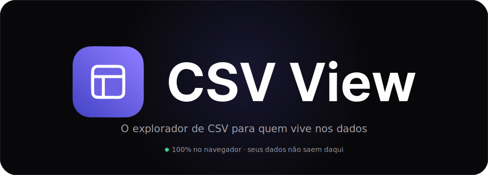
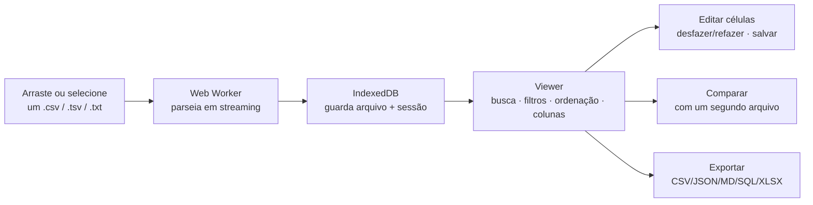
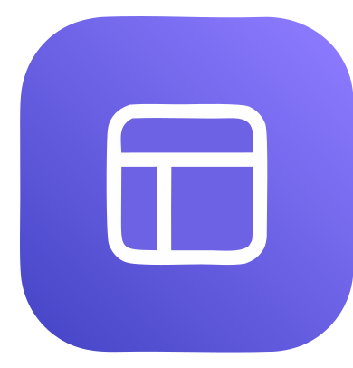

<p align="center">
  
</p>

<p align="center">
  
  
  
  
  
  = 22.12" src="https://img.shields.io/badge/node-%3E%3D22.12-339933?logo=node.js&logoColor=white&style=flat-square">
  
</p>

<p align="center">
  <b>Abra, filtre e analise arquivos CSV enormes direto no navegador — sem instalar nada e sem enviar seus dados para nenhum servidor.</b>
</p>

<br>

## Sumário

- [Destaques](#-destaques)
- [Como funciona](#-como-funciona)
- [Design system](#-design-system)
- [Stack](#-stack)
- [Começando](#-começando)
- [Estrutura do projeto](#-estrutura-do-projeto)
- [Testes](#-testes)
- [Roadmap](#-roadmap)
- [Licença](#-licença)

## ✨ Destaques

| | |
|---|---|
| ⚡ **Parsing em streaming** | CSV/TSV/TXT são lidos e parseados num Web Worker dedicado (`csvParser.worker.ts`), em chunks de 1 MB — a UI nunca trava, mesmo em arquivos com milhões de linhas. |
| 🧭 **Detecção automática** | Delimitador (`,` `;` tab), BOM e linhas irregulares são tratados na hora do parse; colunas curtas são normalizadas contra o cabeçalho. |
| 🖥️ **Tabela virtualizada** | Renderização com `@tanstack/vue-virtual` — só o que está na viewport vai para o DOM, então rolar 1 milhão de linhas é tão liso quanto rolar 10. |
| 🔍 **Busca + ordenação** | Busca global instantânea sobre todas as colunas e ordenação multi-coluna, tudo reativo e computado em memória. |
| 📌 **Colunas sob controle** | Fixe, redimensione, reordene e oculte colunas — o layout da tabela é seu. |
| 🧮 **Estatísticas por coluna** | Tipo inferido (número, data, booleano, e-mail, URL), nulos, únicos, duplicados, preenchimento, mín/máx/média/mediana e um mini-histograma de distribuição, por coluna selecionada. |
| 🧰 **Filtros por coluna** | Operadores combináveis por tipo de dado (igual, contém, maior/menor, entre, intervalo de datas, vazio/preenchido) — combine quantos quiser, com feedback imediato de quantas linhas casaram. |
| 🚨 **Destaques automáticos** | Células vazias, valores duplicados, números negativos e datas inválidas são realçados na tabela sem nenhuma configuração — legenda fixa no topo. |
| ✏️ **Edição com desfazer/refazer** | Edite células inline com validação por tipo; desfazer/refazer cobre tanto edições de célula quanto reordenação de coluna numa única pilha cronológica — "Salvar nova versão" ou "Sobrescrever original" gravam o arquivo com a ordem de colunas vigente. |
| 🆚 **Comparação de arquivos** | Abra um segundo CSV lado a lado e veja o diff: registros adicionados, removidos, alterados e inalterados, pareados por coluna-chave ou por posição. |
| 📤 **Exportação** | CSV, JSON, Markdown, SQL (`INSERT`) e XLSX, respeitando filtros ativos e colunas visíveis/ocultas. |
| 💾 **Arquivos recentes + sessão** | Cada arquivo aberto é persistido em IndexedDB (LRU de 10) — reabra em um clique e retome de onde parou: busca, filtros, ordenação e colunas voltam exatamente como estavam. |
| 🌗 **Tema claro/escuro** | Dark por padrão, com preferência persistida entre sessões. |
| 🔒 **Zero backend** | `ssr:false`, sem rotas de API, sem chamadas de rede. Nada do conteúdo do seu arquivo sai da máquina — nem por acidente. |

## 🧠 Como funciona



Todo o pipeline roda no navegador: **abrir → parsear → persistir → explorar → editar/comparar/exportar**.
Não há `server/`, não há API, não há upload — só o seu arquivo e a sua máquina.

## 🎨 Design system

Tema **dark por padrão**, com variante light — tokens vivos em `app/assets/css/main.css`.

| Token | Papel | Dark | Light |
|---|---|---|---|
| `--accent` | Ações primárias, marca |  `#6e62f7` |  `#5a4fe0` |
| `--success` | Estados positivos |  `#3ecf8e` |  `#0f9d63` |
| `--warning` | Alertas |  `#f3b13c` |  `#c1830f` |
| `--error` | Erros, destrutivo |  `#f2555a` |  `#dc3d43` |
| `--info` | Informativo |  `#54a8ff` |  `#2b7fff` |
| `--bg` | Fundo do app |  `#08080a` |  `#fbfbfc` |

- **Tipografia:** [Geist](https://vercel.com/font) para UI, **Geist Mono** para dados tabulares — ambas auto-hospedadas via `@fontsource-variable`, sem CDN externo.
- **Raios:** `2–14px` em chips/inputs/botões/cards, `20px` em pílulas e superfícies grandes.
- **Troca de tema** via atributo `data-theme` na raiz do documento (`useTheme.ts`), persistida em `localStorage`.

## 🧱 Stack

| Camada | Tecnologia |
|---|---|
| Framework | [Nuxt 4](https://nuxt.com) (`ssr:false`, Nitro `preset:'static'`) — SPA pura, sem servidor |
| UI | [Vue 3](https://vuejs.org) `<script setup>` + [Tailwind CSS v4](https://tailwindcss.com) |
| Linguagem | TypeScript |
| Parsing | [PapaParse](https://www.papaparse.com) rodando dentro de um Web Worker |
| Tabela | [`@tanstack/vue-virtual`](https://tanstack.com/virtual) |
| Persistência | [IndexedDB](https://developer.mozilla.org/docs/Web/API/IndexedDB_API) via [`idb`](https://github.com/jakearchibald/idb) |
| Testes | [Vitest](https://vitest.dev) + `@vue/test-utils` + `happy-dom` + `fake-indexeddb` |

## 🚀 Começando

Pré-requisitos: **Node `>=22.12.0`** e **yarn** (único gerenciador suportado — `yarn.lock` é a fonte da verdade).

```bash
yarn install   # instala as dependências
yarn dev       # http://localhost:3000
```

| Comando | O que faz |
|---|---|
| `yarn dev` | Servidor de desenvolvimento (`nuxt dev`) |
| `yarn build` | Build de produção (`nuxt build`) |
| `yarn generate` | Gera o SPA estático (`nuxt generate`) — servível por qualquer CDN |
| `yarn preview` | Preview do build de produção |
| `yarn test` | Roda a suíte de testes uma vez (`vitest run`) |
| `yarn test:watch` | Testes em modo watch |

## 🗂️ Estrutura do projeto

```
csvview/
├─ app/
│  ├─ pages/          # index.vue (Upload) · viewer.vue (Visualizador) · compare.vue (Comparação)
│  ├─ layouts/         # shell com header, logo e toggle de tema
│  ├─ components/      # Dropzone, ViewerTable, StatsPanel, ColumnChip, FilterPanel,
│  │                    # CompareTable, SaveCopyModal, UnsavedChangesModal, HighlightLegend...
│  ├─ composables/      # useCsvParser, useViewer, useCellEditing, useSaveVersion,
│  │                    # useUnsavedChangesGuard, useComparisonDatasets, useFilesStore, useTheme...
│  ├─ services/         # csvParser, columnStats, columnFilters, diffDatasets,
│  │                    # exportData, exportXlsx, formatFile — puros, sem framework
│  └─ assets/css/       # main.css — tokens de design (cores, raios, fontes)
├─ test/                # specs Vitest (componentes, composables, serviços)
├─ public/              # logo.svg e estáticos servidos sem processamento
└─ docs/agents/          # documentação gerada para agentes de IA
```

> Regra de arquitetura: lógica de domínio (parsing, estatísticas, filtros, diff, exportação)
> vive isolada em `app/services/`, sem dependência de Vue — 100% testável em isolamento.

## 🧪 Testes

```bash
yarn test
```

Suíte roda sobre `happy-dom` com IndexedDB simulado (`fake-indexeddb`) — nenhum navegador
real é necessário. Cobre componentes, composables e os serviços de parsing/estatística.

## 🗺️ Roadmap

O produto principal (visualização, tipos/estatísticas, filtros, exportação, destaques, edição
com desfazer/refazer, sessão persistida e comparação de arquivos) já está implementado. Em
avaliação para os próximos ciclos:

- [ ] **Consultas SQL** — rodar SQL sobre o dataset via DuckDB WASM
- [ ] **Gráficos e dashboards** — visualizações automáticas por coluna, combináveis em painéis
- [ ] **União de arquivos** — merge de múltiplos CSVs
- [ ] **Qualidade de dados** — detecção automática de inconsistências
- [ ] **Assistente de IA** — explicar datasets, gerar filtros e identificar padrões em linguagem natural
- [ ] **PWA offline** e **versão desktop** (Tauri)

## 📄 Licença

Projeto privado — todos os direitos reservados.

<br>

<p align="center">
  
  <br>
  <sub>100% no navegador · seus dados não saem daqui</sub>
</p>
